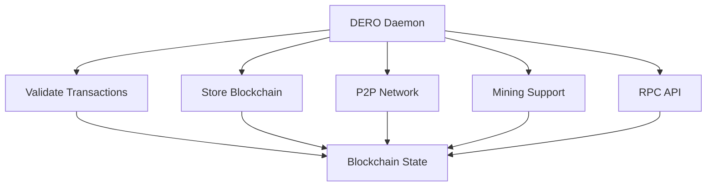

import { Callout } from 'nextra/components'
import Image from 'next/image'

# DERO Daemon (Node)


The DERO daemon (`derod`) is the core software that runs the DERO blockchain network. It validates transactions, maintains the blockchain, and connects peers in a decentralized P2P network.

<Callout type="info">
  **Download:** [GitHub Releases](https://github.com/deroproject/derohe/releases)
</Callout>

---

## What Does a Daemon Do?



| Function | What It Does | Source Code |
|----------|-------------|-------------|
| **Transaction Validation** | Verify proofs, ring sigs, bulletproofs | `blockchain/transaction_verify.go` |
| **Block Processing** | Execute transactions, update balances | `blockchain/transaction_execute.go:239` |
| **P2P Networking** | Sync with peers, propagate blocks/TXs | `p2p/connection.go` |
| **Mining** | Provide PoW templates, validate solutions | `blockchain/mining.go` |
| **RPC API** | Serve wallet requests, smart contract calls | `rpc/rpc_dero.go` |

---

## Network Ports

### Mainnet

| Service | Port | Purpose |
|---------|------|---------|
| **P2P** | 10101 | Node-to-node communication |
| **RPC** | 10102 | Daemon RPC API |
| **Wallet RPC** | 10103 | Wallet communication |

### Testnet

| Service | Port | Purpose |
|---------|------|---------|
| **P2P** | 40401 | Node-to-node communication |
| **RPC** | 40402 | Daemon RPC API |
| **Wallet RPC** | 40403 | Wallet communication |

**Source:** `config/config.go` - Network configuration

---

## Running Your Own Node

**Basic command:**
```bash
./derod-linux-amd64

# With custom settings
./derod-linux-amd64 --rpc-bind=0.0.0.0:10102 --p2p-bind=0.0.0.0:10101
```

**System Requirements:**
- **CPU:** 2 to 4 cores minimum
- **RAM:** 4GB minimum
- **Disk:** 15GB+ SSD (grows over time)
- **Network:** Stable internet connection

---

## Integrator Rewards

### The 10% Daemon Bonus

**How it works:**

```
Every 10 miniblocks → 1 integrator block
  • 9 regular miniblocks (normal difficulty)
  • 1 integrator block (9× difficulty)
  
Integrator block reward → Your daemon address
Result: Daemon operators earn ~10% of blocks mined on their node
```

**Why run your own daemon:**
- ✅ Earn 10% integrator rewards (vs 1.6% fee to pool operators)
- ✅ Support network decentralization
- ✅ Full privacy (no third-party node)
- ✅ Contribute to blockchain security

**Source:** Miniblock system described in `blockchain/blockchain.go`

---

## Sync Status

**Understanding the numbers:**

```bash
# Daemon display
Height: 6090778/6090778  ← Synced!
         ^local  ^network

Not synced: 5500000/6090778
Syncing:    6090000/6090778 (99.9%)
Synced:     6090778/6090778 ✓
```

**Fast sync vs Full sync:**
- **Full sync:** Downloads and validates entire blockchain (slow, complete)
- **Fast sync:** Downloads state snapshots (faster, still secure)

---

## Daemon as Mining Pool

Each daemon acts as its own mining pool:

| Role | Fee | How It Works |
|------|-----|--------------|
| **Daemon Operator** | 1.6% | Runs node, provides infrastructure |
| **Miners** | 88.4% | Connect and mine, split proportionally |
| **Integrator** | 10% | Daemon's address for integrator blocks |

**Total:** 100% (nothing wasted)

**Connect miners to your daemon:**
```bash
# Miner connects to daemon
./dero-miner-linux-amd64 -daemon-rpc-address=127.0.0.1:10100 -wallet-address=dero1qy...
```

**Daemon tracks shares and distributes rewards automatically**

**Source:** Mining pool logic in `blockchain/miniblocks.go`

---

## Key Features

### Privacy-Preserving
- ✅ TLS-encrypted P2P connections
- ✅ Stores encrypted balances (ElGamal)
- ✅ Validates without revealing amounts
- ✅ No metadata leakage

### Lightweight Storage
```
Blockchain storage:
  • Account: 66 bytes (encrypted balance)
  • Total accounts: Scales efficiently
  • Pruning: Can reduce disk usage
  
1 billion accounts = ~200GB (with overhead)
Source: README.md (lines 92-98)
```

### Fast Validation
- Block time: ~16 seconds
- Transaction verification: under 25ms
- Instant balance queries: 66 bytes

---

## Daemon Commands

**Interactive mode:**
```bash
$ ./derod

Commands available:
  status          # Show blockchain height, peers
  peer_list       # Connected peers
  diff            # Current difficulty
  print_bc        # Print blockchain info
  print_block     # Show specific block
  print_tx        # Show transaction details
  exit            # Stop daemon
```

**Useful RPC calls:**
```bash
# Get blockchain info
curl http://127.0.0.1:10102/json_rpc \
  -d '{"method":"DERO.GetInfo"}'

# Get block details  
curl http://127.0.0.1:10102/json_rpc \
  -d '{"method":"DERO.GetBlock","params":{"height":100000}}'
```

---

## Why Run a Daemon?

**Benefits:**

| Benefit | Description |
|---------|-------------|
| **Privacy** | No third-party sees your queries |
| **Integrator Rewards** | Earn 10% of blocks mined on your node |
| **Network Support** | Contribute to decentralization |
| **Self-Sovereignty** | Complete control, no trust needed |
| **Mining Pool** | Support friends/family mining |

**Trade-offs:**
- Requires: Always-on machine, disk space, bandwidth
- Maintains: Full blockchain copy
- Syncs: Initially time-consuming

---

## Related Pages

**Get Started:**
- [Running a Node](/basics/running-a-node) - Complete VPS setup guide
- [DERO Mining](/basics/mining) - How to mine with your node

**API & Integration:**
- [Daemon RPC API](/rpc-api/daemon-rpc-api) - Full API reference
- [Network Ports & Setup](/features/encrypted-network) - P2P network details

**Understanding DERO:**
- [DERO Blockchain](/basics/about) - How DERO works
- [Smart Contracts](/dvm/dero-virtual-machine) - DVM integration

