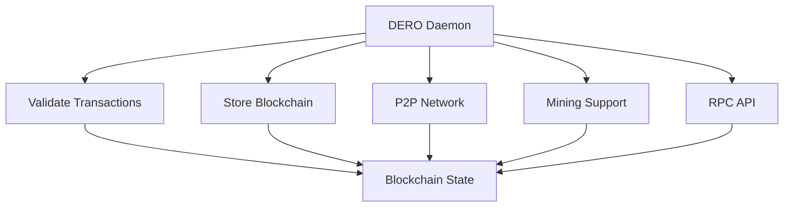

import { Callout } from 'nextra/components'
import Image from 'next/image'
import CaptainNote from '../../components/CaptainNote'

# DERO Daemon (Node)


The DERO daemon (`derod`) is the core software that runs the DERO blockchain network. It validates transactions, maintains the blockchain, and connects peers in a decentralized P2P network.

<Callout type="info">
  **Download:** [GitHub Releases](https://github.com/deroproject/derohe/releases)
</Callout>

---

## What Does a Daemon Do?


```mermaid
graph TB
    D[DERO Daemon]
    
    D --> V[Validate Transactions]
    D --> B[Store Blockchain]
    D --> P[P2P Network]
    D --> M[Mining Support]
    D --> R[RPC API]
    
    V --> BC[Blockchain State]
    B --> BC
    P --> BC
    M --> BC
    R --> BC
```

| Function | What It Does | Source Code |
|----------|-------------|-------------|
| **Transaction Validation** | Verify proofs, ring sigs, bulletproofs | `blockchain/transaction_verify.go` |
| **Block Processing** | Execute transactions, update balances | `blockchain/transaction_execute.go:239` |
| **P2P Networking** | Sync with peers, propagate blocks/TXs | `p2p/connection.go` |
| **Mining** | Provide PoW templates, validate solutions | `blockchain/mining.go` |
| **RPC API** | Serve wallet requests, smart contract calls | `rpc/rpc_dero.go` |

---

## Network Ports

### Mainnet

| Service | Port | Purpose |
|---------|------|---------|
| **P2P** | 10101 | Node-to-node communication — **randomized at startup**; pin with `--p2p-bind=0.0.0.0:10101` ([details](/basics/running-a-node#firewall-configuration)) |
| **RPC** | 10102 | Daemon RPC API |
| **Wallet RPC** | 10103 | Wallet communication |

### Testnet

| Service | Port | Purpose |
|---------|------|---------|
| **P2P** | 40401 | Node-to-node communication (randomized; pin with `--p2p-bind=0.0.0.0:40401`) |
| **RPC** | 40402 | Daemon RPC API |
| **Wallet RPC** | 40403 | Wallet communication |

**Source:** `config/config.go` (RPC + GETWORK ports); `p2p/controller.go:502` (P2P default `0.0.0.0:0` — random); `README.md:133` (10101 convention).

---

## Verify your binaries

Before running `derod` or `dero-wallet-cli` from a download, confirm the binary matches Captain's published GPG signature and the release sha512sum:

```bash
gpg --verify checksum.txt.asc
sha512sum dero_linux_amd64.tar.gz
```

<CaptainNote
  source="https://discord.com/channels/419781880632836096/419781880632836098/1056519143932829716"
  date="2022-12-25"
  channel="#dero-discussion"
>
  Please every-time verify checksum of DERO binaries/source after downloading from github.
</CaptainNote>

Full instructions for installing Captain's GPG key and running the verification end-to-end are in the [DERO forum thread](https://forum.dero.io/t/verify-dero-code-and-binaries-release/2230).

---

## Reading the derod prompt

When you start `derod`, the top of the terminal looks like this:

<figure style={{ margin: '1.5rem 0', textAlign: 'center' }}>
  <Image
    src="/assets/Dprompt1.png"
    alt="Annotated derod interface showing 10 numbered callouts mapping each region of the prompt to its meaning"
    width={1200}
    height={650}
    sizes="(max-width: 768px) 100vw, 800px"
    style={{ maxWidth: '100%', height: 'auto', borderRadius: '6px' }}
  />
  <CaptainNote
    variant="figure"
    source="https://discord.com/channels/419781880632836096/419798461039509504/1095749633671712890"
    date="2023-04-12"
    channel="#technical-questions"
  >
    Details about DERO daemon prompt. Also run status/syncinfo/help cmd in daemon for details.
  </CaptainNote>
</figure>

Every field on the prompt is a live signal. Once you can read it, you can diagnose almost any daemon problem at a glance.

| # | Field on prompt | Meaning |
|---|---|---|
| 1 | `146658/146658` | **Local sync height** — your node's chain tip |
| 2 | `[146658/146658]` | **Network height** — what your peers agree on |
| 3 | `P 17` | **Peers** — daemons currently connected to you |
| 4 | `TXp 0` | **TX pool** — transactions waiting to be included |
| 5 | `0` | **Registration pool** — wallet registrations waiting |
| 6 | `NW 4.200 GH/s` | **Global network hashrate** |
| 7 | `>Miners 1` | **Miners** connected to your daemon |
| 8 | `98` | **Miniblocks** currently active in this machine's RAM |
| 9 | `0s\|0s` | **Time offsets** — NTP vs peer-derived |
| 10 | `2ms>>` | **Latency** between this daemon and its peers |

Read the prompt left to right:

- When **1** and **2** match, you're synced.
- When **9** shows non-zero seconds, your clock is drifting — fix NTP (see [Mining → Time sync — install chrony](/basics/mining#time-sync--install-chrony)).
- When **10** climbs into the hundreds of ms, check your network.

Three commands give you more detail any time you need it:

```bash
status     # chain height, peers, version, top hash
syncinfo   # per-peer height and direction
help       # full command list
```

### MB / MBR / IB counters

When you're mining (or operating a daemon other miners connect to), three additional counters appear under the prompt's Mining Stats:

| Code | Meaning | Healthy? |
|---|---|---|
| `MB` | Miniblock submitted | yes |
| `MBR` | Miniblock rejected (usually invalid PoW) | only if rare |
| `IB` | Integrator block submitted | yes |

<CaptainNote
  variant="verified"
  source="https://discord.com/channels/419781880632836096/427613001537814540/971678950562594946"
  date="2022-05-05"
  channel="#dero-mining"
  codeRef="cmd/derod/main.go:904"
>
  MB-> Minblock submitted. MBR: Miniblock rejected due to invalidPOW or so. IB-> Integrator Block submitted.
</CaptainNote>

The `status` command's `Block Minted` line is `(MB + IB) − MBR` — so when `MBR` climbs, your minted count visibly drops. `MBR` is PoW-test rejection only (`cmd/derod/rpc/websocket_getwork_server.go:137`), so the root-causes to check, in order: (1) clock drift on the miner host ([Mining → Time sync](/basics/mining#time-sync--install-chrony)); (2) network instability dropping work mid-flight; (3) an unofficial miner binary submitting malformed work — switch back to the official `dero-miner`.

---

## Running Your Own Node

**Basic command:**
```bash
./derod-linux-amd64

# With custom settings
./derod-linux-amd64 --rpc-bind=0.0.0.0:10102 --p2p-bind=0.0.0.0:10101
```

**System Requirements:**
- **CPU:** 2 to 4 cores minimum
- **RAM:** 4GB minimum
- **Disk:** 15GB+ SSD (grows over time)
- **Network:** Stable internet connection

---

## Integrator Rewards

### The 10% Daemon Bonus

**How it works:**

```
Every 10 miniblocks → 1 integrator block
  • 9 regular miniblocks (normal difficulty)
  • 1 integrator block (9× difficulty)
  
Integrator block reward → Your daemon address
Result: Daemon operators earn ~10% of blocks mined on their node
```

**Why run your own daemon:**
- ✅ Earn 10% integrator rewards (vs 1.6% fee to pool operators)
- ✅ Support network decentralization
- ✅ Full privacy (no third-party node)
- ✅ Contribute to blockchain security

**Source:** Miniblock system described in `blockchain/blockchain.go`

---

## Sync Status

**Understanding the numbers:**

```bash
# Daemon display
Height: 6090778/6090778  ← Synced!
         ^local  ^network

Not synced: 5500000/6090778
Syncing:    6090000/6090778 (99.9%)
Synced:     6090778/6090778 ✓
```

**Fast sync vs Full sync:**
- **Full sync:** Downloads and validates entire blockchain (slow, complete)
- **Fast sync:** Downloads state snapshots (faster, still secure)

### Pruned-node height — why your status looks short

If you started your node with `--fastsync`, `status` will print a line like:

```
Chain is pruned till 6087500
```

…meaning blocks before that point exist only on full-history nodes. The chain still validates correctly — you just can't serve TX queries from before the prune point.

<CaptainNote
  source="https://discord.com/channels/419781880632836096/419781880632836098/1054735099553386557"
  date="2022-12-20"
  channel="#dero-discussion"
>
  Pls run `status` cmd in daemon &amp; see what is your pruned node height. TXs before pruned height will not appear.
</CaptainNote>

If you need full history (e.g. to serve TX queries from genesis), there is no "backfill" — `--fastsync` is a bootstrap-only flag (`cmd/derod/main.go:73`), and toggling it off post-bootstrap doesn't recover pruned blocks. Captain's recommended path for full history is to start over: stop `derod`, delete the `mainnet/` folder, and run a full sync from zero (no `--fastsync`).

<CaptainNote
  source="https://discord.com/channels/419781880632836096/419798461039509504/949516853619855480"
  date="2022-03-05"
  channel="#technical-questions"
>
  Don't use --fastsync. Sync full node.
</CaptainNote>

### When your node gets stuck — the pop escalation

If your daemon stops advancing or believes a wrong tip, Captain's recommended recovery is to rewind blocks from the top and let the chain re-sync from your peers.

<CaptainNote
  variant="verified"
  source="https://discord.com/channels/419781880632836096/419798461039509504/1066560738862301225"
  date="2023-01-22"
  channel="#technical-questions"
  codeRef="cmd/derod/main.go:981 (case command == 'pop')"
>
  pop 20 or 50000 blocks &amp; see if you can start sync again. if not delete mainnet folder &amp; start fullsync again, It takes 1 -2 days to do full sync on recent cpus with SSD. Sync may appear very slow for few hrs for some duration but it will sync very fast after that.
</CaptainNote>

In practice the ladder operators converge on is:

| Step | Command | When |
|---|---|---|
| 1 | `pop 20` (in derod) | Brief hiccup, recent fork |
| 2 | `pop 50000` | After step 1 doesn't unstick within minutes |
| 3 | Stop `derod` → delete the `mainnet/` folder → restart with `--fastsync` | Nuclear option |

Steps 1 and 2 are Captain's direct recommendation. Intermediate values (`pop 1000`, `pop 10000`) work the same way — `pop N` simply rewinds `N` blocks; pick whatever distance reflects how far back you suspect the wedge is.

---

## Daemon as Mining Pool

Each daemon acts as its own mining pool:

| Role | Fee | How It Works |
|------|-----|--------------|
| **Daemon Operator** | 1.6% | Runs node, provides infrastructure |
| **Miners** | 88.4% | Connect and mine, split proportionally |
| **Integrator** | 10% | Daemon's address for integrator blocks |

**Total:** 100% (nothing wasted)

**Connect miners to your daemon:**
```bash
# Miner connects to daemon
./dero-miner-linux-amd64 --daemon-rpc-address=127.0.0.1:10100 --wallet-address=dero1qy...
```

**Daemon tracks shares and distributes rewards automatically**

**Source:** Mining pool logic in `blockchain/miniblocks.go`

---

## Key Features

### Privacy-Preserving
- ✅ TLS-encrypted P2P connections
- ✅ Stores encrypted balances (ElGamal)
- ✅ Validates without revealing amounts
- ✅ No metadata leakage

### Lightweight Storage
```
Blockchain storage:
  • Account: 66 bytes (encrypted balance)
  • Total accounts: Scales efficiently
  • Pruning: Can reduce disk usage
  
1 billion accounts = ~200GB (with overhead)
Source: README.md (lines 92-98)
```

### Fast Validation
- Block time: ~18 seconds
- Transaction verification: under 25ms
- Instant balance queries: 66 bytes

---

## Daemon Commands

**Interactive mode:**
```bash
$ ./derod

Commands available:
  status          # Show blockchain height, peers
  peer_list       # Connected peers
  diff            # Current difficulty
  print_bc        # Print blockchain info
  print_block     # Show specific block
  print_tx        # Show transaction details
  exit            # Stop daemon
```

**Useful RPC calls:**
```bash
# Get blockchain info
curl http://127.0.0.1:10102/json_rpc \
  -d '{"method":"DERO.GetInfo"}'

# Get block details  
curl http://127.0.0.1:10102/json_rpc \
  -d '{"method":"DERO.GetBlock","params":{"height":100000}}'
```

---

## Why Run a Daemon?

**Benefits:**

| Benefit | Description |
|---------|-------------|
| **Privacy** | No third-party sees your queries |
| **Integrator Rewards** | Earn 10% of blocks mined on your node |
| **Network Support** | Contribute to decentralization |
| **Self-Sovereignty** | Complete control, no trust needed |
| **Mining Pool** | Support friends/family mining |

**Trade-offs:**
- Requires: Always-on machine, disk space, bandwidth
- Maintains: Full blockchain copy
- Syncs: Initially time-consuming

---

## Related Pages

**Get Started:**
- [Running a Node](/basics/running-a-node) - Complete VPS setup guide
- [DERO Mining](/basics/mining) - How to mine with your node

**API & Integration:**
- [Daemon RPC API](/rpc-api/daemon-rpc-api) - Full API reference
- [Network Ports & Setup](/features/encrypted-network) - P2P network details

**Understanding DERO:**
- [DERO Blockchain](/basics/about) - How DERO works
- [Smart Contracts](/dvm/dero-virtual-machine) - DVM integration

