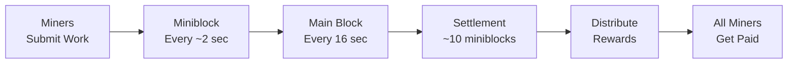

import { Callout } from 'nextra/components'
import Image from 'next/image'

# DERO Mining


DERO's **Σ-blocks** (Sigma blocks) system turns the entire network into one giant mining pool. Even miners with 100 KH/s get daily rewards based on their hashrate contribution.

<Callout type="tip">
  **Solo Mining Made Easy:** No pools needed - the network automatically distributes rewards proportionally to all miners every few minutes.
</Callout>

---

## The Σ-Blocks Revolution

**Traditional mining:**
```
Big miner (1 MH/s):  Finds blocks → Gets rewards ✓
Small miner (10 KH/s): Never finds blocks → Earns nothing ❌

Solution: Join pool, pay 2-5% fees
Problem: Centralization, trust pools
```

**DERO Σ-mining:**
```
Big miner (1 MH/s):   1000 shares/day → Proportional rewards ✓
Small miner (10 KH/s): 10 shares/day → Proportional rewards ✓

Solution: Network IS the pool
Benefit: Everyone earns daily, no pools needed
```

---

## How It Works



| Metric | Value | Notes |
|--------|-------|-------|
| **Miniblock time** | ~1-2 seconds | Σ-block (miniblock) emission |
| **Main block** | 16 seconds | Settles 10 miniblocks |
| **Settlement** | Every block | ~16 seconds |
| **Daily miniblocks** | ~54,000 | 5,400 blocks × 10 miniblocks |
| **Blocks per day** | ~5,400 | 86,400 seconds ÷ 16 |

---

## Reward Calculator

**Your hashrate vs network determines reward frequency:**

| Your Share of Network | Reward Frequency | Example Hashrate* |
|----------------------|------------------|------------------|
| 1/54,000 | Daily | 1 KH/s (if network = 54 MH/s) |
| 1/108,000 | Every 2 days | 500 H/s (if network = 54 MH/s) |
| 1/540,000 | Every 10 days | 100 H/s (if network = 54 MH/s) |

*Network hashrate varies - check current hashrate in your daemon/miner output

**Formula:**
```
Your expected miniblocks per day = (Your hashrate / Network hashrate) × 54,000

Example:
  You: 10 KH/s
  Network: 54 MH/s
  Your share: 10,000 / 54,000,000 = 0.0185%
  Daily miniblocks: 54,000 × 0.0185% = 10 miniblocks/day
```

---

## Mining Algorithm

### AstroBWT v3

**CPU-optimized, ASIC-resistant:**

```
Memory requirement: ~256MB per thread
Difficulty: Adjusts every block
Target block time: 16 seconds
```

**Why CPU-only?**
- ✅ Democratizes mining (everyone has CPU)
- ✅ Prevents ASIC dominance
- ✅ Lower barrier to entry
- ✅ Better decentralization

**Source:** `astrobwt/` directory, `pow/pow.go`

---

## Solo Mining Setup

**Step 1: Run Daemon**
```bash
./derod-linux-amd64 --integrator-address=dero1qy...your_address
```

**Step 2: Start Miner**
```bash
./dero-miner-linux-amd64 \
  --daemon-rpc-address=127.0.0.1:10100 \
  --wallet-address=dero1qy...your_address \
  --mining-threads=4
```

**Step 3: Monitor**
```
Miner output:
  Hashrate: 10.5 KH/s
  Shares: 150 submitted
  Blocks: 2 found today
  
Daemon output:
  Miniblocks: Being processed
  Height: Increasing
  
Wallet:
  Rewards: Arriving proportionally based on your miniblock contributions
```

---

## Reward Breakdown

**Every Σ-block reward distributed as:**

| Recipient | Percentage | Goes To |
|-----------|-----------|---------|
| **Miners** | 88.4% | Split among share contributors |
| **Integrator** | 10% | Daemon operator's address |
| **Pool Fee** | 1.6% | Daemon operator (your daemon = you keep this!) |

**If mining on your own daemon:**
- You get: 88.4% (miner share) + 10% (integrator) + 1.6% (fee) = **100%**
- Pool miners get: 88.4% only

**Advantage:** 11.6% more rewards by running your own node!

---

## Mining Performance

### Hashrate Expectations

**CPU Performance (approximate):**

| CPU | Threads | Expected Hashrate |
|-----|---------|------------------|
| Intel i5 (modern) | 4 | 5-8 KH/s |
| Intel i7 (modern) | 8 | 10-15 KH/s |
| AMD Ryzen 5 | 6 | 8-12 KH/s |
| AMD Ryzen 9 | 16 | 20-30 KH/s |
| Server (high-end) | 32+ | 50-100+ KH/s |

**Benchmark your hardware:**
```bash
./dero-miner --bench
```
This runs local performance tests and shows hashrate for different thread counts.

---

## Mining Pools vs Solo

| Aspect | Traditional Pool | DERO Solo (Σ-blocks) |
|--------|-----------------|---------------------|
| **Rewards** | Daily, but 2-5% fee | Daily, 0% fee (own node) |
| **Setup** | Easy (just connect) | Medium (run daemon) |
| **Centralization** | High (pool controls) | Low (you control) |
| **Trust** | Trust pool operator | Trustless |
| **Small miner friendly** | ✅ Yes | ✅ Yes (even better!) |

**DERO = Best of both worlds**

---

## Getting Started

**Quick start:**

1. **Download:**
   ```bash
   https://github.com/deroproject/derohe/releases
   ```

2. **Run daemon:**
   ```bash
   ./derod --integrator-address=YOUR_ADDRESS
   ```

3. **Mine:**
   ```bash
   ./dero-miner --daemon-rpc-address=127.0.0.1:10100 --wallet-address=YOUR_ADDRESS
   ```

4. **Profit:**
   ```
   Start contributing miniblock shares immediately
   Rewards arrive proportional to your hashrate contribution
   Check wallet for incoming miniblock rewards
   ```

---

## Optimizing Mining

**CPU Settings:**
```bash
# Use all cores except 1 (keep system responsive)
--mining-threads=$(nproc --ignore=1)

# Set process priority
nice -n 19 ./dero-miner ...
```

**Multiple Machines:**
```bash
# All point to your daemon
Machine 1: ./dero-miner --daemon-rpc-address=192.168.1.100:10100
Machine 2: ./dero-miner --daemon-rpc-address=192.168.1.100:10100
Machine 3: ./dero-miner --daemon-rpc-address=192.168.1.100:10100

# Daemon tracks all shares, distributes rewards
```

---

## Mining Economics

**Block reward:** Currently ~1.2 DERO per block (decreases over time)

**Daily emission:**
```
Blocks per day: ~5,400 (86,400 seconds / 16 seconds)
Daily emission: ~3,320 DERO
```

**Your daily earnings (example):**
```
Your hashrate: 10 KH/s
Network: 54 MH/s
Your share: 10,000 / 54,000,000 = 0.0185%

Daily rewards: 5,400 × 0.0185% = ~1 DERO/day
Miniblock rewards: 54,000 × 0.0185% = ~10 miniblocks/day
```

*Values are approximate and change with network hashrate and block rewards*

---

## Common Questions

**Q: Can I mine with GPU/ASIC?**  
A: No - AstroBWT is memory-hard, CPU-optimized. GPUs/ASICs have no advantage.

**Q: Do I need a pool?**  
A: No - Σ-blocks make solo mining practical for everyone.

**Q: How often do I get paid?**  
A: Miniblocks settle every 16 seconds (each main block). You receive rewards proportional to your contributed shares in each block.

**Q: What if my hashrate is tiny?**  
A: You'll still get rewards proportional to your hashrate share! Even 100 H/s contributes to miniblocks and earns rewards, just less frequently than higher hashrates.

---

## Key Takeaways

**What makes DERO mining special:**
- ✅ **Σ-blocks** - Network is one giant pool
- ✅ **Solo mining works** - Even for small miners
- ✅ **Daily rewards** - Proportional to hashrate
- ✅ **No pools needed** - Decentralized by design
- ✅ **CPU-only** - Fair, accessible to all
- ✅ **Integrator rewards** - 10% bonus for node operators

<Callout type="info">
  **Start small, earn daily:** Even a laptop can mine DERO profitably. Try it with 1-2 threads and see rewards within hours!
</Callout>

---

## Related Pages

**Get Started Mining:**
- [Run a Daemon](/basics/daemon) - Setup your own node
- [Running a Node](/basics/running-a-node) - VPS integrator node guide
- [DERO Wallets](/basics/wallets) - Store your mining rewards

**Technical Details:**
- [AstroBWT Algorithm](/features/astroBWT) - Mining algorithm explained
- [Golang Performance](/features/golang) - Why DERO is fast

**Resources:**
- [Mining Pools Stats](https://miningpoolstats.stream/dero) - Available mining pools
- [Daemon RPC API](/rpc-api/daemon-rpc-api) - Get block templates for mining
- [DERO Discord](https://discord.gg/H95TJDp) - Mining help and community

