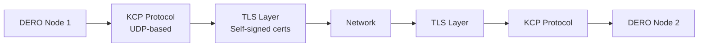

import Image from 'next/image'
import { Callout } from 'nextra/components'

# TLS-Encrypted P2P Network


DERO is the first blockchain to use **TLS-encrypted UDP** for all P2P network communication, protecting against eavesdropping and tampering while maintaining high performance.

<Callout type="info">
  **Innovation:** Self-signed TLS certificates over KCP/UDP provide privacy without certificate authorities or trusted third parties.
</Callout>

---

## Why Network Encryption Matters

**Without encryption (Bitcoin, Ethereum):**
```
Network observer (ISP, government) can see:
  ✓ Who you're connecting to
  ✓ Transaction broadcasts (plaintext)
  ✓ Block propagation timing
  ✓ Network metadata patterns
  
Privacy: Zero
```

**With TLS encryption (DERO):**
```
Network observer sees:
  ✓ Encrypted packets
  ✗ Cannot read contents
  ✗ Cannot identify transaction types
  ✗ Cannot tamper with data
  
Privacy: Network-level protection
```

---

## DERO's Network Architecture

### TLS over KCP/UDP



| Layer | Technology | Purpose |
|-------|-----------|---------|
| **Transport** | UDP | Low latency, reduced kernel exposure |
| **Reliability** | KCP | Reliable delivery over UDP |
| **Encryption** | TLS | Confidentiality and integrity |
| **Authentication** | Self-signed certs | No central authority |

**Source:** `p2p/controller.go:34-35, 48, 609`

---

## TLS Implementation

### Self-Signed Certificates

**From source code** (`p2p/controller.go:717-776`):

```go
// Generate random TLS cert
func generate_random_tls_cert() tls.Certificate {
    // ECDSA for fast handshakes
    key, _ := ecdsa.GenerateKey(elliptic.P256(), rand.Reader)
    
    tml := x509.Certificate{
        SerialNumber: big.NewInt(random),
    }
    
    cert, _ := x509.CreateCertificate(rand.Reader, &tml, &tml, &key.PublicKey, key)
    return tls.X509KeyPair(certPem, keyPem)
}

// Applied to connections
tlsconfig := &tls.Config{
    Certificates: []tls.Certificate{generate_random_tls_cert()}
}
tlsconn := tls.Server(conn, tlsconfig)
```

**Why self-signed?**
- ✅ No certificate authorities (decentralized)
- ✅ Each node generates own cert
- ✅ No trusted third parties
- ✅ Prevents network-level eavesdropping

---

## ECDSA vs RSA Choice

### Performance Comparison

**From source code comments** (`p2p/controller.go:721-734`):

```go
/* RSA can do only 500 exchanges per second
 * EC256 does roughly 20000 exchanges per second
 */

// DERO chose ECDSA (P256)
key, err := ecdsa.GenerateKey(elliptic.P256(), rand.Reader)
```

| Algorithm | Handshakes/Second | DERO's Choice |
|-----------|------------------|---------------|
| **RSA** | ~500 | ❌ Too slow |
| **ECDSA P256** | ~20,000 | ✅ Used |

**Why this matters:**
- Enterprise services handle thousands of connections/second
- Fast handshakes = better scalability
- 40× performance improvement

---

## UDP vs TCP

### Why DERO Uses UDP

| Aspect | TCP | UDP (with KCP) |
|--------|-----|----------------|
| **Network Overhead** | Higher | Lower |
| **Kernel Exposure** | More syscalls | Fewer syscalls |
| **Latency** | Higher | Lower |
| **Reliability** | Built-in | KCP adds it |
| **For Blockchain** | Slower propagation | Faster propagation |

**KCP (UDP-based reliability):**
- Provides TCP-like reliability over UDP
- Lower latency than TCP
- Configurable for blockchain needs
- Used by many high-performance systems

**Source:** `p2p/controller.go:48` - `github.com/xtaci/kcp-go/v5`

---

## Network Privacy Stack

```
Layer 1: UDP Transport
  → Low latency, reduced overhead
  
Layer 2: KCP Protocol  
  → Reliable delivery
  
Layer 3: TLS Encryption ← PRIVACY LAYER
  → Encrypted communication
  → Self-signed certificates
  → No eavesdropping possible
  
Layer 4: DERO Protocol
  → Block/TX propagation
  → Encrypted by TLS
```

---

## What TLS Protects

**Network-Level Attacks Prevented:**

| Attack | Without TLS | With TLS |
|--------|-------------|----------|
| **Eavesdropping** | ISP sees all data | ✅ Only sees encrypted packets |
| **Tampering** | Can modify packets | ✅ Detected and rejected |
| **Traffic Analysis** | Can identify TX types | ⚠️ Timing still visible |
| **MITM** | Possible | ✅ Prevented (self-signed certs) |

**What TLS does NOT hide (network layer metadata):**
- ⚠️ Your IP address (visible at network layer)
- ⚠️ Packet sizes (observable by network)
- ⚠️ Connection timing (metadata analysis)
- ⚠️ That you're using DERO (traffic patterns)

*Note: These limitations apply to ALL TLS implementations (network layer metadata is below TLS's encryption layer)*

**Additional privacy:** DERO supports SOCKS proxy (for Tor/other proxies):

```bash
# Run daemon through Tor (Tor must be running on port 9050)
./derod --socks-proxy=127.0.0.1:9050

# Or through any SOCKS5 proxy
./derod --socks-proxy=proxy_ip:port

# Source: cmd/derod/main.go:62, 75
# Flag: --socks-proxy=<socks_ip:port>  Use a proxy to connect to network.
```

**Note:** VPN would hide DERO usage from ISP, but is NOT configurable via daemon (system-level).

---

## Network Configuration

**Default ports:**

```bash
# Mainnet
P2P:  10101 (encrypted UDP/KCP/TLS)
RPC:  10102 (HTTP, local only)

# Testnet  
P2P:  40401 (encrypted UDP/KCP/TLS)
RPC:  40402 (HTTP, local only)
```

**Firewall rules:**
```bash
# Allow P2P (required)
sudo ufw allow 10101/tcp

# RPC should be local-only (security)
# No firewall rule needed for RPC
```

**Source:** `config/config.go` - Network port constants

---

## Key Advantages

**1. Privacy**
- ✅ ISP cannot read network traffic
- ✅ Government cannot inspect packets
- ✅ No plaintext transaction broadcasts

**2. Security**
- ✅ Prevents packet tampering
- ✅ Authenticates peers
- ✅ Protects integrity

**3. Performance**
- ✅ Fast handshakes (20,000/sec with ECDSA)
- ✅ Low latency (UDP-based)
- ✅ Efficient propagation

**4. Decentralization**
- ✅ No certificate authorities
- ✅ Self-signed certs
- ✅ No central trust point

---

## Comparison with Other Blockchains

| Blockchain | Network Encryption | Protocol | Performance |
|------------|-------------------|----------|-------------|
| **Bitcoin** | ❌ None | TCP | Slower, public |
| **Ethereum** | ❌ None | TCP | Slower, public |
| **Other Privacy Coins** | ❌ None | TCP | Slower, public |
| **DERO** | ✅ TLS | UDP/KCP | Faster, private |

**DERO = Only blockchain with encrypted P2P layer**

---

## Technical Implementation

### Connection Flow

```
Outgoing connection:
  1. Create KCP/UDP connection
  2. Wrap with TLS (self-signed cert)
  3. Perform handshake
  4. Exchange blockchain data (encrypted)
  
Incoming connection:
  1. Accept KCP/UDP connection
  2. Wrap with TLS (self-signed cert)
  3. Verify handshake
  4. Serve blockchain data (encrypted)
```

**Source code:**
- TLS setup: `p2p/controller.go:551, 609`
- Outgoing: `p2p/controller.go:398` - `tls.Client(conn, &tls.Config{InsecureSkipVerify: true})`
- Incoming: `p2p/controller.go:609` - `tls.Server(conn, tlsconfig)`

---

## Limitations & Mitigations

**What TLS Encrypts:**
- ✅ All packet contents
- ✅ Transaction data
- ✅ Block data
- ✅ Peer communications

**What TLS Does NOT Hide:**
- ⚠️ That you're using DERO
- ⚠️ Connection timing
- ⚠️ Packet sizes
- ⚠️ Your IP address

**Additional Privacy Layers:**
```bash
# Use Tor for IP privacy
torify ./derod

# Or use VPN
# Hides that you're using DERO from ISP
```

---

## Key Takeaways

**DERO's encrypted network provides:**
- ✅ **TLS encryption** - All P2P traffic encrypted
- ✅ **UDP/KCP protocol** - Fast, low latency
- ✅ **ECDSA certificates** - 20,000 handshakes/sec (40× faster than RSA)
- ✅ **Self-signed** - No certificate authorities
- ✅ **Privacy** - ISP cannot read network data
- ✅ **Security** - Tampering detected and prevented

<Callout type="warning">
  **Note:** TLS protects network layer. For complete privacy, DERO also uses ring signatures (sender), homomorphic encryption (amounts), and bulletproofs (validation).
</Callout>

---

## Further Reading

- [Transaction Privacy](/privacy/transaction-privacy) - How all privacy layers work together
- [Running a Node](/basics/running-a-node) - Setup your own node
- [DERO Daemon](/basics/daemon) - Understanding daemon operations

**Source Code:**
- Network implementation: `p2p/controller.go`
- TLS cert generation: `p2p/controller.go:717-776`
- KCP/UDP: `github.com/xtaci/kcp-go/v5`

