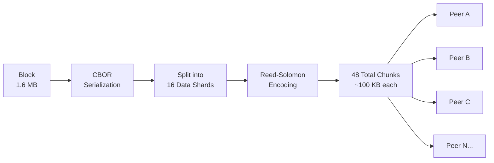
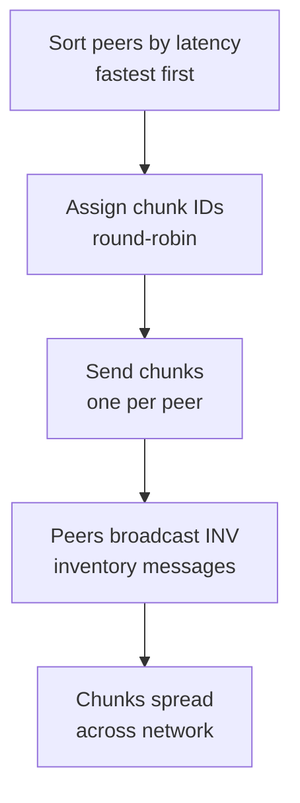

import { Callout, Tabs } from 'nextra/components'

# Erasure Coded Blocks

DERO uses **erasure coding** to improve block propagation across its peer-to-peer network. Rather than transmitting entire blocks as a monolithic unit, DERO splits block data into multiple chunks, generates redundant parity chunks, and disperses them across peers. Any peer receiving a sufficient subset of chunks can reconstruct the full block — even if the majority of chunks are lost or delayed.

<Callout type="info">
  **Innovation:** DERO erasure codes each block into 48 chunks and disperses them across the network. Any peer receiving just 16 of the 48 chunks can fully reconstruct the original block.
</Callout>

---

## What Is Erasure Coding?

Erasure coding is a forward error correction technique that adds mathematical redundancy to data. Unlike simple duplication, it uses algorithms to generate parity shards that allow full reconstruction from any sufficient subset of pieces.

In DERO:
- A block is serialized and split into **data shards**
- Additional **parity shards** are generated using [Reed-Solomon coding](https://en.wikipedia.org/wiki/Reed%E2%80%93Solomon_error_correction)
- Shards are dispersed across peers in the network
- Any peer receiving enough shards (data or parity) can reconstruct the entire block

This improves network resilience against packet loss, latency spikes, and partial connectivity — without requiring full block retransmission.

---

## The 48-Chunk Layout

DERO's erasure coding configuration uses a **16/32 Reed-Solomon scheme**:

| Parameter | Value | Description |
|-----------|-------|-------------|
| Data shards | 16 | Original block data split into 16 pieces |
| Parity shards | 32 | Redundant parity pieces generated |
| **Total chunks** | **48** | All pieces dispersed across the network |
| **Reconstruction threshold** | **16** | Minimum chunks needed to rebuild the block |

**Source:** `p2p/chunk_server.go:335-347`

```go
// 16 data blocks, 32 parity blocks RS code
// if the peer receives any 16 blocks in any order, they can reconstruct entire block
enc, _ := reedsolomon.New(16, 32)
```

---

## How It Works



Consider a **1.6 MB block** being propagated:

1. **Serialization** — The complete block is serialized using CBOR encoding
2. **Splitting** — The 1.6 MB payload is divided into 16 data shards (~100 KB each)
3. **Parity generation** — Reed-Solomon generates 32 parity shards (~100 KB each)
4. **Dispersal** — 48 chunks total (~4.8 MB of data) are distributed across peers
5. **Reconstruction** — Any peer receiving any 16 of the 48 chunks reconstructs the original 1.6 MB block

<Callout type="success">
  **Resilience:** A peer can lose up to **32 of 48 chunks** (66% packet loss) and still fully reconstruct the block.
</Callout>

---

## Data Expansion

Erasure coding trades **bandwidth for reliability**. This tradeoff results in data expansion:

```
Expansion Factor = Total Chunks / Data Chunks
                 = 48 / 16
                 = 3×
```

A 1 MB block becomes ~3 MB of dispersed chunks. This is intentional redundancy — not accidental bloat. The tradeoff is worthwhile: fast, resilient propagation across an adversarial network.

### Hard Limits

The implementation enforces practical bounds on expansion:

**Source:** `p2p/chunk_server.go:12-16`, `p2p/chunk_server.go:341-345`

```go
const MAX_CHUNKS uint8 = 255  // Maximum 255 chunks total

// Minimum requirements:
if data_shard_count < 10 {
    panic(fmt.Errorf("data shard must be > 10, actual %d", data_shard_count))
}
if parity_shard_count < data_shard_count {
    panic(fmt.Errorf("parity shard must be equal or more than data shards"))
}
```

| Constraint | Value | Effect |
|------------|-------|--------|
| Max total chunks | 255 | Upper bound on shard count |
| Min data shards | 10 | Prevents excessive expansion |
| Parity ≥ Data | Enforced | Guarantees meaningful redundancy |
| **Max expansion** | **~25.5×** | `255 / 10` theoretical limit |

These limits balance network efficiency, memory constraints, and latency.

### 100× Block Size Scalability

DERO's official documentation states that erasure coding *"allows 100x block size without increasing propagation delays."* This is a separate claim from the 3× data expansion — and both are correct. They measure different things:

| Metric | Value | What it measures |
|--------|-------|-----------------|
| **Data expansion** | 3× | Bandwidth cost per block (48 chunks / 16 data shards) |
| **Block size scalability** | up to 100× | How much larger blocks can be while maintaining fast propagation |

**Why erasure coding enables larger blocks:**

In traditional blockchains, a block must be transmitted in full to every peer before it can propagate further. If you double the block size, you roughly double the propagation time across the network. This creates a practical ceiling on block size — larger blocks mean slower propagation, more orphans, and reduced security.

Erasure coding breaks this bottleneck:

1. **Parallel dispersal** — 48 small chunks propagate simultaneously across different peers, rather than one large block moving sequentially
2. **Partial reconstruction** — Peers don't need the full 48 chunks; any 16 suffice, so propagation completes as soon as the fastest 16 paths deliver
3. **Reduced per-peer load** — Each peer only transmits a small chunk (~1/48th of the expanded data), not the entire block
4. **Network-wide parallelism** — While peer A sends chunk 1 to peer B, peer C is already forwarding chunk 7 to peer D

The net effect: a 100 MB block broken into 48 chunks of ~6.25 MB each propagates far faster than sending 100 MB sequentially to each peer — even though the total data in the network is 3× larger. The parallelism more than compensates for the redundancy overhead.

<Callout type="info">
  **The tradeoff:** Pay 3× in total bandwidth to unlock dramatically larger block sizes without sacrificing propagation speed. This is a key enabler of DERO's scalability.
</Callout>

---

## Chunk Dispersal

Chunks are distributed using a **round-robin strategy** across peers, prioritized by latency:

**Source:** `p2p/connection_pool.go:394-467`

```go
// Each peer gets a specific chunk based on count modulo total chunks
cid := count % chunk_count  // Rotates through chunks 0-47

// Build chunk identifier: [32-byte block ID][1-byte chunk ID][32-byte header hash]
var chunkid [32 + 1 + 32]byte
copy(chunkid[:], blid[:])
chunkid[32] = byte(cid)
copy(chunkid[33:], hhash[:])
```

### Dispersal Process



1. **Latency-based peer sorting** — Peers are sorted by connection latency (fastest first)
2. **Bandwidth factor** — Environment variable `BW_FACTOR` controls redundancy (default 1)
3. **Chunk rotation** — Each peer receives chunk `count % 48`, cycling through all 48 chunks
4. **Minimum distribution** — Every connected peer gets at least one chunk
5. **Rebroadcast** — When a peer receives a chunk, it broadcasts an INV (inventory) message to its peers

**Source:** `p2p/rpc_notifications.go:32-94`, `p2p/connection_pool.go:483-534`

---

## Reconstruction

When a peer collects enough chunks, reconstruction begins automatically:

**Source:** `p2p/chunk_server.go:176-232`

```go
// 1. Collect available chunks
if uint(chunk_count) < chunk.CHUNK_NEED {  // Need at least 16
    return nil  // Wait for more chunks
}

// 2. Build shard array (nil for missing chunks)
var shards [][]byte
for i := 0; i < int(chunk.CHUNK_COUNT); i++ {
    if chunks_per_block.ChunkCollection[i] == nil {
        shards = append(shards, nil)
    } else {
        shards = append(shards, chunks_per_block.ChunkCollection[i].CHUNK_DATA)
    }
}

// 3. Reconstruct missing shards
enc, _ := reedsolomon.New(int(chunk.CHUNK_NEED), int(chunk.CHUNK_COUNT-chunk.CHUNK_NEED))
if err := enc.Reconstruct(shards); err != nil {
    return nil
}

// 4. Join shards back into original payload
var writer bytes.Buffer
if err := enc.Join(&writer, shards, int(chunk.DSIZE)); err != nil {
    return nil
}

// 5. Deserialize and process block
if err := cbor.Unmarshal(writer.Bytes(), &cbl); err != nil {
    return nil
}
```

---

## Failure Scenarios

### Normal Operation
- Peer receives 16+ chunks from different sources
- Reconstruction succeeds, block is validated and added to the chain
- Remaining arriving chunks are ignored (block already reconstructed)

### High Packet Loss
- Fewer than 16 chunks arrive within the timeout window
- Peer waits for additional chunks or requests missing ones via `GetObject`
- If insufficient chunks arrive within 3 minutes, the chunk set expires and is cleaned up

**Source:** `p2p/chunk_server.go:35-47`

```go
func chunks_clean_up() {
    chunk_map.Range(func(key, value interface{}) bool {
        chunks_per_block := value.(*Chunks_Per_Block_Data)
        if time.Now().Sub(chunks_per_block.Created) > time.Second*180 {
            chunk_map.Delete(key)  // Expire after 3 minutes
        }
        return true
    })
}
```

### Malicious Chunks
- Each chunk includes a hash of its data (`CHUNK_HASH`)
- Corrupted chunks fail hash verification and are rejected
- Peers sending bad chunks can be banned

**Source:** `p2p/chunk_server.go:72-87`

```go
if chunk.CHUNK_HASH[chunk.CHUNK_ID] != crypto.Keccak256_64(chunk.CHUNK_DATA) {
    return fmt.Errorf("Corrupted Chunk")  // Hash mismatch
}
```

---

## RAID Analogy

Erasure coding in DERO is conceptually similar to **RAID** in storage systems — but applied to the network layer:

| RAID Level | Description | DERO Equivalent |
|------------|-------------|-----------------|
| **RAID 0** | Striping, no redundancy | No erasure coding (just split blocks) |
| **RAID 1** | Mirroring (full duplication) | Sending full block to all peers (inefficient) |
| **RAID 5** | Striping + distributed parity | Similar concept but fixed parity disks |
| **RAID 6** | Striping + dual parity | More parity, can lose 2 disks |
| **DERO EC** | 16 data + 32 parity shards | Can lose up to 32 of 48 chunks |

**Key differences from RAID:**
- ✅ **Network vs. Storage** — RAID protects against disk failures; DERO protects against network propagation failures
- ✅ **Dynamic dispersal** — RAID uses fixed disks; DERO disperses across dynamic peer connections
- ✅ **Any subset works** — Unlike RAID with fixed parity locations, any 16 of 48 chunks suffice
- ✅ **No hot spares** — Redundancy comes from oversharing, not standby peers

Think of it as **"RAID for the network"** — instead of protecting against disk failures, it protects against packet loss, peers going offline mid-propagation, network congestion, and asymmetric connectivity.

---

## What Erasure Coding Is NOT

<Callout type="warning">
  Erasure coding is a **propagation optimization**, not a privacy or consensus mechanism.
</Callout>

| Misconception | Reality |
|---------------|---------|
| Encryption | Chunks are not encrypted — they are split and redundant |
| Privacy feature | Anyone with 16 chunks can reconstruct the block |
| Compression | It **expands** data (3×), not compresses it |
| Consensus mechanism | It propagates blocks but doesn't validate them |

For privacy features, see [Ring Signatures](/privacy/ring-signatures), [Homomorphic Encryption](/privacy/homomorphic-encryption), and [Bulletproofs](/privacy/bulletproofs).

---

## Compression

The erasure coding path does **not** apply additional compression (zstd, gzip, snappy, etc.). The flow is strictly:

```
Block → CBOR Serialization → Reed-Solomon Encoding → Chunk Transmission
```

The Reed-Solomon library adds redundancy only — it does not compress. CBOR provides compact binary encoding, but no explicit compression step occurs before chunking.

---

## Implementation Details

### Block Chunk Structure

**Source:** `p2p/wire_structs.go:148-158`

```go
type Block_Chunk struct {
    Type        uint16   `cbor:"T"`      // Object type
    HHash       [32]byte `cbor:"BLH"`    // Header hash for verification
    BLID        [32]byte `cbor:"BLID"`   // Block ID this chunk belongs to
    DSIZE       uint     `cbor:"DSIZE"`  // Original data size in bytes
    BLOCK       []byte   `cbor:"BL"`     // Block header and miniblock data
    CHUNK_COUNT uint     `cbor:"CC"`     // Total chunks (48)
    CHUNK_NEED  uint     `cbor:"CN"`     // Chunks needed for reconstruction (16)
    CHUNK_HASH  []uint64 `cbor:"CH"`     // All chunk hashes (48 hashes)
    CHUNK_ID    uint     `cbor:"CID"`    // This chunk's ID (0-47)
    CHUNK_DATA  []byte   `cbor:"CD"`     // This chunk's payload data
}
```

### Libraries Used

| Library | Purpose |
|---------|---------|
| `github.com/klauspost/reedsolomon` | Efficient Go Reed-Solomon implementation |
| `github.com/fxamacker/cbor/v2` | Binary serialization for wire format |
| `crypto.Keccak256_64` | Fast 64-bit truncated hashes for chunk verification |

### Source Files

| File | Purpose |
|------|---------|
| `p2p/chunk_server.go` | Core chunk creation, validation, and reconstruction |
| `p2p/connection_pool.go` | Chunk dispersal and broadcast logic |
| `p2p/rpc_notifications.go` | Chunk INV handling and rebroadcast |
| `p2p/rpc_object_request.go` | Chunk request/response protocol |
| `p2p/wire_structs.go` | Chunk data structure definitions |

---

## Key Takeaways

**DERO's erasure coding system:**
- ✅ **Splits** blocks into 16 data shards using Reed-Solomon coding
- ✅ **Generates** 32 parity shards for redundancy
- ✅ **Disperses** 48 total chunks across the peer network
- ✅ **Reconstructs** full blocks from any 16 received chunks
- ✅ **Tolerates** up to 66% chunk loss during propagation
- ✅ **Protects** against packet loss, peer dropout, and network congestion

<Callout type="info">
  **Design philosophy:** Trade a 3× bandwidth expansion for robust block propagation even in adversarial or congested network conditions.
</Callout>

---

## Further Reading

- [Encrypted Network](/features/encrypted-network) — TLS encryption for peer connections
- [Graviton](/features/graviton) — DERO's storage engine
- [Transaction Privacy](/privacy/transaction-privacy) — How all privacy layers work together

**Source Code:**
- Chunk server: `p2p/chunk_server.go`
- Dispersal logic: `p2p/connection_pool.go`
- Reed-Solomon: `github.com/klauspost/reedsolomon`
