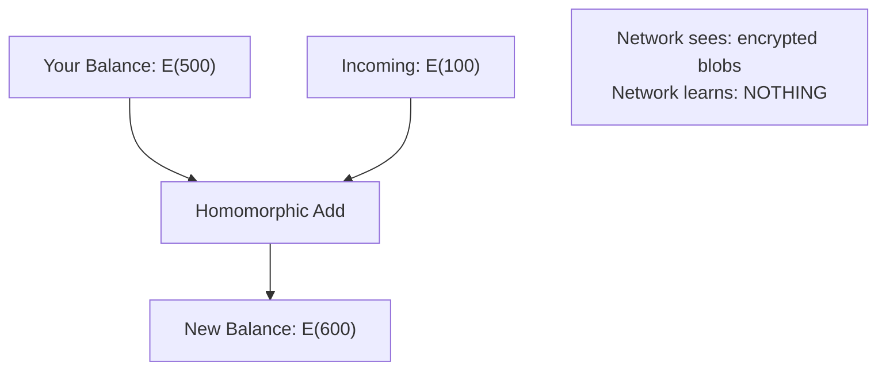
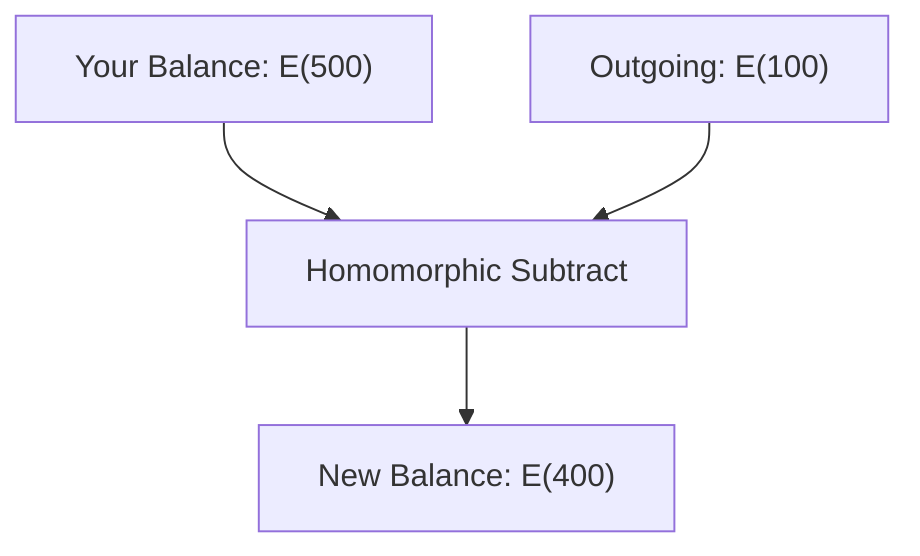
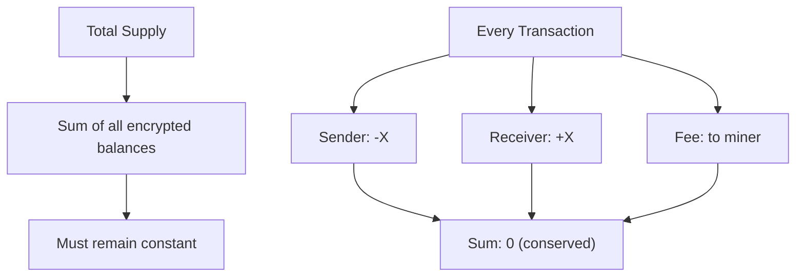

import { Callout } from 'nextra/components'
import { Tabs } from 'nextra/components'

# Balance Mechanics: Encrypted State Management

<Callout type="info" emoji="🔐">
**Always Encrypted:** DERO balances are never stored or transmitted in plaintext. All balance operations happen on encrypted data through homomorphic encryption.
</Callout>

## The Encrypted Balance Structure

### The 66-Byte Format

Every DERO balance is stored as 66 bytes of encrypted data:

```
┌─────────────────────────────────────────────────────────────────────┐
│                    Encrypted Balance (66 bytes)                      │
├──────────────────────────────────┬──────────────────────────────────┤
│      Left Commitment (33 bytes)  │     Right Commitment (33 bytes)  │
│           L = amount×G + r×P     │            R = r×G               │
└──────────────────────────────────┴──────────────────────────────────┘
```

**From Source Code** (`cryptography/crypto/algebra_elgamal.go`):

```go
type ElGamal struct {
    G          *bn256.G1   // Generator point
    Randomness *big.Int    // Blinding factor (used during construction)
    Left       *bn256.G1   // L = amount×G + r×P (33 bytes compressed)
    Right      *bn256.G1   // R = r×G (33 bytes compressed)
}

// Only Left and Right are serialized (66 bytes)
func (e *ElGamal) Serialize() (data []byte) {
    data = append(data, e.Left.EncodeCompressed()...)
    data = append(data, e.Right.EncodeCompressed()...)
    return data
}
```

> **Note:** The full struct includes `G` (generator) and `Randomness` (blinding factor) fields used during construction, but only `Left` and `Right` are serialized to the 66-byte on-chain representation.

### What Each Component Represents

| Component | Formula | Purpose |
|-----------|---------|---------|
| **Left (L)** | `amount×G + r×P` | Encrypted amount + randomness |
| **Right (R)** | `r×G` | Randomness commitment (for decryption) |

**Where:**
- `amount` = The actual balance (hidden)
- `G` = Generator point (public constant)
- `r` = Random blinding factor (secret)
- `P` = Account's public key

---

## Zero Balance Initialization

### The Genesis Rule

**From Source Code** (`blockchain/transaction_execute.go:189-194`):

```go
// give new wallets generated in initial month a balance
// so they can claim previous chain balance safely/securely without revealing themselves
// 144000= 86400/18 *30
if globals.IsMainnet() && height < 144000 {
    zerobalance = zerobalance.Plus(new(big.Int).SetUint64(200))
}
```

### What This Means

| Registration Block | Initial Balance | Reason |
|-------------------|-----------------|--------|
| **< 144,000** | 200 atomic units | Early adoption period |
| **≥ 144,000** | 0 DERO | Standard registration |

**For context:**
- 144,000 blocks = 30 days of 18-second blocks (`86400 / 18 × 30`)
- This bonus period ended long ago; the vast majority of addresses have zero initial balance

<Callout type="warning" emoji="📅">
**Timeline:** The 200-unit bonus only applied to addresses registered in the first ~30 days of mainnet (before block 144,000). Any address registered after that starts with exactly zero DERO.
</Callout>

---

## Homomorphic Operations

### Addition (Receiving DERO)

**When you receive DERO:**



**The Math:**

```
E(balance) = (L_balance, R_balance)
E(amount)  = (L_amount, R_amount)

E(balance) + E(amount) = (L_balance + L_amount, R_balance + R_amount)
                       = E(balance + amount)

Result: Still encrypted! No decryption needed!
```

### Subtraction (Sending DERO)

**When you send DERO:**



**The Math:**

```
E(balance) - E(amount) = (L_balance - L_amount, R_balance - R_amount)
                       = E(balance - amount)
```

**Source:** `cryptography/crypto/algebra_elgamal.go:69` - ElGamal operations

---

## What Balance Changes Mean

### When Balance Changes

| Scenario | Balance Changes? | Reason |
|----------|-----------------|--------|
| **Send DERO** | Yes | Subtracted from your balance |
| **Receive DERO** | Yes | Added to your balance |
| **Ring member (decoy)** | **Yes** | Participates in ring signature |
| **No activity** | No | Balance unchanged |

### The Ring Member Case (Critical)

<Callout type="warning" emoji="⚠️">
**Important:** Encrypted balance changes occur for ALL ring members in a transaction, including decoys. This is by design, not a bug. See [Ring Member Behavior](/integrity/ring-member-behavior) for details.
</Callout>

**From Source Code** (`walletapi/daemon_communication.go:886-889`):

```go
// When address is a ring member:
changes := crypto.ConstructElGamal(tx.Payloads[t].Statement.C[j], tx.Payloads[t].Statement.D)
changed_balance_e := previous_balance_e_tx.Add(changes)
// Balance changes even if address is just a decoy!
```

---

## Balance Query Process

### How to Query Balance

<Tabs items={['Encrypted (Anyone)', 'Decrypted (Owner Only)']}>
  <Tabs.Tab>
    **Query Encrypted Balance (Public)**
    
    ```bash
    curl -X POST http://127.0.0.1:10102/json_rpc \
      -H "Content-Type: application/json" \
      -d '{
        "jsonrpc": "2.0",
        "id": "1",
        "method": "getencryptedbalance",
        "params": {
          "address": "dero1qy...",
          "scid": "0000...0000",
          "topoheight": 1081893
        }
      }'
    ```
    
    **Response:**
    ```json
    {
      "data": "002a319487393969e9552e6b64176c88...",
      "registration": 1059301,
      "bits": 26,
      "height": 1081893,
      "status": "OK"
    }
    ```
    
    **What you see:** 66 bytes of encrypted data
    **What you learn:** Nothing about actual balance
  </Tabs.Tab>
  
  <Tabs.Tab>
    **Decrypt Balance (Requires Private Key)**
    
    **Decryption process:**
    1. Deserialize the 66-byte encrypted balance into an ElGamal pair (Left, Right)
    2. Compute `Left - privateKey × Right` which yields `amount × G`
    3. Solve the discrete log (baby-step giant-step) to recover the integer amount
    
    **What you see:** Actual balance (e.g., 500 DERO)
    **Who can do this:** Only the address owner (requires private key for step 2)
  </Tabs.Tab>
</Tabs>

### The Encrypted Balance Identity Test

**Comparing balances at different heights:**

```
Block 1,059,301: "002a319487393969e9552e6b64176c88..."
Block 1,081,892: "002a319487393969e9552e6b64176c88..."  ← IDENTICAL
Block 1,081,893: "a58442215349d55ceaac042821d568c8..."  ← CHANGED
```

**What this tells us:**
- Identical encrypted data = No balance change
- Different encrypted data = Balance changed (for ANY reason)
- 22,592 blocks unchanged = No involvement in any transaction (not even as ring member)

---

## Balance Conservation

### The Conservation Law



**The homomorphic operations preserve this:**

```
Before: E(sender_balance) + E(receiver_balance) = E(total)
After:  E(sender_balance - amount) + E(receiver_balance + amount) = E(total)

The total is unchanged (minus fee to miner)
```

### Network Verification

**The network verifies conservation without seeing amounts.**

Because ElGamal is additively homomorphic, the network can confirm that the sum of encrypted inputs equals the sum of encrypted outputs -- without decrypting any of them. If the encrypted totals don't match, the transaction is rejected. The actual balance updates happen in `blockchain/transaction_execute.go` using the `ElGamal.Add()` operation from `cryptography/crypto/algebra_elgamal.go:69`.

---

## Security Properties

### What's Protected

| Property | How It's Achieved |
|----------|------------------|
| **Balance confidentiality** | ElGamal encryption |
| **Balance integrity** | Commitment binding |
| **Conservation** | Homomorphic verification |
| **Non-negative balances** | Range proofs |

### What's Visible

| Information | Visible To |
|-------------|-----------|
| **Encrypted balance (66 bytes)** | Anyone |
| **That balance changed** | Anyone |
| **Actual balance value** | Only owner |
| **Transaction amounts** | Only sender/receiver |

---

## Key Takeaways

### The Encryption Guarantee

<Callout type="success" emoji="🔒">
**Always Encrypted:** From creation to storage to operations, DERO balances are always encrypted. The network processes all value transfers without ever seeing a single plaintext balance.
</Callout>

### Balance Change Interpretation

| Observation | What It Means | What It Doesn't Mean |
|-------------|--------------|---------------------|
| **Balance unchanged** | Address not involved in ANY transaction | - |
| **Balance changed** | Address participated in some transaction | ≠ Address was sender |
| **66 bytes different** | Some balance operation occurred | ≠ Received or sent specific amount |

### The Homomorphic Advantage

```
Traditional blockchain:
  Read balance → See actual amount → Privacy broken

DERO:
  Read balance → See encrypted blob → Privacy preserved
  Math on encrypted → Result still encrypted → Privacy preserved
  Only owner decrypts → With private key → Privacy preserved
```

---

## Related Pages

**Security Suite:**
- [Ring Member Behavior](/integrity/ring-member-behavior) - Why decoys' balances change
- [Negative Transfer Protection](/integrity/negative-transfer-protection) - Range proof security

**Privacy Suite:**
- [Homomorphic Encryption](/privacy/homomorphic-encryption) - Full technical details
- [Transaction Privacy](/privacy/transaction-privacy) - Complete privacy model

**Technical Reference:**
- [Wallet RPC API](/rpc-api/wallet-rpc-api) - Balance queries
- [Daemon RPC API](/rpc-api/daemon-rpc-api) - GetEncryptedBalance method
