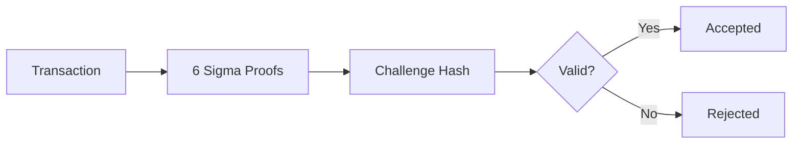

import { Callout } from 'nextra/components'

# DERO Protocol Integrity

**Integrity is a mathematical guarantee, not a policy.** DERO's protocol integrity isn't achieved through secrecy or trust — it's achieved through cryptographic proofs that are independently verifiable by anyone.

<Callout type="success" emoji="🔒">
**The Foundation:** Every DERO transaction requires six interlocking cryptographic proofs that must all pass. Fake one, and the cryptographic binding invalidates all six. These proofs are open source and independently verifiable by anyone.
</Callout>

---

## The Six Sigma Proof System

Every DERO transaction requires **six sigma proof components** bound together through a cryptographic challenge hash. Faking one proof changes the hash, which invalidates all other proofs — an all-or-nothing security model.



**Source:** `cryptography/crypto/proof_verify.go` — [Full technical breakdown →](/integrity/transaction-proofs)

---

## Anatomy of a Transaction

Follow a DERO transaction from creation to finality — each row links to the full technical deep-dive.

### Phase 1: Building the Transaction

Before a transaction leaves the wallet, the proof system is already at work.

| What Happens | Learn More |
|-------------|------------|
| Wallet reads the sender's encrypted balance: 66 bytes, two curve points, zero plaintext | [Balance Mechanics](/integrity/balance-mechanics) |
| Wallet generates six sigma proofs, all bound through a single challenge hash | [Transaction Proofs](/integrity/transaction-proofs) |
| A_t validates a combined 128-bit value: 64 bits transfer + 64 bits remaining. Triple-layer defense | [Range Proofs](/integrity/range-proof-integrity) |
| Negative amounts are caught here, before the transaction leaves the wallet | [Negative Transfers](/integrity/negative-transfer-protection) |

### Phase 2: Network Verification

Every node that receives this transaction runs the same verification independently.

| What Happens | Learn More |
|-------------|------------|
| First checkpoint: `uint64` overflow checks on fees and values. Fails fast before expensive crypto | [Overflow Protection](/integrity/overflow-protection) |
| Five checkpoints in sequence: overflow, parity, polynomial recovery, challenge hash, inner product | [Verification Flow](/integrity/proof-verification-flow) |

### Phase 3: Acceptance and State

Once verified, the transaction enters the mempool, gets mined into a block, and the chain state updates.

| What Happens | Learn More |
|-------------|------------|
| Every node verifies independently and reaches the same conclusion. 18-second blocks, probabilistic finality | [Network Consensus](/integrity/network-consensus-validation) |
| All ring members' encrypted balances change — including decoys. Only the owner knows who sent | [Ring Members](/integrity/ring-member-behavior) |
| Transaction proofs (consensus, secure) vs. payload proofs (display, fakeable by design) | [Proof Types](/integrity/payload-vs-transaction-proofs) |

---

## Security Guarantees

All cryptographic protections below rely on the hardness of ECDLP on the bn256 curve (see [Mathematical Foundation](#mathematical-foundation) below), except where noted.

| Threat | Protection |
|--------|------------|
| **Negative transfers** | Bit decomposition + range proofs |
| **Transaction replay** | A_u key image + nonce/height + consensus rules |
| **Invalid amounts** | 128-bit combined range proof |
| **Forged transactions** | A_y proof (private key ownership) |
| **Balance manipulation** | Homomorphic commitments |
| **Arithmetic overflow** | Explicit `uint64` overflow checks *(deterministic integer arithmetic, not cryptographic)* |

### Honest Limitations

| Limitation | What's Exposed |
|------------|---------------|
| **Timing analysis** | Transaction submission times are visible to connected peers |
| **Network observation** | IP addresses are visible to peers (TLS encrypts content, not identity) |
| **Metadata correlation** | Transaction frequency and patterns are observable on-chain |

---

## Verify It Yourself

<Callout type="info" emoji="🔍">
**Don't Trust, Verify:** All claims in this documentation can be independently verified against the DERO source code.
</Callout>

| Protection | File | Lines |
|------------|------|-------|
| Bit decomposition | `cryptography/crypto/proof_generate.go` | 468-487 |
| Overflow check | `cryptography/crypto/proof_verify.go` | 108-110 |
| Parity check | `cryptography/crypto/proof_verify.go` | 136-141 |
| Challenge hash | `cryptography/crypto/proof_verify.go` | 410-425 |
| Inner product | `cryptography/crypto/proof_verify.go` | 457-459 |
| Block time | `config/config.go` | 34 |
| Balance init | `blockchain/transaction_execute.go` | 189-194 |

```bash
git clone https://github.com/deroproject/derohe.git
cd derohe

# Verify any of the above:
sed -n '468,487p' cryptography/crypto/proof_generate.go   # Bit decomposition
sed -n '108,110p' cryptography/crypto/proof_verify.go     # Overflow check
sed -n '410,425p' cryptography/crypto/proof_verify.go     # Challenge hash
sed -n '457,459p' cryptography/crypto/proof_verify.go     # Inner product
grep "BLOCK_TIME" config/config.go                        # Block time
```

---

## Mathematical Foundation

<Callout type="info" emoji="📐">
DERO's cryptographic proofs rely on the hardness of the elliptic curve discrete logarithm problem (ECDLP) on a bn256 (Barreto-Naehrig) curve -- the same curve family behind Ethereum's bn256 precompiles (EIP-196/197). No efficient algorithm is known for solving ECDLP on these parameters.

Source: `cryptography/bn256/`
</Callout>
