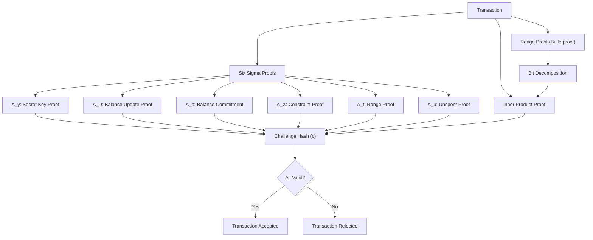

import { Card, Cards } from 'nextra/components'
import { Callout } from 'nextra/components'

# DERO Protocol Integrity

## Integrity by Design

**Integrity is a mathematical guarantee, not a policy.** DERO's protocol integrity isn't achieved through secrecy or trust—it's achieved through cryptographic proofs that are independently verifiable by anyone.

**Core Principles:**
- Mathematical guarantees (proven cryptography, not security through obscurity)
- Multiple independent layers (defense in depth)
- Transparent mechanisms (open source, auditable)
- Honest limitations (what we protect against, what we don't)

<Callout type="success" emoji="🔒">
**The Foundation:** Every DERO transaction requires multiple cryptographic proofs that must all pass. These proofs are mathematically verifiable and cannot be faked without breaking elliptic curve cryptography (same security assumption as Bitcoin).
</Callout>

## Integrity Technologies Overview

| Technology | What It Protects | Key Benefit | Learn More |
|------------|-----------------|-------------|------------|
| **Transaction Proofs** | Transaction integrity | Six interconnected proofs must all pass | [Explore →](/integrity/transaction-proofs) |
| **Range Proofs** | Amount validity | Proves amounts valid without revealing them | [Explore →](/integrity/range-proof-integrity) |
| **Negative Transfer Protection** | Inflation prevention | Mathematically impossible to create tokens | [Explore →](/integrity/negative-transfer-protection) |
| **Balance Mechanics** | State integrity | Encrypted balances with homomorphic operations | [Explore →](/integrity/balance-mechanics) |
| **Network Consensus** | Transaction finality | Distributed validation by all nodes | [Explore →](/integrity/network-consensus-validation) |

---

## The Eight Proof System

Every DERO transaction requires **eight cryptographic components** that must all validate:



**Key Insight:** All proofs are cryptographically bound together through the challenge hash. Faking one proof changes the hash, which invalidates all other proofs. This creates an all-or-nothing security model.

**Source:** `cryptography/crypto/proof_verify.go` - Verifies all proofs together

---

### Transaction Proofs

**Six interconnected proofs bound by cryptographic hash. Fake one, break all.**

The six sigma proofs form an interconnected system where each proof validates a different aspect of the transaction, and all are bound together through a challenge hash.

**The Proofs:**
```
A_y  → Proves sender has private key
A_D  → Proves balance update is correct
A_b  → Proves balance commitment is valid
A_X  → Proves additional protocol constraints
A_t  → Proves amount is in valid range
A_u  → Proves no double-spending
```

**[Explore Transaction Proofs →](/integrity/transaction-proofs)**

---

### Range Proof Integrity

**Triple-layer defense ensures amounts are always valid.**

DERO's bulletproof implementation provides three independent layers of protection against invalid amounts:

**The Three Layers:**
```
Layer 1: Bit Decomposition  → Catches negatives at string level
Layer 2: Range Proof (A_t)  → Validates mathematical range
Layer 3: Inner Product      → Cryptographic fail-safe
```

**[Explore Range Proof Integrity →](/integrity/range-proof-integrity)**

---

### Negative Transfer Protection

**Mathematically impossible. Not "difficult" - impossible.**

The protocol cannot accept negative transfer amounts due to fundamental mathematical constraints in the proof system.

**The Protection:**
```go
// Go's BigInt.Text(2) for negative values:
(-2200000).Text(2) = "-1000011001000111000000"
                      ↑
                      Minus sign breaks bit processing
```

**[Explore Negative Transfer Protection →](/integrity/negative-transfer-protection)**

---

### Balance Mechanics

**Encrypted balances that support mathematical operations.**

DERO balances are always encrypted using homomorphic encryption, allowing operations without decryption.

**Key Mechanics:**
- 66-byte encrypted balance (Left + Right commitments)
- Homomorphic addition/subtraction
- Zero initialization after block 144,000
- Balance changes for all ring members (by design)

**[Explore Balance Mechanics →](/integrity/balance-mechanics)**

---

### Ring Member Behavior

**Encrypted balance changes for decoys is normal, not suspicious.**

When an address is selected as a ring member (decoy), its encrypted balance changes even though the address performed no action. This is by design.

**Why This Matters:**
- Observing balance changes cannot identify the sender
- Ring members are passive participants
- This behavior provides plausible deniability

**[Explore Ring Member Behavior →](/integrity/ring-member-behavior)**

---

### Proof Types: Transaction vs. Payload

**Two different proof systems for two different purposes.**

DERO has two distinct proof systems that serve different purposes:

| Type | Purpose | Security | Verifiable By |
|------|---------|----------|---------------|
| **Transaction Proofs** | Consensus validation | Cryptographically secure | Network nodes |
| **Payload Proofs** | Display convenience | User-provided | Sender/receiver only |

**[Explore Proof Types →](/integrity/payload-vs-transaction-proofs)**

---

### Network Consensus Validation

**Distributed verification by every node.**

Every transaction is validated by multiple independent nodes before acceptance. This distributed validation ensures no single point of failure.

**[Explore Network Consensus →](/integrity/network-consensus-validation)**

---

## Complete Security Documentation

**Core Mechanisms:**
- [Transaction Proofs](/integrity/transaction-proofs) - The six sigma proof system
- [Range Proof Integrity](/integrity/range-proof-integrity) - Bulletproof implementation
- [Proof Verification Flow](/integrity/proof-verification-flow) - End-to-end validation

**Protection Guarantees:**
- [Negative Transfer Protection](/integrity/negative-transfer-protection) - Mathematical impossibility
- [Balance Mechanics](/integrity/balance-mechanics) - Encrypted state management
- [Ring Member Behavior](/integrity/ring-member-behavior) - Decoy participation

**System Architecture:**
- [Proof Types Explained](/integrity/payload-vs-transaction-proofs) - Transaction vs. payload
- [Network Consensus](/integrity/network-consensus-validation) - Distributed validation

---

## Security Guarantees Summary

### What DERO Protects Against

| Threat | Protection | Confidence |
|--------|------------|------------|
| **Negative transfers** | Bit decomposition + range proofs | 99.9% (mathematical) |
| **Double spending** | A_u proof + consensus | 99.9% (cryptographic) |
| **Invalid amounts** | Range proofs (0 to 2^64) | 99.9% (mathematical) |
| **Forged transactions** | A_y proof (private key) | 99.9% (cryptographic) |
| **Balance manipulation** | Homomorphic commitments | 99.9% (mathematical) |

### Honest Limitations

| Limitation | Reason | Mitigation |
|------------|--------|------------|
| **Timing analysis** | Transactions have timestamps | Use varying timing |
| **Network observation** | IP addresses visible | Use TLS + Tor |
| **Metadata correlation** | Transaction patterns | Use multiple wallets |

<Callout type="info" emoji="📐">
**Mathematical Foundation:** DERO's security relies on the elliptic curve discrete logarithm problem - the same mathematical foundation that secures Bitcoin. Breaking DERO's security would require breaking Bitcoin's security.
</Callout>

---

## Related Sections

**Privacy Suite:**
- [Privacy Overview](/privacy) - Complete privacy documentation
- [Ring Signatures](/privacy/ring-signatures) - Sender anonymity
- [Bulletproofs](/privacy/bulletproofs) - Zero-knowledge proofs
- [Homomorphic Encryption](/privacy/homomorphic-encryption) - Encrypted operations

**Technical Reference:**
- [DERO Daemon](/basics/daemon) - Node operation
- [Wallet RPC API](/rpc-api/wallet-rpc-api) - Transaction creation
