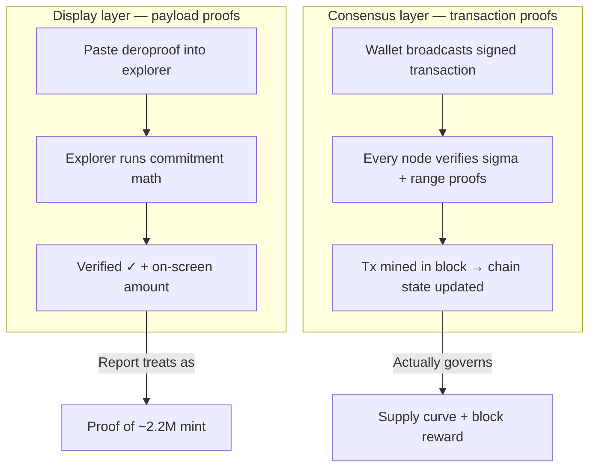
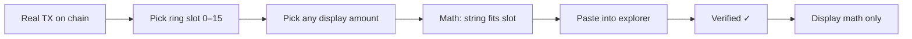

import { Callout } from 'nextra/components'
import { Card, Cards } from 'nextra/components'
import { Tabs } from 'nextra/components'
import { Screenshot } from '@components/screenshot'

# The 2022 Inflation Claim: Claims vs. Evidence

<Callout type="info" emoji="📋">
**Scope:** This page evaluates the foundational claim in publicly circulated exploit reports — that DERO minted ~2.2M coins via negative-transfer wraparound in October 2022. Downstream allegations (laundering, attribution, dollar figures) **derive from it**. Governance and holdings claims are out of scope. Mechanics: [Proof Types](/integrity/payload-vs-transaction-proofs), [Ring Member Behavior](/integrity/ring-member-behavior), [Negative Transfer Protection](/integrity/negative-transfer-protection).
</Callout>

On **October 17, 2022**, a transaction was mined on mainnet — unremarkable at the time. The inflation claim surfaced in **2024–2025** in the [Derolytics "DERO Heist" report](https://web.archive.org/web/20250903162339/https://derolytics.com/) and related posts, after a **separate** wallet-layer privacy bug (May 2024, fixed in Release 142) made forensic analysis of encrypted payloads possible. That bug is real; it does not by itself prove consensus minted coins.

---

## TL;DR Summary

| Question | The Evidence |
|----------|--------------|
| **Did total supply increase by ~2.2M DERO?** | **Not established.** Exploit-block reward was **0.615 DERO**, not 2.2M; the cited TX was accepted under range proofs. No supply delta published. [Part 4](#verify-supply-at-the-exploit-block) |
| Is negative-transfer wraparound possible on consensus? | **No.** Range proofs bind every transfer to a non-negative range; a negative/out-of-range amount cannot produce a verifying proof. [Part 4](#part-4-what-consensus-actually-enforces) |
| Is the circulated payload proof cryptographic evidence of a mint? | **No.** It is a user-supplied **display object**; "Verified" means its own math is consistent, not that consensus accepted it. [Part 3](#part-3-forge-a-fake-proof-yourself) |
| Can explorer **Verified** on inflated proofs be reproduced? | **Yes** on unpatched explorers (`MAX_INT64_SAFE` bypass). [Part 3](#part-3-forge-a-fake-proof-yourself) |
| Does the deanonymization support the ~2.2M? | **No — it refutes it.** The figure is the forgeable proof string, not a deanonymization output. A faithful deanonymization reads the value committed on-chain, which the range proof guarantees was held and conserved ([Part 4](#part-4-what-consensus-actually-enforces)) — an ordinary transfer. [Part 5](#part-5-what-deanonymization-can-and-cannot-establish) |
| Could another inflation mechanism exist? | This page constrains only the alleged negative-transfer mechanism; it does not audit every transaction in chain history. |

---

## Part 1: The Claim and Its Foundation

The report cites these artifacts — readers paste the **payload proof** into an explorer, see **Verified**, and treat that as confirmation the on-chain transfer was negative ([Proof Types](/integrity/payload-vs-transaction-proofs); display-layer only, not consensus):

```
Payload proof:  deroproof1qyyj0cgu3htmkumr79sgca75vwsx8kx7zkrjg0nfez46w36qyx4kwq9zvfyyskpqvdpcfhkhk4m7y9d77ehyj7yhnnrv9z0tjr9m5fqe2yx9t27dwtdxy4j4r0llll7vcmaxwjcl8jzfq
Date:           October 17, 2022
Block:          1,081,893
TX:             5bbe1b7eecfe3447cb045b1197a07a214b456968eda8a3d5a90f5fae9ce57e55
```

<Callout type="warning" emoji="⚠️">
**Category error:** **Verified** on a pasted payload proof means the display object's internal math is consistent — **not** that nodes accepted the transfer or minted coins. Payload proofs are user-supplied; explorers check math, not consensus. [Proof Types](/integrity/payload-vs-transaction-proofs)
</Callout>



The inflation narrative conflates the left path with the right. [Parts 2–3](#part-2-the-explorer-wraparound--what-it-actually-proves) dismantle the display-layer path; [Part 4](#part-4-what-consensus-actually-enforces) checks what nodes actually enforce.

**The technical claim** (as stated in public exploit reports):

1. The transfer amount was **−2,200,000.00181 DERO** (fee included in the negative value).
2. Stored as `uint64` (an unsigned 64-bit integer, no negatives), that negative value wraparound displays as **~184 trillion DERO** on explorers — roughly **14 million× total supply**.
3. Post-2024 deanonymization is cited to name a fresh wallet as the **sender**, allegedly receiving **~2.2M DERO** from the negative transfer — not the **~184 trillion** figure on screen.
4. **Conclusion:** consensus failed → **~2.2M DERO** minted from nothing.

Each step is load-bearing. The rest of this page evaluates them on three independent grounds — the proof string ([Parts 2–3](#part-2-the-explorer-wraparound--what-it-actually-proves)), what consensus enforces ([Part 4](#part-4-what-consensus-actually-enforces)), and attribution limits ([Part 5](#part-5-what-deanonymization-can-and-cannot-establish)) — then synthesizes them ([Part 6](#part-6-the-keystone-collapses)).

### The TX is on chain — so what?

Public reports treat `5bbe1b7eecfe3447cb045b1197a07a214b456968eda8a3d5a90f5fae9ce57e55` appearing in a mined block as proof of inflation. It is not:

- The transaction **was accepted** → all six sigma proofs and range proofs **passed at every node** that validated the block. [Transaction Proofs](/integrity/transaction-proofs)
- Nodes do not store plaintext amounts; they verify cryptographic proofs bind to **non-negative** values. [Range Proof Integrity](/integrity/range-proof-integrity)
- A tx in a block proves **validity under protocol rules**, not that a pasted deroproof string reflects consensus state.

The existence of the transaction is expected. What matters is whether the **payload proof** and **deanonymized interpretation** prove what they claim — and whether the alleged mechanism could have passed the proofs nodes actually verified.

### Report claims vs. evidence

| Report claim | What actually follows |
|---|---|
| *"Protocol failed to validate transaction proofs"* | They mean **payload proofs** (display layer). **Transaction proofs** are verified by every node. [Proof Types](/integrity/payload-vs-transaction-proofs) |
| *"Verify yourself… proof string … on the official explorer"* | **Verified** = pasted object math checks out, not node acceptance. The string decodes to exactly **−2,200,000.00181** and even verifies on-chain — because that is all a display proof does. [Part 3](#part-3-forge-a-fake-proof-yourself) |
| *"Sender actually received 2.2M DERO"* | The ~2.2M is the [forgeable proof string](#part-3-forge-a-fake-proof-yourself), not a deanonymization result; a faithful deanonymization reads a **conserved transfer of coins already held**. [Part 5](#part-5-what-deanonymization-can-and-cannot-establish) |
| *"Both wallets freshly created and empty"* | Ring members **always** show encrypted balance changes — including decoys who did not send. [Ring Member Behavior](/integrity/ring-member-behavior) |
| *"$8.34M laundered over 781 transactions"* | **Assumes the mint happened.** No keystone → the graph is unmotivated. Out of scope here. |

---

## Part 2: The Explorer Wraparound — What It Actually Proves

Paste the [Part 1](#part-1-the-claim-and-its-foundation) **payload proof** into an unpatched explorer and it displays **`184,467,438,537,095.51434 DERO`** with **Verified ✓** — roughly **14 million× total supply** on screen. That figure is a display-layer reading of the embedded `uint64` as a positive number.

<Callout type="warning" emoji="⚠️">
**Proves:** Unpatched explorers can mark inflated payload proofs **Verified** — including amounts that bypass `MAX_INT64_SAFE` and wrap to negatives.

**Does not prove:** The on-chain transaction contained that amount. [Remediation](#part-6-the-keystone-collapses)
</Callout>

<Callout type="info" emoji="🔬">
**Even the on-screen amount's last digit is display-only.** Decode the bech32 string as an integer (`rpc.NewAddress` → `args.Value(RPC_VALUE_TRANSFER, DataUint64)`) and the embedded value is `18,446,743,853,709,551,435` — exactly **−2,200,000.00181 DERO**, the report's own stated figure. The explorer prints `.51434` only because `FormatMoneyPrecision` parses the `uint64` via `big.ParseFloat(..., prec=0, ...)`, which Go's stdlib promotes to a **64-bit mantissa** before rounding (documented behavior — when `prec=0`, [`math/big.Float.Parse`](https://pkg.go.dev/math/big#Float.Parse) sets it to 64). At that precision the step size near 10¹⁴ (~`0.0000153 DERO`) is *just over* one atomic unit (`0.00001 DERO`), so the rounding error lands in the **last** place — `…51435` renders as `…51434`. An "off-by-one" read of the display is reading that rounding, not the integer in the string, which matches the report to the atom. A layer that cannot reliably render its own last digit is not consensus state.
</Callout>

### Decode it yourself

The canonical path the callout cites — `rpc.NewAddress` → `args.Value` — runs in ~10 lines against any DEROHE checkout:

```go
// go run decode.go — requires a DEROHE checkout.
package main

import (
	"fmt"
	"github.com/deroproject/derohe/rpc"
)

func main() {
	addr, _ := rpc.NewAddress("deroproof1qyyj0cgu3htmkumr79sgca75vwsx8kx7zkrjg0nfez46w36qyx4kwq9zvfyyskpqvdpcfhkhk4m7y9d77ehyj7yhnnrv9z0tjr9m5fqe2yx9t27dwtdxy4j4r0llll7vcmaxwjcl8jzfq")
	v := addr.Arguments.Value(rpc.RPC_VALUE_TRANSFER, rpc.DataUint64).(uint64)
	fmt.Printf("uint64:  %d\n", v)                                   // 18446743853709551435
	fmt.Printf("signed:  %d atoms\n", int64(v))                      // -220000000181
	fmt.Printf("DERO:    %.5f\n", float64(int64(v))/100_000)         // -2200000.00181
}
```

On the cited TX with the [Part 1](#part-1-the-claim-and-its-foundation) string:

**Unpatched** ([DEROFDN/derohe `main`](https://github.com/DEROFDN/derohe/tree/main) — no `proof/proof_validation.go`) shows it as **Verified ✓**:

<Screenshot>


</Screenshot>

**Patched** ([DEROFDN/derohe `community-dev`](https://github.com/DEROFDN/derohe/tree/community-dev), via [PR #14](https://github.com/DEROFDN/derohe/pull/14) — `ValidatePayloadProofAmount`) rejects the wraparound before display:

<Screenshot>


</Screenshot>

[Part 3](#part-3-forge-a-fake-proof-yourself) shows anyone can forge such proofs for arbitrary amounts.

---

## Part 3: Forge a Fake Proof Yourself

A payload proof is a **user-supplied display object** — like filling in a receipt template, not an official bank record. It is not signed by the network, not bound to consensus, and on unpatched explorers can show **Verified ✓** for amounts that never moved on-chain.

Everything needed to forge one for the [Part 1](#part-1-the-claim-and-its-foundation) transaction is **already public**: the TX, its **16 ring slots**, and the commitment math inside the payload. No wallet. No private keys.

### The trick, in plain English

1. **Pick the real transaction** everyone is looking at (`5bbe1b7eecfe3447cb045b1197a07a214b456968eda8a3d5a90f5fae9ce57e55`).
2. **Pick one of 16 ring slots** (positions 0–15) — each slot has a public address; you choose which slot the fake proof should attach to.
3. **Pick any amount** you want on screen — including **−1 DERO** or **~184 trillion DERO** wraparound values.
4. **Do the math** so your fake `deroproof…` string fits that slot's public commitment.
5. **Paste the string** into an unpatched explorer with the same TX.

If the display math fits → **Verified ✓**.



<Callout type="error" emoji="🚫">
**Verified ✓ does not mean:**

- Coins were minted
- The chain accepted that amount
- That ring member actually sent it

It only means: **your pasted string is internally consistent with public display math.** Nodes never saw the string. Supply does not change. The circulated report string ([Part 1](#part-1-the-claim-and-its-foundation)) is exactly one such pasted object.
</Callout>

<Callout type="warning" emoji="🧪">
**Paste this forged demo** — built for this page, not from the report.

| Field | Value |
|---|---|
| **TX** | `5bbe1b7eecfe3447cb045b1197a07a214b456968eda8a3d5a90f5fae9ce57e55` |
| **Ring slot** | **0** (of 16) |
| **Encoded amount** | **−1 DERO** → renders on screen as `184,467,440,737,094.51616` |

```
deroproof1qyvvfxzyfqtjm0lgyf5jncleh6cxmmfahgmekxpyrzhhsz832dv8qq9zvfyyskpqqqqqqqqqqqqqqqqqqqqqqqqqqqqqqqqqqqqqqqqqqqqqqqqqqqqxy4j4r0lllllllll8jcq3r0a08
```
</Callout>

**Unpatched** ([DEROFDN/derohe `main`](https://github.com/DEROFDN/derohe/tree/main)):

<Screenshot>


</Screenshot>

**Patched** ([DEROFDN/derohe `community-dev`](https://github.com/DEROFDN/derohe/tree/community-dev), [PR #14](https://github.com/DEROFDN/derohe/pull/14)):

<Screenshot>


</Screenshot>

On an **unpatched** explorer, this can show **Verified ✓** for an amount we chose from thin air. [DEROFDN/derohe `community-dev`](https://github.com/DEROFDN/derohe/tree/community-dev) (via [PR #14](https://github.com/DEROFDN/derohe/pull/14)), [HOLOGRAM](https://hologram.derod.org/proof-validation), and patched explorers reject wraparound amounts before display — that is a display-layer fix, not evidence the chain minted coins.

### How the demo string was built

No wallet — public inputs, public math, one bech32 string.

**What we chose:** ring slot **0**, target **−1 DERO** (= −100,000 atoms). Encoded as the `uint64` wraparound **`18446744073709451616`**, the unpatched explorer renders it as a positive number → **`184,467,440,737,094.51616 DERO`** on screen — the −1 we picked never appears (same display-layer reading as [Part 2](#part-2-the-explorer-wraparound--what-it-actually-proves)).

**The equation** (`proof/proof.go`):

```text
amount × G + blinder  ==  C[slot]
```

`C[0]` is **public** in the TX hex. Rearrange: **`blinder = C[0] − amount×G`**. That derived point — **not** the ring address — plus `V` (amount) and dummy `H`, bech32-encoded → demo string above.

**Self-check:**

```text
proof.Prove(forged, tx_hex, ring, mainnet)
→ err=nil
→ receiver = dero1qyjgfvvf4e7jrna8xg6mmwh77km6q9nfrgdue6q2lczy33almkgy2qq9wzrkp  (slot 0)
→ amount   = 18446744073709451616
```

Passes → unpatched explorer shows **Verified ✓**. **Nothing on-chain changed.**

The circulated report string ([Part 1](#part-1-the-claim-and-its-foundation)) is the same kind of object.

<Tabs items={['Fetch the ring (curl)', 'Pick an amount (Python)', 'Build the string (Go)']}>
  <Tabs.Tab>

Steps 1–2 — fetch the cited TX and its **16 ring members** (public on-chain):

```bash
# Requires a synced mainnet daemon — RPC port 10102 by default.

curl -s http://127.0.0.1:10102/json_rpc \
  -H 'Content-Type: application/json' \
  -d '{
    "jsonrpc": "2.0",
    "id": "1",
    "method": "DERO.GetTransaction",
    "params": {
      "txs_hashes": ["5bbe1b7eecfe3447cb045b1197a07a214b456968eda8a3d5a90f5fae9ce57e55"],
      "decode_as_json": true
    }
  }' | jq '.result.txs[0].ring[0] | length'

# List all 16 ring addresses (pick any slot 0–15 for forging):
curl -s http://127.0.0.1:10102/json_rpc \
  -H 'Content-Type: application/json' \
  -d '{
    "jsonrpc": "2.0",
    "id": "1",
    "method": "DERO.GetTransaction",
    "params": {
      "txs_hashes": ["5bbe1b7eecfe3447cb045b1197a07a214b456968eda8a3d5a90f5fae9ce57e55"],
      "decode_as_json": true
    }
  }' | jq -r '.result.txs[0].ring[0] | to_entries[] | "\(.key): \(.value)"'

# Raw TX bytes for the Go tab:
curl -s http://127.0.0.1:10102/json_rpc \
  -H 'Content-Type: application/json' \
  -d '{
    "jsonrpc": "2.0",
    "id": "1",
    "method": "DERO.GetTransaction",
    "params": {
      "txs_hashes": ["5bbe1b7eecfe3447cb045b1197a07a214b456968eda8a3d5a90f5fae9ce57e55"]
    }
  }' | jq -r '.result.txs_as_hex[0]' | head -c 80
# … (full hex string — several KB)
```

The explorer checks commitment math against these public values — not whether the amount was consensus-valid.

  </Tabs.Tab>
  <Tabs.Tab>

Step 3 only — wraparound `uint64` math for a chosen amount. **Does not** output a pasteable `deroproof…` string.

```python
# No wallet, no chain access. Pick ANY display amount.

ATOMIC = 100_000
UINT64_MOD = 2**64

def forge_wraparound_uint64(negative_dero: float) -> int:
    negative_atoms = int(round(negative_dero * ATOMIC))
    return UINT64_MOD + negative_atoms

def uint64_to_display(amount: int) -> float:
    signed = amount if amount < 2**63 else amount - UINT64_MOD
    return signed / ATOMIC

# Example: forge -1 DERO (the demo callout above)
demo = forge_wraparound_uint64(-1.0)
whole, frac = divmod(demo, ATOMIC)
print(f"uint64 embedded: {demo}")       # → 18446744073709451616
print(f"displays as:     {uint64_to_display(demo)} DERO")
print(f"explorer raw:    {whole:,}.{frac:05d} DERO")

# Example: the report's claimed amount
claimed = forge_wraparound_uint64(-2_200_000.00181)
print(f"\nReport claims:   {uint64_to_display(claimed)} DERO")
print(f"  tail .{int(claimed % ATOMIC):05d} — embedded integer; explorer DISPLAYS .51434 (FormatMoney rounding, see Part 2)")
```

  </Tabs.Tab>
  <Tabs.Tab>

Step 4 — encode a complete `deroproof…` string (needs TX bytes + ring from the **curl** tab). The proof embeds a **derived blinder point** (`C[slot] − amount×G`) so the explorer math fits — not the ring address string itself. Requires a [DEROHE](https://github.com/deroproject/derohe) checkout.

```go
// go run forge_demo.go
// Self-checks with proof.Prove() — same path as explorer verification.

package main

import (
	"encoding/hex"
	"fmt"
	"math/big"

	"github.com/deroproject/derohe/cryptography/bn256"
	"github.com/deroproject/derohe/cryptography/crypto"
	"github.com/deroproject/derohe/proof"
	"github.com/deroproject/derohe/rpc"
	"github.com/deroproject/derohe/transaction"
)

func main() {
	txHex := "<paste txs_as_hex[0] from curl tab>" // serialized TX bytes (not the hash)
	ring := [][]string{{ /* 16 addresses from curl tab */ }}

	amount := uint64(int64(-100_000)) // -1 DERO in atomic units → uint64 wrap
	slot := 0                         // ring position 0–15

	txBytes, _ := hex.DecodeString(txHex)
	var tx transaction.Transaction
	tx.Deserialize(txBytes)

	Ck := tx.Payloads[0].Statement.C[slot]
	var amountG bn256.G1
	amountG.ScalarMult(crypto.G, new(big.Int).SetInt64(int64(amount)))
	blinder := new(bn256.G1).Set(Ck)
	blinder.Add(blinder, new(bn256.G1).Neg(&amountG))

	p := rpc.NewAddressFromKeys((*crypto.Point)(blinder))
	p.Mainnet, p.Proof = true, true
	p.Arguments = rpc.Arguments{
		{Name: "H", DataType: rpc.DataHash, Value: crypto.Hash{}},
		{Name: rpc.RPC_VALUE_TRANSFER, DataType: rpc.DataUint64, Value: amount},
	}

	forged := p.String()
	fmt.Println(forged)

	receivers, amounts, _, _, err := proof.Prove(forged, txHex, ring, true)
	fmt.Printf("Self-check: err=%v receiver=%s atoms=%d\n", err, receivers[0], amounts[0])
}
```

Change `amount` and `slot` to forge any display value for any ring position. If `proof.Prove` succeeds, an unpatched explorer would show **Verified ✓** for that amount.

  </Tabs.Tab>
</Tabs>

---

## Part 4: What Consensus Actually Enforces

[Parts 2–3](#part-2-the-explorer-wraparound--what-it-actually-proves) dismantled the display layer — pasted deroproof strings and explorer **Verified** badges. Part 4 turns to the **consensus layer** from the diagram above: what every node validates and what the chain permanently records.

Two independent checks apply. First, **could** the alleged negative-transfer mechanism pass protocol validation? Second, **what does on-chain history record** at the exploit block — block reward, transaction acceptance, and the emission schedule? A real consensus mint via this mechanism must evade range proofs *and* show abnormal coin creation in the block record. Neither is supported.

### Negative transfers fail range-proof validation

Could negative transfers pass consensus — separate from the submitted proof string?

**No — and the guarantee is cryptographic, not a string-parsing quirk.** Every DERO transfer carries a **Bulletproof range proof**. The protocol packs the **transfer amount** and the sender's **remaining balance** into one 128-bit value and proves, in zero knowledge, that it lies in `[0, 2^128)` — i.e. that *both* the amount sent and the balance left over are valid **non-negative** 64-bit numbers (`number = transfer + (balance << 64)`, `cryptography/crypto/proof_generate.go`).

A "negative" transfer is the `uint64` wraparound of a huge value, and it cannot satisfy that proof:

- **As the amount** — a value near `2^64` exceeds the 64-bit range bound.
- **As the consequence** — spending more than you hold drives the *remaining balance* negative, which wraps out of range too.

By the **soundness** of Bulletproofs, no prover can construct a proof that *verifies* for an out-of-range committed value — forging one is as hard as breaking the underlying discrete-log assumption. Combined with DERO's homomorphic accounting (inputs and outputs are bound to balance exactly), value cannot be created from nothing. Every node runs this verification independently before accepting a block, so a negative-transfer mint is rejected at **consensus** — not merely discouraged client-side.

| Proves | Does not prove |
|---|---|
| The **specific** alleged mechanism cannot produce a verifying proof. | No inflation via *any* mechanism. |
| Range proofs bind every node's acceptance. | Every historical tx has been audited. |

Full derivation: [Negative Transfer Protection](/integrity/negative-transfer-protection).

That closes the *mechanism* question. The *outcome* question is what the chain permanently recorded at topo 1,081,893 — not what a pasted deroproof displays.

### Verify supply at the exploit block

The report's conclusion is that ~2.2M DERO was **minted from nothing** on October 17, 2022 (topoheight **1,081,893**). To support that, it would need to show abnormal coin creation at consensus — a multi-million DERO step in the block itself, or a supply audit against something other than the emission schedule. It publishes neither: only a payload proof string and an interpretation of the **corresponding transaction** ([Part 1](#part-1-the-claim-and-its-foundation)).

Scheduled emission is **deterministic** from block height: premine plus block rewards that halve on a fixed schedule (`CalcBlockReward` in `blockchain/transaction_execute.go`). That formula estimates *expected* cumulative supply at any height. **`DERO.GetInfo` reports the same approximation** (`cmd/derod/rpc/rpc_dero_getinfo.go`: `PREMINE + CalcBlockReward(topoheight) × topoheight`) — scheduled emission in whole DERO, **not** a UTXO census or balance sum across the ledger.

<Callout type="warning" emoji="⚖️">
**What `GetInfo` can and cannot do:** Comparing `GetInfo.total_supply` to the emission formula confirms the RPC implements the schedule. It does **not** independently detect a surreptitious mint — both numbers come from the same model. DERO does not expose a chain-wide balance sum via RPC. The **independent** checks for this case are: block-header **reward**, cited-TX **acceptance** (range proofs passed), and the **impossibility** of the alleged negative-transfer mechanism ([above](#negative-transfers-fail-range-proof-validation)).
</Callout>

<Callout type="info" emoji="📊">
**Burden of proof:** The report never publishes a supply delta against any independent measure. Per-block emission at the exploit era is **~0.62 DERO** — not millions. The on-chain block record at topo 1,081,893 matches normal scheduled emission.
</Callout>

### Exploit block facts (permanent on-chain)

These values are fixed in mainnet history — query any synced node at topoheight **1,081,893**:

| Field | Value |
|---|---|
| **Timestamp** | 2022-10-17 07:58:09 UTC |
| **Block hash** | `b6bd914f7fb1c79788fe8676c277e58e7bb5a904317afb096b1d2793af9aed13` |
| **Block reward** | **0.615 DERO** (61,500 atomic units) |
| **TX count** | **1** (the cited transaction) |

The block reward is normal scheduled emission — not a multi-million DERO mint. The cited TX being mined here proves the transaction was **accepted under protocol rules**; it does not prove a pasted deroproof amount.

### What the chain record shows

**Independent on-chain checks** at topo 1,081,893 — query any synced node:

| Check | RPC / source | Result |
|---|---|---|
| Block reward | `GetBlockHeaderByTopoHeight` | **0.615 DERO** — normal scheduled emission, not a 2.2M mint |
| Cited TX | `GetTransaction` | **Accepted and mined** → all range proofs passed at every validating node |
| Expected cumulative supply | Emission formula | **~12,946,618 DERO** at this height (schedule only — not a ledger audit) |

For context, if a **+2.2M DERO** consensus mint had occurred at this block, expected cumulative supply under the schedule would be **~15,146,618 DERO** instead — but detecting that would require an **independent** supply measure the protocol does not expose via RPC. The report never publishes one.

For **this alleged mechanism**, the block record is decisive anyway: a negative-transfer mint would require consensus to accept an impossible amount ([range proofs](#negative-transfers-fail-range-proof-validation)). The TX **was** accepted — under normal protocol rules, with a **0.615 DERO** block reward, not millions.

<Tabs items={['Query the chain', 'Emission formula (Python)']}>
  <Tabs.Tab>

```bash
# Requires a synced mainnet daemon — RPC port 10102 by default.
# See: /basics/running-a-node

# 1) Exploit block header — independent on-chain facts (reward, txcount)
curl -s http://127.0.0.1:10102/json_rpc \
  -H 'Content-Type: application/json' \
  -d '{"jsonrpc":"2.0","id":"1","method":"DERO.GetBlockHeaderByTopoHeight","params":{"topoheight":1081893}}' \
  | jq '.result.block_header | {topoheight, hash, timestamp, reward, txcount}'

# 2) Flagged TX exists in chain — accepted tx means range proofs passed
curl -s http://127.0.0.1:10102/json_rpc \
  -H 'Content-Type: application/json' \
  -d '{"jsonrpc":"2.0","id":"1","method":"DERO.GetTransaction","params":{"txs_hashes":["5bbe1b7eecfe3447cb045b1197a07a214b456968eda8a3d5a90f5fae9ce57e55"]}}' \
  | jq '.result.txs[0] | {in_pool, version}'

# 3) Optional — GetInfo reports scheduled emission (same formula as Python tab)
curl -s http://127.0.0.1:10102/json_rpc \
  -H 'Content-Type: application/json' \
  -d '{"jsonrpc":"2.0","id":"1","method":"DERO.GetInfo"}' \
  | jq '{topoheight, total_supply, height}'
```

Steps 1–2 are the independent checks. Step 3 confirms `GetInfo.total_supply` implements the emission schedule (`PREMINE + CalcBlockReward × height`) — **not** a UTXO census. Matching the Python tab means the RPC uses the formula; it does not detect a surreptitious mint.

Same RPC methods are available via the [DERO MCP server](/tools/mcp-server) (`dero_get_info`, `dero_get_block_header_by_topo_height`).

  </Tabs.Tab>
  <Tabs.Tab>

```python
# Emission schedule — same model as DERO.GetInfo (not a UTXO census).
# Source: config.PREMINE, blockchain/transaction_execute.go (CalcBlockReward)

ATOMIC = 100_000
BLOCK_TIME = 18
REWARD_REDUCTION_INTERVAL = 210_000 * 600 // BLOCK_TIME  # 7,000,000
BASE_REWARD = (41 * 100_000 * BLOCK_TIME) // 600         # 123,000 atomic/block at genesis era
PREMINE = 1_228_125_400_000                              # atomic units (Stargate premine accounting)
ALLEGED_MINT = 2_200_000
EXPLOIT = 1_081_893

def calc_block_reward(height: int) -> int:
    return BASE_REWARD >> ((height + REWARD_REDUCTION_INTERVAL) // REWARD_REDUCTION_INTERVAL)

def scheduled_supply_dero(topoheight: int) -> float:
    atoms = PREMINE + calc_block_reward(topoheight) * topoheight
    return atoms / ATOMIC

# --- At the exploit block (schedule context only) ---
expected = scheduled_supply_dero(EXPLOIT)
print(f"Scheduled supply at exploit block: {expected:>14,.3f} DERO")
print(f"If 2.2M had been minted (hypothetical): {expected + ALLEGED_MINT:>14,.3f} DERO")
print(f"Block reward at this height:       {calc_block_reward(EXPLOIT) / ATOMIC:.3f} DERO/block")
print(f"  ↑ query independently via GetBlockHeaderByTopoHeight — should match")

# --- Emission step across the exploit block (~2× block reward, not 2.2M) ---
step = scheduled_supply_dero(EXPLOIT + 1) - scheduled_supply_dero(EXPLOIT - 1)
print(f"\nSchedule change across block ±1: {step:.3f} DERO")

# --- Optional: confirm GetInfo implements the same schedule (not a mint audit) ---
def getinfo_matches_schedule(topoheight: int, getinfo_supply: int) -> None:
    scheduled = scheduled_supply_dero(topoheight)
    print(f"At topo {topoheight:,}:")
    print(f"  Schedule expects: {scheduled:,.3f} DERO")
    print(f"  GetInfo reports:  {getinfo_supply:,} DERO (whole DERO, same formula)")
    print(f"  Match confirms RPC uses the schedule — not an independent supply audit.")

# Example: getinfo_matches_schedule(topoheight=<from GetInfo>, getinfo_supply=<from GetInfo>)
```

  </Tabs.Tab>
</Tabs>

<Callout type="success" emoji="🔒">
Part 4 closes the consensus side: the alleged mechanism cannot pass range-proof validation. The exploit block records a **0.615 DERO** reward — not a multi-million mint — and the cited transaction in [Part 1](#part-1-the-claim-and-its-foundation) was **accepted**, meaning range proofs passed at every validating node. The report never publishes a supply delta against an independent measure.
</Callout>

---

## Part 5: What Deanonymization Can and Cannot Establish

[Parts 2–4](#part-4-what-consensus-actually-enforces) closed the mint question. The report leans on one further capability — deanonymization — to name a beneficiary and trace funds. Applied honestly to this transaction, it does not support the inflation claim. It undercuts it.

<Callout type="info" emoji="ℹ️">
**The bug was real, and the fix mattered.** The deanonymization in public reports relies on a genuine wallet-layer randomness-reuse vulnerability (disclosed May 2024, fixed in Release 142): payloads were encrypted under a key derived from a **deterministic** blinding scalar feeding a zero-nonce stream cipher, which Release 142 replaced with a per-payload ephemeral key. This page neither disputes the vulnerability nor minimizes the fix.
</Callout>

**The ~2.2M is not a deanonymization result.** It is the [circulated proof string](#part-1-the-claim-and-its-foundation) — a forgeable display object ([Part 3](#part-3-forge-a-fake-proof-yourself)) whose embedded `uint64` reads as −2,200,000.00181 only if you take a wraparound as negative. The report sources the figure there itself: *"use the proof string on the official explorer to confirm."*

**A faithful deanonymization reads the chain — and the chain was constrained in advance.** Deanonymizing recovers the value actually committed in the transaction, not a pasted string. Whatever that value is, the range proof already pinned what it *can* be ([Part 4](#part-4-what-consensus-actually-enforces)): the sender provably **held** the amount and the balances **conserved**. A committed transfer of ~184 trillion DERO is impossible — the sender would have had to hold it, and the proof would not have verified. So a faithful deanonymization of this transaction recovers an **ordinary transfer of coins that already existed** — not a mint.

Attribution to a named individual is the report's own conceded allegation, resting on timing, access, and behavior — not cryptography. The laundering graph inherits that dependency: with no minted 2.2M, there is nothing to launder.

### What changes — and what doesn't

Compare the pre-fix payload encryption with the Release-142 fix, both from `walletapi/transaction_build.go`:

```go
// Release 113/114 — pre-fix
// The payload key derives from r, the blinding scalar that also hides every commitment.
// D = rG is published in the statement, so anyone who recovers r can read this payload.
shared_key := crypto.GenerateSharedSecret(r, publickeylist[i])                       // key tied to r
asset.RPCPayload = append([]byte{byte(uint(witness_index[1]))}, data...)             // prepends RECEIVER index
crypto.EncryptDecryptUserData(crypto.Keccak256(shared_key[:], publickeylist[i].EncodeCompressed()), asset.RPCPayload)

// ─────────────────────────────────────────────────────────────────────────────
// Release 142 — fix
// A per-payload ephemeral scalar replaces r in the key derivation; the ephemeral
// pubkey is prepended so the receiver can still derive the shared secret. The
// scalar is bound through two SHAKE passes to sender_secret, roothash, ring
// inputs, and receiver — none of which an outside observer can reconstruct.
ephemeral_key    := crypto.ShakeXOF(publickeylist[i].String(), sender_secret.Bytes(), roothash[:])
ephemeral_seed   := crypto.ShakeXOF(sender.String(), ephemeral_key[:], rinputs, publickeylist[i].EncodeCompressed())
ephemeral_scalar := new(big.Int).SetBytes(ephemeral_seed[:])
ephemeral_scalar  = ephemeral_scalar.Mod(ephemeral_scalar, bn256.Order)
ephemeral_pub    := crypto.GPoint.ScalarMult(crypto.GetBNRed(ephemeral_scalar))
shared_key       := crypto.GenerateSharedSecret(ephemeral_scalar, publickeylist[i]) // key independent of r
payload          := append([]byte{byte(uint(witness_index[1]))}, data...)            // still the RECEIVER index
crypto.EncryptDecryptUserData(crypto.Keccak256(shared_key[:], publickeylist[i].EncodeCompressed()), payload)
asset.RPCPayload  = append(ephemeral_pub.EncodeCompressed(), payload...)             // ephemeral pub prepended
```

The receiver byte (`witness_index[1]`) is in both versions — the sender is never serialized in either era. What changed is the key derivation, from `r` to an independent ephemeral scalar. So a faithful read of either era's payload surfaces a receiver index and the committed value — exactly what a deanonymization can return, and nothing more.

---

## Part 6: The Keystone Collapses

Every downstream claim in the public exploit narrative — dollar figures, laundering graphs, "stolen funds," attribution arguments, the framing of a multi-year cover-up — is built on **one load-bearing artifact**: the payload proof pasted above, presented as cryptographic confirmation that the protocol minted 2.2M DERO from nothing.

That artifact fails on four independent grounds — in the order established above:

1. **It is only a display object.** [Part 3](#part-3-forge-a-fake-proof-yourself) — a payload proof is user-supplied; anyone can build a **Verified ✓** one for any amount and any ring slot.
2. **The mechanism is impossible.** [Part 4](#part-4-what-consensus-actually-enforces) — a negative/wraparound transfer cannot produce a verifying range proof, so no node would accept it at the protocol layer.
3. **No consensus mint recorded.** [Part 4](#verify-supply-at-the-exploit-block) — block reward was **0.615 DERO**, not millions; the cited TX was **accepted** (range proofs passed). `GetInfo` reports scheduled emission, not a UTXO census — it cannot detect a surreptitious mint by itself. The report never publishes a supply delta against any independent measure.
4. **Deanonymization refutes the mint, it doesn't support it.** [Part 5](#part-5-what-deanonymization-can-and-cannot-establish) — the ~2.2M is the forgeable proof string, not a deanonymization output. A faithful deanonymization reads the value committed on-chain, which the range proof guarantees was held and conserved — an ordinary transfer. Attribution to a person is the report's own conceded allegation.

The display-layer bug that made this confusion possible was real. It is being remediated — [DEROFDN/derohe `community-dev`](https://github.com/DEROFDN/derohe/tree/community-dev) ([PR #14](https://github.com/DEROFDN/derohe/pull/14)), [HOLOGRAM](https://hologram.derod.org), and patched explorers now reject proofs like this one; `main` and other unpatched explorers may still show **Verified**. That is a display-layer problem worth fixing. It is not evidence that the chain minted coins; the range proofs do not permit it.

<Callout type="warning" emoji="💬">
**"Irrefutable" is only as strong as its evidence.** [Derolytics' executive summary](https://web.archive.org/web/20250903162339/https://derolytics.com/) calls the case *"irrefutable"* and invites readers to *"verify yourself"* by pasting the proof string into an explorer. But that string is a user-supplied display object — one [anyone can forge for any amount](#part-3-forge-a-fake-proof-yourself), describing a transfer that [consensus could never accept](#part-4-what-consensus-actually-enforces).
</Callout>

What this page establishes is narrow but decisive: the circulated payload proof, presented as evidence of a sophisticated consensus exploit, does not support what it was meant to prove. The alleged mechanism is what fails — not every conceivable scenario — but the artifact the report calls "irrefutable" is neither irrefutable nor proof.

---

## Related Pages

<Cards>
  <Card title="Proof Types Explained" href="/integrity/payload-vs-transaction-proofs">
    Transaction vs payload proofs — the distinction at the center of this case
  </Card>
  <Card title="Ring Member Behavior" href="/integrity/ring-member-behavior">
    Why decoy addresses see ciphertext changes without sending funds
  </Card>
  <Card title="Negative Transfer Protection" href="/integrity/negative-transfer-protection">
    Mathematical proof that negative amounts cannot pass consensus
  </Card>
  <Card title="Payload Proofs" href="/privacy/payload-proofs">
    Why third-party payload verification is ambiguous by design
  </Card>
</Cards>
