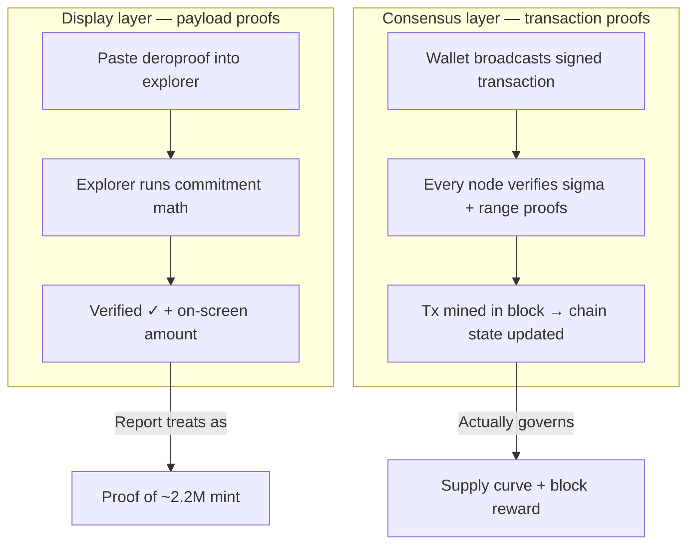

import { Callout } from 'nextra/components'
import { Card, Cards } from 'nextra/components'
import { Tabs } from 'nextra/components'
import { Screenshot } from '@components/screenshot'

# The 2022 Inflation Claim: Claims vs. Evidence

_Derolytics' "irrefutable proof" is a string anyone can forge — and even a genuine one describes a transfer the chain would have rejected._

<Callout type="info" emoji="📋">
**Scope:** This page tests **one** claim: that DERO minted ~2.2M coins in October 2022 by exploiting a bug in how transfers were validated. Laundering totals, dollar figures, and attribution to individuals all **derive from this single claim** — if it falls, they fall with it. Governance and wallet-holdings allegations are out of scope here.
</Callout>

## TL;DR Summary

| Question | The Evidence |
|----------|--------------|
| **Did total supply increase by ~2.2M DERO?** | **No.** The exploit-block reward was **0.615 DERO** — normal scheduled emission, not millions. The report never shows a supply jump on chain. [Part 4](#verify-supply-at-the-exploit-block) |
| Is negative-transfer wraparound possible on consensus? | **No.** Range proofs bind every transfer to a non-negative range; a negative/out-of-range amount cannot produce a verifying proof. [Part 4](#part-4-the-chains-account-at-the-exploit-block) |
| Is the circulated payload proof cryptographic evidence of a mint? | **No.** It is a user-supplied **display object**; "Verified" means its own math is consistent, not that consensus accepted it. [Part 3](#part-3-forge-a-fake-proof-yourself) |
| Can explorer **Verified** on inflated proofs be reproduced? | **Yes** on unpatched explorers (`MAX_INT64_SAFE` bypass). [Part 3](#part-3-forge-a-fake-proof-yourself) |
| Does the deanonymization support the ~2.2M? | **No — it refutes it.** The figure is the forgeable proof string, not a deanonymization output; a faithful deanonymization recovers an ordinary transfer of coins already held. [Part 5](#part-5-what-deanonymization-can-and-cannot-establish) |
| **Bottom line on the keystone?** | **The artifact at the center of every accusation is a display object anyone can forge — and consensus could not have accepted the transfer it depicts.** [Part 6](#part-6-the-keystone-collapses) |

---

At the center of every inflation accusation is a string. About a hundred characters of base32, prefixed `deroproof1...`, pasted into an unpatched DERO explorer where it lights up as **Verified ✓** for an amount the explorer renders as `184,467,438,537,095.51434 DERO` — roughly fourteen million times the entire DERO supply.

That string is the foundation of the [Derolytics "DERO Heist" report](https://web.archive.org/web/20250903162339/https://derolytics.com/) and its follow-ups — the source of the **2.2-million-DERO** figure, the cited evidence for every downstream claim of laundering, theft, and attribution. It is also a *payload proof*: a wallet-side display object the protocol gives no third party any way to verify. By design. Ring signatures rely on exactly this ambiguity — if outsiders could verify payload proofs, plausible deniability would die with them.

The technique that produced it became possible in **May 2024**, when a separate wallet-layer randomness-reuse bug (patched in Release 142) gave outside observers their first means of reading inside DERO's encrypted payloads. Pointed back at a transaction mined on **October 17, 2022** — accepted by every validating node, indistinguishable on-chain from any other transfer — that technique returned a value, paired it with a payload proof, and announced an inflation.

The chain never said any such thing. The transaction is the same one it has always been: bounded by range proofs that pin every amount to a non-negative range, conserved by balance proofs that bind inputs to outputs, accepted unanimously. What changed in 2024 was the ability to *interpret* — and a misreading, intentional or otherwise, of what a payload proof is and does. The entire Derolytics narrative rests on that single misreading. Every chart, every accusation, every dollar figure.

---

## Part 1: The Claim and Its Foundation

The report cites this **payload proof** as cryptographic evidence — readers paste it into an explorer, see **Verified**, and treat that as confirmation the on-chain transfer was negative ([Proof Types](/integrity/payload-vs-transaction-proofs); display-layer only, not consensus). As cited:

```
Payload proof:  deroproof1qyyj0cgu3htmkumr79sgca75vwsx8kx7zkrjg0nfez46w36qyx4kwq9zvfyyskpqvdpcfhkhk4m7y9d77ehyj7yhnnrv9z0tjr9m5fqe2yx9t27dwtdxy4j4r0llll7vcmaxwjcl8jzfq
Date:           October 17, 2022
Block:          1,081,893
TX:             5bbe1b7eecfe3447cb045b1197a07a214b456968eda8a3d5a90f5fae9ce57e55
```

<Callout type="warning" emoji="⚠️">
**Category error:** **Verified** on a pasted payload proof means the display object's internal math is consistent — **not** that nodes accepted the transfer or minted coins. Payload proofs are user-supplied; explorers check math, not consensus. [Proof Types](/integrity/payload-vs-transaction-proofs)
</Callout>



**The technical claim** (as stated in public exploit reports) rests on a single assumption — that the payload proof above is cryptographic evidence, and what verifies on an explorer also represents what consensus accepted:

1. The transfer amount was **−2,200,000.00181 DERO** — `−220,000,000,181` atoms when the bech32 is decoded ([Part 2](#part-2-the-explorer-wraparound--what-it-actually-proves)).
2. Stored as `uint64` (an unsigned 64-bit integer, no negatives), that negative value wraparound displays as **~184 trillion DERO** on explorers — roughly **14 million× total supply**.
3. Post-2024 deanonymization is cited to name a fresh wallet as the **sender** — and to read the wraparound as a **~2.2M DERO** credit to that sender, not the **~184 trillion** figure on screen.
4. **Conclusion:** consensus failed → **~2.2M DERO** minted from nothing.

Each step is load-bearing. The rest of this page evaluates them on three independent grounds — the proof string ([Parts 2–3](#part-2-the-explorer-wraparound--what-it-actually-proves)), what consensus enforces ([Part 4](#part-4-the-chains-account-at-the-exploit-block)), and attribution limits ([Part 5](#part-5-what-deanonymization-can-and-cannot-establish)) — then synthesizes them ([Part 6](#part-6-the-keystone-collapses)).

### Report claims vs. evidence

| Report claim | What actually follows |
|---|---|
| *"Protocol failed to validate transaction proofs"* | They mean **payload proofs** (display layer). **Transaction proofs** are verified by every node. [Proof Types](/integrity/payload-vs-transaction-proofs) |
| *"Verify yourself… proof string … on the official explorer"* | **Verified** = pasted object math checks out, not node acceptance. The string decodes to exactly **−2,200,000.00181** and the explorer's display-layer consistency check passes — because that is all a display proof does. [Part 3](#part-3-forge-a-fake-proof-yourself) |
| *"Sender actually received 2.2M DERO"* | The ~2.2M is the [forgeable proof string](#part-3-forge-a-fake-proof-yourself), not a deanonymization result; a faithful deanonymization reads a **conserved transfer of coins already held**. [Part 5](#part-5-what-deanonymization-can-and-cannot-establish) |
| *"Both wallets freshly created and empty"* | Ring members **always** show encrypted balance changes — including decoys who did not send. [Ring Member Behavior](/integrity/ring-member-behavior) |
| *"$8.34M laundered over 781 transactions"* | **Assumes the mint happened.** No keystone → the graph is unmotivated. Out of scope here. |

---

## Part 2: The Explorer Wraparound — What It Actually Proves

Paste the [Part 1](#part-1-the-claim-and-its-foundation) **payload proof** into an unpatched explorer and it displays **`184,467,438,537,095.51434 DERO`** with **Verified ✓** — roughly **14 million× total supply** on screen. That figure is a display-layer reading of the embedded `uint64` as a positive number.

<Callout type="warning" emoji="⚠️">
**Proves:** Unpatched explorers can mark inflated payload proofs **Verified** — including amounts that bypass `MAX_INT64_SAFE` and wrap to negatives.

**Does not prove:** The on-chain transaction contained that amount. [Remediation](#part-6-the-keystone-collapses)
</Callout>

<Callout type="info" emoji="🔬">
**The proof is authentic.** Decode the bech32 string as an integer (`rpc.NewAddress` → `args.Value(RPC_VALUE_TRANSFER, DataUint64)`) and the embedded value is `18,446,743,853,709,551,435` — exactly **−2,200,000.00181 DERO**, the report's own stated figure to the atom. The "off-by-one" in the display is the explorer's rounding, not a flaw in the proof: `FormatMoneyPrecision` parses the `uint64` via `big.ParseFloat(..., prec=0, ...)`, which Go's stdlib promotes to a **64-bit mantissa** before rounding (documented behavior — when `prec=0`, [`math/big.Float.Parse`](https://pkg.go.dev/math/big#Float.Parse) sets it to 64). At that precision the step size near 10¹⁴ (~`0.0000153 DERO`) is *just over* one atomic unit (`0.00001 DERO`), so rounding lands in the **last** place — `…51435` renders as `…51434`.

Authenticity is the page's point, not a problem for it. The misreading at the heart of the inflation claim isn't "Derolytics produced a broken proof" — it's that an authentic display object was treated as consensus state. A layer that cannot reliably render its own last digit is not consensus state.
</Callout>

### Decode it yourself

The canonical path the callout cites — `rpc.NewAddress` → `args.Value` — runs in ~10 lines against any DEROHE checkout:

```go
// go run decode.go — requires a DEROHE checkout.
package main

import (
	"fmt"
	"github.com/deroproject/derohe/rpc"
)

func main() {
	addr, _ := rpc.NewAddress("deroproof1qyyj0cgu3htmkumr79sgca75vwsx8kx7zkrjg0nfez46w36qyx4kwq9zvfyyskpqvdpcfhkhk4m7y9d77ehyj7yhnnrv9z0tjr9m5fqe2yx9t27dwtdxy4j4r0llll7vcmaxwjcl8jzfq")
	v := addr.Arguments.Value(rpc.RPC_VALUE_TRANSFER, rpc.DataUint64).(uint64)
	fmt.Printf("uint64:  %d\n", v)                                   // 18446743853709551435
	fmt.Printf("signed:  %d atoms\n", int64(v))                      // -220000000181
	fmt.Printf("DERO:    %.5f\n", float64(int64(v))/100_000)         // -2200000.00181
}
```

On the cited TX with the [Part 1](#part-1-the-claim-and-its-foundation) string:

**Unpatched** ([DEROFDN/derohe `main`](https://github.com/DEROFDN/derohe/tree/main) — no `proof/proof_validation.go`) shows it as **Verified ✓**:

<Screenshot>


</Screenshot>

**Patched** ([DEROFDN/derohe `community-dev`](https://github.com/DEROFDN/derohe/tree/community-dev), via [PR #14](https://github.com/DEROFDN/derohe/pull/14) — `ValidatePayloadProofAmount`) rejects the wraparound before display:

<Screenshot>


</Screenshot>

[Part 3](#part-3-forge-a-fake-proof-yourself) shows anyone can forge such proofs for arbitrary amounts.

---

## Part 3: Forge a Fake Proof Yourself

**We forged one to show how trivial it is.** Below is a fake `deroproof…` built specifically for this page — accepts on unpatched explorers, shows an amount that never moved on-chain. It took minutes. No wallet, no private keys, no insider access. Everything needed is already public: the [Part 1](#part-1-the-claim-and-its-foundation) transaction, its 16 ring slots, and the commitment math.

The point isn't that forgery is *theoretically possible* — it's that **the report's "Verified ✓" evidence is the same kind of object, built the same way**.

### The trick, in plain English

1. **Pick the real transaction** everyone is looking at (`5bbe1b7eecfe3447cb045b1197a07a214b456968eda8a3d5a90f5fae9ce57e55`).
2. **Pick one of 16 ring slots** (positions 0–15) — each slot has a public address; you choose which slot the fake proof should attach to.
3. **Pick any amount** you want on screen — including **−1 DERO** or **~184 trillion DERO** wraparound values.
4. **Do the math.** Each ring slot has a published commitment of the form `amount × G + blinder` — public on chain. Pick any amount; rearrange to solve for the blinder that fits: `blinder = C[slot] − amount × G`.
5. **Paste the string** into an unpatched explorer with the same TX.

If the display math fits → **Verified ✓** on an unpatched explorer. Nodes never saw the string; supply didn't change. The circulated report string ([Part 1](#part-1-the-claim-and-its-foundation)) is exactly one such pasted object.

**Three ways to see it for yourself**, easiest first — paste ours, ask an agent, or build one from scratch with nothing but public data.

### Tier 0 — Paste the one we already made

<Callout type="warning" emoji="🧪">
**Paste this forged demo** — built for this page, not from the report.

| Field | Value |
|---|---|
| **TX** | `5bbe1b7eecfe3447cb045b1197a07a214b456968eda8a3d5a90f5fae9ce57e55` |
| **Ring slot** | **0** (of 16) |
| **Encoded amount** | **−1 DERO** → renders on screen as `184,467,440,737,094.51616` |

```
deroproof1qyvvfxzyfqtjm0lgyf5jncleh6cxmmfahgmekxpyrzhhsz832dv8qq9zvfyyskpqqqqqqqqqqqqqqqqqqqqqqqqqqqqqqqqqqqqqqqqqqqqqqqqqqqqxy4j4r0lllllllll8jcq3r0a08
```
</Callout>

**Unpatched** ([DEROFDN/derohe `main`](https://github.com/DEROFDN/derohe/tree/main)):

<Screenshot>


</Screenshot>

**Patched** ([DEROFDN/derohe `community-dev`](https://github.com/DEROFDN/derohe/tree/community-dev), [PR #14](https://github.com/DEROFDN/derohe/pull/14)):

<Screenshot>


</Screenshot>

### Tier 1 — Ask your agent to forge one (no setup)

No Go, no keys, no math. The [DERO MCP server](/tools/mcp-server) ships a `dero_forge_demo_proof` tool — connect once, then ask in plain language. Two ways in:

- **Nothing to install** — point an HTTP MCP client (ChatGPT custom connectors, Cursor hosted mode) at `https://mcp.derod.org/mcp`.
- **Run it yourself** — `npx dero-mcp-server` and add it to Claude or Cursor. Either way it finds a node automatically: your own if you're running one (the local-first default as of v0.4.0), a public node otherwise.

Then ask:

> *"Forge a payload proof for TX `5bbe…e55`, ring slot 7, for −5,000,000 DERO."*

Back comes a `deroproof…` string. Paste it into an unpatched explorer — it lights up **Verified ✓**, rendering your −5M as a ~184-trillion-DERO "mint." The chain never moved a coin. Change the slot, change the amount, go bigger; the "evidence" doesn't care what number you pick — *that's the whole point.*

<Callout type="info" emoji="🤖">
Live now — `npx dero-mcp-server` (v0.4.0+) or the hosted endpoint at `mcp.derod.org`, both shipping the forge tool and local-first node resolution ([source](https://github.com/DHEBP/dero-mcp-server)).
</Callout>

### Tier 2 — Build one from scratch (no DERO tooling)

No wallet — public inputs, public math, one bech32 string. Nothing here comes from DERO, so a skeptic can re-run the whole thing from public data and trust the result. We're showing the work so it can be reproduced, not taken on faith.

**What we chose:** ring slot **0**, target **−1 DERO** (= −100,000 atoms). Encoded as the `uint64` wraparound **`18446744073709451616`**, the unpatched explorer renders it as a positive number → **`184,467,440,737,094.51616 DERO`** on screen — the −1 we picked never appears (same display-layer reading as [Part 2](#part-2-the-explorer-wraparound--what-it-actually-proves)).

**The equation** (`proof/proof.go`):

```text
amount × G + blinder  ==  C[slot]
```

`C[0]` is **public** in the TX hex. Rearrange: **`blinder = C[0] − amount×G`**. That derived point — **not** the ring address — plus `V` (amount) and dummy `H`, bech32-encoded → demo string above.

**Self-check:**

```text
proof.Prove(forged, tx_hex, ring, mainnet)
→ err=nil
→ receiver = dero1qyjgfvvf4e7jrna8xg6mmwh77km6q9nfrgdue6q2lczy33almkgy2qq9wzrkp  (slot 0)
→ amount   = 18446744073709451616
```

Passes → unpatched explorer shows **Verified ✓**. **Nothing on-chain changed.**

The circulated report string ([Part 1](#part-1-the-claim-and-its-foundation)) is the same kind of object.

<Tabs items={['Fetch the ring (curl)', 'Pick an amount (Python)', 'Build the string (Go)']}>
  <Tabs.Tab>

Steps 1–2 — fetch the cited TX and its **16 ring members** (public on-chain):

```bash
# Requires a synced mainnet daemon — RPC port 10102 by default.

curl -s http://127.0.0.1:10102/json_rpc \
  -H 'Content-Type: application/json' \
  -d '{
    "jsonrpc": "2.0",
    "id": "1",
    "method": "DERO.GetTransaction",
    "params": {
      "txs_hashes": ["5bbe1b7eecfe3447cb045b1197a07a214b456968eda8a3d5a90f5fae9ce57e55"],
      "decode_as_json": true
    }
  }' | jq '.result.txs[0].ring[0] | length'

# List all 16 ring addresses (pick any slot 0–15 for forging):
curl -s http://127.0.0.1:10102/json_rpc \
  -H 'Content-Type: application/json' \
  -d '{
    "jsonrpc": "2.0",
    "id": "1",
    "method": "DERO.GetTransaction",
    "params": {
      "txs_hashes": ["5bbe1b7eecfe3447cb045b1197a07a214b456968eda8a3d5a90f5fae9ce57e55"],
      "decode_as_json": true
    }
  }' | jq -r '.result.txs[0].ring[0] | to_entries[] | "\(.key): \(.value)"'

# Raw TX bytes for the Go tab:
curl -s http://127.0.0.1:10102/json_rpc \
  -H 'Content-Type: application/json' \
  -d '{
    "jsonrpc": "2.0",
    "id": "1",
    "method": "DERO.GetTransaction",
    "params": {
      "txs_hashes": ["5bbe1b7eecfe3447cb045b1197a07a214b456968eda8a3d5a90f5fae9ce57e55"]
    }
  }' | jq -r '.result.txs_as_hex[0]' > tx.hex   # full serialized TX (several KB) — do NOT truncate; the Go tab needs all of it
# peek at the start if you like:  head -c 80 tx.hex
```

The explorer checks commitment math against these public values — not whether the amount was consensus-valid.

  </Tabs.Tab>
  <Tabs.Tab>

Step 3 only — wraparound `uint64` math for a chosen amount. **Does not** output a pasteable `deroproof…` string.

```python
# No wallet, no chain access. Pick ANY display amount.

ATOMIC = 100_000
UINT64_MOD = 2**64

def forge_wraparound_uint64(negative_dero: float) -> int:
    negative_atoms = int(round(negative_dero * ATOMIC))
    return UINT64_MOD + negative_atoms

def uint64_to_display(amount: int) -> float:
    signed = amount if amount < 2**63 else amount - UINT64_MOD
    return signed / ATOMIC

# Example: forge -1 DERO (the demo callout above)
demo = forge_wraparound_uint64(-1.0)
whole, frac = divmod(demo, ATOMIC)
print(f"uint64 embedded: {demo}")       # → 18446744073709451616
print(f"displays as:     {uint64_to_display(demo)} DERO")
print(f"explorer raw:    {whole:,}.{frac:05d} DERO")

# Example: the report's claimed amount
claimed = forge_wraparound_uint64(-2_200_000.00181)
print(f"\nReport claims:   {uint64_to_display(claimed)} DERO")
print(f"  tail .{int(claimed % ATOMIC):05d} — embedded integer; explorer DISPLAYS .51434 (FormatMoney rounding, see Part 2)")
```

  </Tabs.Tab>
  <Tabs.Tab>

Step 4 — encode a complete `deroproof…` string. **Building** the proof needs only the TX bytes (to read `C[slot]`); the **ring** is used solely by the optional `proof.Prove` self-check at the end. The proof embeds a **derived blinder point** (`C[slot] − amount×G`) so the explorer math fits — not the ring address string itself.

**Setup once.** This imports `github.com/deroproject/derohe/...`, so either drop `forge_demo.go` *inside* a [DEROHE](https://github.com/deroproject/derohe) checkout, or make a folder beside one and wire a module to it:

```bash
mkdir forge && cd forge && go mod init forge
go mod edit -replace github.com/deroproject/derohe=/path/to/derohe
# put forge_demo.go here, then:
go mod tidy && go run forge_demo.go
```

```go
// go run forge_demo.go
// Self-checks with proof.Prove() — same path as explorer verification.

package main

import (
	"encoding/hex"
	"fmt"
	"math/big"

	"github.com/deroproject/derohe/cryptography/bn256"
	"github.com/deroproject/derohe/cryptography/crypto"
	"github.com/deroproject/derohe/proof"
	"github.com/deroproject/derohe/rpc"
	"github.com/deroproject/derohe/transaction"
)

func main() {
	txHex := "<contents of tx.hex from the curl tab>" // full serialized TX bytes (not the hash) — needed to read C[slot]

	// Ring is ONLY for the self-check at the bottom. To skip it, leave this empty
	// and delete the proof.Prove call — building the string does not need it.
	ring := [][]string{{
		"dero1qy...slot0", "dero1qy...slot1", // ...all 16 addresses from the curl tab, in order
	}}

	negAtoms := int64(-100_000)       // -1 DERO in atomic units — change THIS to pick any amount
	amount := uint64(negAtoms)        // uint64 wrap (two-step form — Go rejects negative-to-uint64 in one constant expression)
	slot := 0                         // ring position 0–15

	txBytes, _ := hex.DecodeString(txHex)
	var tx transaction.Transaction
	tx.Deserialize(txBytes)

	Ck := tx.Payloads[0].Statement.C[slot]
	var amountG bn256.G1
	// Two representations, on purpose: the SIGNED value is the curve scalar; the UNSIGNED
	// wrap (`amount`, embedded as the display Value below) is NOT. Don't "simplify" to
	// SetUint64(amount) — on the curve 2^64−k ≠ −k, so the proof would stop verifying.
	amountG.ScalarMult(crypto.G, new(big.Int).SetInt64(int64(amount)))
	blinder := new(bn256.G1).Set(Ck)
	blinder.Add(blinder, new(bn256.G1).Neg(&amountG))

	p := rpc.NewAddressFromKeys((*crypto.Point)(blinder))
	p.Mainnet, p.Proof = true, true
	p.Arguments = rpc.Arguments{
		{Name: "H", DataType: rpc.DataHash, Value: crypto.Hash{}},
		{Name: rpc.RPC_VALUE_TRANSFER, DataType: rpc.DataUint64, Value: amount},
	}

	forged := p.String()
	fmt.Println(forged)

	receivers, amounts, _, _, err := proof.Prove(forged, txHex, ring, true)
	fmt.Printf("Self-check: err=%v receiver=%s atoms=%d\n", err, receivers[0], amounts[0])
}
```

Change `amount` and `slot` to forge any display value for any ring position. If `proof.Prove` succeeds, an unpatched explorer would show **Verified ✓** for that amount.

  </Tabs.Tab>
</Tabs>

---

## Part 4: The Chain's Account at the Exploit Block

The proof asserts consensus accepted a negative-amount transfer — that the protocol minted ~2.2M DERO from nothing. The chain testifies otherwise on two independent counts.

**First:** range proofs cannot verify a negative-amount transfer, so no validating node could have accepted one. **Second:** the block where it allegedly happened records a **0.615 DERO** reward — scheduled emission, not millions — and one transaction whose range proofs passed cleanly at every validator. Both counts hold.

### Negative transfers fail range-proof validation

Could negative transfers pass consensus — separate from the submitted proof string?

**No — and the guarantee is cryptographic, not a string-parsing quirk.** Every DERO transfer carries a **Bulletproof range proof**. The protocol packs the **transfer amount** and the sender's **remaining balance** into one 128-bit value and proves, in zero knowledge, that it lies in `[0, 2^128)` — i.e. that *both* the amount sent and the balance left over are valid **non-negative** 64-bit numbers (`number := btransfer.Add(btransfer, bdiff.Lsh(bdiff, 64))` at `cryptography/crypto/proof_generate.go:471`).

A "negative" transfer is the `uint64` wraparound of a huge value, and it cannot satisfy that proof:

- **As the amount** — a value near `2^64` exceeds the 64-bit range bound.
- **As the consequence** — spending more than you hold drives the *remaining balance* negative, which wraps out of range too.

By the **computational soundness** of Bulletproofs — under the discrete-log assumption on the bn256 curve, in the random oracle model (Fiat-Shamir) — no prover can construct a proof that *verifies* for an out-of-range committed value, except with negligible probability bounded by the underlying hardness. Combined with DERO's homomorphic accounting (inputs and outputs are bound to balance exactly), value cannot be created from nothing. Every node runs this verification independently before accepting a block, so a negative-transfer mint is rejected at **consensus** — not merely discouraged client-side. See [Cryptographic Assumptions](/integrity/transaction-proofs#cryptographic-assumptions) for the full assumption stack.

| Proves | Does not prove |
|---|---|
| The **specific** alleged mechanism cannot produce a verifying proof. | No inflation via *any* mechanism. |
| Range proofs bind every node's acceptance. | Every historical tx has been audited. |

Full derivation: [Negative Transfer Protection](/integrity/negative-transfer-protection).

That closes the *mechanism* question. The *outcome* question is what the chain permanently recorded at topo 1,081,893 — not what a pasted deroproof displays.

### Verify supply at the exploit block

The report's conclusion is that ~2.2M DERO was **minted from nothing** on October 17, 2022 (topoheight **1,081,893**). To support that, it would need to show abnormal coin creation at consensus — a multi-million DERO step in the block itself, or a supply audit against something other than the emission schedule. It publishes neither: only a payload proof string and an interpretation of the **corresponding transaction** ([Part 1](#part-1-the-claim-and-its-foundation)).

Scheduled emission is **deterministic** from block height: premine plus block rewards that halve on a fixed schedule (`CalcBlockReward` in `blockchain/transaction_execute.go`). That formula estimates *expected* cumulative supply at any height. **`DERO.GetInfo` reports the same approximation** (`cmd/derod/rpc/rpc_dero_getinfo.go:81-82`: `PREMINE + CalcBlockReward(topoheight) × topoheight`, then divided by `100,000` to convert atomic units to whole DERO) — scheduled emission in whole DERO, **not** a UTXO census or balance sum across the ledger.

<Callout type="info" emoji="📊">
**Burden of proof.** Supply conservation isn't audited — it's built in. Every accepted transaction is bound by range proofs (amounts must be non-negative) and balance proofs (inputs must equal outputs), so cumulative supply at any height is exactly **premine + scheduled block rewards**. `GetInfo.total_supply` reports that schedule, not a UTXO census — and it doesn't need to.

To show a 2.2M mint, the report would need a deviation against an independent supply measure, or an accounting discrepancy in the block record. It shows neither. Per-block emission at this era was **0.615 DERO**, and the cited block records exactly that.

The independent checks on this case: block-header **reward**, cited-TX **acceptance** (range proofs passed), and the **impossibility** of the alleged mechanism ([above](#negative-transfers-fail-range-proof-validation)).
</Callout>

### Exploit block: what the chain records

Independent on-chain checks at topoheight **1,081,893** — query any synced node:

| Check | RPC / source | Result |
|---|---|---|
| Block timestamp | `GetBlockHeaderByTopoHeight` | 2022-10-17 07:58:09 UTC |
| Block hash | `GetBlockHeaderByTopoHeight` | `b6bd914f7fb1c79788fe8676c277e58e7bb5a904317afb096b1d2793af9aed13` |
| Block reward | `GetBlockHeaderByTopoHeight` | **0.615 DERO** (61,500 atomic units) — normal scheduled emission, not a 2.2M mint |
| TX count | `GetBlockHeaderByTopoHeight` | **1** (the cited transaction) |
| Cited TX status | `GetTransaction` | **Accepted and mined** → all range proofs passed at every validating node |
| Expected cumulative supply | Emission formula | **~12,946,618 DERO** at this height (schedule only — not a ledger audit) |

For context, if a **+2.2M DERO** consensus mint had occurred at this block, expected cumulative supply under the schedule would be **~15,146,618 DERO** instead — but detecting that would require an **independent** supply measure the protocol does not expose via RPC. The report never publishes one.

For **this alleged mechanism**, the block record is decisive anyway: a negative-transfer mint would require consensus to accept an impossible amount ([range proofs](#negative-transfers-fail-range-proof-validation)). The TX **was** accepted — under normal protocol rules, with a **0.615 DERO** block reward, not millions.

<Tabs items={['Query the chain', 'Emission formula (Python)']}>
  <Tabs.Tab>

```bash
# Requires a synced mainnet daemon — RPC port 10102 by default.
# See: /basics/running-a-node

# 1) Exploit block header — independent on-chain facts (reward, txcount)
curl -s http://127.0.0.1:10102/json_rpc \
  -H 'Content-Type: application/json' \
  -d '{"jsonrpc":"2.0","id":"1","method":"DERO.GetBlockHeaderByTopoHeight","params":{"topoheight":1081893}}' \
  | jq '.result.block_header | {topoheight, hash, timestamp, reward, txcount}'

# 2) Flagged TX exists in chain — accepted tx means range proofs passed
curl -s http://127.0.0.1:10102/json_rpc \
  -H 'Content-Type: application/json' \
  -d '{"jsonrpc":"2.0","id":"1","method":"DERO.GetTransaction","params":{"txs_hashes":["5bbe1b7eecfe3447cb045b1197a07a214b456968eda8a3d5a90f5fae9ce57e55"]}}' \
  | jq '.result.txs[0] | {in_pool, version}'

# 3) Optional — GetInfo reports scheduled emission (same formula as Python tab)
curl -s http://127.0.0.1:10102/json_rpc \
  -H 'Content-Type: application/json' \
  -d '{"jsonrpc":"2.0","id":"1","method":"DERO.GetInfo"}' \
  | jq '{topoheight, total_supply, height}'
```

Steps 1–2 are the independent checks. Step 3 confirms `GetInfo.total_supply` implements the emission schedule (`PREMINE + CalcBlockReward × height`) — **not** a UTXO census. Matching the Python tab means the RPC uses the formula; it does not detect a surreptitious mint.

Same RPC methods are available via the [DERO MCP server](/tools/mcp-server) (`dero_get_info`, `dero_get_block_header_by_topo_height`).

  </Tabs.Tab>
  <Tabs.Tab>

```python
# Emission schedule — same model as DERO.GetInfo (not a UTXO census).
# Source: config.PREMINE, blockchain/transaction_execute.go (CalcBlockReward)

ATOMIC = 100_000
BLOCK_TIME = 18
REWARD_REDUCTION_INTERVAL = 210_000 * 600 // BLOCK_TIME  # 7,000,000
BASE_REWARD = (41 * 100_000 * BLOCK_TIME) // 600         # 123,000 atomic/block at genesis era
PREMINE = 1_228_125_400_000                              # atomic units (Stargate premine accounting)
ALLEGED_MINT = 2_200_000
EXPLOIT = 1_081_893

def calc_block_reward(height: int) -> int:
    return BASE_REWARD >> ((height + REWARD_REDUCTION_INTERVAL) // REWARD_REDUCTION_INTERVAL)

def scheduled_supply_dero(topoheight: int) -> float:
    atoms = PREMINE + calc_block_reward(topoheight) * topoheight
    return atoms / ATOMIC

# --- At the exploit block (schedule context only) ---
expected = scheduled_supply_dero(EXPLOIT)
print(f"Scheduled supply at exploit block: {expected:>14,.3f} DERO")
print(f"If 2.2M had been minted (hypothetical): {expected + ALLEGED_MINT:>14,.3f} DERO")
print(f"Block reward at this height:       {calc_block_reward(EXPLOIT) / ATOMIC:.3f} DERO/block")
print(f"  ↑ query independently via GetBlockHeaderByTopoHeight — should match")

# --- Emission step across the exploit block (~2× block reward, not 2.2M) ---
step = scheduled_supply_dero(EXPLOIT + 1) - scheduled_supply_dero(EXPLOIT - 1)
print(f"\nSchedule change across block ±1: {step:.3f} DERO")

# --- Optional: confirm GetInfo implements the same schedule (not a mint audit) ---
def getinfo_matches_schedule(topoheight: int, getinfo_supply: int) -> None:
    scheduled = scheduled_supply_dero(topoheight)
    print(f"At topo {topoheight:,}:")
    print(f"  Schedule expects: {scheduled:,.3f} DERO")
    print(f"  GetInfo reports:  {getinfo_supply:,} DERO (whole DERO, same formula)")
    print(f"  Match confirms RPC uses the schedule — not an independent supply audit.")

# Example: getinfo_matches_schedule(topoheight=<from GetInfo>, getinfo_supply=<from GetInfo>)
```

  </Tabs.Tab>
</Tabs>

<Callout type="success" emoji="🔒">
Part 4 closes the consensus side: the alleged mechanism cannot pass range-proof validation. The exploit block records a **0.615 DERO** reward — not a multi-million mint — and the cited transaction in [Part 1](#part-1-the-claim-and-its-foundation) was **accepted**, meaning range proofs passed at every validating node. The report never publishes a supply delta against an independent measure.
</Callout>

---

## Part 5: What Deanonymization Can and Cannot Establish

[Parts 2–4](#part-4-the-chains-account-at-the-exploit-block) closed the mint question. The report leans on one further capability — deanonymization — to name a beneficiary and trace funds. Applied honestly to this transaction, it does not support the inflation claim. It undercuts it.

<Callout type="info" emoji="ℹ️">
**The bug was real, and the fix mattered.** The deanonymization in public reports relies on a genuine wallet-layer randomness-reuse vulnerability (disclosed May 2024, fixed in Release 142): payloads were encrypted under a key derived from a **deterministic** blinding scalar feeding a zero-nonce stream cipher, which Release 142 replaced with a per-payload ephemeral key. This page neither disputes the vulnerability nor minimizes the fix.
</Callout>

**The ~2.2M is not a deanonymization result.** It is the [circulated proof string](#part-1-the-claim-and-its-foundation) — a forgeable display object ([Part 3](#part-3-forge-a-fake-proof-yourself)) whose embedded `uint64` reads as −2,200,000.00181 only if you take a wraparound as negative. The report sources the figure there itself: *"use the proof string on the official explorer to confirm."*

**A faithful deanonymization reads the chain — and the chain was constrained in advance.** Deanonymizing recovers the value actually committed in the transaction, not a pasted string. Whatever that value is, the range proof already pinned what it *can* be ([Part 4](#part-4-the-chains-account-at-the-exploit-block)): the sender provably **held** the amount and the balances **conserved**. A committed transfer that wraps either way — the on-screen ~184 trillion DERO or the report's signed −2.2M read as a credit — is impossible: the first exceeds the 64-bit range bound, and the second requires the sender's remaining balance to go negative, which the range proof also forbids ([Part 4](#negative-transfers-fail-range-proof-validation)). So a faithful deanonymization of this transaction recovers an **ordinary transfer of coins that already existed** — not a mint.

The payload structure backs this up: in both pre-fix and post-fix wallet code (`walletapi/transaction_build.go`), the only address-bound byte serialized into the payload is the **receiver index** (`witness_index[1]`) — the sender is never written into the payload in either era. What Release 142 changed was the **key derivation**, from the global blinding scalar `r` to a per-payload ephemeral scalar an outside observer can't reconstruct. A faithful read of either era's payload surfaces a receiver index and the committed value — exactly what a deanonymization can return, and nothing more.

Attribution to a named individual is the report's own conceded allegation, resting on timing, access, and behavior — not cryptography. The laundering graph inherits that dependency: with no minted 2.2M, there is nothing to launder.

---

## Part 6: The Keystone Collapses

Every downstream claim in the public exploit narrative — dollar figures, laundering graphs, "stolen funds," attribution arguments, the framing of a multi-year cover-up — is built on **one load-bearing artifact**: the payload proof pasted above, presented as cryptographic confirmation that the protocol minted 2.2M DERO from nothing.

That artifact fails on four independent grounds — in the order established above:

1. **It is only a display object.** [Part 3](#part-3-forge-a-fake-proof-yourself) — a payload proof is user-supplied; anyone can build a **Verified ✓** one for any amount and any ring slot.
2. **The mechanism is impossible.** [Part 4](#part-4-the-chains-account-at-the-exploit-block) — a negative/wraparound transfer cannot produce a verifying range proof, so no node would accept it at the protocol layer.
3. **No consensus mint recorded.** [Part 4](#verify-supply-at-the-exploit-block) — block reward was **0.615 DERO**, not millions; the cited TX was **accepted** (range proofs passed). `GetInfo` reports scheduled emission, not a UTXO census — it cannot detect a surreptitious mint by itself. The report never publishes a supply delta against any independent measure.
4. **Deanonymization refutes the mint, it doesn't support it.** [Part 5](#part-5-what-deanonymization-can-and-cannot-establish) — the ~2.2M is the forgeable proof string, not a deanonymization output. A faithful deanonymization reads the value committed on-chain, which the range proof guarantees was held and conserved — an ordinary transfer. Attribution to a person is the report's own conceded allegation.

The display-layer bug that made this confusion possible was real. It is being remediated — [DEROFDN/derohe `community-dev`](https://github.com/DEROFDN/derohe/tree/community-dev) ([PR #14](https://github.com/DEROFDN/derohe/pull/14)), [HOLOGRAM](https://hologram.derod.org), and patched explorers now reject proofs like this one; `main` and other unpatched explorers may still show **Verified**. That is a display-layer problem worth fixing. It is not evidence that the chain minted coins; the range proofs do not permit it.

<Callout type="warning" emoji="💬">
**"Don't Trust, Verify" — exactly. So verify the chain, not a string someone hands you.** [Derolytics' executive summary](https://web.archive.org/web/20250903162339/https://derolytics.com/) calls the case *"irrefutable"* and tells you to *"verify yourself"* by pasting the proof into an explorer. But a payload proof's **Verified ✓** only confirms the display object's own math is self-consistent — it never touched consensus. That's not *Don't Trust, Verify* — it's *trust the checkmark.* The string is [forgeable for any amount](#part-3-forge-a-fake-proof-yourself), describing a transfer [consensus could never accept](#part-4-the-chains-account-at-the-exploit-block). **Verify the chain** — run a node, decode the transaction, check the range proofs — and the "mint" disappears.
</Callout>

The artifact at the center of every accusation is a display object anyone can forge. The chain neither records the event the report describes nor permits the mechanism it alleges. Every downstream claim — laundering, attribution, dollar figures — requires that artifact to function as cryptographic evidence. It does not.

---

## Related Pages

<Cards>
  <Card title="Proof Types Explained" href="/integrity/payload-vs-transaction-proofs">
    Transaction vs payload proofs — the distinction at the center of this case
  </Card>
  <Card title="Ring Member Behavior" href="/integrity/ring-member-behavior">
    Why decoy addresses see ciphertext changes without sending funds
  </Card>
  <Card title="Negative Transfer Protection" href="/integrity/negative-transfer-protection">
    Mathematical proof that negative amounts cannot pass consensus
  </Card>
  <Card title="Payload Proofs" href="/privacy/payload-proofs">
    Why third-party payload verification is ambiguous by design
  </Card>
</Cards>
