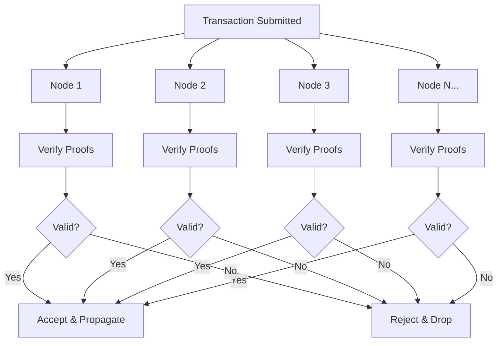
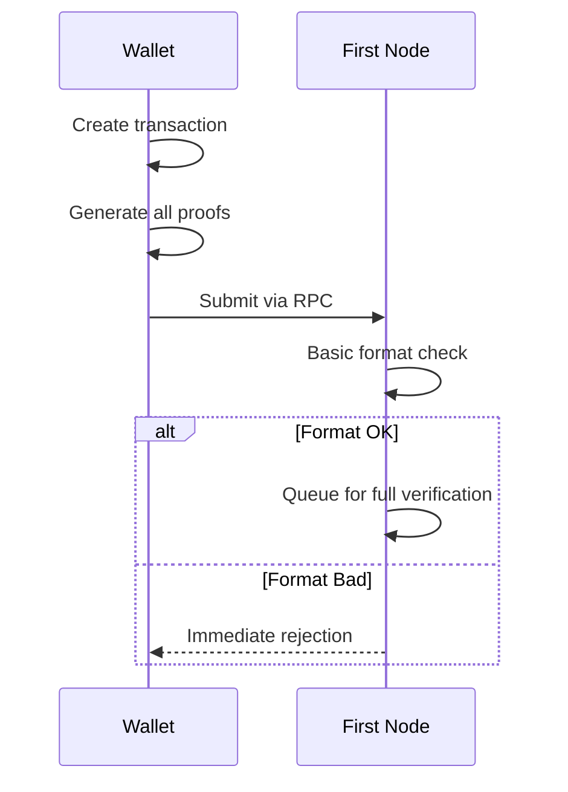
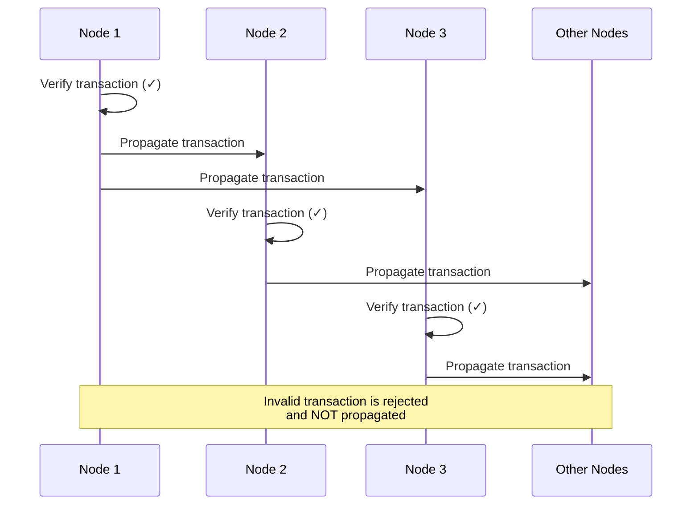
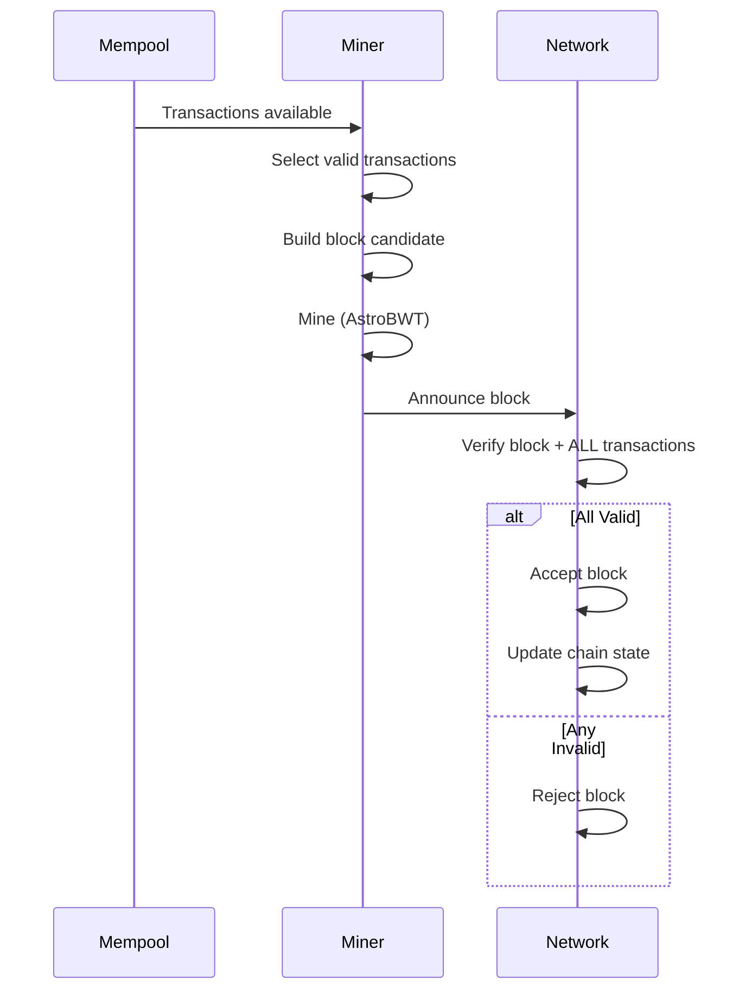
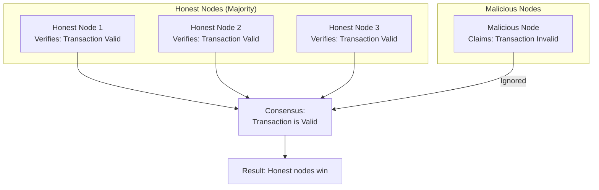
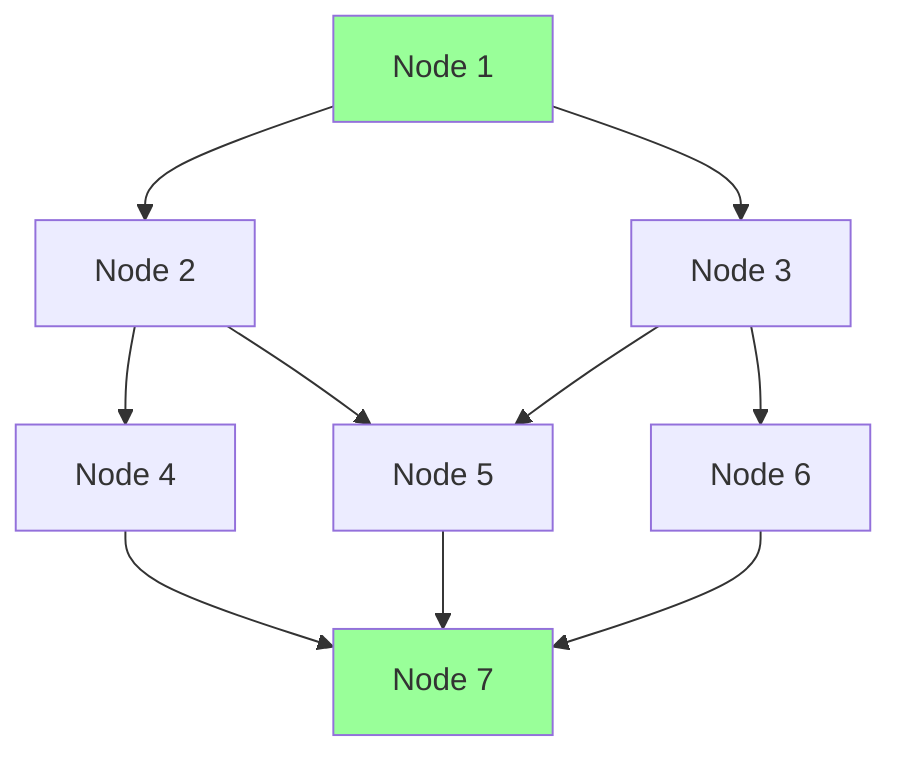
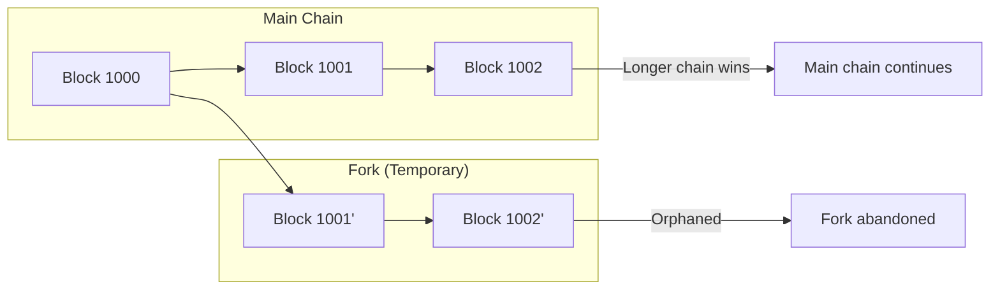
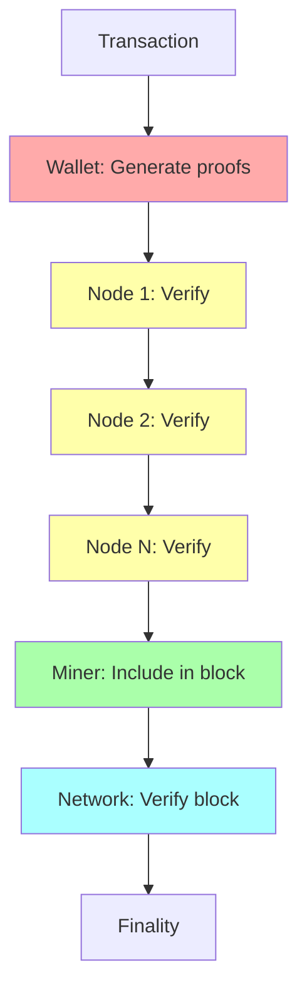

import { Callout } from 'nextra/components'
import { Tabs } from 'nextra/components'

# Network Consensus Validation

<Callout type="success" emoji="🌐">
**Distributed Security:** Every DERO node independently validates every transaction. There's no central authority - security comes from the mathematical certainty that all nodes will reach the same conclusion when given the same data.
</Callout>

## The Consensus Model

### Distributed Validation



### Why This Works

**Deterministic Verification:**
- Same transaction → Same verification result
- Every honest node reaches the same conclusion
- No coordination required between nodes
- Mathematical certainty, not voting

---

## Transaction Lifecycle

### Phase 1: Submission



### Phase 2: Full Verification

**Each node performs complete verification:**

```go
// From blockchain/transaction_verify.go (simplified)

func FullVerification(tx *Transaction) error {
    // 1. Verify all six sigma proofs
    if !VerifySigmaProofs(tx) {
        return errors.New("sigma proof verification failed")
    }
    
    // 2. Verify range proof (A_t)
    if !VerifyRangeProof(tx) {
        return errors.New("range proof verification failed")
    }
    
    // 3. Verify inner product proof
    if !VerifyInnerProduct(tx) {
        return errors.New("inner product verification failed")
    }
    
    // 4. Check double-spend
    if IsDoubleSpend(tx) {
        return errors.New("double spend detected")
    }
    
    // 5. Verify transaction structure
    if !ValidStructure(tx) {
        return errors.New("invalid transaction structure")
    }
    
    return nil
}
```

### Phase 3: Propagation



**Key Principle:** Nodes only propagate transactions they've independently verified as valid.

### Phase 4: Block Inclusion



---

## What Gets Verified

### Transaction-Level Checks

| Check | What It Validates | Failure Means |
|-------|------------------|---------------|
| **Sigma proofs** | All 6 proofs valid | Forged transaction |
| **Range proof** | Amount in [0, 2^64] | Invalid amount |
| **Inner product** | Cryptographic consistency | Proof manipulation |
| **Double-spend** | Output not already spent | Replay attack |
| **Structure** | Valid format, sizes | Malformed TX |
| **Fee** | Sufficient fee included | Underpaid TX |

### Block-Level Checks

| Check | What It Validates | Failure Means |
|-------|------------------|---------------|
| **All TXs valid** | Every TX passes individual checks | Block contains invalid TX |
| **Block header** | Valid previous hash, timestamp | Chain fork or manipulation |
| **Mining proof** | Valid AstroBWT solution | Insufficient work |
| **Size limits** | Block within size constraints | Oversized block |
| **Merkle root** | TX hash tree correct | TX inclusion manipulation |

---

## Byzantine Fault Tolerance

### The Byzantine Generals Problem

**DERO's solution:**



### Why Malicious Nodes Can't Win

**The math is deterministic:**

```
Transaction TX with proofs P

For every honest node N:
  Verify(TX, P) → Same result

If TX is valid:
  ALL honest nodes accept
  Malicious nodes saying "invalid" are simply ignored

If TX is invalid:
  ALL honest nodes reject
  Malicious nodes cannot force acceptance
```

**Key insight:** Nodes don't "vote" on validity. They independently compute the same mathematical result. A malicious node lying about the result is just ignored.

---

## The Verification Timeline

### Single Transaction

```
Time 0ms:     Transaction submitted to node
Time 1ms:     Basic format check (pass)
Time 5-15ms:  Full proof verification
Time 15ms:    Added to mempool (if valid)
Time 15-30ms: Propagated to peers
Time 30ms+:   Peers verify and propagate

Total: ~50ms to reach most of network
```

### Block Confirmation

```
Block time: ~18 seconds (average)

Time 0:      TX in mempool
Time 18s:    Included in block
Time 36s:    1 confirmation
Time 54s:    2 confirmations
Time 5 min:  ~16 confirmations (very secure)
```

---

## Network Topology

### P2P Architecture



**Properties:**
- No central coordinator
- Multiple paths between nodes
- Failure of one node doesn't affect others
- Geographic distribution

### TLS Encryption

**All node communication is encrypted:**

```go
// From p2p/connection.go

func Connect(peer string) (*Connection, error) {
    tlsConfig := &tls.Config{
        MinVersion: tls.VersionTLS13,
        // ...
    }
    
    conn, err := tls.Dial("tcp", peer, tlsConfig)
    if err != nil {
        return nil, err
    }
    
    return &Connection{conn: conn}, nil
}
```

**Benefits:**
- Prevents eavesdropping on transaction data
- Protects against man-in-the-middle attacks
- Ensures peer authenticity

---

## Finality

### When is a Transaction "Final"?

<Tabs items={['Probabilistic', 'Practical']}>
  <Tabs.Tab>
    **Probabilistic Finality:**
    
    ```
    Each confirmation reduces reversal probability:
    
    1 confirmation:  ~1% reversal chance
    2 confirmations: ~0.1% reversal chance
    3 confirmations: ~0.01% reversal chance
    6 confirmations: ~0.0001% reversal chance
    
    After 6+ confirmations:
      Reversal is computationally infeasible
      Would require >50% network hashrate
    ```
  </Tabs.Tab>
  
  <Tabs.Tab>
    **Practical Finality:**
    
    ```
    For most use cases:
    
    Small amounts (<$100):  1-2 confirmations (~30-36s)
    Medium amounts:         3-4 confirmations (~1 min)
    Large amounts:          6+ confirmations (~2 min)
    Exchanges:              10-20 confirmations (~3-6 min)
    
    After 6 confirmations:
      Consider transaction final
      Reversal would be front-page news
    ```
  </Tabs.Tab>
</Tabs>

### Block Reorganization



**Reorg protection:** Deeper transactions are safer because reorganizing the chain becomes exponentially harder.

---

## Security Guarantees

### What Consensus Provides

| Guarantee | How It's Achieved |
|-----------|------------------|
| **No fake transactions** | Cryptographic proof verification |
| **No double-spending** | Spent output tracking |
| **No censorship** | Decentralized mining |
| **Eventual finality** | Longest chain rule |
| **Consistent state** | Deterministic verification |

### What It Doesn't Provide

| Non-Guarantee | Why |
|---------------|-----|
| **Instant finality** | Probabilistic confirmation |
| **Privacy from nodes** | Nodes see encrypted TXs |
| **51% attack immunity** | Theoretical possibility |

---

## Key Takeaways

### The Consensus Guarantee

```
Valid transaction + Network propagation = Guaranteed acceptance

Because:
  1. All honest nodes compute same result
  2. Honest nodes only propagate valid TXs
  3. Invalid TXs die at first node they reach
  4. Majority honest nodes = valid state
```

### Defense in Depth



**Multiple layers:**
- Wallet creates valid proofs (or TX can't be created)
- Each node verifies (or TX is dropped)
- Miners include only valid TXs (or block is rejected)
- Network verifies blocks (or block is orphaned)

<Callout type="success" emoji="🌐">
**No Single Point of Failure:** DERO's security doesn't depend on any single node, miner, or authority. It depends on the mathematical certainty that honest nodes, running honest code, will all reach the same conclusion about transaction validity.
</Callout>

---

## Related Pages

**Security Suite:**
- [Transaction Proofs](/integrity/transaction-proofs) - What nodes verify
- [Proof Verification Flow](/integrity/proof-verification-flow) - Detailed verification steps

**Technical Reference:**
- [Running a Node](/basics/running-a-node) - Participate in consensus
- [Daemon RPC API](/rpc-api/daemon-rpc-api) - Submit transactions
