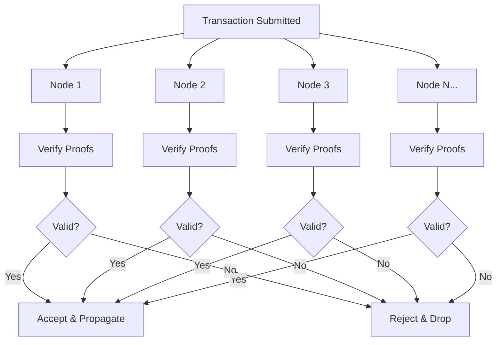
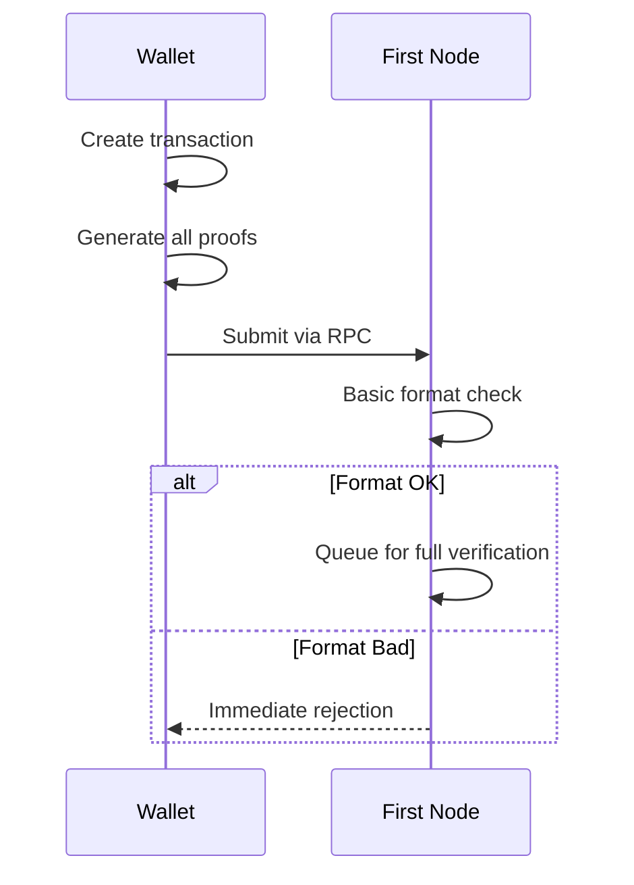
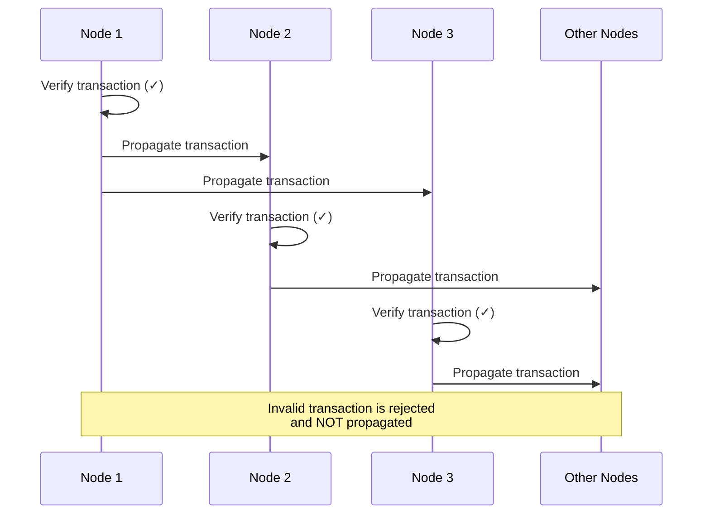
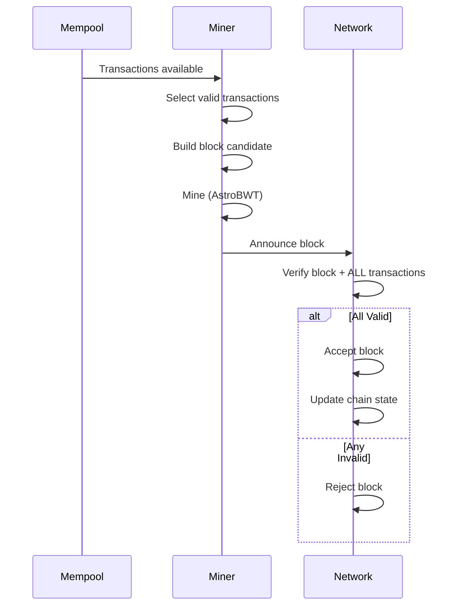
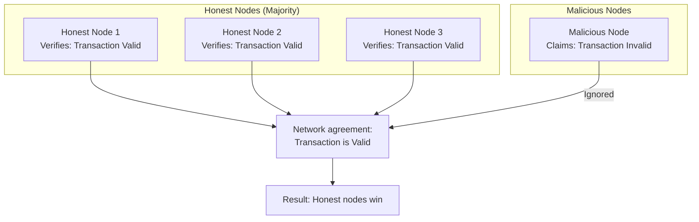
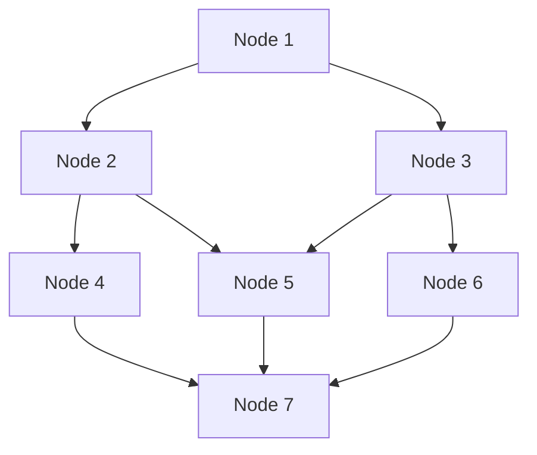
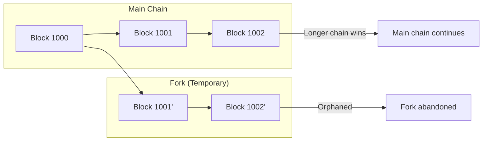
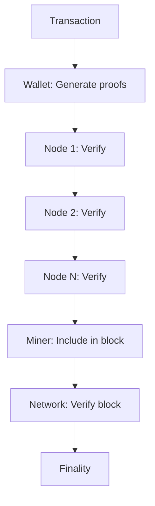

import { Callout } from 'nextra/components'
import { Tabs } from 'nextra/components'

# Network Consensus Validation

<Callout type="success" emoji="🌐">
**Distributed Security:** Every DERO node independently validates every transaction. There's no central authority - security comes from the mathematical certainty that all nodes will reach the same conclusion when given the same data.
</Callout>

<Callout type="info" emoji="🧭">
**Scope of this page:** "Consensus" here refers to *network agreement on transaction validity* — every node independently re-runs the proof system and reaches the same accept/reject decision because the math is deterministic. **Chain consensus** — which sequence of blocks is canonical, how forks are resolved — is a separate concern handled by DERO's proof-of-work + DAG selection rules, and is not the subject of this page.
</Callout>

## The Consensus Model

### Distributed Validation



### Why This Works

**Deterministic Verification:**
- Same transaction → Same verification result
- Every honest node reaches the same conclusion
- No coordination required between nodes
- Mathematical certainty, not voting

---

## Transaction Lifecycle

### Phase 1: Submission



### Phase 2: Full Verification

**Each node performs complete verification.**

The core verification logic lives in `cryptography/crypto/proof_verify.go` in the `Verify()` function (`proof_verify.go:98`). Each node independently runs through the same sequence:

1. **Overflow check** -- Reject if `fees + extra_value` overflows (`proof_verify.go:108-111`)
2. **Parity check** -- Verify the secret parity is well-formed (`proof_verify.go:136-141`)
3. **Polynomial recovery** -- Verify B^w × A recovery (`proof_verify.go:162-180`)
4. **Challenge hash** -- Recompute and compare challenge `c` from all six sigma proof components (`proof_verify.go:410-425`)
5. **Inner product** -- Final cryptographic consistency check (`proof_verify.go:457-460`)

If any step fails, `Verify()` returns `false` and the transaction is rejected.

### Phase 3: Propagation



**Key Principle:** Nodes only propagate transactions they've independently verified as valid.

### Phase 4: Block Inclusion



---

## What Gets Verified

### Transaction-Level Checks

| Check | What It Validates | Failure Means |
|-------|------------------|---------------|
| **6 sigma proofs** | A_y, A_D, A_b, A_X, A_t, A_u all valid (A_t includes range proof) | Forged transaction |
| **Inner product** | Bulletproof verification (sub-component of A_t range proof) | Invalid amount / proof manipulation |
| **Structure** | Valid format, sizes, parity | Malformed TX |
| **Overflow** | Fee arithmetic doesn't overflow `uint64` | Arithmetic attack |
| **Fee** | Sufficient fee included | Underpaid TX |

### Block-Level Checks

| Check | What It Validates | Failure Means |
|-------|------------------|---------------|
| **All TXs valid** | Every TX passes individual checks | Block contains invalid TX |
| **Block header** | Valid previous hash, timestamp | Chain fork or manipulation |
| **Mining proof** | Valid AstroBWT solution | Insufficient work |
| **Size limits** | Block within size constraints | Oversized block |
| **Merkle root** | TX hash tree correct | TX inclusion manipulation |

---

## Byzantine Fault Tolerance

### The Byzantine Generals Problem

**DERO's solution:**



### Why Malicious Nodes Can't Win

**The math is deterministic:**

```
Transaction TX with proofs P

For every honest node N:
  Verify(TX, P) → Same result

If TX is valid:
  ALL honest nodes accept
  Malicious nodes saying "invalid" are simply ignored

If TX is invalid:
  ALL honest nodes reject
  Malicious nodes cannot force acceptance
```

**Key insight:** Nodes don't "vote" on validity. They independently compute the same mathematical result. A malicious node lying about the result is just ignored.

---

## The Verification Timeline

### Single Transaction

When a transaction is submitted, it passes through these stages in order:

1. **Basic format check** -- Structural validation (field counts, size limits, parity)
2. **Full proof verification** -- All sigma proofs and inner product proof verified mathematically
3. **Mempool admission** -- If valid, added to the node's mempool
4. **Peer propagation** -- Forwarded to connected peers, who independently verify

> **Note:** No official benchmarks exist for per-step verification times. Actual performance depends on hardware, network conditions, and ring size. The codebase does not include benchmark tests for proof verification.

### Block Confirmation

<Callout type="info" emoji="⏱️">
**Block Time:** DERO's block time is **18 seconds** as defined in `config/config.go:34`. The README mentions "16s" but this appears to be outdated - the actual constant is `BLOCK_TIME = uint64(18)`.
</Callout>

```
Block time: 18 seconds (from config/config.go)

Time 0:      TX in mempool
Time 18s:    Included in block
Time 36s:    1 confirmation
Time 54s:    2 confirmations
Time ~5 min: ~17 confirmations (very secure)
```

**Source verification:**
```go
// config/config.go:34
const BLOCK_TIME = uint64(18)
const BLOCK_TIME_MILLISECS = BLOCK_TIME * 1000
```

---

## Network Topology

### P2P Architecture



**Properties:**
- No central coordinator
- Multiple paths between nodes
- Failure of one node doesn't affect others
- Geographic distribution

### TLS Encryption

**All node communication is encrypted:**

```go
// From p2p/controller.go

// Outgoing connections wrap in TLS
conntls := tls.Client(conn, &tls.Config{InsecureSkipVerify: true})

// Server generates random TLS certificate
tlsconfig := &tls.Config{Certificates: []tls.Certificate{generate_random_tls_cert()}}
```

**Benefits:**
- Prevents eavesdropping on transaction data
- Encrypts all peer-to-peer traffic

**Honest limitations:**
- Uses `InsecureSkipVerify: true` -- peers are not authenticated via certificate validation
- TLS provides transport encryption, not peer identity verification
- Peer identity is established through the DERO handshake protocol, not TLS certificates

---

## Finality

### When is a Transaction "Final"?

<Tabs items={['How It Works', 'What We Can Say']}>
  <Tabs.Tab>
    **Probabilistic Finality:**
    
    Like all Proof-of-Work chains, DERO has probabilistic finality -- each additional block confirmation makes reversal exponentially harder. The general principle:
    
    - **1 confirmation** -- Transaction is in a block, but a competing chain could still overtake
    - **More confirmations** -- Each subsequent block multiplies the computational cost of a reversal
    - **Deep confirmations** -- Reversal becomes economically and computationally impractical
    
    The exact reversal probability for any given confirmation depth depends on the attacker's share of total network hashrate. No fixed percentages can be stated without knowing the current hashrate distribution.
    
    > **Note:** DERO uses AstroBWT proof-of-work and an 18-second block time (`config/config.go:34`). Specific finality guarantees depend on the live network's hashrate, which varies over time.
  </Tabs.Tab>
  
  <Tabs.Tab>
    **What the source code defines:**
    
    ```
    Block time: 18 seconds (config/config.go:34)
    ```
    
    **Confirmation timing** (simple arithmetic):
    
    | Confirmations | Time |
    |--------------|------|
    | 1 | ~18s |
    | 3 | ~54s |
    | 6 | ~108s (~2 min) |
    | 10 | ~180s (~3 min) |
    | 20 | ~360s (~6 min) |
    
    How many confirmations to wait is a risk decision for the application or service -- it depends on the transaction value and the current network hashrate, neither of which are protocol constants.
  </Tabs.Tab>
</Tabs>

### Block Reorganization



**Reorg protection:** Deeper transactions are safer because reorganizing the chain becomes exponentially harder.

---

## Security Guarantees

### What Consensus Provides

| Guarantee | How It's Achieved |
|-----------|------------------|
| **No fake transactions** | Cryptographic proof verification |
| **No transaction replay** | Nonce/height tracking and key image binding to tree state |
| **No censorship** | Decentralized mining |
| **Eventual finality** | Longest chain rule |
| **Consistent state** | Deterministic verification |

### What It Doesn't Provide

| Non-Guarantee | Why |
|---------------|-----|
| **Instant finality** | Probabilistic confirmation |
| **Privacy from nodes** | Nodes see encrypted TXs |
| **51% attack immunity** | Theoretical possibility |

---

## Key Takeaways

### The Consensus Guarantee

```
Valid transaction + Network propagation = Guaranteed acceptance

Because:
  1. All honest nodes compute same result
  2. Honest nodes only propagate valid TXs
  3. Invalid TXs die at first node they reach
  4. Majority honest nodes = valid state
```

### Defense in Depth



**Multiple layers:**
- Wallet creates valid proofs (or TX can't be created)
- Each node verifies (or TX is dropped)
- Miners include only valid TXs (or block is rejected)
- Network verifies blocks (or block is orphaned)

<Callout type="success" emoji="🌐">
**No Single Point of Failure:** DERO's security doesn't depend on any single node, miner, or authority. It depends on the mathematical certainty that honest nodes, running honest code, will all reach the same conclusion about transaction validity.
</Callout>

---

## Related Pages

**Security Suite:**
- [Transaction Proofs](/integrity/transaction-proofs) - What nodes verify
- [Proof Verification Flow](/integrity/proof-verification-flow) - Detailed verification steps

**Technical Reference:**
- [Running a Node](/basics/running-a-node) - Participate in consensus
- [Daemon RPC API](/rpc-api/daemon-rpc-api) - Submit transactions
