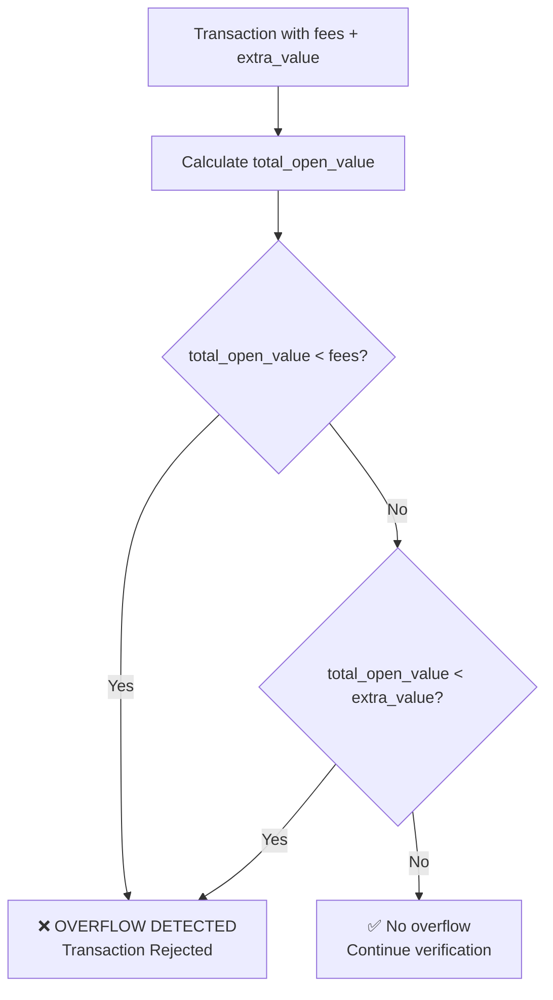
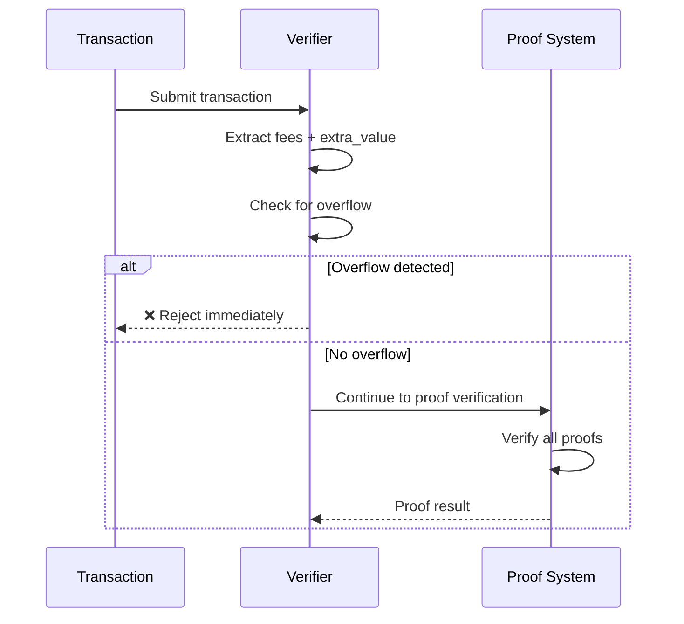

import { Callout } from 'nextra/components'
import { Tabs } from 'nextra/components'

# Overflow Protection: Integer Safety

<Callout type="success" emoji="🛡️">
**Arithmetic Safety:** DERO includes explicit checks to prevent integer overflow attacks that could manipulate transaction fees or values. These checks are performed during proof verification before any transaction is accepted.
</Callout>

## The Threat: Integer Overflow Attacks

### What is Integer Overflow?

Integer overflow occurs when an arithmetic operation produces a value outside the range that can be represented by the data type. In blockchain contexts, this can be exploited to:

- **Create tokens from nothing** (if overflow wraps to positive)
- **Bypass fee requirements** (if fees overflow to small values)
- **Manipulate transaction values** (if sums overflow)

### Example Attack Vector

```
Attacker's Goal: Pay minimal fees while appearing to pay maximum

uint64 max value: 18,446,744,073,709,551,615

If fees + extra_value overflows:
  fees = 18,446,744,073,709,551,610
  extra_value = 10
  
  fees + extra_value = 18,446,744,073,709,551,620
                     = 4 (after overflow!)  ← Attack succeeds!
```

---

## DERO's Protection Mechanism

### The Overflow Check

**Location:** `cryptography/crypto/proof_verify.go:108-111`

```go
total_open_value := s.Fees + extra_value
if total_open_value < s.Fees || total_open_value < extra_value { // stop over flowing attacks
    return false
}
```

### How It Works



### The Mathematical Principle

**For unsigned integers, if `a + b` overflows:**
```
a + b < a  (always true after overflow)
a + b < b  (always true after overflow)
```

**For valid (non-overflowing) addition:**
```
a + b >= a  (always true)
a + b >= b  (always true)
```

This property is exploited to detect overflow without needing arbitrary-precision arithmetic.

---

## Verification: Step-by-Step

### Normal Case (No Overflow)

```go
fees := uint64(1000)
extra_value := uint64(500)

total_open_value := fees + extra_value  // = 1500

// Check 1: Is 1500 < 1000? NO
// Check 2: Is 1500 < 500? NO
// Result: ✅ VALID - no overflow
```

### Attack Case (Overflow Detected)

```go
fees := uint64(18446744073709551610)
extra_value := uint64(10)

total_open_value := fees + extra_value  // = 4 (overflowed!)

// Check 1: Is 4 < 18446744073709551610? YES!
// Result: ❌ OVERFLOW DETECTED - transaction rejected
```

---

## Test It Yourself

### Go Verification Program

```bash
cat <<'EOF' > /tmp/overflow_test.go
package main

import (
    "fmt"
)

func main() {
    // Normal case
    fees1 := uint64(1000)
    extra1 := uint64(500)
    total1 := fees1 + extra1
    
    fmt.Println("=== Normal Case ===")
    fmt.Printf("fees: %d, extra: %d, total: %d\n", fees1, extra1, total1)
    fmt.Printf("total < fees? %v\n", total1 < fees1)
    fmt.Printf("total < extra? %v\n", total1 < extra1)
    fmt.Printf("Result: %s\n\n", checkOverflow(fees1, extra1))
    
    // Overflow case
    fees2 := uint64(18446744073709551610)
    extra2 := uint64(10)
    total2 := fees2 + extra2
    
    fmt.Println("=== Overflow Attack Case ===")
    fmt.Printf("fees: %d, extra: %d, total: %d\n", fees2, extra2, total2)
    fmt.Printf("total < fees? %v\n", total2 < fees2)
    fmt.Printf("total < extra? %v\n", total2 < extra2)
    fmt.Printf("Result: %s\n", checkOverflow(fees2, extra2))
}

func checkOverflow(fees, extra uint64) string {
    total := fees + extra
    if total < fees || total < extra {
        return "❌ OVERFLOW DETECTED - REJECTED"
    }
    return "✅ VALID - no overflow"
}
EOF

go run /tmp/overflow_test.go
```

**Expected Output:**
```
=== Normal Case ===
fees: 1000, extra: 500, total: 1500
total < fees? false
total < extra? false
Result: ✅ VALID - no overflow

=== Overflow Attack Case ===
fees: 18446744073709551610, extra: 10, total: 4
total < fees? true
total < extra? false
Result: ❌ OVERFLOW DETECTED - REJECTED
```

---

## Where This Check Occurs

### In the Verification Flow



### Position in Code

The overflow check happens **early** in the verification process, before expensive cryptographic operations:

```go
// proof_verify.go - Verify function
func (proof *Proof) Verify(scid Hash, scid_index int, s *Statement, txid Hash, extra_value uint64) bool {
    // ... initial setup ...
    
    // Line 108-110: OVERFLOW CHECK (happens first!)
    total_open_value := s.Fees + extra_value
    if total_open_value < s.Fees || total_open_value < extra_value {
        return false
    }
    
    // ... rest of verification (only if overflow check passes) ...
}
```

**Why early?** Checking for overflow before expensive operations:
1. Saves computational resources on invalid transactions
2. Prevents attackers from wasting node resources
3. Fails fast on obviously malicious inputs

---

## Related Protections

### Combined with Other Checks

| Check | What It Prevents | Location |
|-------|-----------------|----------|
| **Overflow check** | Arithmetic manipulation (fee wraparound) | `proof_verify.go:108-111` |
| **Bulletproof range proof** (A_t commitment closed by the inner product proof) | Out-of-range values, including negative/wraparound amounts. The A_t commitment and the inner product proof are **one bulletproof gate with two named pieces**, not two separable checks — see [Bulletproofs § Inner Product Proof — Closing A_t](/privacy/bulletproofs#inner-product-proof--closing-a_t) | A_t commitment: `proof_verify.go` (every node); IP closure: `proof_innerproduct.go:71` + `proof_verify.go:457` |

### Order of Verifier Operations

```
Transaction submitted
    ↓
Overflow check (this page)
    ↓
Proof structure validation
    ↓
Parity check
    ↓
Sigma proof verification (A_y, A_D, A_b, A_X, A_t, A_u)
    ↓
Bulletproof gate (A_t commitment + IP recursive closure)
    ↓
✅ Transaction accepted
```

> The verifier runs these steps sequentially; each is a precondition for proceeding to the next. They are **not** "layers of defense in depth against the same attack" — each catches a different malformation. The cryptographic guarantee against negative-transfer / wraparound mints is the bulletproof gate alone.

---

## Security Guarantees

### What This Protects Against

| Attack | How It's Blocked |
|--------|-----------------|
| **Fee overflow** | Sum comparison catches wraparound |
| **Value manipulation** | Early rejection before processing |
| **Resource exhaustion** | Fails fast, minimal computation |

### Confidence Level

<Callout type="success" emoji="🔒">
**Mathematical Certainty:** The overflow check uses a fundamental property of unsigned integer arithmetic that cannot be bypassed. If `a + b` overflows, then `a + b < a` is **always** true. This is guaranteed by the Go language specification, which defines `uint64` arithmetic as wrapping modulo 2^64.
</Callout>

---

## Key Takeaways

### The Protection Summary

```
Overflow attack attempt:
  fees + extra_value overflows
    ↓
  total < fees (true due to wraparound)
    ↓
  Check detects overflow
    ↓
  Transaction REJECTED
    ↓
  Attack FAILED
```

### Why This Matters

- **Prevents token creation** from arithmetic manipulation
- **Protects fee integrity** ensuring miners receive proper fees
- **Fails fast** saving network resources
- **Language-spec-guaranteed** — Go defines `uint64` arithmetic as wrapping modulo 2^64

---

## Source Code Reference

**File:** `cryptography/crypto/proof_verify.go`
**Lines:** 108-111
**Function:** `Verify()` (defined at `proof_verify.go:98`)

```go
// The complete overflow protection check
total_open_value := s.Fees + extra_value
if total_open_value < s.Fees || total_open_value < extra_value { // stop over flowing attacks
    return false
}
```

**Verification command:**
```bash
git clone https://github.com/deroproject/derohe.git
cd derohe
sed -n '108,110p' cryptography/crypto/proof_verify.go
```

---

## Related Pages

**Security Suite:**
- [Negative Transfer Protection](/integrity/negative-transfer-protection) - Verifier-enforced bulletproof soundness
- [Range Proof Integrity](/integrity/range-proof-integrity) - 128-bit range proof closed at the verifier
- [Proof Verification Flow](/integrity/proof-verification-flow) - Complete verification process

**Technical Reference:**
- [Transaction Proofs](/integrity/transaction-proofs) - Proof system overview
- [Network Consensus](/integrity/network-consensus-validation) - Distributed validation
