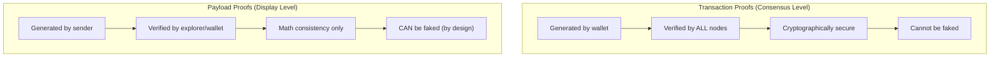
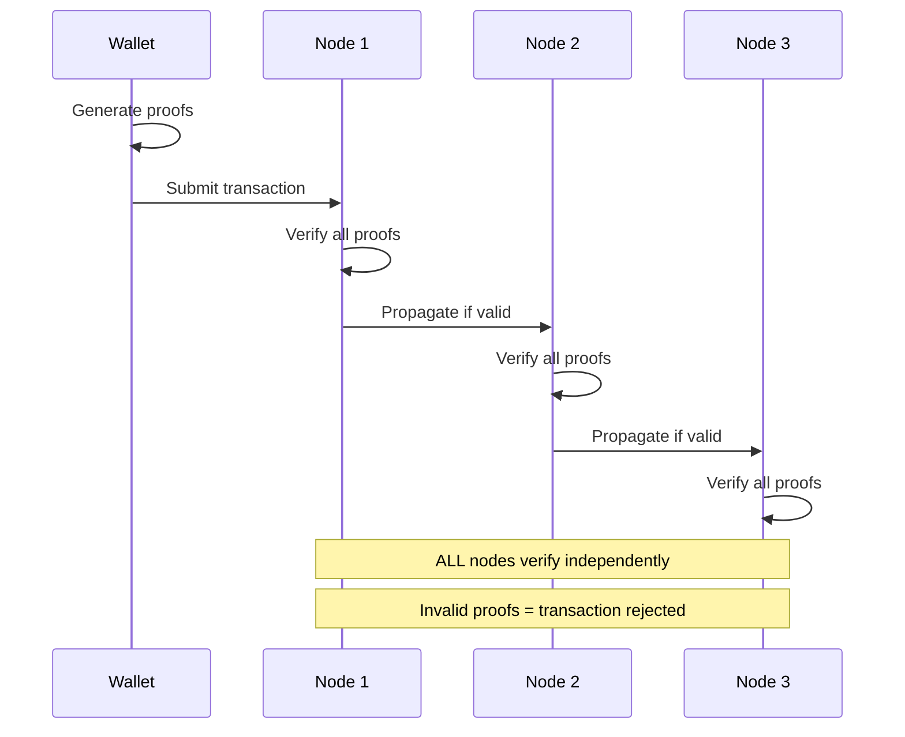
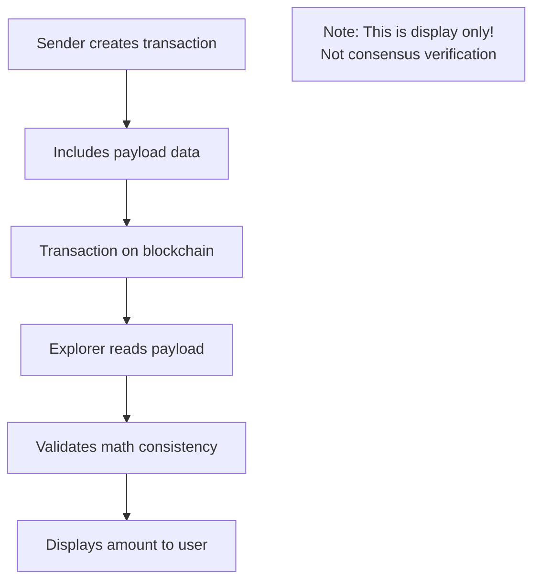
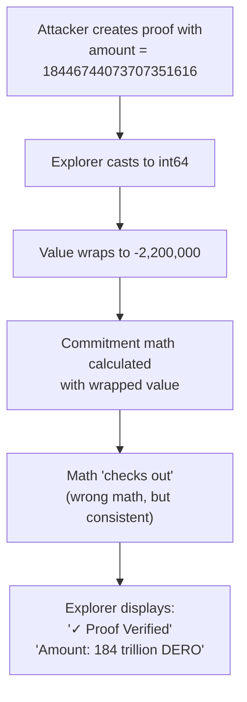
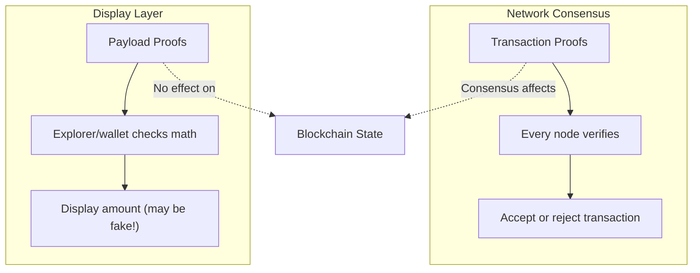

import { Callout } from 'nextra/components'
import { Tabs } from 'nextra/components'

# Proof Types Explained

<Callout type="warning" emoji="⚠️">
**Critical Distinction:** DERO has two completely different proof systems that serve different purposes. Confusing them leads to fundamental misunderstandings about what can and cannot be verified.
</Callout>

## The Two Proof Systems



### Quick Comparison

| Aspect | Transaction Proofs | Payload Proofs |
|--------|-------------------|----------------|
| **Purpose** | Consensus validation | Display/communication |
| **Verified by** | All network nodes | Explorer/wallet UI |
| **Security** | Cryptographically secure | Math check only |
| **Can be faked?** | No | Yes (by design) |
| **Affects blockchain?** | Yes | No |
| **Third-party verifiable?** | Yes (validity only) | No |

---

## Transaction Proofs: The "Real" Proofs

### What They Are

Transaction proofs are the cryptographic proofs that make transactions valid. They're generated when you create a transaction and verified by every node on the network.

**Components:**
- Six Sigma proofs (A_y, A_D, A_b, A_X, A_t, A_u)
- Inner product proof
- Challenge hash binding all components

### How They Work



### Security Guarantees

**From Source Code** (`cryptography/crypto/proof_verify.go`):

```go
func VerifyTransaction(tx *Transaction) bool {
    // Recompute challenge hash
    c := HashToScalar(tx.A_y, tx.A_D, tx.A_b, tx.A_X, tx.A_t, tx.A_u, ...)
    
    // ALL proofs must pass
    if !VerifyAy(tx.A_y, tx.s_y, c) { return false }
    if !VerifyAD(tx.A_D, tx.s_D, c) { return false }
    // ... verify all proofs
    
    if !VerifyInnerProduct(tx.InnerProof) { return false }
    
    return true
}
```

**Why they can't be faked:**
- All proofs are cryptographically bound
- Faking one changes the hash
- Changed hash invalidates all responses
- Network consensus requires valid proofs

---

## Payload Proofs: Display Convenience

### What They Are

Payload proofs are **wallet-level tools** for showing transaction details in explorers and wallets. They're NOT used for consensus - they're just for display.

**Purpose:**
- Show transaction amounts in explorer
- Verify receipt of funds
- Sender/receiver communication

### How They Work



### The Math Check

**What payload proof verification actually checks:**

```go
// From proof/proof.go (simplified)

func VerifyPayloadProof(proof string, tx *Transaction) (uint64, error) {
    // 1. Decode the proof string
    decoded := DecodeProof(proof)
    
    // 2. Check math consistency
    // This checks: Does the claimed amount match the commitment math?
    x := tx.C[position] - decoded.SharedKey
    expected := ScalarMult(G, decoded.Amount)
    
    if x.Equals(expected) {
        return decoded.Amount, nil  // Math checks out
    }
    return 0, errors.New("math doesn't match")
}
```

**What this does NOT check:**
- ❌ Whether the sender actually had that amount
- ❌ Whether the sender is who they claim to be
- ❌ Whether the proof was generated legitimately
- ❌ Whether the amount is real vs. fabricated

---

## Why Payload Proofs Can Be Faked

### The Design Reason

<Callout type="info" emoji="🔐">
**Privacy by Design:** If payload proofs were cryptographically verifiable by third parties, it would break sender privacy. The entire point of ring signatures is that third parties CANNOT definitively prove who sent a transaction.
</Callout>

### How Faking Works

**Anyone can create a payload proof for any ring member:**

```
Transaction has ring: [Addr_0, Addr_1, ..., Addr_15]
Amount: 100 DERO

For ANY position (0-15), you can create a proof that says:
  "Address at position X sent 100 DERO"
  
The math will check out because:
  - All ring members use the SAME amount in commitments
  - The commitment math is public
  - You can solve for any position
```

### Demonstration

**From security research (August 2025):**

```
Transaction: c4fbc0d541c40abf6f5c818f3a0f8430e3ebb5c3f0811d74a4318892be4a4632

Fake proof created showing: 184,467,436,737,095 DERO (184 trillion)
Official DERO explorer result: "✓ Proof Verified Successfully"

Reality: Total DERO supply is only ~16 million
Conclusion: Payload proofs can show impossible amounts
```

**This is not a bug - it's the consequence of privacy-preserving design.**

---

## Technical Cause: The int64 Cast Issue

### Why Fake Proofs "Validate"

The ability to create fake proofs showing impossible amounts (like 184 trillion DERO) stems from a specific technical issue in the explorer's proof verification code.

**From Source Code** (`proof/proof.go:98`):

```go
// Original code - vulnerable to wraparound
x.ScalarMult(crypto.G, new(big.Int).SetInt64(int64(amount)))
//                                  ↑ This cast is the issue
```

**The Problem:**

| Input (uint64) | After int64 Cast | Result |
|----------------|------------------|--------|
| `100` | `100` | ✅ Normal |
| `2,200,000` | `2,200,000` | ✅ Normal |
| `9,223,372,036,854,775,808` (2^63) | `-9,223,372,036,854,775,808` | ❌ Wraps negative |
| `18,446,744,073,707,351,616` | `-2,200,000` | ❌ Wraps to -2.2M |

**What Happens:**



### Why This Doesn't Affect Protocol Security

<Callout type="success" emoji="🔒">
**Protocol Is Secure:** This issue only affects explorer DISPLAY. The actual transaction proofs (consensus level) use proper validation with bit decomposition that catches negative values. See [Negative Transfer Protection](/integrity/negative-transfer-protection) for the mathematical proof.
</Callout>

| Layer | Affected? | Why |
|-------|-----------|-----|
| **Transaction Proofs** | ❌ No | Bit decomposition catches negatives |
| **Network Consensus** | ❌ No | All nodes verify with proper validation |
| **Blockchain State** | ❌ No | Fake proofs don't affect state |
| **Explorer Display** | ✅ Yes | Was showing fake amounts as "verified" |

---

## Explorer Mitigation

### The Fix

To prevent explorers from displaying obviously fake amounts, validation was added to the payload proof verification.

<Callout type="info" emoji="🛡️">
**Hologram-Exclusive:** This fix is currently only implemented in [Hologram's proof validation page](https://hologram.derod.org/proof-validation). The standard `derohe` binaries from the official DERO repository do not include this validation. Hologram is an official community project developed by DHEBP.
</Callout>

**New Validation** (`proof/proof_validation.go`):

```go
const (
    // Maximum safe value for int64 conversion (2^63 - 1)
    MAX_INT64_SAFE = 9223372036854775807
    
    // Maximum reasonable amount (22M DERO in atomic units)
    // ~5% above hard cap, allows buffer while blocking impossible amounts
    MAX_REASONABLE_AMOUNT_ATOMIC = 22_000_000_000_000
)

func ValidatePayloadProofAmount(amount uint64) error {
    // Check 1: Prevent int64 wraparound
    if amount > MAX_INT64_SAFE {
        return fmt.Errorf("amount exceeds int64 maximum - possible wraparound attack")
    }
    
    // Check 2: Reject impossibly large amounts
    if amount > MAX_REASONABLE_AMOUNT_ATOMIC {
        return fmt.Errorf("amount exceeds reasonable maximum - likely fake proof")
    }
    
    return nil
}
```

**Fixed int64 Cast** (`proof/proof.go:98`):

```go
// Before (vulnerable):
x.ScalarMult(crypto.G, new(big.Int).SetInt64(int64(amount)))

// After (safe):
x.ScalarMult(crypto.G, new(big.Int).SetUint64(amount))
```

### What This Prevents

| Attack | Before Fix | After Fix |
|--------|------------|-----------|
| **184 trillion DERO proof** | ✓ "Verified" | ✗ "Amount exceeds maximum" |
| **Wraparound to -2.2M** | ✓ "Verified" | ✗ "Possible wraparound attack" |
| **100M DERO fake** | ✓ "Verified" | ✗ "Exceeds reasonable maximum" |
| **Legitimate 1M DERO** | ✓ "Verified" | ✓ "Verified" |

### Honest Limitations

<Callout type="warning" emoji="⚠️">
**What This Cannot Prevent:** The fix blocks egregious fakes (184 trillion, negative wraparound) but cannot detect subtle fakes. A fake proof claiming 1,500 DERO instead of 1,000 DERO would still pass validation. This is a fundamental limitation of privacy-preserving design - full verification would require private keys.
</Callout>

**What the fix CAN do:**
- ✅ Block amounts > 22M DERO (above total supply)
- ✅ Block amounts that would wrap to negative
- ✅ Prevent the specific attack used to create false narratives
- ✅ Improve user experience (no impossible amounts displayed)

**What the fix CANNOT do:**
- ❌ Verify the proof is genuine (would break privacy)
- ❌ Detect subtle inflation (e.g., 50% fake)
- ❌ Prove sender identity (by design)
- ❌ Replace proper wallet verification

**The Bottom Line:** This fix is a **defense-in-depth enhancement** for the display layer. It blocks the most egregious fake proofs while acknowledging that payload proofs are fundamentally unverifiable by design. For real verification, users should always check their wallet balance with their private keys.

---

## The Critical Difference

### What Each Proves

<Tabs items={['Transaction Proofs', 'Payload Proofs']}>
  <Tabs.Tab>
    **Transaction Proofs Prove:**
    
    ```
    ✓ Transaction is valid
    ✓ Proofs are cryptographically correct
    ✓ Amount is in valid range [0, 2^64]
    ✓ No double-spending
    ✓ Sender has private key
    
    Does NOT prove:
    ✗ Which ring member is sender
    ✗ The exact amount (only that it's valid)
    ✗ Sender identity to third parties
    ```
  </Tabs.Tab>
  
  <Tabs.Tab>
    **Payload Proofs Prove:**
    
    ```
    ✓ Math is consistent (commitment matches)
    
    Does NOT prove:
    ✗ The proof is genuine (vs. fabricated)
    ✗ The sender is who is claimed
    ✗ The amount is accurate
    ✗ Anything about the real transaction
    
    Payload proofs are DISPLAY TOOLS, not verification!
    ```
  </Tabs.Tab>
</Tabs>

### Verification Scope



---

## Implications

### For Users

**When viewing transaction details:**
- ✅ Transaction existence is real (on blockchain)
- ✅ Ring members are real (from blockchain)
- ⚠️ Displayed amounts may not be accurate
- ⚠️ Sender attribution may be wrong

**To verify you received funds:**
- ✅ Check your wallet balance (decrypted with your key)
- ❌ Don't rely solely on explorer display

### For Developers

**When building on DERO:**
- ✅ Trust transaction proof validity (consensus level)
- ❌ Don't trust payload proof amounts (display level)
- ✅ Use wallet RPC to get real balances
- ❌ Don't use explorer proofs for verification logic

### For Analysts

**When analyzing transactions:**
- ⚠️ Payload proofs can be fabricated
- ⚠️ Sender attribution is not cryptographically verifiable
- ⚠️ Amounts shown may be manipulated
- ✅ Transaction existence/validity is verifiable

---

## Why This Design?

### The Privacy Trade-off

```
Option A: Verifiable payload proofs
  → Third parties can prove sender identity
  → Ring signatures become meaningless
  → Privacy: ❌ BROKEN

Option B: Unverifiable payload proofs (DERO's choice)
  → Third parties can only guess sender
  → Ring signatures provide real privacy
  → Privacy: ✅ PRESERVED
```

### The Philosophy

<Callout type="success" emoji="🛡️">
**Privacy Over Verification:** DERO prioritizes user privacy over third-party verification capabilities. Only YOU should be able to prove you sent a transaction. Third parties should only be able to guess.
</Callout>

---

## Key Takeaways

### Transaction Proofs

| Aspect | Status |
|--------|--------|
| **Purpose** | Consensus validation |
| **Verified by** | All network nodes |
| **Can be faked** | No |
| **Trust level** | Cryptographically secure |

### Payload Proofs

| Aspect | Status |
|--------|--------|
| **Purpose** | Display convenience |
| **Verified by** | Explorer/wallet UI |
| **Can be faked** | Yes (by design) |
| **Trust level** | Math check only |

### The Bottom Line

```
Transaction Proofs = "Is this transaction valid?" (consensus)
Payload Proofs     = "What does the sender claim?" (display)

Transaction proofs affect the blockchain.
Payload proofs are just metadata for display.

Don't confuse the two!
```

---

## Related: Payload Encryption (Separate Issue)

<Callout type="info" emoji="📝">
**Distinct from payload proofs:** This page covers payload *proofs* (display-level, fakeable by design). A separate issue involving payload *encryption* was disclosed in May 2024 and fixed in Release142.
</Callout>

The payload encryption issue involved **randomness reuse** between ElGamal ciphertexts and payload encryption keys. This allowed an attacker to perform trial decryption, potentially revealing sender, receiver, and amount for transactions made with vulnerable wallet software.

**Key points:**
- **Fixed in Release142** (August 2025) via `ENCRYPTED_DEFAULT_PAYLOAD_CBOR_V2`
- **Affected:** Wallet-layer privacy (sender/receiver/amount deanonymization)
- **Not affected:** Consensus layer, ledger integrity, transaction validity
- **Historical transactions** made before Release142 remain potentially affected

**Recommendation:** Use Release142+ wallets for hardened payload encryption.

---

## Related Pages

**Security Suite:**
- [Transaction Proofs](/integrity/transaction-proofs) - The six sigma system
- [Ring Member Behavior](/integrity/ring-member-behavior) - Why sender can't be identified

**Privacy Suite:**
- [Ring Signatures](/privacy/ring-signatures) - Sender anonymity
- [Payload Proofs](/privacy/payload-proofs) - Complete payload proof explanation
