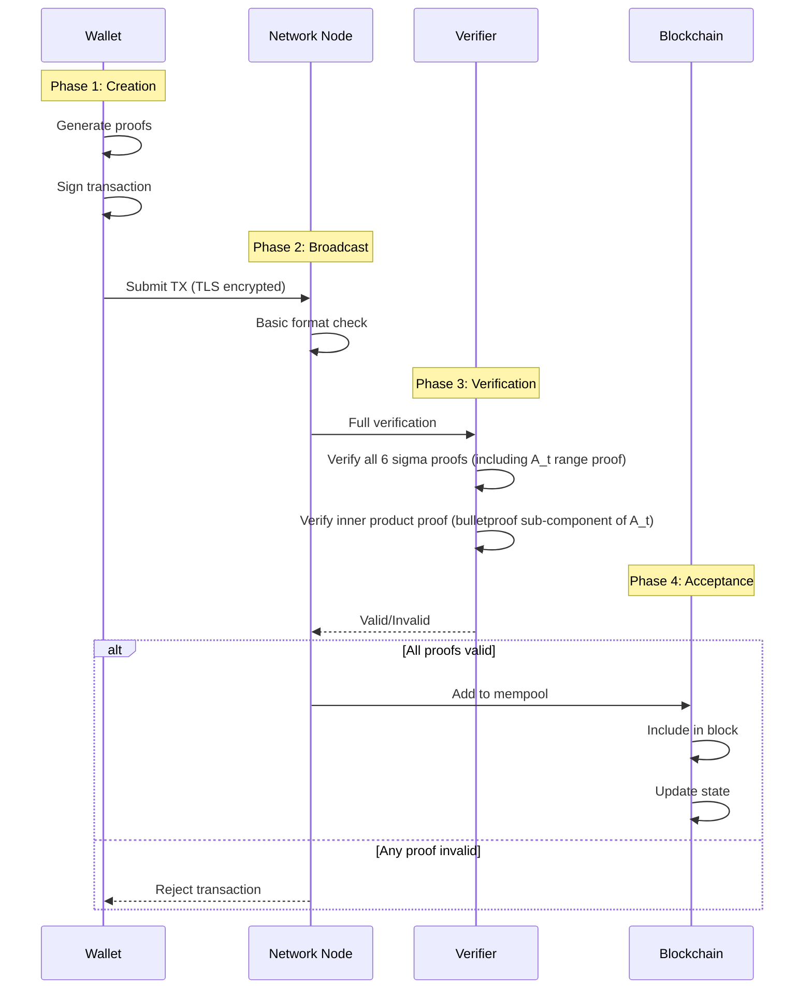
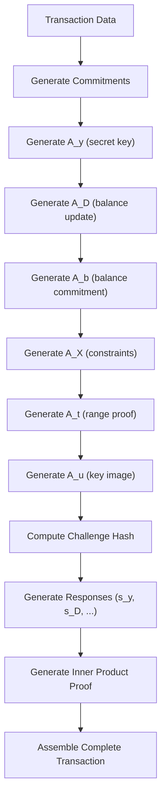
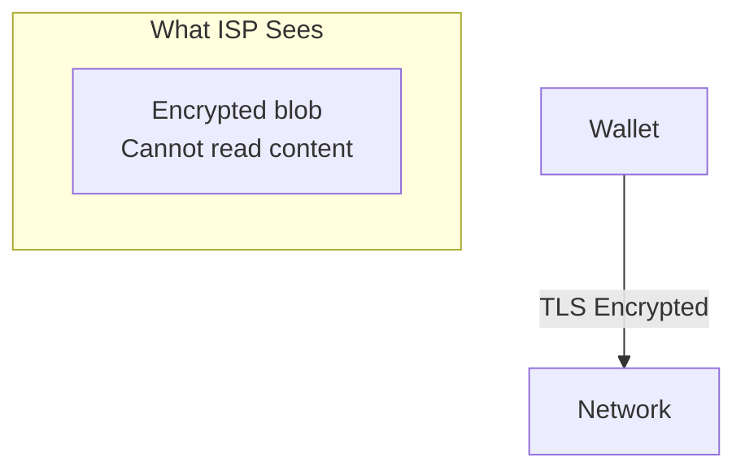
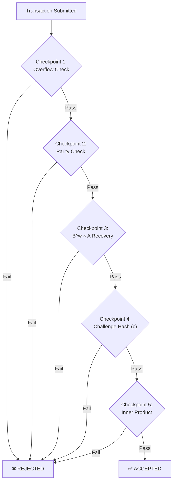
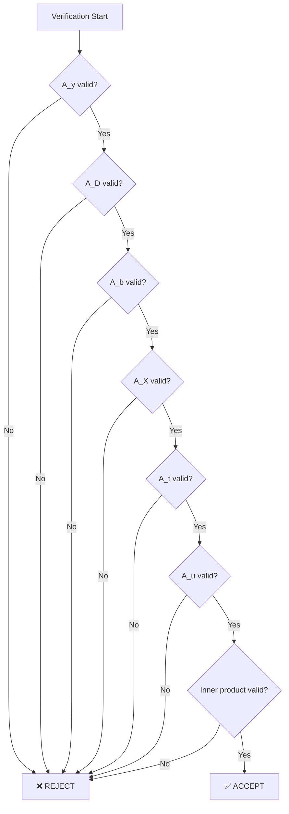
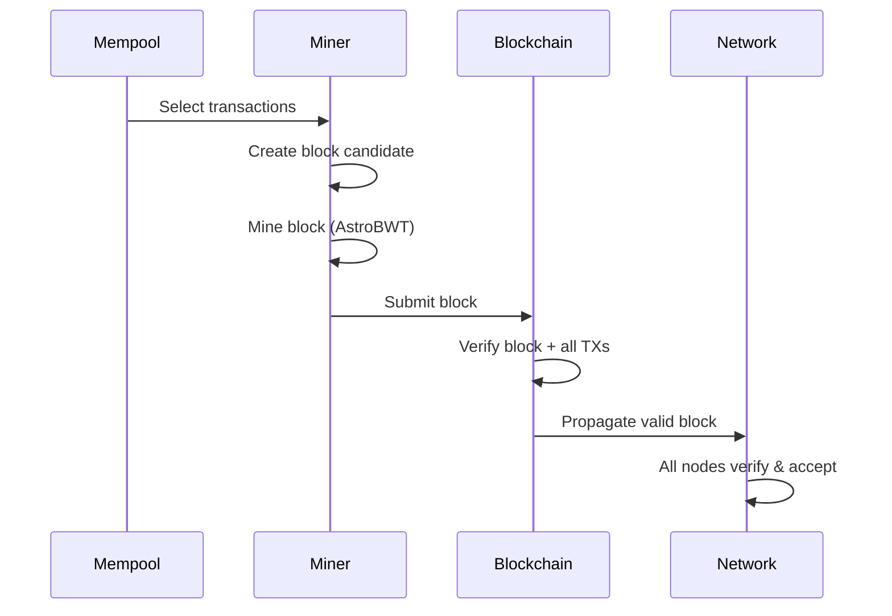

import { Callout } from 'nextra/components'
import { Tabs } from 'nextra/components'

# Proof Verification Flow

<Callout type="info" emoji="🔄">
**End-to-End Security:** Every transaction goes through a complete verification pipeline - from wallet creation through network validation to blockchain acceptance. This page traces the entire journey.
</Callout>

## The Complete Flow



---

## Phase 1: Transaction Creation (Wallet)

### Step 1.1: Prepare Transaction Data

**What happens in the wallet** (see `walletapi/wallet_transfer.go`):

1. **Check balance** -- Retrieve the sender's current encrypted balance from the daemon
2. **Select ring members** -- Request random addresses from the daemon to form the ring (decoys)
3. **Create transfer commitment** -- Encrypt the transfer amount using the recipient's public key
4. **Proceed to proof generation** -- Build the cryptographic proofs for the transaction

### Step 1.2: Generate Proofs

**The proof generation sequence:**



**Source:** `cryptography/crypto/proof_generate.go`

The proof generation function builds all components in sequence:

1. **Create commitments** for each sigma proof component (A_y, A_D, A_b, A_X, A_t, A_u)
2. **Bit decomposition** occurs during A_t construction (lines 468-487) -- this is where negative amounts are caught
3. **Compute challenge hash** binding all six components together via `reducedhash()`
4. **Generate responses** (s_y, s_D, etc.) using the challenge `c` and secret values
5. **Generate inner product proof** for the bulletproof range verification

### Step 1.3: Bit Decomposition (Critical Security Point)

**This is where negative amounts are caught.** The amount is converted to binary via Go's `BigInt.Text(2)`. For negative values, this always returns a string starting with `-`, which breaks the bit processing loop expecting only `'0'` or `'1'`.

**Key Point:** Invalid transactions cannot even be created. The wallet cannot generate a valid proof for negative amounts.

**[Full technical details →](/integrity/negative-transfer-protection)**

---

## Phase 2: Network Broadcast

### Step 2.1: TLS Encryption



**From Source Code** (`p2p/controller.go`):

```go
// Outgoing connections use TLS
conntls := tls.Client(conn, &tls.Config{InsecureSkipVerify: true})
```

### Step 2.2: Basic Format Check

**Before full verification, nodes do quick sanity checks:**

- Transaction size is within acceptable limits
- Required proof fields are present and properly formatted
- Basic structural validity (correct number of payloads, ring sizes within `MIN_RINGSIZE`/`MAX_RINGSIZE` from `config/config.go`)

If format checks fail, the transaction is rejected immediately without proceeding to expensive cryptographic verification.

---

## Phase 3: Full Verification

<Callout type="info" emoji="🔍">
**Five Highlighted Checkpoints:** The verification process includes many checks. Below are five key checkpoints that must pass. Failure at any checkpoint results in immediate rejection.
</Callout>

### The Five Verification Checkpoints



---

### Checkpoint 1: Overflow Protection

**Location:** `proof_verify.go:108-110`

```go
// Prevent integer overflow attacks on fees
total_open_value := s.Fees + extra_value
if total_open_value < s.Fees || total_open_value < extra_value {
    return false  // Overflow detected!
}
```

**What it catches:** Arithmetic overflow attacks that could manipulate transaction fees.

**[Learn more →](/integrity/overflow-protection)**

---

### Checkpoint 2: Parity Check

**Location:** `proof_verify.go:136-141`

```go
// Verify the secret parity is well-formed
if anonsupport.w.Cmp(proof.f.vector[0]) == 0 || anonsupport.w.Cmp(proof.f.vector[m]) == 0 {
    // Parity is well formed - continue
} else {
    Logger.V(1).Info("Parity check failed")
    return false
}
```

**What it catches:** Invalid sender index encoding. The parity check ensures the prover knows which ring member position they occupy without revealing it.

**Why it matters:** In a ring signature, the real sender's position is hidden among decoys. The parity check cryptographically verifies the prover knows their position without revealing which one it is. This check is the verification-side counterpart of the parity constraint enforced at transaction build time — sender and receiver must occupy indices of different parity (one even, one odd), splitting the ring evenly between potential senders and potential recipients. See [The Parity Constraint](/privacy/ring-signatures#the-parity-constraint) for the full structural explanation.

---

### Checkpoint 3: B^w × A Recovery

**Location:** `proof_verify.go:162-179`

```go
// proof_verify.go:161-179 (actual source)
// check whether we successfuly recover B^w * A
stored := new(bn256.G1).Add(new(bn256.G1).ScalarMult(proof.B, anonsupport.w), proof.A)
computed := new(bn256.G1).Add(anonsupport.temp, new(bn256.G1).ScalarMult(gparams.H, proof.z_A))

// ... debug logging (lines 165-175) ...

if stored.String() != computed.String() {  // line 177
    Logger.V(1).Info("Recover key failed B^w * A")
    return false
}
```

**What it catches:** Malformed proof structure. This verifies the polynomial commitment structure is consistent.

---

### Checkpoint 4: Challenge Hash Verification

**Location:** `proof_verify.go:410-425`

```go
// Recompute challenge hash and verify it matches
var input []byte
input = append(input, ConvertBigIntToByte(x)...)
input = append(input, sigmasupport.A_y.Marshal()...)
input = append(input, sigmasupport.A_D.Marshal()...)
input = append(input, sigmasupport.A_b.Marshal()...)
input = append(input, sigmasupport.A_X.Marshal()...)
input = append(input, sigmasupport.A_t.Marshal()...)
input = append(input, sigmasupport.A_u.Marshal()...)

if reducedhash(input).Text(16) != proof.c.Text(16) {
    Logger.V(1).Info("C calculation failed")
    return false
}
```

**What it catches:** Any tampering with proof components. If ANY proof element was modified, the challenge hash won't match.

---

### Checkpoint 5: Inner Product Verification

**Location:** `proof_verify.go:457-459`

```go
// Final cryptographic verification
if !proof.ip.Verify(hPrimes, u_x, P, o, gparams) {
    Logger.V(1).Info("inner proof failed")
    return false
}
```

**What it catches:** Invalid range proofs, forged bit commitments, and any cryptographic inconsistency in the bulletproof.

---

### Step 3.1: Recompute Challenge Hash

**The verifier recomputes the challenge from the submitted proofs.**

From `proof_verify.go:410-425`, the verifier builds an input byte array from all six recovered sigma components (A_y, A_D, A_b, A_X, A_t, A_u), then runs `reducedhash()` over them. The result must match the `proof.c` value submitted with the transaction:

```go
// proof_verify.go:410-425 (actual source)
var input []byte
input = append(input, ConvertBigIntToByte(x)...)
input = append(input, sigmasupport.A_y.Marshal()...)
input = append(input, sigmasupport.A_D.Marshal()...)
input = append(input, sigmasupport.A_b.Marshal()...)
input = append(input, sigmasupport.A_X.Marshal()...)
input = append(input, sigmasupport.A_t.Marshal()...)
input = append(input, sigmasupport.A_u.Marshal()...)

if reducedhash(input).Text(16) != proof.c.Text(16) {
    Logger.V(1).Info("C calculation failed")
    return false
}
```

If any proof component was tampered with, the recomputed hash won't match `proof.c`, and verification fails.

### Step 3.2: Verify Each Proof

<Tabs items={['A_y: Secret Key', 'A_D: Balance Update', 'A_t: Range Proof', 'Inner Product']}>
  <Tabs.Tab>
    **A_y: Secret Key Proof**
    
    Uses Schnorr-style verification: checks that the response `s_y` is consistent with the commitment `A_y`, the challenge `c`, and the sender's public key. This proves the sender possesses the private key without revealing it.
    
    **What it proves:** Sender owns the funds
  </Tabs.Tab>
  
  <Tabs.Tab>
    **A_D: Balance Update Proof**
    
    Verifies that the encrypted balance update is mathematically correct using homomorphic properties: `E(old_balance) - E(amount) = E(new_balance)`. The verification checks this relationship holds without decrypting any values.
    
    **What it proves:** Balance math is correct (old - amount = new)
  </Tabs.Tab>
  
  <Tabs.Tab>
    **A_t: Range Proof**
    
    The bulletproof range proof component. Validates that the combined 128-bit value (transfer amount in lower 64 bits + remaining balance in upper 64 bits) is within valid range. This is where bit decomposition, bit commitments, and range bounds are all verified.
    
    **What it proves:** Amount is valid (not negative, not overflow)
    
    **[Full technical details →](/integrity/range-proof-integrity)**
  </Tabs.Tab>
  
  <Tabs.Tab>
    **Inner Product Proof**
    
    The final cryptographic check. From `proof_verify.go:457-459`:
    
    ```go
    if !proof.ip.Verify(hPrimes, u_x, P, o, gparams) {
        Logger.V(1).Info("inner proof failed")
        return false
    }
    ```
    
    This recursively verifies that the bit vectors, commitments, and all proof components are cryptographically consistent. Uses 7 rounds of halving (from `proof_innerproduct.go:71: length := 7`) to verify 128 bits.
    
    **What it proves:** All components are cryptographically consistent
  </Tabs.Tab>
</Tabs>

### Step 3.3: All-or-Nothing Decision



**Key Point:** ALL proofs must pass. There is no "partial acceptance."

---

## Phase 4: Blockchain Acceptance

### Step 4.1: Mempool Addition

Before a transaction enters the mempool, the node:

1. **Full verification** -- Runs the complete `Verify()` function from `proof_verify.go` (all checkpoints must pass)
2. **Duplicate check** -- Ensures the transaction isn't already in the mempool
3. **State check** -- Confirms the transaction is valid against current chain state
4. **Add to mempool** -- Transaction is queued for inclusion in a future block

### Step 4.2: Block Inclusion



### Step 4.3: State Update

Once a transaction is included in a block, the state is updated (see `blockchain/transaction_execute.go`):

1. **Update encrypted balances** -- For each ring member, the encrypted balance is updated using `ElGamal.Add()` from `cryptography/crypto/algebra_elgamal.go:69`. All ring members' encrypted balances change (see [Ring Member Behavior](/integrity/ring-member-behavior)), but only the real sender/receiver's decrypted balance changes.
2. **Record the transaction** -- The transaction is committed to the chain state via Graviton (DERO's key-value store).

---

## Security at Each Phase

| Phase | What's Checked | Attack Prevented |
|-------|---------------|------------------|
| **Creation** | Bit decomposition | Negative amounts |
| **Broadcast** | TLS encryption | Network snooping |
| **Verification** | All proofs | Forgery, transaction replay |
| **Acceptance** | Consensus | Byzantine actors |

---

## Verification Order

| Step | What Happens |
|------|-------------|
| **Format check** | Basic structural validation (field counts, size limits, parity) |
| **Proof verification** | All six sigma proofs recovered and challenge hash recomputed |
| **Inner product** | Recursive 7-round inner product proof verified (bulletproof sub-component of A_t) |
| **Consensus** | Transaction included in next block (~18s block time from `config/config.go:34`) |

> **Note:** No official benchmarks exist for per-step verification times. The codebase does not include benchmark tests. Actual performance depends on hardware and ring size.

---

## Key Takeaways

### The Verification Guarantee

```
Transaction Accepted ⟺ ALL of:
  ✓ Wallet could generate valid proofs
  ✓ TLS encrypted during transit
  ✓ All 6 sigma proofs valid (A_y, A_D, A_b, A_X, A_t, A_u)
  ✓ Inner product proof valid (bulletproof sub-component of A_t)
  ✓ Nonce/height valid (replay prevention)
  ✓ Consensus acceptance
```

### Why Invalid Transactions Cannot Succeed

<Callout type="success" emoji="🛡️">
**Multiple Barriers:** Invalid transactions face multiple independent barriers. They can't be created (bit decomposition), can't be verified (proof system), and can't be accepted (consensus). Each barrier is independently sufficient.
</Callout>

---

## Related Pages

**Security Suite:**
- [Transaction Proofs](/integrity/transaction-proofs) - The six sigma system
- [Range Proof Integrity](/integrity/range-proof-integrity) - Triple-layer defense
- [Network Consensus](/integrity/network-consensus-validation) - Distributed validation

**Technical Reference:**
- [Daemon RPC API](/rpc-api/daemon-rpc-api) - Transaction submission
- [Wallet RPC API](/rpc-api/wallet-rpc-api) - Transaction creation
