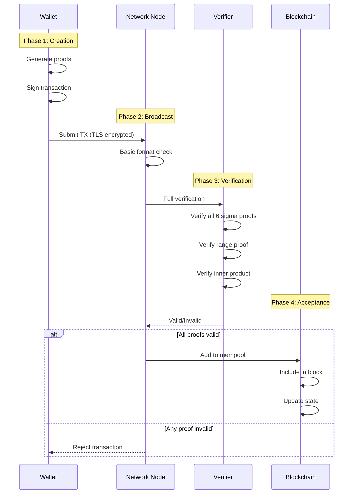
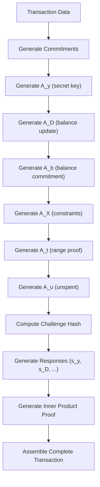
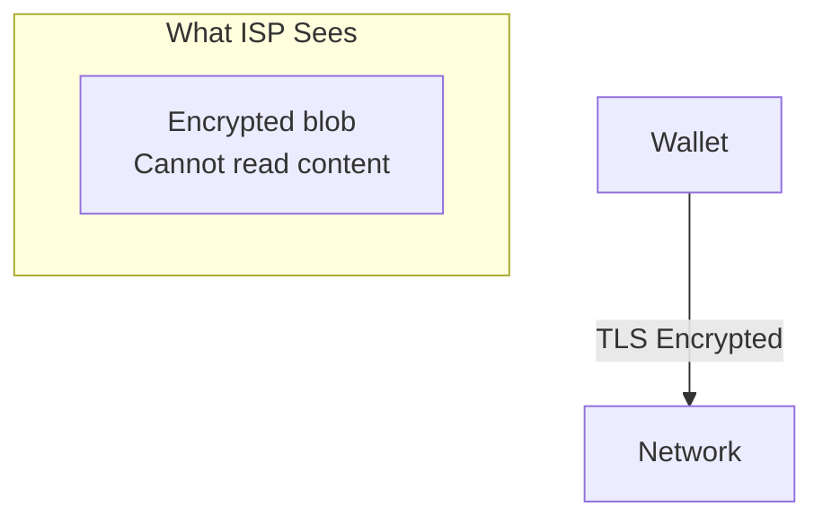
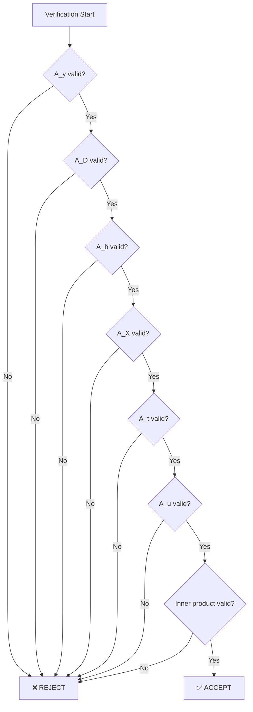
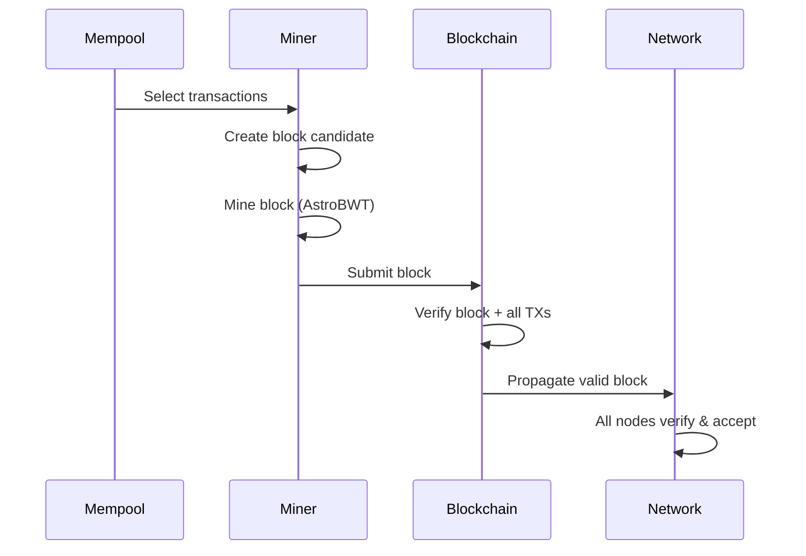

import { Callout } from 'nextra/components'
import { Tabs } from 'nextra/components'

# Proof Verification Flow

<Callout type="info" emoji="🔄">
**End-to-End Security:** Every transaction goes through a complete verification pipeline - from wallet creation through network validation to blockchain acceptance. This page traces the entire journey.
</Callout>

## The Complete Flow



---

## Phase 1: Transaction Creation (Wallet)

### Step 1.1: Prepare Transaction Data

**What happens in the wallet:**

```go
// Pseudocode from walletapi/wallet_transfer.go

func CreateTransaction(recipient, amount) {
    // 1. Check balance (encrypted)
    balance := wallet.GetEncryptedBalance()
    
    // 2. Select ring members
    ring := daemon.GetRandomAddresses(ring_size)
    
    // 3. Create transfer commitment
    commitment := EncryptAmount(amount, recipient_pubkey)
    
    // 4. Proceed to proof generation
}
```

**Source:** `walletapi/wallet_transfer.go:62` - Transaction creation

### Step 1.2: Generate Proofs

**The proof generation sequence:**



**From Source Code** (`cryptography/crypto/proof_generate.go`):

```go
// Simplified proof generation flow
func GenerateProof(witness *Witness) *Proof {
    // 1. Create commitments for each proof component
    A_y := generateAy(witness)
    A_D := generateAD(witness)
    A_b := generateAb(witness)
    A_X := generateAX(witness)
    A_t := generateAt(witness)  // Includes bit decomposition
    A_u := generateAu(witness)
    
    // 2. Compute challenge hash (binds all proofs together)
    c := HashToScalar(A_y, A_D, A_b, A_X, A_t, A_u, ...)
    
    // 3. Generate responses using challenge
    s_y := computeResponse(k_y, c, x_y)
    s_D := computeResponse(k_D, c, x_D)
    // ... other responses
    
    // 4. Generate inner product proof
    innerProof := generateInnerProduct(aL, aR, ...)
    
    return &Proof{A_y, A_D, A_b, A_X, A_t, A_u, s_y, s_D, ..., innerProof}
}
```

### Step 1.3: Bit Decomposition (Critical Security Point)

**This is where negative amounts are caught:**

```go
// From proof_generate.go:473-487
number_string := reverse("0000...000" + number.Text(2))

// For amount = 100:
//   number.Text(2) = "1100100"
//   Process: '1', '1', '0', '0', '1', '0', '0'
//   Result: Valid bit vector

// For amount = -100:
//   number.Text(2) = "-1100100"
//   Process: '-', '1', '1', '0', ...
//   First char is '-' (not '0' or '1')
//   Result: PROOF GENERATION FAILS
```

**Key Point:** Invalid transactions cannot even be created. The wallet cannot generate a valid proof for negative amounts.

---

## Phase 2: Network Broadcast

### Step 2.1: TLS Encryption



**From Source Code** (`p2p/connection.go`):

```go
// All connections use TLS
func (c *Connection) Connect() error {
    tlsConfig := &tls.Config{
        // TLS 1.3 minimum
        MinVersion: tls.VersionTLS13,
    }
    conn, err := tls.Dial("tcp", address, tlsConfig)
    // ...
}
```

### Step 2.2: Basic Format Check

**Before full verification, nodes do quick sanity checks:**

```go
// Pseudocode from blockchain/transaction_verify.go

func BasicCheck(tx *Transaction) error {
    // 1. Check transaction size limits
    if tx.Size() > MAX_TX_SIZE {
        return errors.New("transaction too large")
    }
    
    // 2. Check required fields present
    if tx.Proofs == nil {
        return errors.New("missing proofs")
    }
    
    // 3. Check signature format
    if !ValidSignatureFormat(tx.Signature) {
        return errors.New("invalid signature format")
    }
    
    return nil
}
```

---

## Phase 3: Full Verification

### Step 3.1: Recompute Challenge Hash

**The verifier recomputes the challenge from the submitted proofs:**

```go
// From proof_verify.go

func Verify(proof *Proof) bool {
    // 1. Extract all proof components
    A_y := proof.A_y
    A_D := proof.A_D
    A_b := proof.A_b
    A_X := proof.A_X
    A_t := proof.A_t
    A_u := proof.A_u
    
    // 2. Recompute challenge hash
    c := HashToScalar(A_y, A_D, A_b, A_X, A_t, A_u, ...)
    
    // This 'c' must match what the prover used
    // If any proof component was changed, c will be different
    // And all verifications will fail
}
```

### Step 3.2: Verify Each Proof

<Tabs items={['A_y Verification', 'A_D Verification', 'A_t Verification', 'Inner Product']}>
  <Tabs.Tab>
    **A_y: Secret Key Proof**
    
    ```go
    func VerifyAy(A_y, s_y, c, PublicKey) bool {
        // Schnorr verification
        // Check: s_y × G = A_y + c × PublicKey
        
        left := ScalarMult(G, s_y)
        right := PointAdd(A_y, ScalarMult(PublicKey, c))
        
        return left.Equals(right)
    }
    ```
    
    **What it proves:** Sender has the private key
  </Tabs.Tab>
  
  <Tabs.Tab>
    **A_D: Balance Update Proof**
    
    ```go
    func VerifyAD(A_D, s_D, c, OldBalance, NewBalance) bool {
        // Verify encrypted balance update is correct
        // E(old) - E(amount) = E(new)
        
        // Uses homomorphic properties
        return ValidateBalanceUpdate(A_D, s_D, c, OldBalance, NewBalance)
    }
    ```
    
    **What it proves:** Math is correct (old - amount = new)
  </Tabs.Tab>
  
  <Tabs.Tab>
    **A_t: Range Proof**
    
    ```go
    func VerifyAt(A_t, proof, c) bool {
        // Bulletproof range proof verification
        // Check: amount is in [0, 2^64]
        
        // 1. Verify bit commitments
        if !ValidateBitCommitments(proof.BitCommits) {
            return false
        }
        
        // 2. Verify range bounds
        if !ValidateRange(proof, 0, MAX_UINT64) {
            return false
        }
        
        return true
    }
    ```
    
    **What it proves:** Amount is valid (not negative, not overflow)
  </Tabs.Tab>
  
  <Tabs.Tab>
    **Inner Product Proof**
    
    ```go
    func VerifyInnerProduct(proof *InnerProof) bool {
        // Recursive verification
        for i := 0; i < log2(128); i++ {
            L := proof.L[i]
            R := proof.R[i]
            x := proof.Challenges[i]
            
            // Verify this round
            if !VerifyRound(L, R, x) {
                return false
            }
        }
        
        // Final check
        return proof.FinalA * proof.FinalB == proof.InnerProduct
    }
    ```
    
    **What it proves:** All components are cryptographically consistent
  </Tabs.Tab>
</Tabs>

### Step 3.3: All-or-Nothing Decision



**Key Point:** ALL proofs must pass. There is no "partial acceptance."

---

## Phase 4: Blockchain Acceptance

### Step 4.1: Mempool Addition

```go
// Pseudocode from blockchain/mempool.go

func AddToMempool(tx *Transaction) error {
    // 1. Verify transaction (full verification)
    if !VerifyTransaction(tx) {
        return errors.New("invalid transaction")
    }
    
    // 2. Check not already in mempool
    if mempool.Contains(tx.Hash) {
        return errors.New("duplicate transaction")
    }
    
    // 3. Check not already spent (double-spend prevention)
    for _, input := range tx.Inputs {
        if spent.Contains(input) {
            return errors.New("input already spent")
        }
    }
    
    // 4. Add to mempool
    mempool.Add(tx)
    return nil
}
```

### Step 4.2: Block Inclusion



### Step 4.3: State Update

```go
// From blockchain/transaction_execute.go

func ExecuteTransaction(tx *Transaction) error {
    // 1. Update sender's encrypted balance
    sender_balance := GetEncryptedBalance(tx.Sender)
    new_sender_balance := HomomorphicSubtract(sender_balance, tx.Amount)
    SetEncryptedBalance(tx.Sender, new_sender_balance)
    
    // 2. Update receiver's encrypted balance
    receiver_balance := GetEncryptedBalance(tx.Receiver)
    new_receiver_balance := HomomorphicAdd(receiver_balance, tx.Amount)
    SetEncryptedBalance(tx.Receiver, new_receiver_balance)
    
    // 3. Mark outputs as spent
    MarkSpent(tx.Inputs)
    
    return nil
}
```

**Source:** `blockchain/transaction_execute.go:239` - Transaction execution

---

## Security at Each Phase

| Phase | What's Checked | Attack Prevented |
|-------|---------------|------------------|
| **Creation** | Bit decomposition | Negative amounts |
| **Broadcast** | TLS encryption | Network snooping |
| **Verification** | All proofs | Forgery, double-spend |
| **Acceptance** | Consensus | Byzantine actors |

---

## Timing Breakdown

**Typical verification times:**

| Step | Time | Notes |
|------|------|-------|
| **Format check** | < 1ms | Basic validation |
| **Proof verification** | ~10ms | All 6 sigma proofs |
| **Inner product** | ~5ms | Recursive verification |
| **Consensus** | ~18s | Block time |

**Total verification per transaction:** ~15-20ms

---

## Key Takeaways

### The Verification Guarantee

```
Transaction Accepted ⟺ ALL of:
  ✓ Wallet could generate valid proofs
  ✓ TLS encrypted during transit
  ✓ All 6 sigma proofs valid
  ✓ Range proof valid
  ✓ Inner product valid
  ✓ No double-spending
  ✓ Consensus acceptance
```

### Why Invalid Transactions Cannot Succeed

<Callout type="success" emoji="🛡️">
**Multiple Barriers:** Invalid transactions face multiple independent barriers. They can't be created (bit decomposition), can't be verified (proof system), and can't be accepted (consensus). Each barrier is independently sufficient.
</Callout>

---

## Related Pages

**Security Suite:**
- [Transaction Proofs](/integrity/transaction-proofs) - The six sigma system
- [Range Proof Integrity](/integrity/range-proof-integrity) - Triple-layer defense
- [Network Consensus](/integrity/network-consensus-validation) - Distributed validation

**Technical Reference:**
- [Daemon RPC API](/rpc-api/daemon-rpc-api) - Transaction submission
- [Wallet RPC API](/rpc-api/wallet-rpc-api) - Transaction creation
