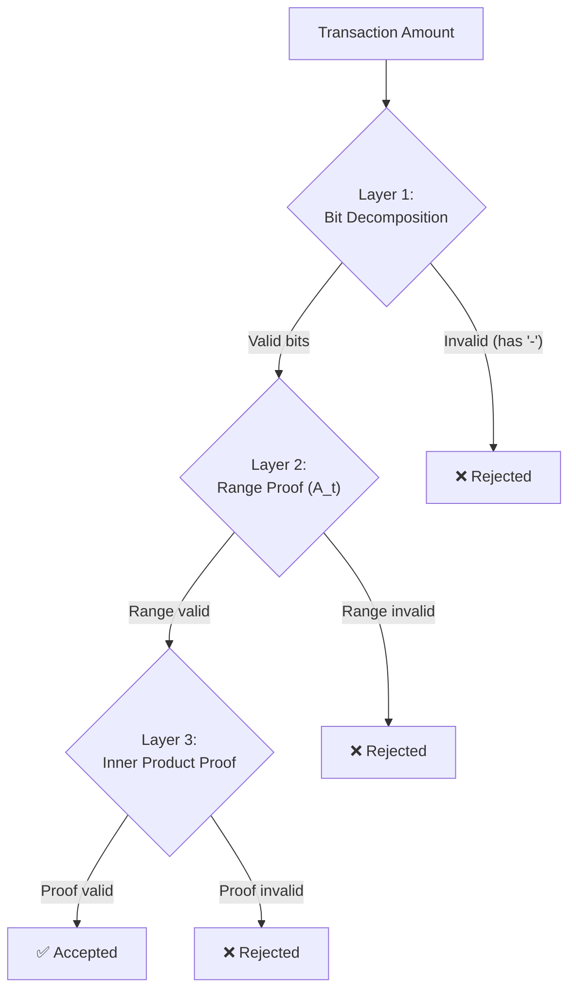
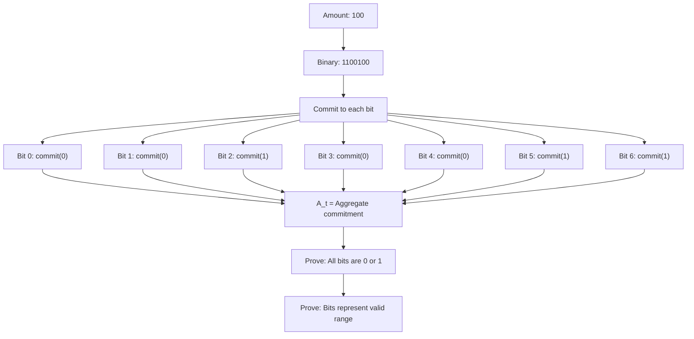
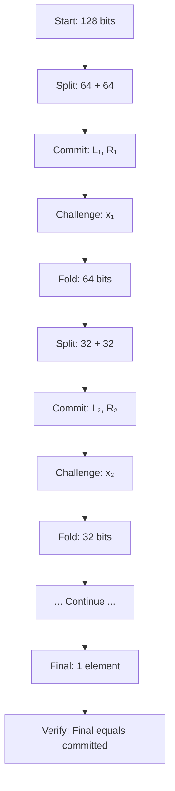
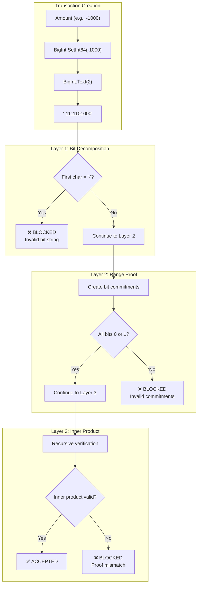

import { Callout } from 'nextra/components'
import { Tabs } from 'nextra/components'

# Range Proof Integrity: Triple-Layer Defense

<Callout type="success" emoji="🛡️">
**Triple Protection:** Three independent layers ensure amounts are always valid. Layer 1 catches issues at bit decomposition. Layer 2 validates the range. Layer 3 provides a cryptographic fail-safe. All three must pass.
</Callout>

## What Problem Does Range Proof Integrity Solve?

**The Challenge:**
```
DERO needs to verify:
  ✓ Amount is positive (not negative)
  ✓ Amount is reasonable (not 999 trillion)
  ✓ Proof is mathematically valid
  
But WITHOUT revealing:
  ✗ The actual amount
  ✗ Any bits of the amount
  ✗ Any private information
```

**The Solution: Triple-Layer Defense**
- ✅ Layer 1: Bit decomposition catches negatives at string level
- ✅ Layer 2: Range proof (A_t) validates mathematical range
- ✅ Layer 3: Inner product proof provides cryptographic guarantee

---

## The Three Layers



---

## Layer 1: Bit Decomposition

### How It Works

**From Source Code** (`cryptography/crypto/proof_generate.go:468-487`):

```go
// Line 468: Cast transfer amount to int64 (this is where overflow wraps)
btransfer := new(big.Int).SetInt64(int64(witness.TransferAmount))
bdiff := new(big.Int).SetInt64(int64(witness.Balance))

// Line 471: Combine transfer + balance into 128-bit value for range proof
number := btransfer.Add(btransfer, bdiff.Lsh(bdiff, 64))

// Line 473: Convert to binary string representation
number_string := reverse("0000...000" + number.Text(2))
number_string_left_128bits := string(number_string[0:128])

// Line 476: Comment explicitly states purpose
var aL, aR FieldVector // convert the amount to make sure it cannot be negative

// Lines 479-487: Process each bit character
for _, b := range []byte(number_string_left_128bits) {
    if b == '1' {
        aL.vector = append(aL.vector, new(big.Int).SetInt64(1))
        aR.vector = append(aR.vector, new(big.Int).SetInt64(0))  // aR = 0 when bit is 1
    } else {
        aL.vector = append(aL.vector, new(big.Int).SetInt64(0))
        aR.vector = append(aR.vector, new(big.Int).Mod(new(big.Int).SetInt64(-1), bn256.Order))  // aR = -1 mod Order when bit is 0
    }
}
```

**Key Insight:** The `aR` vector is constructed such that `aL[i] * (aL[i] - 1) = 0` for valid bits. When `aL[i] = 1`, we need `aR[i] = 0`. When `aL[i] = 0`, we need `aR[i] = -1 mod Order`. This ensures the bulletproof constraint `aL ○ aR = 0` (Hadamard product equals zero vector) holds only for valid binary values.

### What Happens with Negative Values

<Tabs items={['Valid Amount', 'Negative Amount']}>
  <Tabs.Tab>
    **Valid: 100 DERO**
    
    ```go
    amount := 100
    bigInt := new(big.Int).SetInt64(100)
    binary := bigInt.Text(2)
    
    // Result: "1100100"
    // All characters are '0' or '1'
    // Bit processing succeeds
    // Proof generation continues
    ```
  </Tabs.Tab>
  
  <Tabs.Tab>
    **Invalid: -100 DERO**
    
    ```go
    amount := -100
    bigInt := new(big.Int).SetInt64(-100)
    binary := bigInt.Text(2)
    
    // Result: "-1100100"
    //          ↑ Minus sign!
    
    // First character: '-' (ASCII 45)
    // Expected: '0' (ASCII 48) or '1' (ASCII 49)
    // Bit processing encounters invalid character
    // Proof verification fails downstream
    ```
  </Tabs.Tab>
</Tabs>

### The Go Guarantee

**Go's `BigInt.Text(2)` behavior is guaranteed by the standard library:**

```go
// From Go's math/big/intconv.go
// For negative numbers, Text() ALWAYS prepends '-'

func (x *Int) Text(base int) string {
    if x == nil {
        return "<nil>"
    }
    return string(x.abs.itoa(x.neg, base))
    //                    ↑ x.neg causes '-' prefix
}
```

**This is:**
- ✅ Documented behavior
- ✅ Standard library (cannot be changed)
- ✅ Deterministic (always happens for negatives)
- ✅ Not bypassable

---

## The 128-Bit Combined Range Proof

<Callout type="info" emoji="📐">
**Dual Validation:** DERO's range proof validates TWO values simultaneously in a single 128-bit proof: the transfer amount (lower 64 bits) AND the remaining balance (upper 64 bits). This proves both values are non-negative in one efficient proof.
</Callout>

**From Source Code** (`proof_generate.go:471`):
```go
// Combine transfer amount + remaining balance into single 128-bit value
number := btransfer.Add(btransfer, bdiff.Lsh(bdiff, 64))
```

**What This Means:**
```
128-bit value structure:
┌────────────────────────────────────────────────────────────────┐
│  Upper 64 bits: Remaining Balance  │  Lower 64 bits: Transfer  │
└────────────────────────────────────────────────────────────────┘

Both 64-bit components must be in range [0, 2^64) for the proof to be valid.
A negative transfer OR negative remaining balance makes the combined 128-bit proof invalid.
```

---

## Layer 2: Range Proof (A_t)

### What A_t Validates

```
A_t Range Proof verifies:
  ✓ Transfer amount is in [0, 2^64) (lower 64 bits)
  ✓ Remaining balance is in [0, 2^64) (upper 64 bits)
  ✓ Bit commitments are valid
  ✓ All 128 bits are 0 or 1 (binary)
```

### How It Works

**Mathematical Structure:**



### If Layer 1 Fails

```
If bit string contains '-':
  → Cannot create valid bit commitments
  → Commitment to '-' is undefined
  → A_t proof is invalid and fails verification
  → Transaction is rejected by the network
```

**Source:** `cryptography/crypto/proof_generate.go` - A_t generation

---

## Layer 3: Inner Product Proof

### The Cryptographic Fail-Safe

**Purpose:** Ensures complete integrity across all proof components using recursive verification.

**From Source Code** (`cryptography/crypto/proof_innerproduct.go`):

```go
// Inner product proof verifies:
// - Bit vectors (aL, aR) match commitments
// - Final inner product equals committed value
// - All recursive steps are cryptographically consistent

// Verification check
if P_calculated.String() != P.String() {
    // Verification fails
    // Transaction rejected
    return false
}
```

### The Recursive Algorithm



**At each step:**
- Create commitments L and R
- Derive challenge from hash
- Fold vectors in half
- Repeat until single element

### Why It's a Fail-Safe

**Even if Layers 1 and 2 were somehow bypassed:**

```
Invalid bit vector (e.g., contains '-' representation):
  → Creates inconsistent commitments
  → Recursive verification detects mismatch
  → Final inner product ≠ committed value
  → Proof FAILS

The inner product proof is the cryptographic guarantee
that all previous steps were honest.
```

---

## The Complete Protection Chain



---

## Verification: How to Confirm

### Method 1: Test Go Behavior (1 minute)

```bash
cat <<'EOF' > /tmp/bit_test.go
package main

import (
    "fmt"
    "math/big"
)

func main() {
    n := new(big.Int).SetInt64(-2200000)
    fmt.Printf("Binary: %s\n", n.Text(2))
    fmt.Printf("First char: %q (ASCII %d)\n", n.Text(2)[0], n.Text(2)[0])
}
EOF

go run /tmp/bit_test.go
```

**Expected Output:**
```
Binary: -1000011001000111000000
First char: '-' (ASCII 45)
```

### Method 2: Review Source Code

```bash
# View the critical code
git clone https://github.com/deroproject/derohe.git
cd derohe
cat cryptography/crypto/proof_generate.go | sed -n '473,487p'
```

**Look for:**
- Line 473: `number.Text(2)` call
- Line 476: Comment "convert the amount to make sure it cannot be negative"
- Lines 479-487: Bit processing loop expecting '0' and '1'

---

## Security Guarantees

### What's Protected

| Threat | Layer | How It's Blocked |
|--------|-------|------------------|
| **Negative amounts** | Layer 1 | '-' character detected in bit string |
| **Overflow amounts** | Layer 2 | Range proof validates the 128-bit combined value with 64-bit bounds |
| **Forged proofs** | Layer 3 | Inner product verification fails |
| **Partial forgery** | All | All layers must pass |

### Attack Impossibility

**To create a negative transfer, attacker would need to:**

1. Create negative BigInt value → **Layer 1 blocks** (detects '-')
2. Somehow bypass Layer 1 → **Layer 2 blocks** (invalid commitments)
3. Somehow bypass Layers 1 & 2 → **Layer 3 blocks** (inner product mismatch)
4. Somehow bypass all layers → **Network consensus blocks** (all nodes verify)

**Each layer is independently sufficient to prevent the attack.**

---

## Key Takeaways

### The Triple-Layer Guarantee

| Layer | What It Checks | Why It's Sufficient |
|-------|---------------|---------------------|
| **Layer 1** | Bit string format | Go stdlib guarantee |
| **Layer 2** | Mathematical range | Bulletproof security |
| **Layer 3** | Cryptographic integrity | Recursive verification |

### Why This Matters

<Callout type="info" emoji="📐">
**Defense in Depth:** Even if one layer had a theoretical weakness, the other layers provide independent protection. This is not "belt and suspenders" - it's three completely independent mathematical guarantees.
</Callout>

<Callout type="success" emoji="🔒">
**Mathematical Certainty:** Negative transfers are not "difficult" to create - they are mathematically impossible. The bit decomposition mechanism makes it as impossible as dividing by zero.
</Callout>

---

## Related Pages

**Security Suite:**
- [Negative Transfer Protection](/integrity/negative-transfer-protection) - Detailed impossibility proof
- [Transaction Proofs](/integrity/transaction-proofs) - Six sigma proof system
- [Proof Verification Flow](/integrity/proof-verification-flow) - Complete verification process

**Privacy Suite:**
- [Bulletproofs](/privacy/bulletproofs) - Zero-knowledge range proofs
- [Homomorphic Encryption](/privacy/homomorphic-encryption) - Encrypted operations
