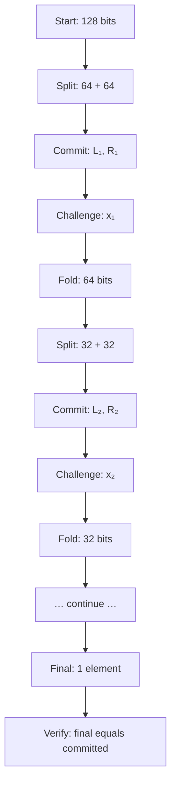

import { Callout } from 'nextra/components'

# Range Proof Integrity

<Callout type="success" emoji="🛡️">
**What the range proof binds:** Every DERO transfer carries a Bulletproof range proof. One proof binds **two** quantities — the transfer amount and the sender's remaining balance — to non-negative 64-bit ranges. Every node verifies the proof independently. By the soundness of Bulletproofs, an out-of-range value cannot produce a proof that verifies.
</Callout>

## What the range proof proves

DERO packs **two** quantities into a single 128-bit value and range-proves them together. The packing step is at `cryptography/crypto/proof_generate.go:468-471` and the bit-decomposition loop that feeds the bulletproof is at `proof_generate.go:473-487`:

```go
btransfer := new(big.Int).SetInt64(int64(witness.TransferAmount)) // this should be reduced
bdiff     := new(big.Int).SetInt64(int64(witness.Balance))        // this should be reduced
number    := btransfer.Add(btransfer, bdiff.Lsh(bdiff, 64))       // 128-bit value to range-prove
```

The trailing `// this should be reduced` comments are the DERO author's own forensic note in source — flagging that reduction modulo the bn256 group order should be applied to these inputs. They are preserved verbatim here because they carry that authorial signal.

So one Bulletproof establishes **both**:

- the **transfer amount** is a valid non-negative 64-bit number (low 64 bits), and
- the sender's **remaining balance** is a valid non-negative 64-bit number (high 64 bits).

<Callout type="info" emoji="📐">
**Why both matter:** proving only the amount is non-negative would not stop an overspend. By also proving the remaining balance is non-negative, the same proof guarantees you cannot send more than you hold — and cannot manufacture a balance by sending a "negative" amount.
</Callout>

---

## The cryptographic guarantee

By the **computational soundness** of Bulletproofs — under the discrete-log assumption on the bn256 curve, in the random oracle model (Fiat-Shamir) — no prover can construct a proof that *verifies* for a committed value outside the proven range, except with negligible probability bounded by the underlying hardness. Combined with DERO's homomorphic accounting (inputs and outputs bound to balance exactly), value cannot be created from nothing. See [Cryptographic Assumptions](/integrity/transaction-proofs#cryptographic-assumptions) for the full assumption stack.

A "negative" transfer is the `uint64` wraparound of a value near `2^64`. It fails the range proof from both directions:

| Attack framing | Why the range proof rejects it |
|---|---|
| Treat the wraparound as the **transfer amount** | A value near `2^64` lies outside `[0, 2^64)` — the low-64 range bound fails. |
| Treat it as **receiving** (so your own balance jumps) | The conservation proof forces a matching decrease; the sender's **remaining balance** goes negative → wraps → the high-64 range bound fails. |

There is no "almost in range," no rounding, no edge case: either a verifying proof exists (value in range) or it does not.

Full soundness derivation and the canonical refutation of the "minus sign breaks the bit loop" misconception: [Negative Transfer Protection](/integrity/negative-transfer-protection).

---

## Where the guarantee actually lives

The protection lives in **verification**, not generation. The wallet builds the proof in `proof_generate.go`; an attacker controls their own wallet and could patch out any client-side check. The cryptographic guarantee comes from `proof_verify.go`, which every node runs independently before accepting a block.

| Layer | What runs | Who controls it | Is this the safeguard? |
|---|---|---|---|
| Wallet proof generation | `proof_generate.go` | Sender (attacker if malicious) | No — can be patched by the attacker |
| Node proof verification | `proof_verify.go` | Every validating node | **Yes** — soundness ensures rejection of out-of-range proofs |

A common misconception holds that Go's `BigInt.Text(2)` emitting a `'-'` for negative values "breaks the bit loop" in proof generation, and that this is what stops negative transfers. It does not. The loop is `if b == '1' { … } else { … }` — a stray `'-'` byte is silently treated as a `0` bit, not rejected. And for any real transaction, the packed 128-bit `number` is positive, so `Text(2)` produces no `'-'` at all. See [Negative Transfer Protection](/integrity/negative-transfer-protection) for the full teardown.

---

## How the Bulletproof verification works

The Bulletproof proves the 128-bit committed value is in range by decomposing it into 128 bits, committing to two vectors derived from those bits, and proving in zero knowledge that each component is a single bit and that the bits reconstruct the committed value.

The verification reduces this to a single inner-product check using a recursive halving algorithm — what makes the proof logarithmic in size.

### The recursive inner product



**At each step:**
- Create commitments L and R
- Derive challenge from hash
- Fold vectors in half
- Repeat until a single element remains (`log₂(128) = 7` rounds, `cryptography/crypto/proof_innerproduct.go`)

If the final inner product does not match the committed value, the check at `proof_verify.go:457-460` fails — and the transaction is rejected at consensus.

---

## Verify it yourself

```bash
git clone https://github.com/deroproject/derohe.git
cd derohe

# The 128-bit packing (proof generation)
sed -n '466,490p' cryptography/crypto/proof_generate.go

# The verification every node runs (the actual enforcement)
sed -n '457,460p' cryptography/crypto/proof_verify.go

# The recursive inner product algorithm
grep -n "length" cryptography/crypto/proof_innerproduct.go
```

For the soundness argument and the proof that out-of-range values cannot produce a verifying proof, see [Negative Transfer Protection](/integrity/negative-transfer-protection).

---

## Related Pages

**Security suite:**
- [Negative Transfer Protection](/integrity/negative-transfer-protection) — soundness derivation, misconception teardown
- [Transaction Proofs](/integrity/transaction-proofs) — the full proof set every node checks
- [Proof Verification Flow](/integrity/proof-verification-flow) — end-to-end validation
- [Inflation Claim](/integrity/inflation-claim) — what the 2022 case actually shows

**Privacy suite:**
- [Bulletproofs](/privacy/bulletproofs) — zero-knowledge range proofs
