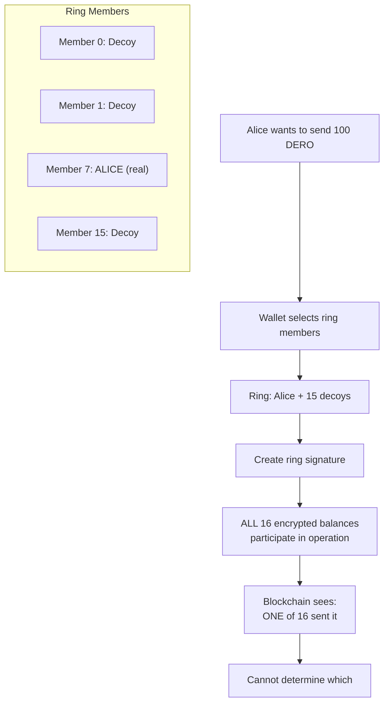
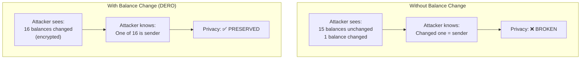

import { Callout } from 'nextra/components'
import { Tabs } from 'nextra/components'

# Ring Member Behavior

<Callout type="warning" emoji="⚠️">
**Critical Understanding:** Encrypted balance changes occur for ALL ring members in a transaction, including decoys. This is **by design** - it's how ring signatures provide plausible deniability. Observing a balance change does NOT mean an address was the sender.
</Callout>

## The Core Mechanism

### How Ring Signatures Work

When Alice sends DERO to Bob:



### Why Decoy Balances Change

**From Source Code** (`walletapi/daemon_communication.go:863-903`):

```go
// When processing a transaction, check if our address is a ring member
if bytes.Compare(compressed_address, tx.Payloads[t].Statement.Publickeylist_compressed[j][:]) == 0 {
    // Our address is in this ring!
    
    // Lines 886-889: Encrypted balance changes for ALL ring members
    changes := crypto.ConstructElGamal(tx.Payloads[t].Statement.C[j], tx.Payloads[t].Statement.D)
    changed_balance_e := previous_balance_e_tx.Add(changes)
    previous_balance_e_tx = new(crypto.ElGamal).Deserialize(changed_balance_e.Serialize())
    
    // Lines 900-903: Identify if we were just a decoy
    switch {
    case previous_balance == changed_balance:
        ring_member = true  // We were a decoy - balance unchanged after decryption
    }
}
```

**Key Insight:** The encrypted balance data changes for ALL ring members, but only the real sender's *decrypted* balance actually changes.

---

## The Two Types of Balance Changes

### Encrypted vs. Decrypted

<Tabs items={['Encrypted Balance', 'Decrypted Balance']}>
  <Tabs.Tab>
    **Encrypted Balance (66 bytes)**
    
    ```
    What network sees:
    
    Ring member (decoy):
      Before: "002a319487393969e9552e..."
      After:  "a58442215349d55ceaac04..."  ← DIFFERENT!
      
    Real sender:
      Before: "7f8e2a1b3c4d5e6f7a8b..."
      After:  "1a2b3c4d5e6f7a8b9c0d..."  ← DIFFERENT!
      
    Both encrypted balances change!
    Cannot distinguish sender from decoy!
    ```
  </Tabs.Tab>
  
  <Tabs.Tab>
    **Decrypted Balance (Only Owner Sees)**
    
    ```
    What owner sees (with private key):
    
    Ring member (decoy):
      Before: 500 DERO
      After:  500 DERO  ← SAME!
      
    Real sender:
      Before: 500 DERO
      After:  400 DERO  ← DIFFERENT!
      
    Only real sender's balance changes!
    But only they can see this!
    ```
  </Tabs.Tab>
</Tabs>

---

## Why This Design?

### The Privacy Guarantee



**The key insight:** If only the real sender's encrypted balance changed, an observer could identify them immediately. By having all ring members' encrypted balances change, the sender remains hidden.

### Plausible Deniability

<Callout type="success" emoji="🛡️">
**Legal Protection:** If accused of sending a transaction, you can truthfully say: "My encrypted balance changed, but that only means I was in the ring. Any of the 16 members could be the real sender." This is cryptographically provable.
</Callout>

---

## What Balance Changes Mean

### Interpretation Guide

| Observation | What It Means | What It Doesn't Mean |
|-------------|--------------|---------------------|
| **Encrypted balance unchanged** | Address not in ANY ring | - |
| **Encrypted balance changed** | Address was in a ring | ≠ Address was sender |
| **Multiple changes over time** | Address in multiple rings | ≠ Address sent multiple times |
| **Decrypted balance unchanged** | Was decoy (owner can verify) | Only owner knows this |
| **Decrypted balance changed** | Was real sender (owner can verify) | Only owner knows this |

### The Unchanged Balance Test

**If encrypted balance is unchanged for X blocks:**

```
Unchanged encrypted balance = NOT involved in ANY transaction

This means:
  ✗ Not a sender
  ✗ Not a receiver
  ✗ Not a decoy
  ✗ Not a ring member at all

The address has zero blockchain activity for that period.
```

**This is powerful evidence** - unchanged encrypted balance definitively proves no involvement.

---

## Ring Member Selection

### How Decoys Are Chosen

**From Source Code** (`cmd/derod/rpc/rpc_dero_getrandomaddress.go`):

```go
// Get addresses with UNCHANGED balances (past 5 blocks)
for i := 0; i < 100; i++ {
    address := balance_tree.Random()
    old_balance := balance_tree_old.Get(address)
    
    if balance != old_balance {
        continue  // Skip if balance changed recently
    }
    
    candidates = append(candidates, address)
}

// Returns ~140 candidates
// Wallet picks ring_size-1 for ring (+ sender)
```

### Selection Criteria

| Requirement | Reason |
|-------------|--------|
| **Unchanged balance (5 blocks)** | Better decoys |
| **Random selection** | Prevents targeting |
| **Multiple candidates** | Ensures diversity |

---

## Example: Tracing a Transaction

### The Scenario

```
Transaction at block 1,081,893:
  Ring size: 16 members
  One of them sent 100 DERO
```

### What an Observer Sees

```
Address 0:  Encrypted balance changed
Address 1:  Encrypted balance changed
Address 2:  Encrypted balance changed
...
Address 7:  Encrypted balance changed  ← Could be sender
...
Address 15: Encrypted balance changed

ALL 16 encrypted balances changed.
Which one is the sender? UNKNOWN.
```

### What Each Owner Sees

```
Address 0 owner:  "My decrypted balance is same. I was a decoy."
Address 1 owner:  "My decrypted balance is same. I was a decoy."
...
Address 7 owner:  "My decrypted balance is 100 less. I was the sender."
...
Address 15 owner: "My decrypted balance is same. I was a decoy."

Only Address 7's owner knows they sent.
Nobody else can prove it.
```

---

## Sender vs. Decoy: How to Verify

### Method 1: Decrypt Balance (Owner Only)

The wallet performs this check automatically. From `walletapi/daemon_communication.go:900-903`:

```go
switch {
case previous_balance == changed_balance:
    ring_member = true  // We were a decoy - balance unchanged after decryption
case previous_balance > changed_balance:
    // We were the sender - balance decreased
```

The wallet decrypts the balance before and after the transaction using the owner's private key. If the decrypted balance is unchanged, you were a decoy. If it decreased, you were the sender.

### Method 2: Check Wallet History (Owner Only)

```bash
# Wallet shows transaction history
dero-wallet-cli
> balance
> show_transfers
```

### Method 3: External Observation (IMPOSSIBLE)

```
Observer can see:
  ✓ Encrypted balance changed
  ✗ Decrypted balance
  ✗ Who the sender is
  ✗ Proof that any specific address sent

Conclusion: Cannot determine sender from outside
```

---

## Common Misconceptions

### Misconception 1: "Balance change = sent transaction"

**Reality:** Balance change only means the address was in a ring. Could be sender OR decoy.

### Misconception 2: "Can track senders by balance changes"

**Reality:** All ring members' balances change. Tracking balance changes tracks ring membership, not sending.

### Misconception 3: "Unchanged balance = received"

**Reality:** Unchanged encrypted balance = no involvement at all (not sending, not receiving, not in any ring).

### Misconception 4: "Third parties can verify sender"

**Reality:** Only the owner (with private key) can determine if they were sender or decoy. This is privacy by design.

---

## Security Implications

### What This Protects

| Threat | How Ring Member Behavior Helps |
|--------|-------------------------------|
| **Sender identification** | All ring members look the same |
| **Transaction linking** | Each TX has independent ring |
| **Balance analysis** | Encrypted balances hide amounts |
| **Statistical attacks** | Random decoy selection |

### The Privacy Guarantee

<Callout type="info" emoji="📐">
**Mathematical Privacy:** The probability of correctly identifying the sender is exactly 1/ring_size (e.g., 6.25% for ring size 16). This is not "hard to guess" - it's mathematically guaranteed randomness.
</Callout>

---

## Key Takeaways

### The Design Principle

```
Ring signature privacy requires:
  1. Multiple addresses in ring
  2. All encrypted balances participate equally
  3. No observable difference between sender and decoys
  4. Only owner can decrypt their balance

Result: Perfect plausible deniability
```

### For Users

- **Your encrypted balance will change** when you're selected as a decoy
- This is **normal** and **expected**
- It does **not** mean you sent anything
- Only **you** know if you were sender or decoy
- This **protects your privacy** when you ARE the sender

### For Analysts

- **Encrypted balance changes** indicate ring membership only
- **Cannot determine** sender vs. decoy from encrypted data
- **Statistical analysis** faces 1/ring_size probability barrier
- **Definitively proving** sender identity is cryptographically impossible

---

## Related Pages

**Security Suite:**
- [Balance Mechanics](/integrity/balance-mechanics) - Encrypted balance structure
- [Proof Types Explained](/integrity/payload-vs-transaction-proofs) - Why third parties can't verify

**Privacy Suite:**
- [Ring Signatures](/privacy/ring-signatures) - Complete ring signature explanation
- [Transaction Privacy](/privacy/transaction-privacy) - Full privacy model
