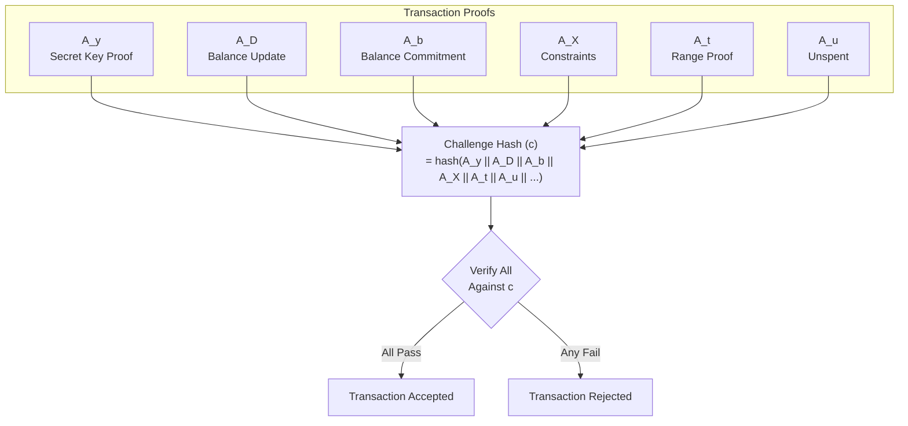
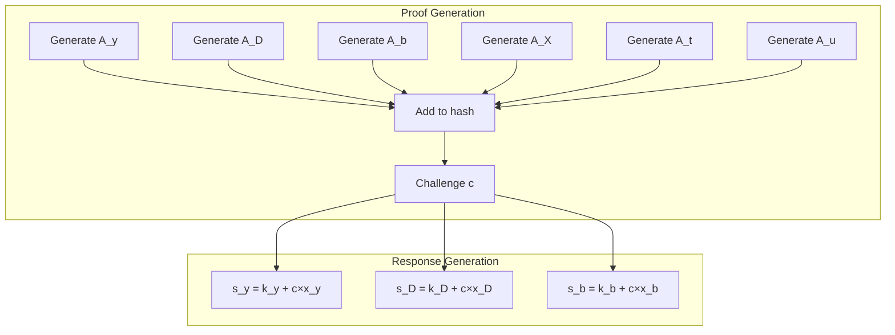
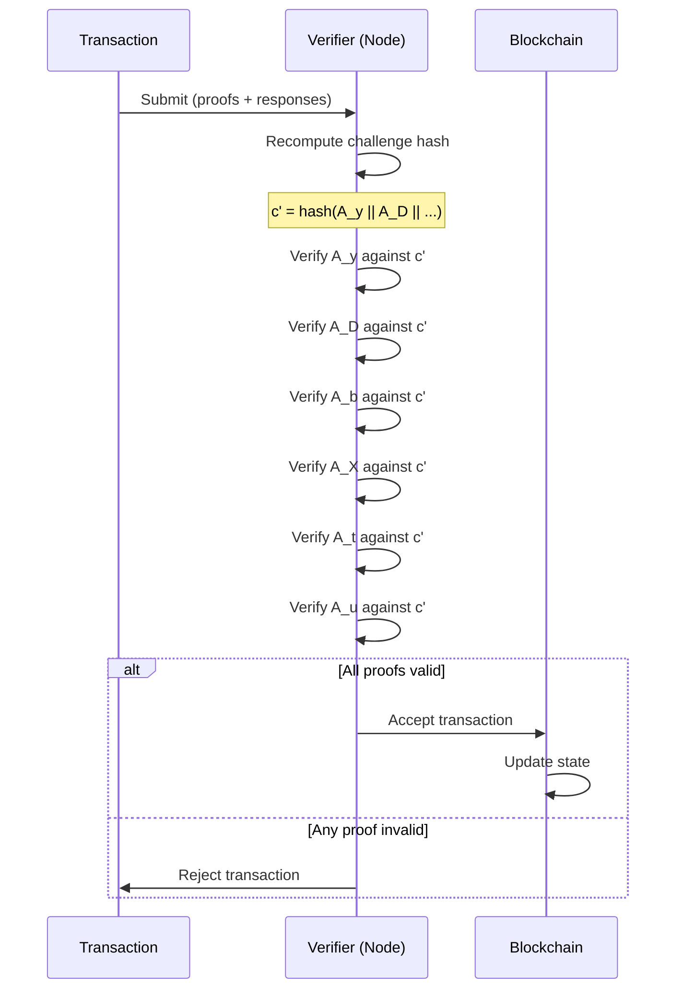

import { Callout } from 'nextra/components'
import { Tabs } from 'nextra/components'

# Transaction Proofs: The Six Sigma System

<Callout type="success" emoji="🔐">
**Core Principle:** Six interconnected proofs bound by a cryptographic hash. If you fake one proof, the hash changes, which invalidates all other proofs. This creates an all-or-nothing security model.
</Callout>

## What Problem Do Transaction Proofs Solve?

**The Challenge:**
```
DERO needs to verify:
  ✓ Sender owns the funds (has private key)
  ✓ Balance update is mathematically correct
  ✓ Amount is valid (not negative, not impossible)
  ✓ No double-spending occurred
  ✓ All protocol constraints satisfied
  
But WITHOUT revealing:
  ✗ The sender's identity
  ✗ The actual amounts
  ✗ The balances
```

**The Solution: Six Sigma Proofs**
- ✅ Each proof validates one aspect
- ✅ All proofs bound together cryptographically
- ✅ Cannot fake one without breaking all
- ✅ Zero-knowledge (reveals nothing)

---

## The Six Proofs



### Proof Details

| Proof | What It Validates | Why It's Needed |
|-------|------------------|-----------------|
| **A_y** | Sender possesses private key | Prevents unauthorized spending |
| **A_D** | Encrypted balance update is correct | Ensures math is right |
| **A_b** | Balance commitment is valid | Binding and hiding properties |
| **A_X** | Additional protocol constraints | Protocol-specific rules |
| **A_t** | Combined 128-bit value with 64-bit bounds | Prevents negative/overflow |
| **A_u** | Output is unspent | Prevents double-spending |

---

## How They're Bound Together

### The Challenge Hash

**From Source Code** (`cryptography/crypto/proof_generate.go`):

```go
// All proofs contribute to the challenge hash
statement_hash := crypto.HashToScalar(
    A_y,        // Secret key proof
    A_D,        // Balance update proof  
    A_b,        // Balance commitment
    A_X,        // Constraint proof
    A_t,        // Range proof
    A_u,        // Unspent proof
    // ... additional components
)

// Challenge 'c' is derived from this hash
c := statement_hash
```

**The Binding Effect:**



### Why This Prevents Forgery

<Tabs items={['The Attack', 'Why It Fails']}>
  <Tabs.Tab>
    **Attacker's Goal:**
    
    ```
    Attacker wants to:
      1. Fake A_t (range proof) to allow negative amount
      2. Keep other proofs valid
      
    Strategy:
      1. Create fake A_t' (allows -1000 DERO)
      2. Submit with real A_y, A_D, A_b, A_X, A_u
    ```
  </Tabs.Tab>
  
  <Tabs.Tab>
    **Why It Fails:**
    
    ```
    1. Fake A_t' is different from real A_t
    
    2. Challenge hash changes:
       c' = hash(A_y || A_D || A_b || A_X || A_t' || A_u)
       c' ≠ c (original)
       
    3. All responses were computed with c, not c':
       s_y = k_y + c×x_y  (computed with c)
       
    4. Verification uses c' but responses use c:
       verify(A_y, s_y, c') → FAILS
       
    5. ALL proofs fail verification, not just A_t
    ```
  </Tabs.Tab>
</Tabs>

**Key Insight:** The challenge hash creates a **circular dependency**. You need all proofs to compute the hash, but you need the hash to create valid responses. Changing any proof changes the hash, which invalidates all responses.

---

## Each Proof Explained

### A_y: Secret Key Proof

**Purpose:** Proves sender possesses the private key without revealing it.

**Mathematical Structure:**
```
Schnorr-style proof:
  - Commitment: A_y = k×G (random k)
  - Challenge: c (from hash)
  - Response: s_y = k + c×private_key

Verification:
  s_y×G = A_y + c×PublicKey
  
If sender doesn't have private_key:
  Cannot compute valid s_y
  Proof fails
```

**Source:** `cryptography/crypto/proof_generate.go` - A_y generation

### A_D: Balance Update Proof

**Purpose:** Proves the encrypted balance update is mathematically correct.

**What It Validates:**
```
Old encrypted balance: E(old_balance)
Transfer amount:       E(amount)
New encrypted balance: E(new_balance)

Proves: E(old_balance) - E(amount) = E(new_balance)
Without revealing: old_balance, amount, or new_balance
```

**Source:** `cryptography/crypto/proof_generate.go` - A_D generation

### A_b: Balance Commitment Proof

**Purpose:** Proves the balance commitment has proper binding and hiding properties.

**Properties Ensured:**
- **Binding:** Cannot change committed value later
- **Hiding:** Cannot determine committed value from commitment

**Mathematical Structure:**
```
Pedersen Commitment:
  C = amount×G + blinding×H

Properties:
  - Cannot find different (amount', blinding') with same C (binding)
  - Cannot determine amount from C without blinding (hiding)
```

**Source:** `cryptography/crypto/proof_generate.go` - A_b generation

### A_X: Constraint Proof

**Purpose:** Validates additional protocol-specific constraints.

**What It Covers:**
- Transaction format validity
- Protocol rule compliance
- Additional cryptographic constraints

**Source:** `cryptography/crypto/proof_generate.go` - A_X generation

### A_t: Range Proof

**Purpose:** Proves the combined 128-bit value is valid (lower 64 bits = transfer, upper 64 bits = remaining balance) without revealing either value.

**This is the bulletproof component:**
- Uses bit decomposition (catches negatives)
- Logarithmic proof size (7 rounds for 128-bit range)
- Validates both transfer AND remaining balance simultaneously

**[Detailed explanation →](/integrity/range-proof-integrity)**

**Source:** `cryptography/crypto/proof_generate.go:473-487`

### A_u: Unspent Proof

**Purpose:** Proves the output hasn't been spent before (prevents double-spending).

**Mechanism:**
```
Each output has unique identifier
Proof shows: identifier not in spent set
Network tracks: all spent identifiers
Result: Cannot spend same output twice
```

**Source:** `cryptography/crypto/proof_generate.go` - A_u generation

---

## Verification Flow



**From Source Code** (`cryptography/crypto/proof_verify.go`):

```go
// Verification pseudocode
func VerifyTransaction(tx *Transaction) bool {
    // 1. Recompute challenge hash from proofs
    c := HashToScalar(tx.A_y, tx.A_D, tx.A_b, tx.A_X, tx.A_t, tx.A_u, ...)
    
    // 2. Verify each proof against the challenge
    if !VerifyAy(tx.A_y, tx.s_y, c) { return false }
    if !VerifyAD(tx.A_D, tx.s_D, c) { return false }
    if !VerifyAb(tx.A_b, tx.s_b, c) { return false }
    if !VerifyAX(tx.A_X, tx.s_X, c) { return false }
    if !VerifyAt(tx.A_t, tx.s_t, c) { return false }
    if !VerifyAu(tx.A_u, tx.s_u, c) { return false }
    
    // 3. Verify inner product proof
    if !VerifyInnerProduct(tx.InnerProof) { return false }
    
    return true
}
```

---

## Security Analysis

### Attack Resistance

| Attack | Why It Fails |
|--------|-------------|
| **Forge single proof** | Changes hash → all proofs invalid |
| **Replay old transaction** | A_u proves unspent → fails if already spent |
| **Spend without key** | A_y requires private key → fails |
| **Negative amount** | A_t range proof → fails |
| **Incorrect balance** | A_D validates math → fails |

### Cryptographic Assumptions

**Security relies on:**
1. **Discrete Logarithm Problem (DLP)** - Same as Bitcoin
2. **Random Oracle Model** - Hash functions behave randomly
3. **Elliptic Curve Security** - 256-bit curve (bn256)

**Breaking DERO's proofs would require:**
- Breaking the same math that secures Bitcoin
- Or finding a flaw in the proof system itself (open source, auditable)

---

## Key Takeaways

### What Transaction Proofs Provide

| Feature | Benefit |
|---------|---------|
| **🔐 All-or-nothing security** | Cannot fake partial proofs |
| **🔒 Zero-knowledge** | Reveals nothing about transaction |
| **⚡ Efficient verification** | ~10ms to verify all proofs |
| **📐 Mathematical guarantee** | Based on proven cryptography |

### The Circular Dependency

```
┌─────────────────────────────────────────────────┐
│                                                 │
│  Proofs ──────► Hash ──────► Responses          │
│    ▲                            │               │
│    │                            │               │
│    └────────────────────────────┘               │
│         (circular dependency)                   │
│                                                 │
│  Cannot create valid responses without          │
│  knowing what the final hash will be.           │
│  Cannot know final hash without all proofs.     │
│  Cannot change proofs without breaking hash.    │
│                                                 │
└─────────────────────────────────────────────────┘
```

<Callout type="info" emoji="🔗">
**The Key Insight:** All six proofs are cryptographically entangled. This isn't just "checking six things" - it's a single interconnected proof system where the validity of each component depends on all others.
</Callout>

---

## Related Pages

**Security Suite:**
- [Range Proof Integrity](/integrity/range-proof-integrity) - Deep dive into A_t
- [Proof Verification Flow](/integrity/proof-verification-flow) - End-to-end flow
- [Negative Transfer Protection](/integrity/negative-transfer-protection) - How A_t prevents negatives

**Privacy Suite:**
- [Bulletproofs](/privacy/bulletproofs) - Zero-knowledge range proofs
- [Homomorphic Encryption](/privacy/homomorphic-encryption) - Encrypted balance operations
