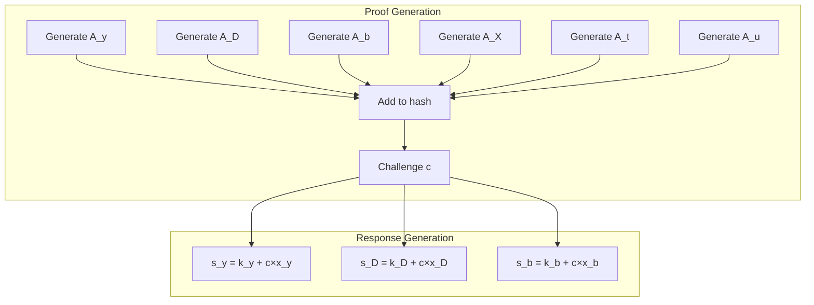
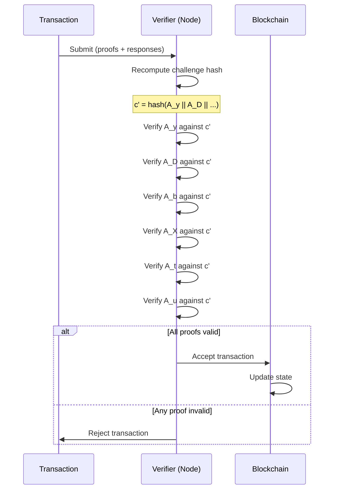

import { Callout } from 'nextra/components'
import { Tabs } from 'nextra/components'

# Transaction Proofs: The Six Sigma System

<Callout type="success" emoji="🔐">
**Core Principle:** Six interconnected proofs bound by a cryptographic hash. If you fake one proof, the hash changes, which invalidates all other proofs. This creates an all-or-nothing security model.
</Callout>

## What Problem Do Transaction Proofs Solve?

**The Challenge:**
```
DERO needs to verify:
  ✓ Sender owns the funds (has private key)
  ✓ Balance update is mathematically correct
  ✓ Amount is valid (not negative, not impossible)
  ✓ Transaction is bound to sender's secret key (key image)
  ✓ All protocol constraints satisfied
  
But WITHOUT revealing:
  ✗ The sender's identity
  ✗ The actual amounts
  ✗ The balances
```

**The Solution: Six Sigma Proofs**
- ✅ Each proof validates one aspect
- ✅ All proofs bound together cryptographically
- ✅ All-or-nothing cryptographic binding — faking one breaks all
- ✅ Zero-knowledge (reveals nothing)

---

## The Six Proofs


### Proof Details

| Proof | What It Validates | Why It's Needed |
|-------|------------------|-----------------|
| **A_y** | Sender possesses private key | Prevents unauthorized spending |
| **A_D** | Encrypted balance update is correct | Ensures math is right |
| **A_b** | Balance commitment is valid | Binding and hiding properties |
| **A_X** | Additional protocol constraints | Protocol-specific rules |
| **A_t** | Combined 128-bit value with 64-bit bounds | Prevents negative/overflow |
| **A_u** | Key image (linking tag) is correctly derived | Binds transaction to sender's secret key |

---

## How They're Bound Together

### The Challenge Hash

**From Source Code** (`cryptography/crypto/proof_verify.go:410-425`):

```go
// All six sigma proof components contribute to the challenge hash
var input []byte
input = append(input, ConvertBigIntToByte(x)...)
input = append(input, sigmasupport.A_y.Marshal()...)
input = append(input, sigmasupport.A_D.Marshal()...)
input = append(input, sigmasupport.A_b.Marshal()...)
input = append(input, sigmasupport.A_X.Marshal()...)
input = append(input, sigmasupport.A_t.Marshal()...)
input = append(input, sigmasupport.A_u.Marshal()...)

// Challenge 'c' must match - if any component was tampered, this fails
if reducedhash(input).Text(16) != proof.c.Text(16) {
    Logger.V(1).Info("C calculation failed")
    return false
}
```

**The Binding Effect:**



### Why This Prevents Forgery

<Tabs items={['The Attack', 'Why It Fails']}>
  <Tabs.Tab>
    **Attacker's Goal:**
    
    ```
    Attacker wants to:
      1. Fake A_t (range proof) to allow negative amount
      2. Keep other proofs valid
      
    Strategy:
      1. Create fake A_t' (allows -1000 DERO)
      2. Submit with real A_y, A_D, A_b, A_X, A_u
    ```
  </Tabs.Tab>
  
  <Tabs.Tab>
    **Why It Fails:**
    
    ```
    1. Fake A_t' is different from real A_t
    
    2. Challenge hash changes:
       c' = hash(A_y || A_D || A_b || A_X || A_t' || A_u)
       c' ≠ c (original)
       
    3. All responses were computed with c, not c':
       s_y = k_y + c×x_y  (computed with c)
       
    4. Verification uses c' but responses use c:
       verify(A_y, s_y, c') → FAILS
       
    5. ALL proofs fail verification, not just A_t
    ```
  </Tabs.Tab>
</Tabs>

**Key Insight:** The challenge hash creates a **circular dependency**. You need all proofs to compute the hash, but you need the hash to create valid responses. Changing any proof changes the hash, which invalidates all responses.

---

## Each Proof Explained

### A_y: Secret Key Proof

**Purpose:** Proves sender possesses the private key without revealing it.

**Mathematical Structure:**
```
Schnorr-style proof:
  - Commitment: A_y = k×G (random k)
  - Challenge: c (from hash)
  - Response: s_y = k + c×private_key

Verification:
  s_y×G = A_y + c×PublicKey
  
If sender doesn't have private_key:
  Cannot compute valid s_y
  Proof fails
```

**Source:** `cryptography/crypto/proof_generate.go` - A_y generation

### A_D: Balance Update Proof

**Purpose:** Proves the encrypted balance update is mathematically correct.

**What It Validates:**
```
Old encrypted balance: E(old_balance)
Transfer amount:       E(amount)
New encrypted balance: E(new_balance)

Proves: E(old_balance) - E(amount) = E(new_balance)
Without revealing: old_balance, amount, or new_balance
```

**Source:** `cryptography/crypto/proof_generate.go` - A_D generation

### A_b: Balance Commitment Proof

**Purpose:** Proves the balance commitment has proper binding and hiding properties.

**Properties Ensured:**
- **Binding:** Cannot change committed value later
- **Hiding:** Cannot determine committed value from commitment

**Mathematical Structure:**
```
Pedersen Commitment:
  C = amount×G + blinding×H

Properties:
  - Cannot find different (amount', blinding') with same C (binding)
  - Cannot determine amount from C without blinding (hiding)
```

**Source:** `cryptography/crypto/proof_generate.go` - A_b generation

### A_X: Constraint Proof

**Purpose:** Validates additional protocol-specific constraints.

**What It Covers:**
- Transaction format validity
- Protocol rule compliance
- Additional cryptographic constraints

**Source:** `cryptography/crypto/proof_generate.go` - A_X generation

### A_t: Range Proof

**Purpose:** Proves the combined 128-bit value is valid (lower 64 bits = transfer, upper 64 bits = remaining balance) without revealing either value.

**This is the bulletproof component:**
- Validates both transfer AND remaining balance simultaneously (low and high 64 bits of the packed 128-bit value)
- Logarithmic proof size (7 rounds for 128-bit range)
- By bulletproof soundness, no prover can construct a verifying proof for a committed value outside the proven range — the cryptographic basis for non-negative amounts

**[Detailed explanation →](/integrity/range-proof-integrity)**

**Source:** `cryptography/crypto/proof_generate.go:473-487`

### A_u: Key Image Proof

**Purpose:** Proves the transaction's linking tag (`proof.u`) was correctly derived from the sender's secret key.

**From Source Code** (`cryptography/crypto/proof_generate.go:1123-1136`):

```go
A_u := new(bn256.G1)
// ... build input from transaction-specific data ...
point := HashToPoint(HashtoNumber(input))
A_u = new(bn256.G1).ScalarMult(point, k_sk)
```

**What this does:**
- Computes a key image by scalar-multiplying a transaction-derived curve point by the secret key nonce
- The verifier recovers A_u from `proof.s_sk` and `proof.u` (`proof_verify.go:399-400`)
- Binds the proof to a specific (hidden) ring member without revealing which one

> **Note on naming:** DERO uses an account model, not UTXO. There are no "outputs" to mark as spent. The A_u proof serves as a key image / linking tag that cryptographically ties the transaction to the sender's secret key within the ring signature framework.

---

## Verification Flow



**Verification flow** (see `cryptography/crypto/proof_verify.go`):

The `Verify()` function performs all checks in sequence. The key checkpoints are:

1. **Overflow check** (`line 108-110`) -- Reject if fees overflow
2. **Parity check** (`line 136-141`) -- Verify the secret parity is well-formed
3. **B^w × A recovery** (`line 177-179`) -- Verify polynomial commitment structure
4. **Challenge hash** (`line 410-425`) -- Recompute `c` from all six sigma components and compare to `proof.c`
5. **Inner product** (`line 457-459`) -- `proof.ip.Verify(hPrimes, u_x, P, o, gparams)`

If any checkpoint returns `false`, the entire transaction is rejected. See [Proof Verification Flow](/integrity/proof-verification-flow) for the full walkthrough.

---

## Security Analysis

### Attack Resistance

| Attack | Why It Fails |
|--------|-------------|
| **Forge single proof** | Changes hash → all proofs invalid |
| **Replay old transaction** | A_u key image is bound to Roothash (tree state) → stale proof fails; nonce/height prevents reuse |
| **Spend without key** | A_y requires private key → fails |
| **Negative amount** | A_t range proof → fails |
| **Incorrect balance** | A_D validates math → fails |

### Cryptographic Assumptions

**Security relies on:**
1. **Elliptic Curve Discrete Logarithm Problem (ECDLP)** on the bn256 (Barreto-Naehrig) curve -- a pairing-friendly curve also used by Ethereum's precompiles and early Zcash
2. **Random Oracle Model** -- Hash functions behave as random oracles
3. **Decisional Diffie-Hellman (DDH)** -- Underpins the ElGamal encryption used for balance confidentiality

### Why bn256?

DERO's proof system requires **pairing operations** — a math operation that pairing-friendly curves like bn256 support and non-pairing curves like secp256k1 do not. This is why DERO and Bitcoin use different curves: they need different capabilities. Bitcoin can do its job without pairings; DERO's bulletproofs cannot.

The trade-off: pairing-friendly curves have lower effective security at the same parameter size. For bn256 specifically, analysis of the extended Tower Number Field Sieve (Menezes 2016; NCC Group 2017 reassessment) places effective security at **~100 bits** against discrete-log attacks on the pairing-target field, rather than the ~128 bits originally targeted.

**What this means in practice:** ~100 bits remains computationally infeasible for any foreseeable adversary, including well-resourced nation-states. The same analysis applies to every production pairing-based system — Ethereum's bn256 precompiles (EIP-196/197), early Zcash, and others. bn256 has not been broken and is not approaching practical attack. But it is not 128, and these docs name that honestly rather than imply parity with secp256k1.


**Breaking DERO's proofs would require:**
- Solving ECDLP on bn256 (no known efficient algorithm exists for these parameters)
- Or finding a flaw in the underlying constructions (bulletproofs and sigma protocols, published cryptographic literature; DERO's implementation is open for independent review)

---

## Key Takeaways

### What Transaction Proofs Provide

| Feature | Benefit |
|---------|---------|
| **🔐 All-or-nothing security** | No partial fakes — challenge hash binds all six |
| **🔒 Zero-knowledge** | Reveals nothing about transaction |
| **⚡ Efficient verification** | Logarithmic proof size (7 rounds for 128-bit range) enables fast verification |
| **📐 Mathematical guarantee** | Based on proven cryptography |

### The Circular Dependency

```
┌─────────────────────────────────────────────────┐
│                                                 │
│  Proofs ──────► Hash ──────► Responses          │
│    ▲                            │               │
│    │                            │               │
│    └────────────────────────────┘               │
│         (circular dependency)                   │
│                                                 │
│  Cannot create valid responses without          │
│  knowing what the final hash will be.           │
│  Cannot know final hash without all proofs.     │
│  Cannot change proofs without breaking hash.    │
│                                                 │
└─────────────────────────────────────────────────┘
```

<Callout type="info" emoji="🔗">
**The Key Insight:** All six proofs are cryptographically entangled. This isn't just "checking six things" - it's a single interconnected proof system where the validity of each component depends on all others.
</Callout>

---

## Related Pages

**Security Suite:**
- [Range Proof Integrity](/integrity/range-proof-integrity) - Deep dive into A_t
- [Proof Verification Flow](/integrity/proof-verification-flow) - End-to-end flow
- [Negative Transfer Protection](/integrity/negative-transfer-protection) - How A_t prevents negatives

**Privacy Suite:**
- [Bulletproofs](/privacy/bulletproofs) - Zero-knowledge range proofs
- [Homomorphic Encryption](/privacy/homomorphic-encryption) - Encrypted balance operations
