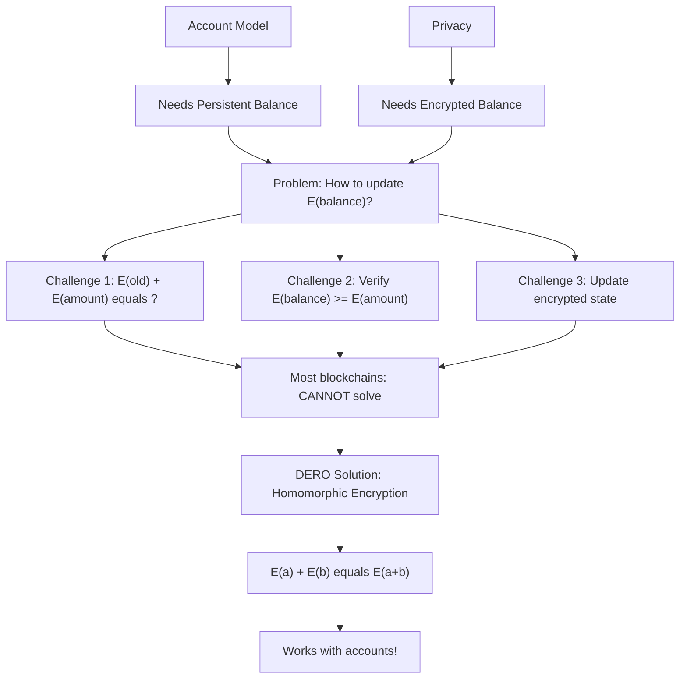
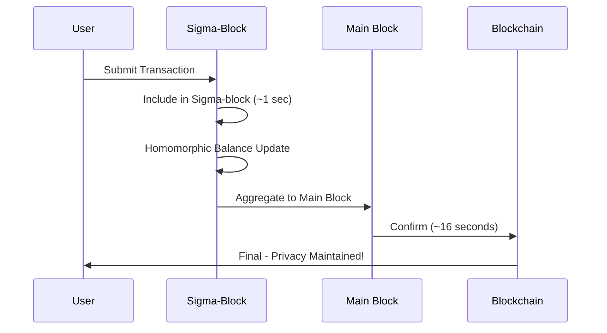
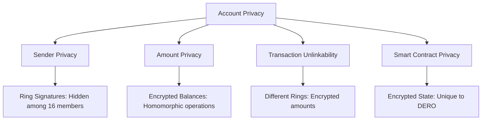

import { Callout } from 'nextra/components'
import { Tabs } from 'nextra/components'

# Account-Based Privacy: The Unprecedented Combination

<Callout type="success" emoji="🎯">
**Architectural Breakthrough:** DERO achieves something no other blockchain has accomplished: combining an account-based model with strong privacy guarantees through homomorphic encryption. This enables instant transactions, simple balance tracking, and private smart contracts - all with encrypted amounts.
</Callout>

## What Problem Does This Solve?

**The Challenge:**
```
Blockchain needs:
  ✓ Account simplicity
  ✓ Privacy guarantees
  ✓ Smart contract support
  ✓ Instant transactions
  
But historically:
  ❌ Accounts = No privacy
  ❌ Privacy = Output-based only
  ❌ Can't have both... or can we?
```

**DERO's Solution:**
- ✅ Account-based model (simple, fast)
- ✅ Homomorphic encryption (privacy)
- ✅ Private smart contracts (unique to DERO)
- ✅ Best of both worlds

---

## The Account Model Advantage

### How DERO's Accounts Work

**Account Structure:**
- Balance is a single value that can be directly updated
- Direct query - no need to sum outputs
- Simple add/subtract operations
- Natural fit for smart contracts
- Lower complexity than output-based systems

---

## Why Account + Privacy Is Hard

### The Challenge DERO Solved

**The Impossible Problem:**



**Why This Was Thought Impossible:**

<Tabs items={['The Challenge', "DERO's Solution"]}>
  <Tabs.Tab>
    **The Account Privacy Challenge**
    
    ```
    For accounts with privacy:
      1. Balance must be encrypted
      2. Operations must work on encrypted values
      3. Network must verify without decrypting
      4. Updates must be instant
      5. Must support smart contracts
    
    The problem:
      ❌ How to add E(old) + E(new)?
      ❌ How to verify E(balance) >= E(amount)?
      ❌ How to update encrypted state?
      ❌ How to do this efficiently?
    
    Most blockchains: CANNOT solve this
    ```
  </Tabs.Tab>
  
  <Tabs.Tab>
    **DERO's Solution: Homomorphic Encryption**
    
    ```
    ElGamal homomorphic encryption:
      1. Encrypt balances: E(balance)
      2. Operations work: E(a) + E(b) = E(a+b)
      3. Verification via proofs (no decryption)
      4. Instant updates (account model benefit)
      5. Smart contracts can use encrypted state
    
    Enables:
      ✓ Account simplicity
      ✓ Amount privacy
      ✓ Balance privacy
      ✓ Smart contract privacy
      ✓ Instant confirmations
      ✓ Simple wallet sync
    
    This combination was unprecedented!
    ```
  </Tabs.Tab>
</Tabs>

---

## Three Key Advantages

### 1. Instant Transaction Confirmation

**DERO's Flow:** Submit to Sigma-block (~1 sec) to Account update to Main block (~16 sec) = **~16 seconds total**

| Aspect | DERO Account Model |
|--------|-------------------|
| **Confirmation** | ~16 seconds |
| **Validation** | Simple account update |
| **Block Structure** | Sigma-blocks + main blocks |
| **Finality** | Same-block finality |

**Advantage:** Fast confirmation with account model + privacy ✅

---

### 2. Simple Balance Checking

**DERO's Flow:** Query encrypted balance to Decrypt with private key = **Seconds**

| Step | DERO Account Model |
|------|-------------------|
| **1** | Query encrypted balance |
| **2** | Decrypt with private key |
| **3** | See balance instantly |
| **Time** | Seconds |
| **Data Required** | One RPC call |

**Advantage:** Instant balance checks without full sync ✅

---

### 3. Smart Contract Compatibility

**DERO Account Model:** Natural state storage, direct balance updates, encrypted state works

| Feature | DERO Account Model |
|---------|-------------------|
| **State Storage** | ✅ Natural |
| **Balance Updates** | ✅ Direct |
| **Logic Complexity** | ✅ Full support |
| **Encrypted State** | ✅ Works with DERO |

**Advantage:** Rich smart contracts WITH privacy ✅

---

## Technical Implementation

### How DERO Manages Encrypted Accounts

**Account Structure:**
- Address: `dero1qy...`
- Encrypted balances stored in Graviton DB
- Key: Address, Value: `E(amount)`
- Supports multiple assets: DERO, tokens, etc.

**Balance Updates:**

**From Source Code** (`blockchain/transaction_execute.go`):

```go
// Balance update process
func UpdateBalance(address, amount):
    old_encrypted := LoadBalance(address)  // E(old)
    new_encrypted := HomomorphicAdd(old_encrypted, amount)  // E(old + amount)
    StoreBalance(address, new_encrypted)  // Save E(new)
    
// Network never decrypts old, amount, or new!
```

---

## Instant Finality: Sigma-Blocks

### How DERO Achieves Fast Confirmation

**Sigma-Block Architecture:**



**Timeline:**

| Step | Time | What Happens |
|------|------|--------------|
| **1. Submit** | 0s | User submits transaction |
| **2. Sigma-Block** | ~1s | Included in micro-block |
| **3. Update** | ~1s | Homomorphic balance update |
| **4. Main Block** | ~16s | Aggregated and confirmed |
| **5. Final** | ~16s | Transaction final |

**Why This Works:**
- Single account validation (simple)
- Easy parallelization
- Fast confirmation
- Privacy maintained throughout

**DERO combines:** Speed of accounts + Privacy of encryption ✅

---

## Wallet Synchronization

### Lightweight Clients Possible

**DERO Account-Based:** Query encrypted balance to Decrypt with private key = **Seconds** (optional history sync)

| Aspect | DERO Wallet |
|--------|-------------|
| **Required** | Query encrypted balance |
| **Time** | Seconds |
| **Data** | Minimal (one query) |
| **Optional** | Transaction history sync |

**Advantage:** Lightweight wallets with full privacy ✅

---

## Privacy Guarantees

### What Account Model Doesn't Compromise



| Privacy Aspect | DERO Account Privacy |
|----------------|---------------------|
| **Sender** | ✅ Ring signatures (hidden among 16 members) |
| **Amount** | ✅ Encrypted (homomorphic operations) |
| **Unlinkability** | ✅ Different rings per transaction |
| **Smart Contracts** | ✅ Encrypted state (unique!) |

**Result:** Complete privacy guarantees, plus smart contract privacy!

---

## Why DERO's Approach Works

### The Account Model Advantage

| Feature | DERO Has |
|---------|----------|
| **Privacy** | ✅ Built-in (homomorphic encryption) |
| **Speed** | ✅ Fast (~16s confirmation) |
| **Smart Contracts** | ✅ Natural support with privacy |
| **Balance Check** | ✅ Instant (no sync needed) |
| **Complexity** | ✅ Low (simple account model) |
| **Wallet Sync** | ✅ Seconds (lightweight clients) |

**DERO proved:** You CAN have account simplicity AND privacy!

### What Makes DERO Unique

| Aspect | DERO |
|--------|------|
| **Privacy** | ✅ Built-in from architecture |
| **Design** | ✅ Designed for encryption |
| **Homomorphic** | ✅ Fundamental to the system |
| **Status** | ✅ Proven in production |

---

## Key Takeaways

### What Account-Based Privacy Provides

| Feature | Benefit | Impact |
|---------|---------|--------|
| **⚡ Instant Transactions** | ~16 second confirmation | Fast finality |
| **🔍 Instant Balance** | Query encrypted balance | No sync needed |
| **🔐 Smart Contract Privacy** | Encrypted state | Unique to DERO |
| **📦 Simple Wallets** | Lightweight clients | Easy adoption |
| **🎯 Account Simplicity** | One balance per account | Lower complexity |
| **✅ Complete Privacy** | All guarantees maintained | Best of both |

### What It Enables

- ✅ **Private Smart Contracts** - Unique to DERO
- ✅ **Instant Balance Queries** - No blockchain scanning
- ✅ **Lightweight Wallets** - Seconds, not hours
- ✅ **Fast Confirmations** - ~16 seconds
- ✅ **Account Simplicity** - Lower complexity
- ✅ **Proven in Production** - Working system, not theoretical

<Callout type="info" emoji="🎯">
  **Innovation:** DERO demonstrated that privacy with accounts was possible through homomorphic encryption. Accounts can be just as private - while being simpler and faster.
</Callout>

---

## Related Pages

**Privacy Suite:**
- [Ring Signatures](/privacy/ring-signatures) - Transaction anonymity
- [Homomorphic Encryption](/privacy/homomorphic-encryption) - Balance privacy
- [Transaction Privacy](/privacy/transaction-privacy) - Complete privacy model

**Technical:**
- [DERO Wallets](/basics/wallets) - Stealth address generation
- [Wallet RPC API](/rpc-api/wallet-rpc-api) - Integrated addresses

**Understanding DERO:**
- [DERO Tokens](/basics/tokens) - Account-based asset model
- [Privacy Features](/privacy/index) - Full privacy suite overview
