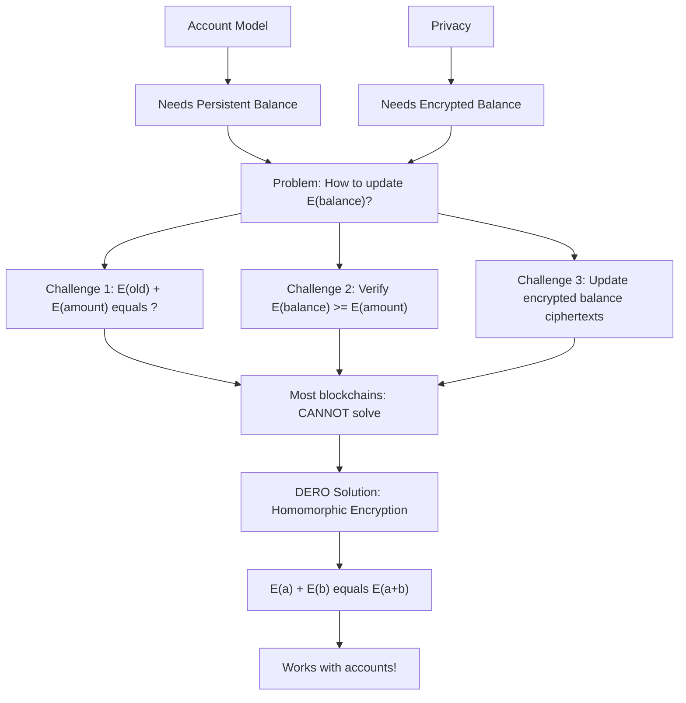
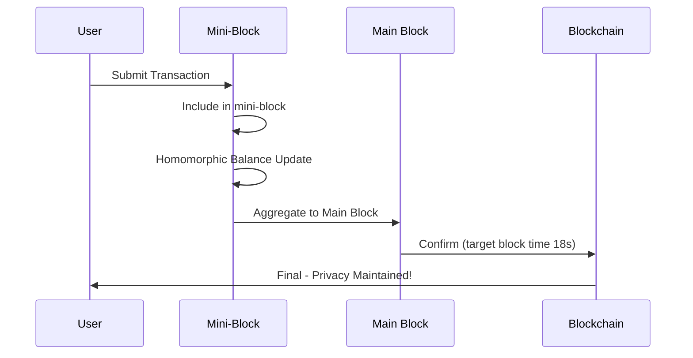
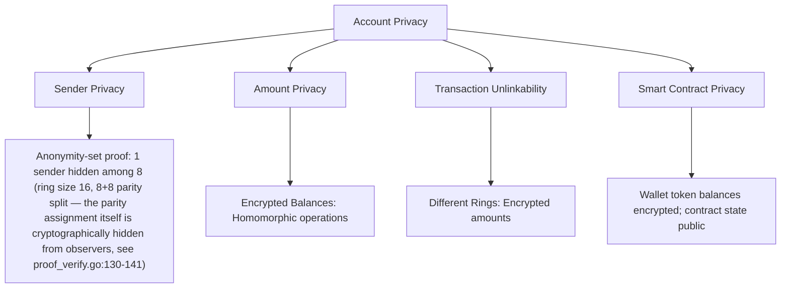

import { Callout } from 'nextra/components'
import { Tabs } from 'nextra/components'

# Account-Based Privacy: The Unprecedented Combination

<Callout type="success" emoji="🎯">
**Architectural Breakthrough:** DERO achieves something no other blockchain has accomplished: combining an account-based model with strong privacy guarantees through homomorphic encryption. This enables direct account updates, simple balance tracking, and private smart contracts - all with encrypted amounts.
</Callout>

## What Problem Does This Solve?

**The Challenge:**
```
Blockchain needs:
  ✓ Account simplicity
  ✓ Privacy guarantees
  ✓ Smart contract support
  ✓ Direct account updates
  
But historically:
  ❌ Accounts = No privacy
  ❌ Privacy = Output-based only
  ❌ Can't have both... or can we?
```

**DERO's Solution:**
- ✅ Account-based model (simple, fast)
- ✅ Homomorphic encryption (privacy)
- ✅ Private smart contracts (unique to DERO)
- ✅ Best of both worlds

---

## The Account Model Advantage

### How DERO's Accounts Work

**Account Structure:**
- Balance is a single value that can be directly updated
- Direct query - no need to sum outputs
- Simple add/subtract operations
- Natural fit for smart contracts
- Lower complexity than output-based systems

---

## Why Account + Privacy Is Hard

### The Challenge DERO Solved

**The Impossible Problem:**


```mermaid
graph TB
    A["Account Model"] --> B["Needs Persistent Balance"]
    C["Privacy"] --> D["Needs Encrypted Balance"]
    
    B --> E["Problem: How to update E(balance)?"]
    D --> E
    
    E --> F["Challenge 1: E(old) + E(amount) equals ?"]
    E --> G["Challenge 2: Verify E(balance) >= E(amount)"]
    E --> H["Challenge 3: Update encrypted balance ciphertexts"]
    
    F --> I["Most blockchains: CANNOT solve"]
    G --> I
    H --> I
    
    I --> J["DERO Solution: Homomorphic Encryption"]
    J --> K["E(a) + E(b) equals E(a+b)"]
    K --> L["Works with accounts!"]
```

**Why This Was Thought Impossible:**

<Tabs items={['The Challenge', "DERO's Solution"]}>
  <Tabs.Tab>
    **The Account Privacy Challenge**
    
    ```
    For accounts with privacy:
      1. Balance must be encrypted
      2. Operations must work on encrypted values
      3. Network must verify without decrypting
      4. Updates must be direct
      5. Must support smart contracts
    
    The problem:
      ❌ How to add E(old) + E(new)?
      ❌ How to verify E(balance) >= E(amount)?
      ❌ How to update encrypted balance ciphertexts?
      ❌ How to do this efficiently?
    
    Most blockchains: CANNOT solve this
    ```
  </Tabs.Tab>
  
  <Tabs.Tab>
    **DERO's Solution: Homomorphic Encryption**
    
    ```
    ElGamal homomorphic encryption:
      1. Encrypt balances: E(balance)
      2. Operations work: E(a) + E(b) = E(a+b)
      3. Verification via proofs (no decryption)
      4. Direct updates (account model benefit)
      5. Smart contracts can move encrypted wallet balances homomorphically
    
    Enables:
      ✓ Account simplicity
      ✓ Amount privacy
      ✓ Balance privacy
      ✓ Smart contract privacy
      ✓ Target block-time confirmations
      ✓ Simple wallet sync
    
    This combination was unprecedented!
    ```
  </Tabs.Tab>
</Tabs>

---

## Three Key Advantages

### 1. Transaction Confirmation (Target Block Time)

**DERO's Flow:** Submit to mini-block system → account update → main block target time (BLOCK_TIME = 18s)

| Aspect | DERO Account Model |
|--------|-------------------|
| **Confirmation** | Target block time: 18 seconds |
| **Validation** | Simple account update |
| **Block Structure** | Mini-blocks + main blocks |
| **Finality** | Same-block finality |

**Advantage:** Fast confirmation with account model + privacy ✅

<Callout type="info" emoji="⏱️">
  **Source:** Target block time is defined by `config/config.go:34` (`const BLOCK_TIME = uint64(18)`).
</Callout>

---

### 2. Simple Balance Checking

**DERO's Flow:** Query encrypted balance → decrypt with private key (no chain scanning)

| Step | DERO Account Model |
|------|-------------------|
| **1** | Query encrypted balance |
| **2** | Decrypt with private key |
| **3** | See balance locally |
| **Time** | No chain scanning required |
| **Data Required** | One RPC call |

**Advantage:** Balance checks without full sync ✅

---

### 3. Smart Contract Compatibility

**DERO Account Model:** Natural state storage, direct balance updates, contracts can move encrypted wallet balances homomorphically without seeing the amount

| Feature | DERO Account Model |
|---------|-------------------|
| **State Storage** | ✅ Natural (`STORE`/`LOAD` to graviton tree, plaintext) |
| **Balance Updates** | ✅ Direct (homomorphic on encrypted wallet balances) |
| **Logic Complexity** | ✅ Full support |
| **Encrypted Wallet Token Balances** | ✅ Contract can transfer without decrypting the amount |

**Advantage:** Rich smart contracts whose **token movements** preserve user privacy (contract logic and state itself are public).

---

## Technical Implementation

### How DERO Manages Encrypted Accounts

**Account Structure:**
- Address: `dero1qy...`
- Encrypted balances stored in Graviton DB
- Key: the compressed public key (33 bytes — `tx.MinerAddress[:]` or the pubkey decoded from the bech32 address); the `dero1qy...` bech32 form is only the display encoding. Value: `E(amount)` (ElGamal `(Left, Right)` pair)
- Supports multiple assets: DERO, tokens, etc.

**Balance Updates:**

**Simplified pseudocode** (`blockchain/transaction_execute.go`):

```text
// Conceptual flow — see source for actual implementation
func UpdateBalance(address, amount):
    old_encrypted := LoadBalance(address)  // E(old)
    new_encrypted := HomomorphicAdd(old_encrypted, amount)  // E(old + amount)
    StoreBalance(address, new_encrypted)  // Save E(new)
    
// Network never decrypts old, amount, or new!
```

---

## Mini-Blocks and Finality

### How DERO Achieves Fast Confirmation

**Mini-Block Architecture:**


```mermaid
sequenceDiagram
    participant U as User
    participant S as Mini-Block
    participant M as Main Block
    participant BC as Blockchain
    
    U->>S: Submit Transaction
    S->>S: Include in mini-block
    S->>S: Homomorphic Balance Update
    S->>M: Aggregate to Main Block
    M->>BC: Confirm (target block time 18s)
    BC->>U: Final - Privacy Maintained!
```

**Timeline:**

| Step | Order | What Happens |
|------|-------|--------------|
| **1. Submit** | 1 | User submits transaction |
| **2. Mini-Block** | 2 | Included in mini-block |
| **3. Update** | 3 | Homomorphic balance update |
| **4. Main Block** | 4 | Aggregated and confirmed |
| **5. Final** | 5 | Transaction final |

**Why This Works:**
- Single account validation (simple)
- Easy parallelization
- Fast confirmation
- Privacy maintained throughout

**DERO combines:** Speed of accounts + Privacy of encryption ✅

---

## Wallet Synchronization

### Lightweight Clients Possible

**DERO Account-Based:** Query encrypted balance to Decrypt with private key = **Seconds** (optional history sync)

| Aspect | DERO Wallet |
|--------|-------------|
| **Required** | Query encrypted balance |
| **Time** | Seconds |
| **Data** | Minimal (one query) |
| **Optional** | Transaction history sync |

**Advantage:** Lightweight wallets with full privacy ✅

---

## Privacy Guarantees

<Callout type="info" emoji="📖">
**Naming note:** "Ring signature" is the user-facing name DERO uses for what the source actually implements as an Anonymous Zether-style anonymity-set ZK proof (see `cryptography/crypto/proof_generate.go` and `proof_verify.go`). The user-facing term is colloquial; the construction is not a classical (Schnorr/LSAG/MLSAG) ring signature.
</Callout>

### What Account Model Doesn't Compromise


```mermaid
graph TB
    P["Account Privacy"] --> S["Sender Privacy"]
    P --> A["Amount Privacy"]
    P --> U["Transaction Unlinkability"]
    P --> SC["Smart Contract Privacy"]
    
    S --> S1["Anonymity-set proof: 1 sender hidden among 8 (ring size 16, 8+8 parity split — the parity assignment itself is cryptographically hidden from observers, see proof_verify.go:130-141)"]
    A --> A1["Encrypted Balances: Homomorphic operations"]
    U --> U1["Different Rings: Encrypted amounts"]
    SC --> SC1["Wallet token balances encrypted; contract state public"]
```

| Privacy Aspect | DERO Account Privacy |
|----------------|---------------------|
| **Sender** | ✅ Anonymity-set proof (hidden among 8 potential senders at ring size 16) |
| **Amount** | ✅ Encrypted (homomorphic operations) |
| **Unlinkability** | ✅ Different rings per transaction |
| **Smart Contracts** | ⚠️ Contract code and `STORE`/`LOAD` state are **public**; what's private is the **token balances in user wallets** that a contract can move homomorphically without seeing the amount (see [Private Smart Contracts](/privacy/private-smart-contracts)) |

**Result:** Strong privacy guarantees on transfers and balances; contract logic is openly auditable.

### What a verified DERO-PROOF reveals

The privacy guarantees above are the **defaults** — what the chain hides from every observer. DERO also gives the sender a per-transaction escape hatch: the **DERO-PROOF** (a.k.a. *DERO proof* or *transaction proof* elsewhere in these docs — same thing, single canonical wire-format string). By sharing the proof string for one specific transaction, the sender lets a verifier confirm what was sent to whom — on-chain equivalent of handing someone a receipt.

A verified DERO-PROOF on the public explorer surfaces exactly three fields:

| Field | What it reveals |
|---|---|
| **Receiver address** | The `dero1q...` that was paid. **The sender remains hidden in the ring.** |
| **Amount** | Exact DERO transferred, in standard units |
| **Memo / decoded payload** | The optional comment field from the transfer, if one was attached |

The proof scheme is sender-driven: the sender holds the tx key, runs the proof tool, and hands the resulting string to whoever needs to verify the payment. The verifier resolves it against the on-chain transaction; the chain confirms that the named receiver was paid the named amount.

**Source:** `proof/proof.go` (`Prove()` returns `receivers`, `amounts`, `payload_raw`, `payload_decoded`); `cmd/explorer/explorerlib/explorerlib.go` wires the result into the explorer UI; `cmd/explorer/explorerlib/templates/tx.tmpl` renders the verified-proof block as `{receiver} Received {amount} DERO`.

Note: scope is one transaction at a time. A proof for tx-A reveals nothing about tx-B, even between the same parties.

---

## Why DERO's Approach Works

### The Account Model Advantage

| Feature | DERO Has |
|---------|----------|
| **Privacy** | ✅ Built-in (homomorphic encryption) |
| **Speed** | ✅ Target block time: 18 seconds |
| **Smart Contracts** | ✅ Natural support with privacy |
| **Balance Check** | ✅ No chain scanning required |
| **Complexity** | ✅ Low (simple account model) |
| **Wallet Sync** | ✅ Lightweight clients supported |

**DERO proved:** You CAN have account simplicity AND privacy!

### What Makes DERO Unique

| Aspect | DERO |
|--------|------|
| **Privacy** | ✅ Built-in from architecture |
| **Design** | ✅ Designed for encryption |
| **Homomorphic** | ✅ Fundamental to the system |
| **Status** | ✅ Proven in production |

---

## Key Takeaways

### What Account-Based Privacy Provides

| Feature | Benefit | Impact |
|---------|---------|--------|
| **⚡ Target Block Time** | 18 seconds | Consensus target |
| **🔍 Encrypted Balance** | Query encrypted balance | No sync needed |
| **🔐 Smart Contract Privacy** | Contract state is public; wallet token balances stay encrypted across SC transfers | Unique to DERO |
| **📦 Simple Wallets** | Lightweight clients | Easy adoption |
| **🎯 Account Simplicity** | One balance per account | Lower complexity |
| **✅ Complete Privacy** | All guarantees maintained | Best of both |

### What It Enables

- ✅ **Private Smart Contracts** - Unique to DERO
- ✅ **Encrypted Balance Queries** - No blockchain scanning
- ✅ **Lightweight Wallets** - No chain scanning required
- ✅ **Target Block Time** - 18 seconds
- ✅ **Account Simplicity** - Lower complexity
- ✅ **Proven in Production** - Working system, not theoretical

<Callout type="info" emoji="🎯">
  **Innovation:** DERO demonstrated that privacy with accounts was possible through homomorphic encryption. Accounts can be just as private - while being simpler and faster.
</Callout>

---

## Related Pages

**Privacy Suite:**
- [Ring Signatures](/privacy/ring-signatures) - Transaction anonymity
- [Homomorphic Encryption](/privacy/homomorphic-encryption) - Balance privacy
- [Transaction Privacy](/privacy/transaction-privacy) - Complete privacy model

**Technical:**
- [DERO Wallets](/basics/wallets) - Stealth address generation
- [Wallet RPC API](/rpc-api/wallet-rpc-api) - Integrated addresses

**Understanding DERO:**
- [DERO Tokens](/basics/tokens) - Account-based asset model
- [Privacy Features](/privacy/index) - Full privacy suite overview
