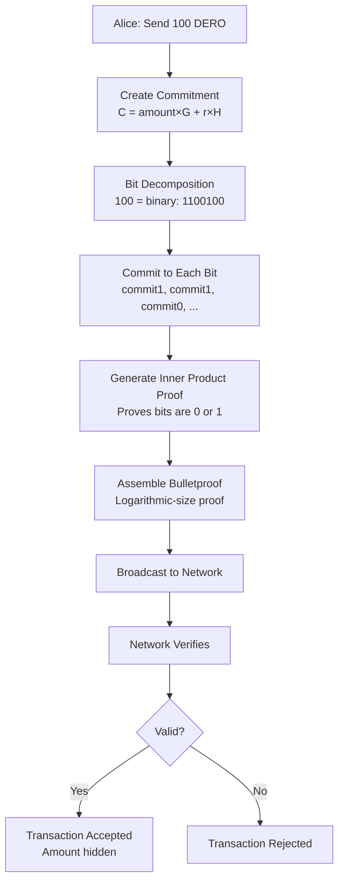
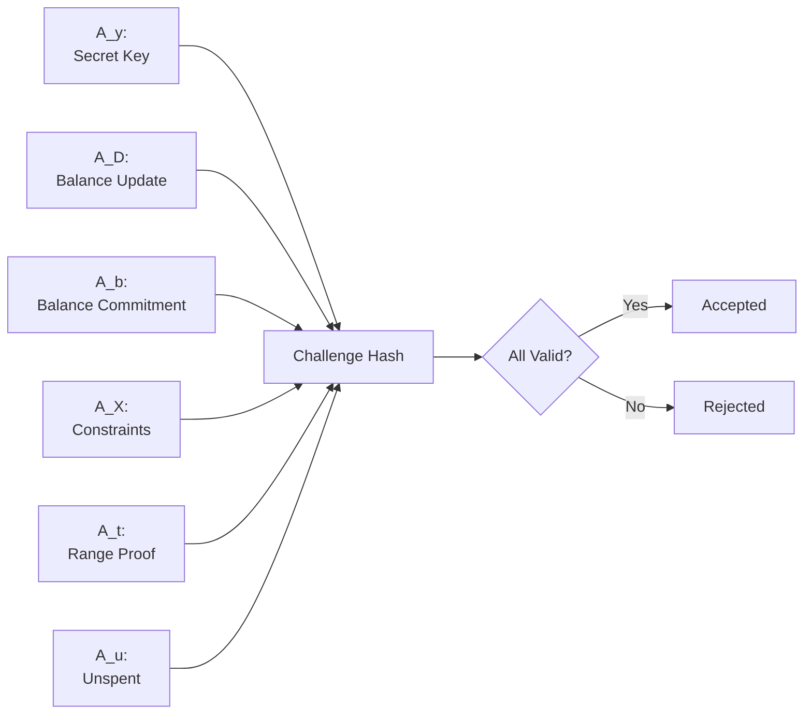
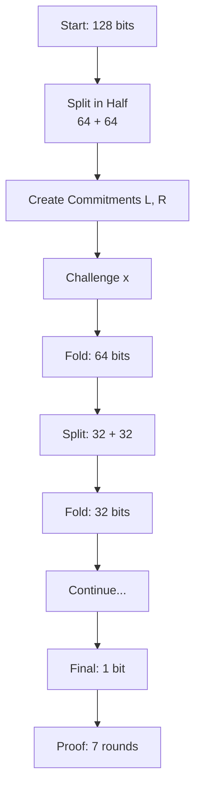
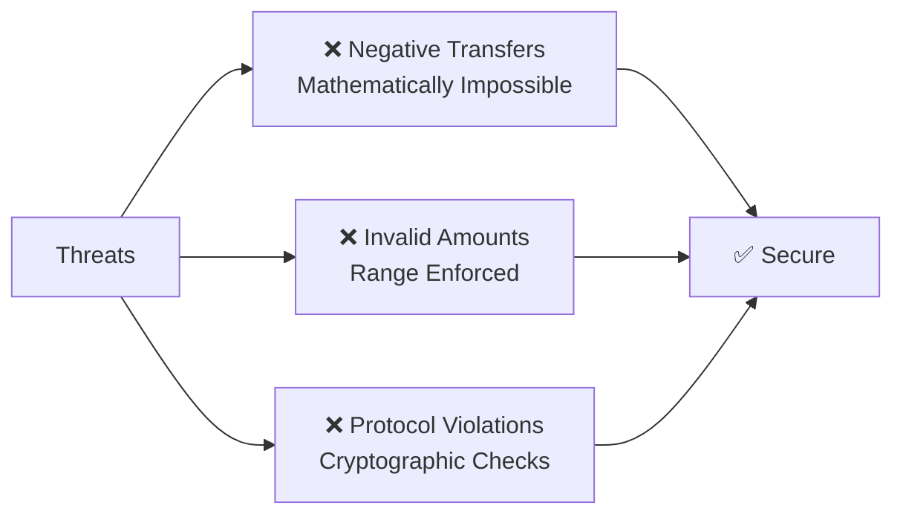

import { Callout } from 'nextra/components'
import { Tabs } from 'nextra/components'

# Bulletproofs: Zero-Knowledge Range Proofs

<Callout type="success" emoji="🔒">
**What bulletproofs prove:** Every transfer carries a zero-knowledge proof that the amount is valid **without revealing what it is**. DERO uses a 128-bit combined range proof that binds both the transfer amount and the sender's remaining balance to non-negative 64-bit ranges in a single proof.
</Callout>

## What Problem Do Bulletproofs Solve?

**The Challenge:**
```
DERO needs to verify:
  ✓ Amount is positive (not negative)
  ✓ Amount is reasonable (not 999 trillion)
  ✓ Sender has enough balance
  
But WITHOUT revealing:
  ✗ The actual amount
  ✗ The sender's balance
  ✗ Any private information
```

**The Solution: Bulletproofs**
- ✅ Prove combined 128-bit value is valid (transfer + remaining balance, each 64-bit)
- ✅ Never reveal the amount value
- ✅ Logarithmic-size proof (7 rounds for 128-bit range)
- ✅ No trusted setup needed

---

## How It Works (Simple Analogy)

**The Bouncer Problem:**

<Tabs items={['Old Way', 'Bulletproof Way']}>
  <Tabs.Tab>
    **Show ID (Reveals Everything)**
    
    ```
    You: "I'm 25 years old"
    Bouncer: "Show me your ID"
    
    Bouncer learns:
      ✓ You're over 21
      ✓ Your exact age (25)
      ✓ Your address
      ✓ Your full name
      ✓ Your photo
      ✓ Everything else on the ID

    Disclosure: everything on the ID is exposed
    ```
  </Tabs.Tab>
  
  <Tabs.Tab>
    **Bulletproof (Reveals Nothing)**
    
    ```
    You: "I'm over 21"
    Bouncer: "Prove it mathematically"
    
    Bouncer learns:
      ✓ You're over 21
      ✗ Your exact age
      ✗ Your address
      ✗ Your name
      ✗ Anything else on the ID

    Disclosure: only the assertion "over 21" is conveyed
    ```
  </Tabs.Tab>
</Tabs>

**For DERO:**
- Bulletproof proves: "Combined 128-bit value is valid (transfer amount in lower 64 bits, remaining balance in upper 64 bits)"
- Network learns: ✅ Both values are valid (in [0, 2^64))
- Network learns: ❌ What either value actually is

---

## The Proof Flow


```mermaid
flowchart TD
    A["Alice: Send 100 DERO"] --> B["Create Commitment<br/>C = amount×G + r×H"]
    B --> C["Bit Decomposition<br/>100 = binary: 1100100"]
    C --> D["Commit to Each Bit<br/>commit1, commit1, commit0, ..."]
    D --> E["Generate Inner Product Proof<br/>Proves bits are 0 or 1"]
    E --> F["Assemble Bulletproof<br/>Logarithmic-size proof"]
    F --> G["Broadcast to Network"]
    G --> H["Network Verifies"]
    H --> I{Valid?}
    I -->|Yes| J["Transaction Accepted<br/>Amount hidden"]
    I -->|No| K["Transaction Rejected"]
```

**What Network Sees:**
- ✅ Commitment (encrypted amount)
- ✅ Bulletproof (logarithmic-size proof)
- ✅ Proof is valid
- ❌ Actual amount (hidden)

---

## Protection Against Negative Transfers

The guarantee is cryptographic, not a string-parsing quirk: by the **soundness** of the Bulletproof range proof, no prover can construct a proof that verifies for a committed value outside the proven range. Combined with DERO's homomorphic value conservation, value cannot be created from nothing.

DERO packs **two** quantities into a single 128-bit value and range-proves them together — the transfer amount in the low 64 bits and the sender's remaining balance in the high 64 bits — so one Bulletproof binds **both** to non-negative 64-bit ranges (`number = transfer + (balance << 64)`, `cryptography/crypto/proof_generate.go:471`).

A "negative" transfer is the `uint64` wraparound of a value near `2^64`. It fails the range proof from both directions:

| Attack framing | Why the range proof rejects it |
|---|---|
| Treat the wraparound as the **transfer amount** | A value near `2^64` lies outside `[0, 2^64)` — the low-64 range bound fails. |
| Treat it as **receiving** (so your own balance jumps) | The conservation proof forces a matching decrease; the sender's **remaining balance** goes negative → wraps → the high-64 range bound fails. |

The protection lives in **verification** (`cryptography/crypto/proof_verify.go`), not generation. The wallet builds the proof in `proof_generate.go`; an attacker controls their own wallet and could patch out any client-side check. The cryptographic guarantee comes from the verifier check that every node runs independently before accepting a block.

<Callout type="info" emoji="📐">
**Common misconception:** A claim circulates that Go's `BigInt.Text(2)` emitting a `'-'` for negative values "breaks the bit loop" in proof generation, and that this is what stops negative transfers. It does not — the loop is `if b == '1' { … } else { … }`, which silently treats a stray `'-'` as a `0` bit. And for any real transaction the packed 128-bit `number` is positive, so no `'-'` appears at all. The actual safeguard is verifier-side Bulletproof soundness. See [Negative Transfer Protection](/integrity/negative-transfer-protection) for the full derivation.
</Callout>

---

## The Six Sigma Proofs

DERO uses **six interconnected proofs** that all must pass:


```mermaid
graph LR
    A["A_y:<br/>Secret Key"] --> H["Challenge Hash"]
    B["A_D:<br/>Balance Update"] --> H
    C["A_b:<br/>Balance Commitment"] --> H
    D["A_X:<br/>Constraints"] --> H
    E["A_t:<br/>Range Proof"] --> H
    F["A_u:<br/>Unspent"] --> H
    
    H --> V{"All Valid?"}
    V -->|Yes| ACC["Accepted"]
    V -->|No| REJ["Rejected"]
```

| Proof | What It Validates | Security Level |
|-------|------------------|----------------|
| **A_y** | Sender has private key | 🔒 Cryptographically secure |
| **A_D** | Encrypted balance update correct | 🔒 Homomorphic validation |
| **A_b** | Balance commitment valid | 🔒 Binding & hiding |
| **A_X** | Additional protocol constraints | 🔒 Protocol-specific |
| **A_t** | Combined 128-bit value valid (transfer + balance) | 🔒 Range proof (bulletproof) |
| **A_u** | No double-spending | 🔒 Unspent validation |

**All Bound Together:**
```
Challenge hash (c) = hash(A_y || A_D || A_b || A_X || A_t || A_u || ...)

If ANY proof fails:
  → Challenge hash is different
  → Verification fails
  → Transaction rejected
```

**Source:** `cryptography/crypto/proof_verify.go` - Verifies all six sigma proofs + inner product

---

## Inner Product Proof (The Core Algorithm)

### Recursive Halving - How Logarithmic Scaling Works

**The Algorithm:**


```mermaid
graph TB
    A["Start: 128 bits"] --> B["Split in Half<br/>64 + 64"]
    B --> C["Create Commitments L, R"]
    C --> D["Challenge x"]
    D --> E["Fold: 64 bits"]
    E --> F["Split: 32 + 32"]
    F --> G["Fold: 32 bits"]
    G --> H["Continue..."]
    H --> I["Final: 1 bit"]
    I --> J["Proof: 7 rounds"]
```

**Iterations:**
- Start: 128 elements
- Iteration 1: 64 elements
- Iteration 2: 32 elements
- Iteration 3: 16 elements
- Iteration 4: 8 elements
- Iteration 5: 4 elements
- Iteration 6: 2 elements
- Iteration 7: 1 element

**Total:** log₂(128) = 7 iterations
  
**Source:** `cryptography/crypto/proof_innerproduct.go` - Recursive halving algorithm

---

## Zero-Knowledge Property Explained

### What "Zero-Knowledge" Means

**After seeing a valid bulletproof, verifier learns:**

| Information | Learned? | Reason |
|------------|----------|--------|
| **Combined 128-bit value is valid** | ✅ Yes | This is what's proven |
| **Transfer and balance each in [0, 2^64)** | ✅ Yes | Implicit from 128-bit structure |
| **Exact transfer amount** | ❌ No | Zero-knowledge property |
| **Exact remaining balance** | ❌ No | Zero-knowledge property |
| **Any bits of either value** | ❌ No | Bits are hidden |
| **Any private information** | ❌ No | The proof reveals nothing beyond the validity claim |

**Formal Properties:**
- ✅ **Completeness:** Valid proofs always verify
- ✅ **Soundness:** Invalid proofs never verify
- ✅ **Zero-knowledge:** No information leaked

---

## Where Bulletproofs Are Used

**Three Core Applications:**

| Application | What It Validates | Protection |
|------------|------------------|------------|
| **Transaction Amounts** | Combined 128-bit value (transfer + remaining balance) | Prevents negative transfers |
| **Balance Sufficiency** | Both transfer and remaining balance in [0, 2^64) | Prevents overdrafts |
| **Smart Contract State** | State transitions valid, no negative balances | Ensures contract integrity |

**All three use the same bulletproof mechanism:**
- ✅ Prove value is in valid range
- ✅ Never reveal the actual value
- ✅ Cryptographic guarantee

---

## Key Takeaways

### What You Get

| Feature | Benefit | Impact |
|---------|---------|--------|
| **🔒 Zero-Knowledge** | Amount hidden from network | Transactions don't leak amounts to observers |
| **📦 Logarithmic Proofs** | 7 rounds for 128-bit range | Efficient transactions |
| **🔐 No Trusted Setup** | Pure cryptography | Decentralized security |
| **🛡️ Soundness + Conservation** | No verifying proof for out-of-range values | Negative transfers cryptographically impossible |
| **✅ Proven Security** | bn256 elliptic curve discrete log | Standard discrete log security assumption |

### What You're Protected From


```mermaid
graph LR
    A["Threats"] --> B["❌ Negative Transfers<br/>Mathematically Impossible"]
    A --> C["❌ Invalid Amounts<br/>Range Enforced"]
    A --> D["❌ Protocol Violations<br/>Cryptographic Checks"]
    
    B --> E["✅ Secure"]
    C --> E
    D --> E
```

**The Bottom Line:**

<Callout type="success" emoji="🔒">
**Verifier-side guarantee:** Every node independently checks the Bulletproof. By soundness, no prover can construct a verifying proof for an out-of-range value. Combined with homomorphic value conservation, negative transfers are cryptographically impossible.
</Callout>

<Callout type="info" emoji="⚡">
**Performance + Privacy:** DERO's bulletproof implementation keeps proofs logarithmic in size while preserving strong cryptographic guarantees.
</Callout>

---

## Related Pages

**Privacy Suite:**
- [Ring Signatures](/privacy/ring-signatures) - Sender anonymity
- [Homomorphic Encryption](/privacy/homomorphic-encryption) - Amount encryption
- [Transaction Privacy](/privacy/transaction-privacy) - Complete privacy model

**Technical Details:**
- [DERO Tokens](/basics/tokens) - How bulletproofs secure token balances
- [Transaction Structure](/privacy/transaction-privacy) - Bulletproof integration

**Learn More:**
- [Privacy Features Overview](/privacy/index) - Full privacy suite
- [Private Smart Contracts](/privacy/private-smart-contracts) - Contract privacy
