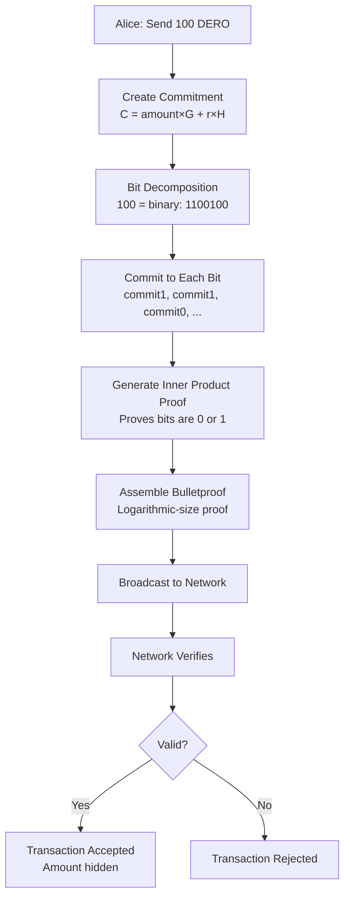
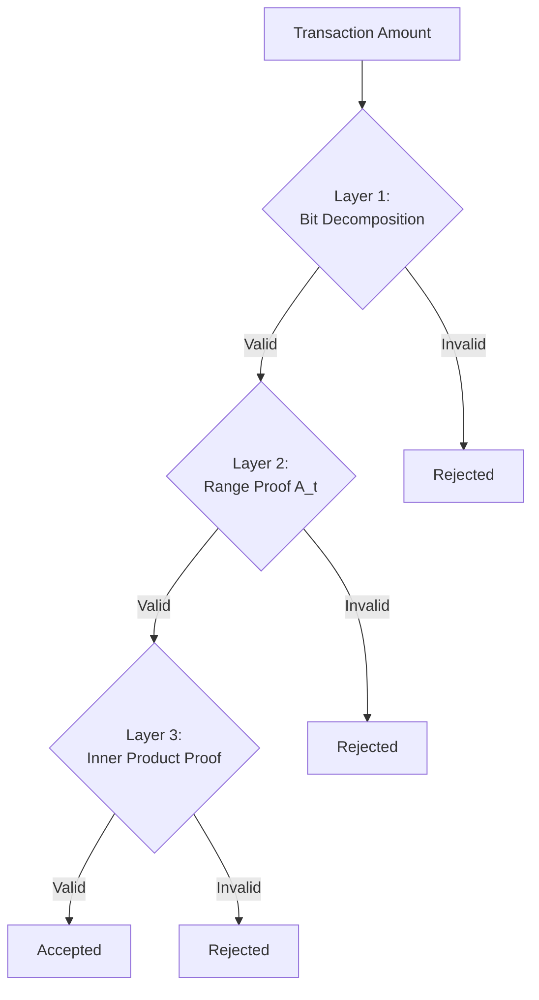
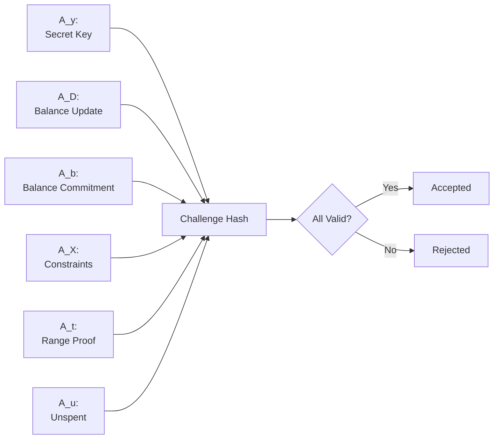
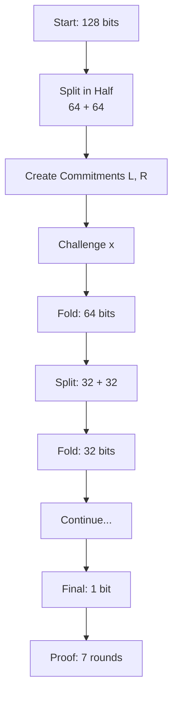
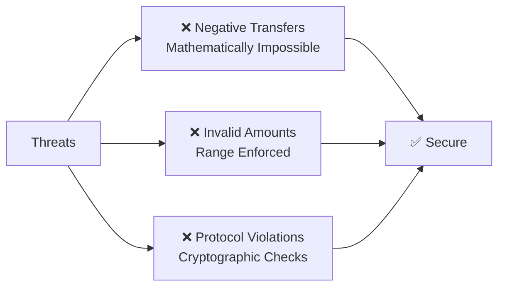

import { Callout } from 'nextra/components'
import { Tabs } from 'nextra/components'

# Bulletproofs: Zero-Knowledge Range Proofs

<Callout type="success" emoji="🔒">
**Zero-Knowledge Magic:** Bulletproofs prove your transaction amounts are valid **without revealing what they are**. DERO uses a 128-bit combined range proof to validate both the transfer amount and remaining balance in a single proof. Privacy + Security = Perfect.
</Callout>

## What Problem Do Bulletproofs Solve?

**The Challenge:**
```
DERO needs to verify:
  ✓ Amount is positive (not negative)
  ✓ Amount is reasonable (not 999 trillion)
  ✓ Sender has enough balance
  
But WITHOUT revealing:
  ✗ The actual amount
  ✗ The sender's balance
  ✗ Any private information
```

**The Solution: Bulletproofs**
- ✅ Prove combined 128-bit value is valid (transfer + remaining balance, each 64-bit)
- ✅ Never reveal the amount value
- ✅ Logarithmic-size proof (7 rounds for 128-bit range)
- ✅ No trusted setup needed

---

## How It Works (Simple Analogy)

**The Bouncer Problem:**

<Tabs items={['Old Way', 'Bulletproof Way']}>
  <Tabs.Tab>
    **Show ID (Reveals Everything)**
    
    ```
    You: "I'm 25 years old"
    Bouncer: "Show me your ID"
    
    Bouncer learns:
      ✓ You're over 21
      ✗ Your exact age (25)
      ✗ Your address
      ✗ Your full name
      ✗ Your photo
      ✗ Everything else on ID
    
    Privacy: ❌ Zero
    ```
  </Tabs.Tab>
  
  <Tabs.Tab>
    **Bulletproof (Reveals Nothing)**
    
    ```
    You: "I'm over 21"
    Bouncer: "Prove it mathematically"
    
    Bouncer learns:
      ✓ You're over 21
      ✗ Your exact age
      ✗ Your address
      ✗ Your name
      ✗ Nothing else
    
    Privacy: ✅ Perfect
    ```
  </Tabs.Tab>
</Tabs>

**For DERO:**
- Bulletproof proves: "Combined 128-bit value is valid (transfer amount in lower 64 bits, remaining balance in upper 64 bits)"
- Network learns: ✅ Both values are valid (in [0, 2^64))
- Network learns: ❌ What either value actually is

---

## The Proof Flow


```mermaid
flowchart TD
    A["Alice: Send 100 DERO"] --> B["Create Commitment<br/>C = amount×G + r×H"]
    B --> C["Bit Decomposition<br/>100 = binary: 1100100"]
    C --> D["Commit to Each Bit<br/>commit1, commit1, commit0, ..."]
    D --> E["Generate Inner Product Proof<br/>Proves bits are 0 or 1"]
    E --> F["Assemble Bulletproof<br/>Logarithmic-size proof"]
    F --> G["Broadcast to Network"]
    G --> H["Network Verifies"]
    H --> I{Valid?}
    I -->|Yes| J["Transaction Accepted<br/>Amount hidden"]
    I -->|No| K["Transaction Rejected"]
```

**What Network Sees:**
- ✅ Commitment (encrypted amount)
- ✅ Bulletproof (logarithmic-size proof)
- ✅ Proof is valid
- ❌ Actual amount (hidden)

---

## Protection Against Negative Transfers

### Three-Layer Defense

DERO uses **three cryptographic layers** to prevent negative transfers:


```mermaid
graph TB
    A["Transaction Amount"] --> B{"Layer 1:<br/>Bit Decomposition"}
    B -->|Valid| C{"Layer 2:<br/>Range Proof A_t"}
    B -->|Invalid| REJ1["Rejected"]
    C -->|Valid| D{"Layer 3:<br/>Inner Product Proof"}
    C -->|Invalid| REJ2["Rejected"]
    D -->|Valid| ACC["Accepted"]
    D -->|Invalid| REJ3["Rejected"]
```

### Layer 1: Bit Decomposition Protection

**What Happens with Negative Values:**

| Scenario | Binary Representation | Result |
|---------|----------------------|--------|
| **Valid (100 DERO)** | `1100100` | ✅ Valid bit string |
| **Invalid (-100)** | `-1100100` | ❌ Contains `-` character |

**From Source Code** (`cryptography/crypto/proof_generate.go:473-487`):

```go
// Bit decomposition process
number_string := reverse("0000...000" + number.Text(2))

// For negative values:
// Go's BigInt.Text(2) returns "-1100100" (with minus sign)
// Bit loop expects only '0' or '1' characters
// Minus sign ('-', ASCII 45) is invalid
// Proof generation fails → Transaction rejected
```

**Technical Guarantee:**
- Go's `BigInt.Text(2)` **always** returns `"-[binary]"` for negatives
- This is standard library behavior (cannot be bypassed)
- Bit processing loop expects only `'0'` (48) or `'1'` (49)
- Minus sign `'-'` (45) breaks the proof generation

### Layer 2: Range Proof (A_t)

**What A_t Validates:**

DERO constructs a **combined 128-bit value** where the lower 64 bits represent the transfer amount and the upper 64 bits represent the remaining balance. This is created by: `value = transfer_amount + (remaining_balance << 64)`.

```
A_t Range Proof checks:
  ✓ Combined 128-bit value is valid
  ✓ Transfer amount (lower 64 bits) is in range [0, 2^64)
  ✓ Remaining balance (upper 64 bits) is in range [0, 2^64)
  ✓ All 128 bit commitments are valid (0 or 1)
```

**If Layer 1 fails (has `-` character):**
- Bit commitments cannot be created
- A_t proof generation fails
- Transaction rejected

**Source:** `cryptography/crypto/proof_generate.go:471` - Combined value construction: `btransfer.Add(btransfer, bdiff.Lsh(bdiff, 64))`

<Callout type="info" emoji="📐">
**Why 128 bits?** By combining transfer amount and remaining balance into a single 128-bit value, DERO proves both are valid in one proof while keeping both values hidden.
</Callout>

### Layer 3: Inner Product Proof - The Cryptographic Fail-Safe

Layer 3 is the **cryptographic fail-safe** that ensures complete integrity across all proof components. Using a recursive halving algorithm, it creates cryptographic commitments at each step, making it mathematically impossible to have invalid bit vectors or any form of manipulation.

**What It Validates:**

```
Inner Product Proof cryptographically verifies:
  ✓ Bit commitments match amount commitment
  ✓ Mathematical consistency across all components
  ✓ No manipulation possible at any level
  ✓ Integrity of entire proof structure
```

**From Source Code** (`cryptography/crypto/proof_innerproduct.go`):

```go
// Inner product proof verifies:
// - Bit vectors (aL, aR) match commitments
// - Final inner product equals committed value
// - All recursive steps are cryptographically consistent

// If ANY layer fails:
if P_calculated.String() != P.String() {
    // Verification fails
    // Transaction rejected
}
```

**The Fail-Safe Guarantee:**

Even if Layers 1 and 2 were somehow bypassed (mathematically impossible), Layer 3 would still reject the transaction because invalid bit vectors create inconsistent inner products, and the recursive structure cryptographically binds all components. The final verification checks mathematical consistency - any corruption is detected and rejected.

<Callout type="warning" emoji="🛡️">
**Triple Protection:** Layer 1 catches negatives at bit decomposition. Layer 2 validates range. **Layer 3 is the cryptographic fail-safe** that ensures complete integrity across all proof components. All three layers must pass - this is mathematically guaranteed.
</Callout>

---

## The Six Sigma Proofs

DERO uses **six interconnected proofs** that all must pass:


```mermaid
graph LR
    A["A_y:<br/>Secret Key"] --> H["Challenge Hash"]
    B["A_D:<br/>Balance Update"] --> H
    C["A_b:<br/>Balance Commitment"] --> H
    D["A_X:<br/>Constraints"] --> H
    E["A_t:<br/>Range Proof"] --> H
    F["A_u:<br/>Unspent"] --> H
    
    H --> V{"All Valid?"}
    V -->|Yes| ACC["Accepted"]
    V -->|No| REJ["Rejected"]
```

| Proof | What It Validates | Security Level |
|-------|------------------|----------------|
| **A_y** | Sender has private key | 🔒 Cryptographically secure |
| **A_D** | Encrypted balance update correct | 🔒 Homomorphic validation |
| **A_b** | Balance commitment valid | 🔒 Binding & hiding |
| **A_X** | Additional protocol constraints | 🔒 Protocol-specific |
| **A_t** | Combined 128-bit value valid (transfer + balance) | 🔒 Range proof (bulletproof) |
| **A_u** | No double-spending | 🔒 Unspent validation |

**All Bound Together:**
```
Challenge hash (c) = hash(A_y || A_D || A_b || A_X || A_t || A_u || ...)

If ANY proof fails:
  → Challenge hash is different
  → Verification fails
  → Transaction rejected
```

**Source:** `cryptography/crypto/proof_verify.go` - Verifies all six sigma proofs + inner product

---

## Inner Product Proof (The Core Algorithm)

### Recursive Halving - How Logarithmic Scaling Works

**The Algorithm:**


```mermaid
graph TB
    A["Start: 128 bits"] --> B["Split in Half<br/>64 + 64"]
    B --> C["Create Commitments L, R"]
    C --> D["Challenge x"]
    D --> E["Fold: 64 bits"]
    E --> F["Split: 32 + 32"]
    F --> G["Fold: 32 bits"]
    G --> H["Continue..."]
    H --> I["Final: 1 bit"]
    I --> J["Proof: 7 rounds"]
```

**Iterations:**
- Start: 128 elements
- Iteration 1: 64 elements
- Iteration 2: 32 elements
- Iteration 3: 16 elements
- Iteration 4: 8 elements
- Iteration 5: 4 elements
- Iteration 6: 2 elements
- Iteration 7: 1 element

**Total:** log₂(128) = 7 iterations
  
**Source:** `cryptography/crypto/proof_innerproduct.go` - Recursive halving algorithm

---

## Zero-Knowledge Property Explained

### What "Zero-Knowledge" Means

**After seeing a valid bulletproof, verifier learns:**

| Information | Learned? | Reason |
|------------|----------|--------|
| **Combined 128-bit value is valid** | ✅ Yes | This is what's proven |
| **Transfer and balance each in [0, 2^64)** | ✅ Yes | Implicit from 128-bit structure |
| **Exact transfer amount** | ❌ No | Zero-knowledge property |
| **Exact remaining balance** | ❌ No | Zero-knowledge property |
| **Any bits of either value** | ❌ No | Bits are hidden |
| **Any private information** | ❌ No | Perfect privacy |

**Formal Properties:**
- ✅ **Completeness:** Valid proofs always verify
- ✅ **Soundness:** Invalid proofs never verify
- ✅ **Zero-knowledge:** No information leaked

---

## Where Bulletproofs Are Used

**Three Core Applications:**

| Application | What It Validates | Protection |
|------------|------------------|------------|
| **Transaction Amounts** | Combined 128-bit value (transfer + remaining balance) | Prevents negative transfers |
| **Balance Sufficiency** | Both transfer and remaining balance in [0, 2^64) | Prevents overdrafts |
| **Smart Contract State** | State transitions valid, no negative balances | Ensures contract integrity |

**All three use the same bulletproof mechanism:**
- ✅ Prove value is in valid range
- ✅ Never reveal the actual value
- ✅ Cryptographic guarantee

---

## Key Takeaways

### What You Get

| Feature | Benefit | Impact |
|---------|---------|--------|
| **🔒 Zero-Knowledge** | Amount hidden from network | Perfect privacy |
| **📦 Logarithmic Proofs** | 7 rounds for 128-bit range | Efficient transactions |
| **🔐 No Trusted Setup** | Pure cryptography | Decentralized security |
| **🛡️ Triple-Layer Defense** | Multiple fail-safes | Negative transfers impossible |
| **✅ Proven Security** | bn256 elliptic curve discrete log | Standard discrete log security assumption |

### What You're Protected From


```mermaid
graph LR
    A["Threats"] --> B["❌ Negative Transfers<br/>Mathematically Impossible"]
    A --> C["❌ Invalid Amounts<br/>Range Enforced"]
    A --> D["❌ Protocol Violations<br/>Cryptographic Checks"]
    
    B --> E["✅ Secure"]
    C --> E
    D --> E
```

**The Bottom Line:**

<Callout type="success" emoji="🔒">
**Triple-Layer Security:** Layer 1 catches negatives at bit decomposition. Layer 2 validates range. Layer 3 provides cryptographic fail-safe integrity. All three must pass - mathematically guaranteed.
</Callout>

<Callout type="info" emoji="⚡">
**Performance + Privacy:** DERO's bulletproof implementation keeps proofs logarithmic in size while preserving strong cryptographic guarantees.
</Callout>

---

## Related Pages

**Privacy Suite:**
- [Ring Signatures](/privacy/ring-signatures) - Sender anonymity
- [Homomorphic Encryption](/privacy/homomorphic-encryption) - Amount encryption
- [Transaction Privacy](/privacy/transaction-privacy) - Complete privacy model

**Technical Details:**
- [DERO Tokens](/basics/tokens) - How bulletproofs secure token balances
- [Transaction Structure](/privacy/transaction-privacy) - Bulletproof integration

**Learn More:**
- [Privacy Features Overview](/privacy/index) - Full privacy suite
- [Private Smart Contracts](/privacy/private-smart-contracts) - Contract privacy
