import { Callout } from 'nextra/components'
import { Tabs } from 'nextra/components'

# Bulletproofs: Zero-Knowledge Range Proofs

<Callout type="success" emoji="🔒">
**Zero-Knowledge Magic:** Bulletproofs prove your transaction amount is valid (0 to 2^64) **without revealing what the amount is**. Privacy + Security = Perfect.
</Callout>

## What Problem Do Bulletproofs Solve?

**The Challenge:**
```
DERO needs to verify:
  ✓ Amount is positive (not negative)
  ✓ Amount is reasonable (not 999 trillion)
  ✓ Sender has enough balance
  
But WITHOUT revealing:
  ✗ The actual amount
  ✗ The sender's balance
  ✗ Any private information
```

**The Solution: Bulletproofs**
- ✅ Prove amount is in valid range [0, 2^64]
- ✅ Never reveal the amount value
- ✅ Compact proof size (~2KB)
- ✅ Fast verification (~10ms)
- ✅ No trusted setup needed

---

## How It Works (Simple Analogy)

**The Bouncer Problem:**

<Tabs items={['Old Way', 'Bulletproof Way']}>
  <Tabs.Tab>
    **Show ID (Reveals Everything)**
    
    ```
    You: "I'm 25 years old"
    Bouncer: "Show me your ID"
    
    Bouncer learns:
      ✓ You're over 21
      ✗ Your exact age (25)
      ✗ Your address
      ✗ Your full name
      ✗ Your photo
      ✗ Everything else on ID
    
    Privacy: ❌ Zero
    ```
  </Tabs.Tab>
  
  <Tabs.Tab>
    **Bulletproof (Reveals Nothing)**
    
    ```
    You: "I'm over 21"
    Bouncer: "Prove it mathematically"
    
    Bouncer learns:
      ✓ You're over 21
      ✗ Your exact age
      ✗ Your address
      ✗ Your name
      ✗ Nothing else
    
    Privacy: ✅ Perfect
    ```
  </Tabs.Tab>
</Tabs>

**For DERO:**
- Bulletproof proves: "Amount is between 0 and 2^64"
- Network learns: ✅ Amount is valid
- Network learns: ❌ What the amount is

---

## The Proof Flow

```mermaid
flowchart TD
    A["Alice: Send 100 DERO"] --> B["Create Commitment<br/>C = amount×G + r×H"]
    B --> C["Bit Decomposition<br/>100 = binary: 1100100"]
    C --> D["Commit to Each Bit<br/>commit1, commit1, commit0, ..."]
    D --> E["Generate Inner Product Proof<br/>Proves bits are 0 or 1"]
    E --> F["Assemble Bulletproof<br/>~2KB compact proof"]
    F --> G["Broadcast to Network"]
    G --> H["Network Verifies"]
    H --> I{Valid?}
    I -->|Yes| J["Transaction Accepted<br/>Amount hidden"]
    I -->|No| K["Transaction Rejected"]
```



**What Network Sees:**
- ✅ Commitment (encrypted amount)
- ✅ Bulletproof (~2KB)
- ✅ Proof is valid
- ❌ Actual amount (hidden)

---

## Protection Against Negative Transfers

### Three-Layer Defense

DERO uses **three cryptographic layers** to prevent negative transfers:


### Layer 1: Bit Decomposition Protection

**What Happens with Negative Values:**

| Scenario | Binary Representation | Result |
|---------|----------------------|--------|
| **Valid (100 DERO)** | `1100100` | ✅ Valid bit string |
| **Invalid (-100)** | `-1100100` | ❌ Contains `-` character |

**From Source Code** (`cryptography/crypto/proof_generate.go:473-487`):

```go
// Bit decomposition process
number_string := reverse("0000...000" + number.Text(2))

// For negative values:
// Go's BigInt.Text(2) returns "-1100100" (with minus sign)
// Bit loop expects only '0' or '1' characters
// Minus sign ('-', ASCII 45) is invalid
// Proof generation fails → Transaction rejected
```

**Technical Guarantee:**
- Go's `BigInt.Text(2)` **always** returns `"-[binary]"` for negatives
- This is standard library behavior (cannot be bypassed)
- Bit processing loop expects only `'0'` (48) or `'1'` (49)
- Minus sign `'-'` (45) breaks the proof generation

### Layer 2: Range Proof (A_t)

**What A_t Validates:**

```
A_t Range Proof checks:
  ✓ Amount is ≥ 0
  ✓ Amount is ≤ 2^64
  ✓ Bit commitments are valid
  ✓ All bits are 0 or 1
```

**If Layer 1 fails (has `-` character):**
- Bit commitments cannot be created
- A_t proof generation fails
- Transaction rejected

**Source:** `cryptography/crypto/proof_generate.go` - Range proof (A_t) generation

### Layer 3: Inner Product Proof - The Cryptographic Fail-Safe

Layer 3 is the **cryptographic fail-safe** that ensures complete integrity across all proof components. Using a recursive halving algorithm, it creates cryptographic commitments at each step, making it mathematically impossible to have invalid bit vectors or any form of manipulation.

**What It Validates:**

```
Inner Product Proof cryptographically verifies:
  ✓ Bit commitments match amount commitment
  ✓ Mathematical consistency across all components
  ✓ No manipulation possible at any level
  ✓ Integrity of entire proof structure
```

**From Source Code** (`cryptography/crypto/proof_innerproduct.go`):

```go
// Inner product proof verifies:
// - Bit vectors (aL, aR) match commitments
// - Final inner product equals committed value
// - All recursive steps are cryptographically consistent

// If ANY layer fails:
if P_calculated.String() != P.String() {
    // Verification fails
    // Transaction rejected
}
```

**The Fail-Safe Guarantee:**

Even if Layers 1 and 2 were somehow bypassed (mathematically impossible), Layer 3 would still reject the transaction because invalid bit vectors create inconsistent inner products, and the recursive structure cryptographically binds all components. The final verification checks mathematical consistency - any corruption is detected and rejected.

<Callout type="warning" emoji="🛡️">
**Triple Protection:** Layer 1 catches negatives at bit decomposition. Layer 2 validates range. **Layer 3 is the cryptographic fail-safe** that ensures complete integrity across all proof components. All three layers must pass - this is mathematically guaranteed.
</Callout>

---

## The Six Sigma Proofs

DERO uses **six interconnected proofs** that all must pass:


| Proof | What It Validates | Security Level |
|-------|------------------|----------------|
| **A_y** | Sender has private key | 🔒 Cryptographically secure |
| **A_D** | Encrypted balance update correct | 🔒 Homomorphic validation |
| **A_b** | Balance commitment valid | 🔒 Binding & hiding |
| **A_X** | Additional protocol constraints | 🔒 Protocol-specific |
| **A_t** | Amount in range [0, 2^64] | 🔒 Range proof (bulletproof) |
| **A_u** | No double-spending | 🔒 Unspent validation |

**All Bound Together:**
```
Challenge hash (c) = hash(A_y || A_D || A_b || A_X || A_t || A_u || ...)

If ANY proof fails:
  → Challenge hash is different
  → Verification fails
  → Transaction rejected
```

**Source:** `cryptography/crypto/proof_verify.go` - Verifies all six sigma proofs + inner product

---

## Inner Product Proof (The Core Algorithm)

### Recursive Halving - How Logarithmic Scaling Works

**The Algorithm:**


**Iterations:**
- Start: 128 elements
- Iteration 1: 64 elements
- Iteration 2: 32 elements
- Iteration 3: 16 elements
- Iteration 4: 8 elements
- Iteration 5: 4 elements
- Iteration 6: 2 elements
- Iteration 7: 1 element

**Total:** log₂(128) = 7 iterations  
**Proof Size:** 7 rounds × ~300 bytes ≈ 2.1KB
  
**Source:** `cryptography/crypto/proof_innerproduct.go` - Recursive halving algorithm

---

## Performance: Why DERO Is 10× Faster

### Custom Implementation

**DERO's Optimizations:**

| Optimization | Benefit | Impact |
|-------------|---------|--------|
| **Custom code** | Tailored for DERO | 3× faster |
| **Efficient EC ops** | Optimized point multiplication | 2× faster |
| **Streamlined verification** | Reduced redundant checks | 1.5× faster |
| **Combined** | **Total speedup** | **~10× faster** |

**Real-World Impact:**

```
Block with 100 transactions:
  
Standard bulletproofs:
  100 tx × 100ms = 10 seconds
  
DERO bulletproofs:
  100 tx × 10ms = 1 second
  
Speedup: 10× faster block validation
Benefit: Better scalability, lower hardware requirements
```

---

## Zero-Knowledge Property Explained

### What "Zero-Knowledge" Means

**After seeing a valid bulletproof, verifier learns:**

| Information | Learned? | Reason |
|------------|----------|--------|
| **Amount is in range [0, 2^64]** | ✅ Yes | This is what's proven |
| **Exact amount value** | ❌ No | Zero-knowledge property |
| **Any bits of the amount** | ❌ No | Bits are hidden |
| **Sender's balance** | ❌ No | Not revealed |
| **Any private information** | ❌ No | Perfect privacy |

**Formal Properties:**
- ✅ **Completeness:** Valid proofs always verify
- ✅ **Soundness:** Invalid proofs never verify
- ✅ **Zero-knowledge:** No information leaked

---

## Where Bulletproofs Are Used

**Three Core Applications:**

| Application | What It Validates | Protection |
|------------|------------------|------------|
| **Transaction Amounts** | Amount ≥ 0, ≤ 2^64 | Prevents negative transfers |
| **Balance Sufficiency** | Old balance ≥ transfer, New balance ≥ 0 | Prevents overdrafts |
| **Smart Contract State** | State transitions valid, no negative balances | Ensures contract integrity |

**All three use the same bulletproof mechanism:**
- ✅ Prove value is in valid range
- ✅ Never reveal the actual value
- ✅ Cryptographic guarantee
- ✅ Fast verification

---

## Key Takeaways

### What You Get

| Feature | Benefit | Impact |
|---------|---------|--------|
| **🔒 Zero-Knowledge** | Amount hidden from network | Perfect privacy |
| **📦 Compact Proofs** | ~2KB (logarithmic scaling) | Efficient transactions |
| **⚡ Fast Verification** | 10× faster than standard | Scalable blockchain |
| **🔐 No Trusted Setup** | Pure cryptography | Decentralized security |
| **🛡️ Triple-Layer Defense** | Multiple fail-safes | Negative transfers impossible |
| **✅ Proven Security** | Same as Bitcoin's ECDSA | 256-bit security level |

### What You're Protected From

```mermaid
graph LR
    A["Threats"] --> B["❌ Negative Transfers<br/>Mathematically Impossible"]
    A --> C["❌ Invalid Amounts<br/>Range Enforced"]
    A --> D["❌ Protocol Violations<br/>Cryptographic Checks"]
    
    B --> E["✅ Secure"]
    C --> E
    D --> E
```



**The Bottom Line:**

<Callout type="success" emoji="🔒">
**Triple-Layer Security:** Layer 1 catches negatives at bit decomposition. Layer 2 validates range. Layer 3 provides cryptographic fail-safe integrity. All three must pass - mathematically guaranteed.
</Callout>

<Callout type="info" emoji="⚡">
**Performance + Privacy:** DERO's bulletproof implementation proves you don't have to choose between privacy and performance. Through custom optimization, you get both strong cryptographic guarantees **and** practical blockchain speed (10× faster verification).
</Callout>

---

## Related Pages

**Privacy Suite:**
- [Ring Signatures](/privacy/ring-signatures) - Sender anonymity
- [Homomorphic Encryption](/privacy/homomorphic-encryption) - Amount encryption
- [Transaction Privacy](/privacy/transaction-privacy) - Complete privacy model

**Technical Details:**
- [DERO Tokens](/basics/tokens) - How bulletproofs secure token balances
- [Transaction Structure](/privacy/transaction-privacy) - Bulletproof integration

**Learn More:**
- [Privacy Features Overview](/privacy/index) - Full privacy suite
- [Private Smart Contracts](/privacy/private-smart-contracts) - Contract privacy
