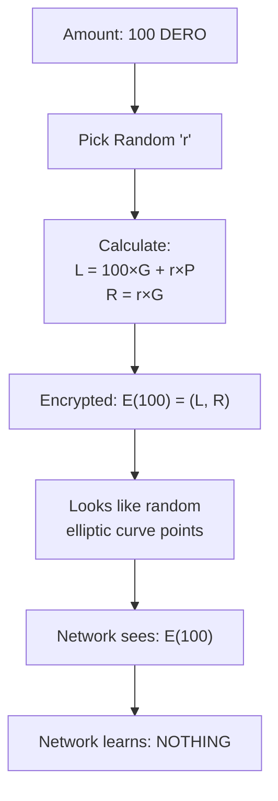
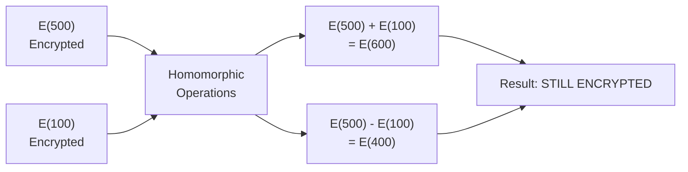
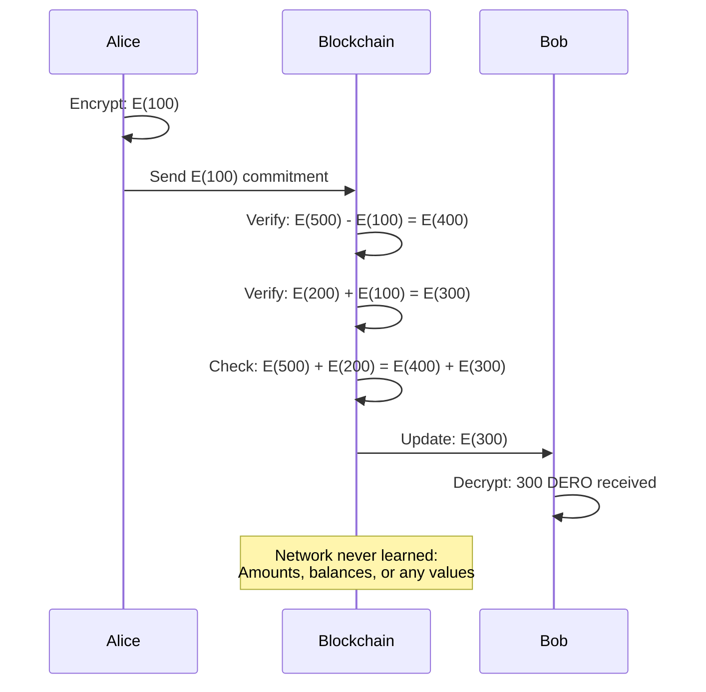
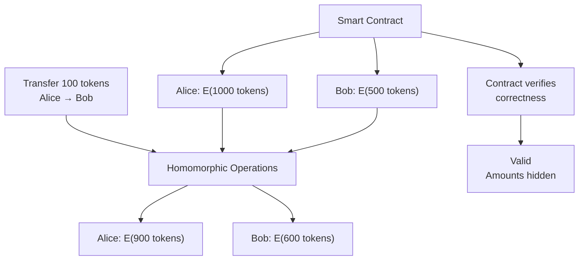

import { Callout } from 'nextra/components'
import { Tabs } from 'nextra/components'

# Homomorphic Encryption: Math on Locked Boxes

<Callout type="success" emoji="🔒">
**The Innovation:** Do math on encrypted balances without ever decrypting them. Your balance stays private. Forever. Even the blockchain never sees it.
</Callout>

## What Problem Does It Solve?

**The Challenge:**
```
Blockchain needs to:
  ✓ Verify transactions (amounts valid)
  ✓ Update balances (addition/subtraction)
  ✓ Ensure no double-spending
  
But WITHOUT revealing:
  ✗ Account balances
  ✗ Transaction amounts
  ✗ Any private information
```

**The Solution: Homomorphic Encryption**
- ✅ Math happens on encrypted data
- ✅ No decryption ever required
- ✅ Privacy never broken
- ✅ Blockchain can verify without seeing amounts

---

## The Simple Analogy

<Tabs items={['Regular Encryption', 'Homomorphic Encryption']}>
  <Tabs.Tab>
    **Locked Safe (Regular Encryption)**

```
You have $500 in a locked safe
Someone sends you $100

Normal way:
  1. Open safe (decrypt) → See $500
  2. Add $100 → Now $600
  3. Lock safe again (encrypt)
  
Problem: When safe is open, anyone can see $500
    Privacy: ❌ Broken
```
  </Tabs.Tab>

  <Tabs.Tab>
    **Magic Safe (Homomorphic Encryption)**

```
You have $500 in a magic safe
Someone sends you $100

Magic way:
  1. Drop $100 through slot in safe
  2. Money inside automatically becomes $600
  3. Safe NEVER opened
  
Result: Nobody ever sees $500, not even for a second
    Privacy: amount stays encrypted end-to-end
```
  </Tabs.Tab>
</Tabs>

**For DERO:**
- Balance is **always** encrypted (safe always locked)
- Math happens on the encrypted number
- Safe never opens
- Blockchain never sees actual balance

---

## How It Works

### The Encryption Flow


```mermaid
flowchart TD
    A["Amount: 100 DERO"] --> B["Pick Random 'r'"]
    B --> C["Calculate:<br/>L = 100×G + r×P<br/>R = r×G"]
    C --> D["Encrypted: E(100) = (L, R)"]
    D --> E["Looks like random<br/>elliptic curve points"]
    E --> F["Network sees: E(100)"]
    F --> G["Network learns: NOTHING"]
```

**The Setup:**
```
Private key: x (your secret)
Public key:  P = x × G (everyone can see this)
Generator:   G (elliptic curve point - public constant)
```

### Encrypting an Amount

**Conceptual flow** (actual implementation: `CommitElGamal` at `cryptography/crypto/algebra_elgamal.go:44-50`; the numbered steps below are docs annotations, not source comments):

```go
// Encrypt 100 DERO (illustrative):
// 1. Pick random number 'r'    (RandomScalarFixed)
// 2. Calculate Left:  L = 100 × G_value + r × P_recipient
// 3. Calculate Right: R = r × G_randomness
// 4. Ciphertext: E(100) = (L, R)
```

| Step | What Happens | What Network Sees |
|------|-------------|-------------------|
| **1. Pick random 'r'** | Generate random number | Nothing |
| **2. Calculate L** | `L = 100×G + r×P` | Random elliptic curve point |
| **3. Calculate R** | `R = r×G` | Random elliptic curve point |
| **4. Result** | `E(100) = (L, R)` | Random points (no amount visible) |

### The Magic: Homomorphic Operations

**Addition & Subtraction on Encrypted Data:**


```mermaid
graph LR
    A["E(500)<br/>Encrypted"] --> C["Homomorphic<br/>Operations"]
    B["E(100)<br/>Encrypted"] --> C
    C --> D["E(500) + E(100)<br/>= E(600)"]
    C --> E["E(500) - E(100)<br/>= E(400)"]
    D --> F["Result: STILL ENCRYPTED"]
    E --> F
```

**The Math:**
```
E(a) = (L₁, R₁)
E(b) = (L₂, R₂)

Addition:
  E(a) + E(b) = (L₁ + L₂, R₁ + R₂) = E(a + b)
  
Subtraction:
  E(a) - E(b) = (L₁ - L₂, R₁ - R₂) = E(a - b)

The encrypted result is STILL encrypted!
No decryption needed at any step!
```

<Callout type="info" emoji="🔐">
  **Mathematical Guarantee:** Based on the elliptic curve discrete logarithm problem on the bn256 (Barreto-Naehrig) curve.
</Callout>

---

## Transaction Flow: Alice → Bob

**Alice sends 100 DERO to Bob:**


```mermaid
sequenceDiagram
    participant A as Alice
    participant BC as Blockchain
    participant B as Bob
    
    A->>A: Encrypt: E(100)
    A->>BC: Send E(100) commitment
    BC->>BC: Verify: E(500) - E(100) = E(400)
    BC->>BC: Verify: E(200) + E(100) = E(300)
    BC->>BC: Check: E(500) + E(200) = E(400) + E(300)
    BC->>B: Update: E(300)
    B->>B: Decrypt: 300 DERO received
    
    Note over BC: Network never learned:<br/>Amounts, balances, or any values
```

<Callout type="info" emoji="📘">
  **Teaching abstraction, not literal verifier flow.** The diagram above shows the *intuition* — value conservation across encrypted balances. The actual verifier does not perform explicit ciphertext arithmetic like `E(500) + E(200) = E(400) + E(300)` at consensus. Balance conservation is enforced by the sigma proof structure: `A_b` (one of the six sigma commitments) commits to the balance-update polynomial relation, and the prover must produce a valid proof that the relation holds for the encrypted before/after values. The verifier checks the proof, not the arithmetic. See `proof_verify.go:98` for the actual `Verify()` entry point and `proof_generate.go` for what `A_b` commits to.
</Callout>

### What Happens at Each Step

<Tabs items={['Before', 'Transaction', 'Homomorphic Math', 'After']}>
  <Tabs.Tab>
    **Initial State**
    
    ```
    Alice's balance: E(500) = (L_a, R_a)
    Bob's balance:   E(200) = (L_b, R_b)
    Transfer amount: 100 DERO
    ```
  </Tabs.Tab>
  
  <Tabs.Tab>
    **Create Transfer**
    
    ```
    Create transfer commitment:
      E(100) = (L_t, R_t)
      
    This goes in transaction as encrypted 'C' commitment
    Network sees: Random elliptic curve points
    Network learns: NOTHING about 100
    ```
  </Tabs.Tab>
  
  <Tabs.Tab>
    **Homomorphic Operations**
    
    ```
    Alice's new balance:
      E(500) - E(100) = E(400)
      (L_a, R_a) - (L_t, R_t) = (L_a - L_t, R_a - R_t)
      
    Bob's new balance:
      E(200) + E(100) = E(300)
      (L_b, R_b) + (L_t, R_t) = (L_b + L_t, R_b + R_t)
      
    No decryption occurred at any point!
    ```
  </Tabs.Tab>
  
  <Tabs.Tab>
    **Final State**
    
    ```
    Alice's balance: E(400)
    Bob's balance:   E(300)
    
    Network verified:
      ✓ Balance conservation
      ✓ No negative amounts
      ✓ Alice had sufficient balance
      
    Network never learned:
      ✗ Actual amounts
      ✗ Balances
      ✗ Any values
    ```
  </Tabs.Tab>
</Tabs>

---

## Comparison: Traditional vs DERO

### Balance Storage

| Aspect | Traditional Blockchain | DERO Blockchain |
|--------|----------------------|-----------------|
| **Account** | `alice.eth` | `dero1qy...` |
| **Balance shown** | `500 ETH` 👁️ Public | `E(???)` 🔒 Encrypted |
| **Everyone sees** | Exact amount | Random bytes (66 bytes) |
| **Only owner sees** | Same as everyone | Actual balance (with private key) |
| **Privacy** | ❌ Zero | ✅ Complete |
| **Balance lookup** | Instant (public) | Instant (encrypted) |

**The Difference:**
- **Bitcoin/Ethereum:** Your balance is like your bank statement posted on a billboard
- **DERO:** Your balance is permanently locked in a safe only you can open

### Blockchain Architecture Comparison

| Feature | Bitcoin/UTXO | Ethereum (Account) | DERO (Account + Encrypted) |
|---------|-------------|-------------------|---------------------------|
| **Model** | Outputs | Accounts | Accounts |
| **Privacy** | ❌ Pseudonymous | ❌ None | ✅ Encrypted |
| **Smart Contracts** | ❌ Limited | ✅ Yes, public | ✅ Yes, **private** |
| **Confirmations** | Slower | Fast | Fast |
| **Balance Lookup** | Scan chain | Instant | Instant + private |

**DERO = Ethereum's simplicity + Privacy coin encryption** 🎯

---

## Real-World Applications

### 1. Instant Balance Queries

**Traditional Privacy Coin:**
```
1. Download entire blockchain
2. Scan all transactions
3. Calculate balance from history
4. Wait minutes to hours

Result: Slow, requires full sync
```

**DERO:**
```
1. Query encrypted balance from node (66 bytes)
2. Decrypt with your private key
3. See balance instantly

Result: Instant, no chain scanning needed
```

### 2. Private Token Systems

**How It Works:**


```mermaid
graph TB
    SC["Smart Contract"] --> A["Alice: E(1000 tokens)"]
    SC --> B["Bob: E(500 tokens)"]
    
    TX["Transfer 100 tokens<br/>Alice → Bob"] --> H["Homomorphic Operations"]
    A --> H
    B --> H
    
    H --> A2["Alice: E(900 tokens)"]
    H --> B2["Bob: E(600 tokens)"]
    
    SC --> V["Contract verifies<br/>correctness"]
    V --> OK["Valid<br/>Amounts hidden"]
```

**Key Points:**

**Source** (verbatim from `tests/normal/multi_deposit_test/asset.bas:11-15`):

```basic
    // Issue Asset after depositing DERO (Convert DERO to TOKENX)
    Function IssueAsset() Uint64
    10  SEND_ASSET_TO_ADDRESS(SIGNER(), DEROVALUE(),SCID())   // send asset without knowing original balance, this is done homomorphically
    20  RETURN 0
    End Function
```

The `SEND_ASSET_TO_ADDRESS` DVM function is registered at `dvm/dvm_functions.go:80`; the BASIC sample above is the canonical example contract in the test suite.

```
Result in user's wallet:
  User's token balance: E(1000)  ← Encrypted, only user can decrypt
  User's DERO balance:  E(500)   ← Also encrypted
```

**Traditional tokens (ERC-20):** Balances public in contract  
**DERO tokens:** Balances encrypted in user wallets, transferable peer-to-peer

### 3. Private DeFi Operations

**Swap Example:**
```
Swap 100 DERO for 500 tokens:

  Your DERO:  E(balance_dero) - E(100)
  Your tokens: E(balance_tokens) + E(500)
  
Public sees:
  ✓ Swap contract called
  ✗ How much swapped
  ✗ Who swapped
  ✗ Resulting balances
```

---

## Technical Implementation

### The C and D Commitments

Every DERO transaction contains encrypted commitments:

**C Commitment (per ring member — ElGamal-style, not Pedersen):**

```go
// One C[i] per ring slot; pubkey[i] is the slot's public key.
C[i] = ±amount × G + r × pubkey[i]   // sender slot: -amount; receiver slot: +amount; decoys: 0
                                     // (see walletapi/transaction_build.go:152-206)
Where:
  amount     = Transfer amount in atomic units (hidden)
  G          = Pedersen value generator (global_pedersen_values.G)
  r          = Transaction-wide blinding scalar (same r across the ring)
  pubkey[i]  = Ring slot's public key — this is the second generator, NOT a global H

Properties:
  • Binding: Cannot change amount after creating C[i] (discrete-log hard)
  • Hiding: Cannot determine amount or which slot is real from C[i] alone
  • Homomorphic on accepted balance: nb.Balance.Add(echanges) at
    blockchain/transaction_execute.go:239 sums an ElGamal change
    ciphertext into the receiver's encrypted balance.
```

> **Why this is not Pedersen.** Pedersen uses a fixed generator pair `(G, H)`. DERO's per-ring construction reuses each ring member's public key as the second generator (`r × pubkey[i]`), which is what makes the same encryption serve both as an anonymity-set commitment and as a per-receiver decryption hint. The two families share the homomorphic add property; the security argument differs.

**D Commitment (shared across the whole anonymity set, not per recipient):**

```go
D = r × G  // single value for the entire payload (one D field on Statement,
           // see cryptography/crypto/protocol_structures.go:38)

Purpose:
  • Acts as the public "Right" half of the ElGamal triple
  • Combined with the receiver's secret key to recover the shared secret
  • Same D for all ring members — the receiver-specific shared key is
    derived from D plus the receiver's own secret
```

**Together they enable:**
- ✅ Encrypted amounts in transactions
- ✅ Verifiable without revealing amounts
- ✅ Homomorphic balance updates

**Source:** `cryptography/crypto/algebra_elgamal.go` — ElGamal encryption implementation. Key entry points: `CommitElGamal` at `algebra_elgamal.go:44` (encryption / commitment construction) and `Add` at `algebra_elgamal.go:69` (homomorphic ciphertext addition).

### Technical Specifications

| Aspect | Details |
|--------|---------|
| **Encryption Scheme** | ElGamal (additive homomorphism) |
| **Curve** | bn256 (Barreto-Naehrig) curve |
| **Security** | Discrete logarithm problem |
| **Commitment Size** | 66 bytes (33 left + 33 right) |
| **Trusted Setup** | ❌ None required |

---

## Key Takeaways

### What Homomorphic Encryption Provides

| Feature | Benefit | Impact |
|---------|---------|--------|
| **🔒 Encrypted Balances** | Always encrypted | Perfect privacy |
| **➕ Math on Encrypted** | Operations without decryption | Privacy never broken |
| **⚡ Instant Queries** | No chain scanning | Fast balance checks |
| **🔐 Private Tokens** | Encrypted token balances | Complete privacy |
| **✅ Verifiable** | Network can verify | Security maintained |
| **🚫 No Trusted Setup** | Pure cryptography | Decentralized |

### What It Enables

- ✅ **Private Smart Contracts** - Impossible on other chains
- ✅ **Instant Balance Lookup** - No blockchain scanning
- ✅ **Encrypted Token Systems** - Private token transfers
- ✅ **Private DeFi** - Encrypted swap operations
- ✅ **Account-Based Privacy** - First blockchain to achieve this

<Callout type="info" emoji="🎯">
**Architectural Breakthrough:** Account-based blockchains were thought incompatible with strong privacy. DERO proved this assumption wrong through homomorphic encryption, enabling private smart contracts with encrypted balances.
</Callout>

---

## Related Pages

**Privacy Suite:**
- [Ring Signatures](/privacy/ring-signatures) - Transaction anonymity
- [Bulletproofs](/privacy/bulletproofs) - Zero-knowledge range proofs
- [Transaction Privacy](/privacy/transaction-privacy) - Complete privacy flow
- [Payload Proofs](/privacy/payload-proofs) - Prove transfers cryptographically

**Technical Implementation:**
- [DERO Tokens](/basics/tokens) - How tokens use homomorphic encryption
- [Private Smart Contracts](/privacy/private-smart-contracts) - Contract encrypted balances

**Build with Privacy:**
- [Token Contract](/smartContracts/token) - Private token example
- [Wallet RPC API](/rpc-api/wallet-rpc-api) - Send private transactions
