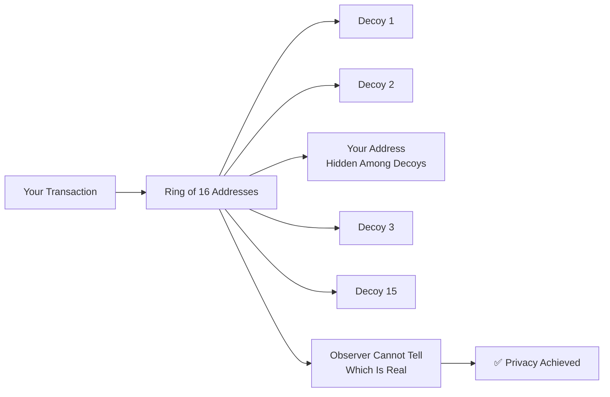
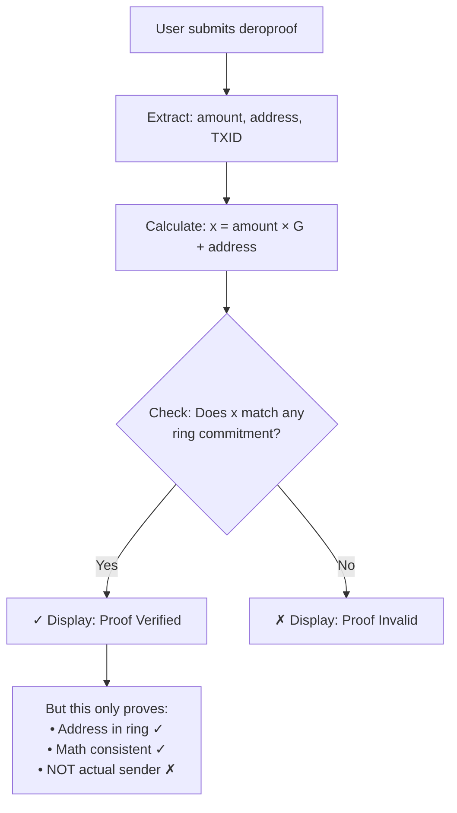
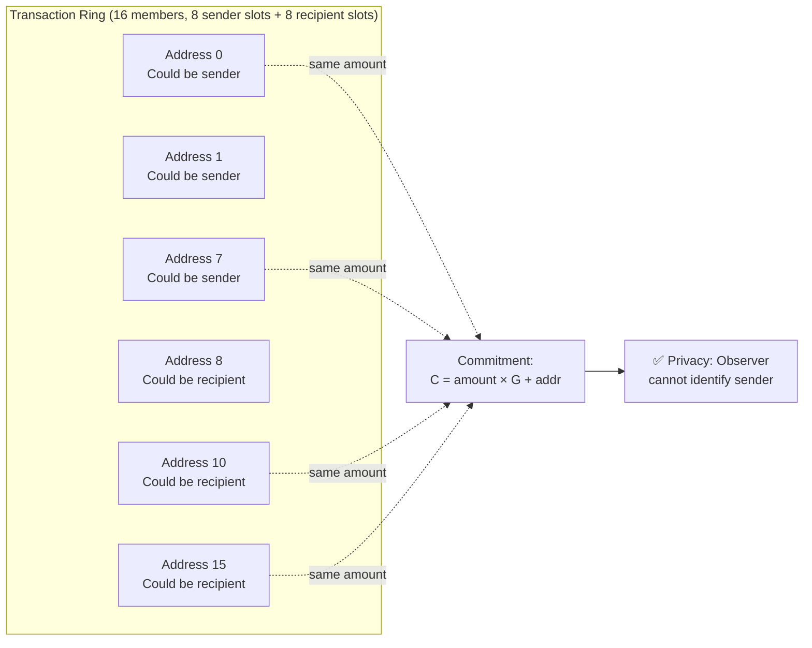

import { Callout } from 'nextra/components'
import { Tabs } from 'nextra/components'

# DERO Payload Proofs

<Callout type="success" emoji="🔒">
**Privacy by construction:** Only you (holding the private key) can prove you sent a transaction. Third parties can guess but cannot prove — by design, so ring-signature plausible deniability remains intact.
</Callout>

## How payload-proof ambiguity works

DERO uses **ring signatures** to hide the sender. When you send a transaction, your real output is hidden among ring_size/2 potential senders (rings are split evenly between senders and recipients), creating **plausible deniability** — observers cannot determine who actually sent the transaction.

That ambiguity is what makes payload-proof verification ambiguous. If a third party could verify exactly who sent what, ring signatures would not provide privacy.


```mermaid
graph LR
    U[Your Transaction] --> R[Ring of 16 Addresses]
    R --> D1[Decoy 1]
    R --> D2[Decoy 2]
    R --> YOU[Your Address<br/>Hidden Among Decoys]
    R --> D3[Decoy 3]
    R --> D4[Decoy 15]
    
    R --> P[Observer Cannot Tell<br/>Which Is Real]
    P --> PR[✅ Privacy Achieved]
```

### How This Compares to Other Privacy Coins

| Feature | DERO | Zcash (Shielded) | Bitcoin/Ethereum |
|---------|------|-------------------|------------------|
| **Ring Signatures** | ✅ 2-128 members | ❌ No rings | ❌ No privacy |
| **Third-party Proof** | ❌ Ambiguous (private) | ✅ Transparent (viewkeys) | ✅ Fully public |
| **Explorer Verification** | ⚠️ Probabilistic | ✅ Exact (less private) | ✅ Exact (no privacy) |
| **Sender Privacy** | ✅ Maximum | 🟡 Opt-in viewkeys | ❌ None |

**DERO's privacy model:** Third parties cannot definitively prove who sent a transaction — this is the point of ring-signature privacy.

### Two Proof Types (Standard in Privacy Blockchains)

| Proof Type | What It Does | Security Level |
|-----------|--------------|----------------|
| **Transaction Proof** | Validates blockchain consensus | 🔒 Cryptographically secure |
| **Payload Proof** | Shows metadata (amount, recipient) | ⚠️ Convenience only, not cryptographic |

**Important:** Explorers show **payload proofs** (convenience), not **transaction proofs** (cryptographic). This is standard across all privacy blockchains with ring signatures.

---

## Two Proof Types

| Feature | Transaction Proofs | Payload Proofs |
|---------|-------------------|----------------|
| **Verified By** | All network nodes | Explorer software only |
| **Security** | Cryptographically secure | Math consistency only |
| **Can Be Faked?** | ❌ No | ⚠️ Yes |
| **Checks** | Bulletproofs, range proofs, signatures | Commitment matching |
| **Purpose** | Blockchain consensus | Display convenience |
| **Shows** | Transaction validity | Amounts, addresses, comments |
| **Trust Level** | Trustless | User-provided data |

<Callout type="info">
  **For Certainty:** Use your wallet with private keys. Payload proofs are convenience tools, not cryptographic guarantees.
</Callout>

---

## How It Works


```mermaid
flowchart TD
    A[User submits deroproof] --> B[Extract: amount, address, TXID]
    B --> C[Calculate: x = amount × G + address]
    C --> D{Check: Does x match any<br/>ring commitment?}
    D -->|Yes| E[✓ Display: Proof Verified]
    D -->|No| F[✗ Display: Proof Invalid]
    E --> G[But this only proves:<br/>• Address in ring ✓<br/>• Math consistent ✓<br/>• NOT actual sender ✗]
```

**What this proves:**
- ✅ Address is in ring
- ✅ Math is consistent
- ❌ **NOT** that this address sent the transaction

## How Ring Signatures Protect Privacy

**Ring signatures hide the real sender among decoys (2-128 addresses)**

All ring members use identical commitment structures with the **same amount**. This is mathematically required for privacy - if different amounts were visible, you could identify the sender. Rings are split evenly — half the members are potential senders, half are potential recipients.


```mermaid
graph LR
    subgraph Ring["Transaction Ring (16 members, 8 sender slots + 8 recipient slots)"]
        A0[Address 0<br/>Could be sender] 
        A1[Address 1<br/>Could be sender]
        A7[Address 7<br/>Could be sender]
        A8[Address 8<br/>Could be recipient]
        A10[Address 10<br/>Could be recipient]
        A15[Address 15<br/>Could be recipient]
    end
    
    A0 -.same amount.-> C[Commitment:<br/>C = amount × G + addr]
    A7 -.same amount.-> C
    A10 -.same amount.-> C
    A15 -.same amount.-> C
    
    C --> R[✅ Privacy: Observer<br/>cannot identify sender]
```

**Mathematical Privacy:**
```
C[0] = (amount × G) + address[0]
C[1] = (amount × G) + address[1]
...
C[k] = (amount × G) + address[k]  ← Same amount for ALL
```

**Result:** Plausible deniability for all ring members. This is the standard ring-signature mechanism — observable ambiguity is what protects sender identity.

**Technical Note:** When an address is included as a ring member (decoy), its encrypted balance changes due to homomorphic operations, even though the address performed no actions. This is cryptographically required behavior - all ring members' encrypted balances participate in the transaction. Observing encrypted balance changes alone cannot identify the real sender, as this happens for all ring members by design.

*Learn more: [Ring Signatures - Encrypted Balance Changes](/privacy/ring-signatures#encrypted-balance-changes-for-ring-members)*

---

## Recognizing Authentic Transaction Metadata

Real senders typically include encrypted metadata (destination address, comment, amount). This helps wallets display transaction history.

| Indicator | Authentic Sender | Ring Decoy |
|-----------|------------------|------------|
| **Payload** | Encrypted data (random bytes) | Often empty or sparse |
| **Decoded** | Valid encrypted structure | Minimal data |
| **Comment** | Encrypted message | Usually absent |
| **Metadata** | Complete fields | Partial fields |

**Note:** This is an observation, not a guarantee. Privacy systems require uncertainty - that's the entire point.

## What Explorers Can and Cannot Show

**This applies to ALL privacy blockchains that use ring signatures**

| Check Type | Explorer CAN Verify | Explorer CANNOT Verify (Privacy Protection) |
|------------|---------------------|---------------------------------------------|
| **Ring Membership** | ✅ Address is in the ring | ❌ Which address actually sent (privacy!) |
| **Math Consistency** | ✅ Commitment calculations | ❌ Cryptographic proof of specific sender |
| **Transaction Validity** | ✅ Transaction is on-chain | ❌ Which ring member is real |
| **Amount Bounds** | ✅ Amount is reasonable | ❌ Proof cannot be for another member |

**Why this is correct:** Privacy requires plausible deniability. If explorers could prove the exact sender, ring signatures would be useless.

---

## Why Payload Proofs Can Be Faked

### Payload Proofs Are Wallet-Level Tools

**Key Distinction:**

| Proof Type | Scope | Validation | Can Be Faked? |
|-----------|-------|-----------|---------------|
| **Transaction Proof** | Blockchain consensus | Cryptographic verification by all nodes | ❌ No |
| **Payload Proof** | Explorer display | Math consistency check only | ⚠️ Yes |

**Why Payload Proofs Can Be Faked:**

1. **User-Provided Data**
   - Payload proofs contain user-submitted metadata
   - Not cryptographically bound to transaction
   - Anyone can create matching proof for any ring member

2. **Math Consistency Only**
   - Explorer verifies: `commitment = amount × G + address`
   - Does NOT verify: This address was the actual sender
   - Any ring member can generate matching proof

3. **No Cryptographic Binding**
   - Payload proofs are separate from transaction proofs
   - They don't affect blockchain consensus
   - Fake proofs don't invalidate transactions

**From Source Code** (`proof/proof.go:34-149`, `cmd/explorer/explorerlib/explorerlib.go:689`):

The payload proof system is designed for **convenience and display**, not cryptographic verification. The explorer checks if the proof's commitment matches any ring member's commitment, but this doesn't prove the sender identity.

**Code Evidence:**
```go
// proof/proof.go:98-104
// Calculate commitment: x = amount × G + address
x.ScalarMult(crypto.G, new(big.Int).SetUint64(amount))
x.Add(new(bn256.G1).Set(&x), addr.PublicKey.G1())

// Check if commitment matches ANY ring member
if x.String() == tx.Payloads[t].Statement.C[k].String() {
    // Proof "verified" - but this only proves math consistency, not sender identity
}
```

**Explorer Call** (`cmd/explorer/explorerlib/explorerlib.go:689`):
```go
addresses, amounts, raw, decoded, err := proof.Prove(tx_proof, info.Hex, info.Ring, mainnet)
```

**Why the design works this way:**

- If explorers could prove exact senders, ring signatures would offer no privacy
- Users can still verify their own transactions with their private key
- Any ring member can generate a matching proof — this is what makes the proof ambiguous to third parties
- All ring-signature privacy systems work this way

**For Real Verification:**
- Use your wallet with private keys (only you can prove you sent)
- Transaction proofs are cryptographically secure (network consensus)
- Payload proofs are convenience tools (explorer display)

---

## Best Practices

**For Users:**
- ✅ **Certainty:** Check YOUR wallet with private keys
- ✅ **Convenience:** Use payload proofs for general verification
- ⚠️ **Understand:** Explorers show possibilities, not proof of sender

**For Developers:**
- 📚 **Educate:** Explain transaction vs payload proofs
- 🔒 **Privacy First:** Don't promise definitive sender identification
- ✅ **Standard Practice:** Ring signature privacy requires plausible deniability

---

## Technical Deep Dive

### Why All Ring Members Use Same Amount

**Privacy Requirement:**

```
If different ring members showed different amounts:
  → You could identify sender by amount
  → Privacy would be broken
  → Ring signature would be useless

Therefore, ALL commitments use same amount:
  C[k] = (amount * G) + address[k]_pubkey
  
Same amount for ALL k (0 through 15)
```

**Result:** Cannot identify sender by commitment inspection

**Trade-off:** Any ring member can generate "valid" proof

### DERO's privacy posture

Privacy blockchains make different trade-offs:

| Approach | Benefits | Trade-offs | Used By |
|----------|----------|------------|---------|
| **Privacy by default** | Sender hidden among ring decoys; amounts encrypted | Third parties cannot verify the sender — must use their own wallet | DERO |
| **Optional privacy** | User controls disclosure | Privacy only if explicitly used | Zcash |
| **Public ledger** | Full transparency | No privacy | Bitcoin, Ethereum |

DERO opts for privacy by default. Payload-proof ambiguity isn't a flaw — it's the visible consequence of the ring-signature construction.

---

## The Bottom Line

**What payload proofs are, and aren't:**

- **They are:** wallet-level display tools. Only you, with your private key, can prove you sent a specific transaction.
- **They aren't:** a cryptographic identifier of the sender. Any ring member can generate a verifying payload proof for a given transaction.

That ambiguity is the visible consequence of how ring signatures work. Bitcoin and Ethereum explorers show exact senders; DERO explorers show ring members. The trade-off is third-party verifiability for sender privacy.

---

---

## Related Pages

**Privacy Features:**
- [Transaction Privacy](/privacy/transaction-privacy) - How transactions stay private
- [Homomorphic Encryption](/privacy/homomorphic-encryption) - Why balances are encrypted
- [Ring Signatures](/privacy/ring-signatures) - Sender anonymity

**Use Cases:**
- [DERO Tokens](/basics/tokens) - Prove token transfers
- [Private Smart Contracts](/privacy/private-smart-contracts) - Prove SC interactions

**For Developers:**
- [Wallet RPC API](/rpc-api/wallet-rpc-api) - Generate payload proofs
- [Daemon RPC API](/rpc-api/daemon-rpc-api) - Verify proofs on-chain
