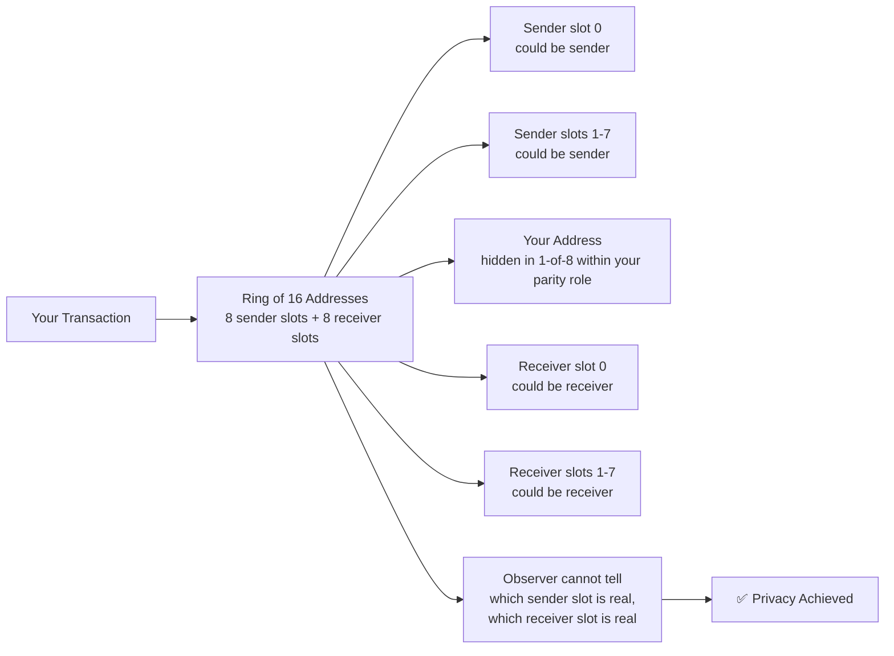
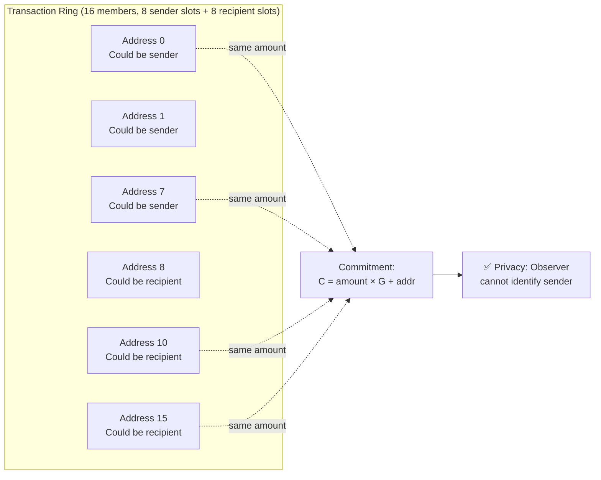

import { Callout } from 'nextra/components'
import { Tabs } from 'nextra/components'

# DERO Payload Proofs

<Callout type="success" emoji="🔒">
**Privacy by construction:** Only you (holding the private key) can prove you sent a transaction. Third parties can guess but cannot prove — by design, so ring-signature plausible deniability remains intact.
</Callout>

*For the integrity angle — why explorer "Verified ✓" on a payload proof isn't evidence of consensus — see [Proof Types Explained](/integrity/payload-vs-transaction-proofs).*

<Callout type="info" emoji="📖">
**Naming note:** "Ring signature" is the user-facing name DERO uses for what the source actually implements as an Anonymous Zether-style anonymity-set ZK proof (see `cryptography/crypto/proof_generate.go` and `proof_verify.go`). The user-facing term is colloquial; the construction is not a classical (Schnorr/LSAG/MLSAG) ring signature.
</Callout>

## How payload-proof ambiguity works

DERO uses **ring signatures** to hide the sender. When you send a transaction, your real sender slot is hidden among ring_size/2 potential senders (rings are split evenly between sender-parity and receiver-parity slots; DERO is account-based, so there are no outputs to hide — only signing positions within the anonymity set), creating **plausible deniability** — observers cannot determine who actually sent the transaction.

That ambiguity is what makes payload-proof verification ambiguous. If a third party could verify exactly who sent what, ring signatures would not provide privacy.


```mermaid
graph LR
    U[Your Transaction] --> R[Ring of 16 Addresses<br/>8 sender slots + 8 receiver slots]
    R --> S0[Sender slot 0<br/>could be sender]
    R --> S1[Sender slots 1-7<br/>could be sender]
    R --> YOU[Your Address<br/>hidden in 1-of-8 within your parity role]
    R --> R0[Receiver slot 0<br/>could be receiver]
    R --> R1[Receiver slots 1-7<br/>could be receiver]
    
    R --> P[Observer cannot tell<br/>which sender slot is real,<br/>which receiver slot is real]
    P --> PR[✅ Privacy Achieved]
```

### How This Compares to Other Privacy Coins

| Feature | DERO | Zcash (Shielded) | Bitcoin/Ethereum |
|---------|------|-------------------|------------------|
| **Ring Signatures** | ✅ 2-128 members | ❌ No rings | ❌ No privacy |
| **Third-party Proof** | ❌ Ambiguous (private) | ✅ Transparent (viewkeys) | ✅ Fully public |
| **Explorer Verification** | ⚠️ Probabilistic | ✅ Exact (less private) | ✅ Exact (no privacy) |
| **Sender Privacy** | ✅ Maximum | 🟡 Opt-in viewkeys | ❌ None |

**DERO's privacy model:** Third parties cannot definitively prove who sent a transaction — this is the point of ring-signature privacy.

---

## How It Works


```mermaid
flowchart TD
    A[User submits deroproof] --> B[Extract: amount, address, TXID]
    B --> C[Calculate: x = amount × G + shared_key]
    C --> D{Check: Does x match any<br/>ring commitment?}
    D -->|Yes| E[✓ Display: Proof Verified]
    D -->|No| F[✗ Display: Proof Invalid]
    E --> G[But this only proves:<br/>• Address in ring ✓<br/>• Math consistent ✓<br/>• NOT actual sender ✗]
```

**What this proves:**
- ✅ Address is in ring
- ✅ Math is consistent
- ❌ **NOT** that this address sent the transaction

## How Ring Signatures Protect Privacy

**Ring signatures hide the real sender among decoys (2-128 addresses)**

All ring members use identical commitment structures with the **same amount**. This is mathematically required for privacy - if different amounts were visible, you could identify the sender. Rings are split evenly — half the members are potential senders, half are potential recipients.


```mermaid
graph LR
    subgraph Ring["Transaction Ring (16 members, 8 sender slots + 8 recipient slots)"]
        A0[Address 0<br/>Could be sender] 
        A1[Address 1<br/>Could be sender]
        A7[Address 7<br/>Could be sender]
        A8[Address 8<br/>Could be recipient]
        A10[Address 10<br/>Could be recipient]
        A15[Address 15<br/>Could be recipient]
    end
    
    A0 -.same amount.-> C[Commitment:<br/>C = amount × G + addr]
    A7 -.same amount.-> C
    A10 -.same amount.-> C
    A15 -.same amount.-> C
    
    C --> R[✅ Privacy: Observer<br/>cannot identify sender]
```

**Mathematical Privacy** (actual per-ring construction, `walletapi/transaction_build.go:152-206`):
```
C[0] = ±amount × G + r × pubkey[0]    // sender slot: -amount; receiver slot: +amount; decoys: 0
C[1] = ±amount × G + r × pubkey[1]    // same r (transaction-wide blinding scalar)
...
C[k] = ±amount × G + r × pubkey[k]    // amount and its sign are concealed at each slot
```

Each ring slot's commitment uses that slot's own **public key** as the second generator — this is what makes the same encryption serve both as anonymity-set membership and as a per-receiver decryption hint.

**Result:** Plausible deniability for all ring members. This is the standard ring-signature mechanism — observable ambiguity is what protects sender identity.

**Technical Note:** When an address is included as a ring member (decoy), its encrypted balance changes due to homomorphic operations, even though the address performed no actions. This is cryptographically required behavior - all ring members' encrypted balances participate in the transaction. Observing encrypted balance changes alone cannot identify the real sender, as this happens for all ring members by design.

*Learn more: [Ring Signatures - Encrypted Balance Changes](/privacy/ring-signatures#encrypted-balance-changes-for-ring-members)*

---

## Decoded Payload — Receiver's View Only

A real transaction carries an encrypted payload (destination address, optional comment, amount) inside the per-ring-member commitment structure. **Only the intended receiver can decrypt that payload** (using their secret key plus the shared `D` ElGamal half — see [Ring Signatures: encrypted balance changes](/privacy/ring-signatures#encrypted-balance-changes-for-ring-members)).

The table below describes what the **receiver's wallet** sees after successful decryption of *its own* slot — not what a third-party observer sees on chain.

| Indicator | What the receiver's wallet shows (after decrypt) |
|-----------|---------------------------------------------------|
| **Payload** | The plaintext fields the sender embedded for this receiver |
| **Decoded** | Address, amount, comment recovered |
| **Comment** | The plaintext comment, if the sender included one |
| **Metadata** | The fields the sender chose to include |

**Third-party observers see encrypted bytes for all 16 ring members identically.** They cannot use payload contents to identify the sender, the receiver, or the real ring slots — every slot looks the same on chain. The "indicators" above are wallet UX after decryption, not chain-level forensic signals.

## What Explorers Can and Cannot Show

**This applies to ALL privacy blockchains that use ring signatures**

| Check Type | Explorer CAN Verify | Explorer CANNOT Verify (Privacy Protection) |
|------------|---------------------|---------------------------------------------|
| **Ring Membership** | ✅ Address is in the ring | ❌ Which address actually sent (privacy!) |
| **Math Consistency** | ✅ Commitment calculations | ❌ Cryptographic proof of specific sender |
| **Transaction Validity** | ✅ Transaction is on-chain | ❌ Which ring member is real |
| **Amount Bounds** | ✅ Amount is reasonable | ❌ Proof cannot be for another member |

**Why this is correct:** Privacy requires plausible deniability. If explorers could prove the exact sender, ring signatures would be useless.

---

## Why Payload Proofs Can Be Faked

The ambiguity that protects sender privacy comes at a cost: **any ring member can generate a verifying payload proof for the transaction.** This is not a defect — it is the visible consequence of how the anonymity-set construction works. The explorer's verification (`proof.go:88-95`) recomputes `amount × G + shared_key` and checks for a match against any ring commitment `C[k]`; since `C[k] = ±amount × G + r × pubkey[k]` and `shared_key` is derived from the proof string itself, the equation can be made to fit for any `k` by choosing a compatible `shared_key` (see [Why Ring-Member Commitments Are Indistinguishable](#why-ring-member-commitments-are-indistinguishable) below). If only the real sender could produce a verifying proof, ring-signature privacy would not exist.

Third parties cannot use payload-proof verification as cryptographic evidence of *who sent what*. **For the integrity-framed perspective** — why payload-proof "Verified ✓" in an explorer is not the same as consensus acceptance, and not evidence of chain state — see [Proof Types Explained](/integrity/payload-vs-transaction-proofs).

---

## Best Practices

**For Users:**
- ✅ **Certainty:** Check YOUR wallet with private keys
- ✅ **Convenience:** Use payload proofs for general verification
- ⚠️ **Understand:** Explorers show possibilities, not proof of sender

**For Developers:**
- 📚 **Educate:** Explain transaction vs payload proofs
- 🔒 **Privacy First:** Don't promise definitive sender identification
- ✅ **Standard Practice:** Ring signature privacy requires plausible deniability

---

## Technical Deep Dive

### Why Ring-Member Commitments Are Indistinguishable

**Privacy Requirement:**

If ring-slot commitments had obviously identifying differences (different generator pairs, different randomness sources, missing terms), an observer could:
  → identify the sender by inspection
  → break ring-signature privacy

DERO's construction uses the **same algebraic shape** for every ring slot, with a single transaction-wide blinding scalar `r` (`walletapi/transaction_build.go:152-206`):

```
C[k] = ±amount × G + r × pubkey[k]
        ↑                  ↑
        sender slot: -amount       same r for every k
        receiver slot: +amount     pubkey[k] is THIS slot's key,
        decoy slots: 0             not a global H generator
```

The amount sign and value differ per slot, but the **construction is identical** — an observer sees 16 commitments of the same algebraic form, computed against the same `r`. Without the secret keys, none of them is distinguishable as "the sender's" or "the receiver's."

**Result:** Cannot identify sender by commitment inspection

**Trade-off:** Any ring member's pubkey can be paired with an arbitrary amount + derived shared key to forge a "valid" payload proof — see [the forgery walkthrough](/integrity/inflation-claim#part-3-forge-a-fake-proof-yourself)

### DERO's privacy posture

Privacy blockchains make different trade-offs:

| Approach | Benefits | Trade-offs | Used By |
|----------|----------|------------|---------|
| **Privacy by default** | Sender hidden among ring decoys; amounts encrypted | Third parties cannot verify the sender — must use their own wallet | DERO |
| **Optional privacy** | User controls disclosure | Privacy only if explicitly used | Zcash |
| **Public ledger** | Full transparency | No privacy | Bitcoin, Ethereum |

DERO opts for privacy by default. Payload-proof ambiguity isn't a flaw — it's the visible consequence of the ring-signature construction.

---

## The Bottom Line

**What payload proofs are, and aren't:**

- **They are:** wallet-level display tools. Only you, with your private key, can prove you sent a specific transaction.
- **They aren't:** a cryptographic identifier of the sender. Any ring member can generate a verifying payload proof for a given transaction.

That ambiguity is the visible consequence of how ring signatures work. Bitcoin and Ethereum explorers show exact senders; DERO explorers show ring members. The trade-off is third-party verifiability for sender privacy.

---

---

## Related Pages

**Privacy Features:**
- [Transaction Privacy](/privacy/transaction-privacy) - How transactions stay private
- [Homomorphic Encryption](/privacy/homomorphic-encryption) - Why balances are encrypted
- [Ring Signatures](/privacy/ring-signatures) - Sender anonymity

**Use Cases:**
- [DERO Tokens](/basics/tokens) - Prove token transfers
- [Private Smart Contracts](/privacy/private-smart-contracts) - Prove SC interactions

**For Developers:**
- [Wallet RPC API](/rpc-api/wallet-rpc-api) - Generate payload proofs
- [Daemon RPC API](/rpc-api/daemon-rpc-api) - Verify proofs on-chain
