import { Callout } from 'nextra/components'
import { Tabs } from 'nextra/components'

# DERO Payload Proofs: Privacy That Actually Works

<Callout type="success" emoji="🔒">
**Privacy Success:** Only YOU (with your private keys) can prove you sent a transaction. Third parties can only make guesses - exactly as designed for maximum privacy!
</Callout>

## Why DERO Privacy Works

DERO uses **ring signatures** to provide class-leading transaction privacy. When you send a transaction, your real output is hidden among 2-128 decoy outputs. This creates **plausible deniability**: observers cannot determine who actually sent the transaction.

**This is a feature, not a bug.** If third parties could easily prove who sent what, privacy would be broken.

```mermaid
graph LR
    U[Your Transaction] --> R[Ring of 16 Addresses]
    R --> D1[Decoy 1]
    R --> D2[Decoy 2]
    R --> YOU[Your Address<br/>Hidden Among Decoys]
    R --> D3[Decoy 3]
    R --> D4[Decoy 15]
    
    R --> P[Observer Cannot Tell<br/>Which Is Real]
    P --> PR[✅ Privacy Achieved]
```



### How This Compares to Other Privacy Coins

| Feature | DERO | Zcash (Shielded) | Bitcoin/Ethereum |
|---------|------|-------------------|------------------|
| **Ring Signatures** | ✅ 2-128 members | ❌ No rings | ❌ No privacy |
| **Third-party Proof** | ❌ Ambiguous (private) | ✅ Transparent (viewkeys) | ✅ Fully public |
| **Explorer Verification** | ⚠️ Probabilistic | ✅ Exact (less private) | ✅ Exact (no privacy) |
| **Sender Privacy** | ✅ Maximum | 🟡 Opt-in viewkeys | ❌ None |

**DERO's privacy model:** Third parties cannot definitively prove who sent a transaction. **This is the entire point of privacy technology!**

### Two Proof Types (Standard in Privacy Blockchains)

| Proof Type | What It Does | Security Level |
|-----------|--------------|----------------|
| **Transaction Proof** | Validates blockchain consensus | 🔒 Cryptographically secure |
| **Payload Proof** | Shows metadata (amount, recipient) | ⚠️ Convenience only, not cryptographic |

**Important:** Explorers show **payload proofs** (convenience), not **transaction proofs** (cryptographic). This is standard across all privacy blockchains with ring signatures.

---

## Two Proof Types

| Feature | Transaction Proofs | Payload Proofs |
|---------|-------------------|----------------|
| **Verified By** | All network nodes | Explorer software only |
| **Security** | Cryptographically secure | Math consistency only |
| **Can Be Faked?** | ❌ No | ⚠️ Yes |
| **Checks** | Bulletproofs, range proofs, signatures | Commitment matching |
| **Purpose** | Blockchain consensus | Display convenience |
| **Shows** | Transaction validity | Amounts, addresses, comments |
| **Trust Level** | Trustless | User-provided data |

<Callout type="info">
  **For Certainty:** Use your wallet with private keys. Payload proofs are convenience tools, not cryptographic guarantees.
</Callout>

---

## How It Works


**What this proves:**
- ✅ Address is in ring
- ✅ Math is consistent
- ❌ **NOT** that this address sent the transaction

## How Ring Signatures Protect Privacy

**Ring signatures hide the real sender among decoys (2-128 addresses)**

All ring members use identical commitment structures with the **same amount**. This is mathematically required for privacy - if different amounts were visible, you could identify the sender.


**Mathematical Privacy:**
```
C[0] = (amount × G) + address[0]
C[1] = (amount × G) + address[1]
...
C[k] = (amount × G) + address[k]  ← Same amount for ALL
```

**Result:** Plausible deniability for all ring members. **This is how privacy works** - ambiguity protects identity in all ring-signature-based privacy systems.

**Technical Note:** When an address is included as a ring member (decoy), its encrypted balance changes due to homomorphic operations, even though the address performed no actions. This is cryptographically required behavior - all ring members' encrypted balances participate in the transaction. Observing encrypted balance changes alone cannot identify the real sender, as this happens for all ring members by design.

*Learn more: [Ring Signatures - Encrypted Balance Changes](/privacy/ring-signatures#encrypted-balance-changes-for-ring-members)*

---

## Recognizing Authentic Transaction Metadata

Real senders typically include encrypted metadata (destination address, comment, amount). This helps wallets display transaction history.

| Indicator | Authentic Sender | Ring Decoy |
|-----------|------------------|------------|
| **Payload** | Encrypted data (random bytes) | Often empty or sparse |
| **Decoded** | Valid encrypted structure | Minimal data |
| **Comment** | Encrypted message | Usually absent |
| **Metadata** | Complete fields | Partial fields |

**Note:** This is an observation, not a guarantee. Privacy systems require uncertainty - that's the entire point.

## What Explorers Can and Cannot Show

**This applies to ALL privacy blockchains that use ring signatures**

| Check Type | Explorer CAN Verify | Explorer CANNOT Verify (Privacy Protection) |
|------------|---------------------|---------------------------------------------|
| **Ring Membership** | ✅ Address is in the ring | ❌ Which address actually sent (privacy!) |
| **Math Consistency** | ✅ Commitment calculations | ❌ Cryptographic proof of specific sender |
| **Transaction Validity** | ✅ Transaction is on-chain | ❌ Which ring member is real |
| **Amount Bounds** | ✅ Amount is reasonable | ❌ Proof cannot be for another member |

**Why this is correct:** Privacy requires plausible deniability. If explorers could prove the exact sender, ring signatures would be useless.

---

## Best Practices

**For Users:**
- ✅ **Certainty:** Check YOUR wallet with private keys
- ✅ **Convenience:** Use payload proofs for general verification
- ⚠️ **Understand:** Explorers show possibilities, not proof of sender

**For Developers:**
- 📚 **Educate:** Explain transaction vs payload proofs
- 🔒 **Privacy First:** Don't promise definitive sender identification
- ✅ **Standard Practice:** Ring signature privacy requires plausible deniability

---

## Technical Deep Dive

### Why All Ring Members Use Same Amount

**Privacy Requirement:**

```
If different ring members showed different amounts:
  → You could identify sender by amount
  → Privacy would be broken
  → Ring signature would be useless

Therefore, ALL commitments use same amount:
  C[k] = (amount * G) + address[k]_pubkey
  
Same amount for ALL k (0 through 15)
```

**Result:** Cannot identify sender by commitment inspection

**Trade-off:** Any ring member can generate "valid" proof

### DERO's Privacy-First Design Choice

**Privacy blockchains make a fundamental choice:**

| Approach | Benefits | Trade-offs | Used By |
|----------|----------|------------|---------|
| **Maximum Privacy** | Complete sender anonymity | Third parties use own wallets to verify | DERO |
| **Optional Privacy** | User controls disclosure | Privacy only if used correctly | Zcash |
| **Public Ledger** | Full transparency | No privacy | Bitcoin, Ethereum |

**DERO's Choice:** Maximum privacy by default ✅

**Why this matters:** Privacy coins protect users from surveillance, financial tracking, and targeted attacks. Ambiguous proof verification is **proof that privacy works**.

---

## The Bottom Line

**DERO delivers real privacy:**

✅ **Your transactions are private** - Only you can prove what you sent  
✅ **Industry-standard technology** - Ring signatures proven in cryptography research  
✅ **Mathematically secure** - Homomorphic encryption + bulletproofs  
✅ **Working as designed** - Ambiguous proofs = successful privacy  

**Privacy through plausible deniability:** Observers see possibilities, not certainties. This is mathematically enforced and prevents mass surveillance.

**Comparison:** Bitcoin/Ethereum explorers show exact senders (zero privacy). DERO explorers show possibilities (maximum privacy). You choose which model you prefer.

---

---

## Related Pages

**Privacy Features:**
- [Transaction Privacy](/privacy/transaction-privacy) - How transactions stay private
- [Homomorphic Encryption](/privacy/homomorphic-encryption) - Why balances are encrypted
- [Ring Signatures](/privacy/ring-signatures) - Sender anonymity

**Use Cases:**
- [DERO Tokens](/basics/tokens) - Prove token transfers
- [Private Smart Contracts](/privacy/private-smart-contracts) - Prove SC interactions

**For Developers:**
- [Wallet RPC API](/rpc-api/wallet-rpc-api) - Generate payload proofs
- [Daemon RPC API](/rpc-api/daemon-rpc-api) - Verify proofs on-chain
