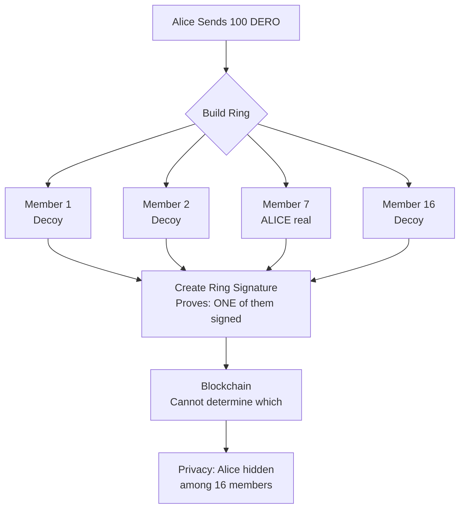

import { Callout } from 'nextra/components'
import { Tabs } from 'nextra/components'

# Ring Signatures

<Callout type="info">
  **Core Concept:** Your address is mixed with 2-128 others. Blockchain sees ONE of them sent the transaction, but can't determine which one.
</Callout>

## How It Works



**Traditional signature:**
```
Alice signs → Everyone knows Alice sent it ❌
```

**Ring signature:**
```
[Alice + 15 others] sign → ONE of 16 sent it, which one? Unknown ✅
```

---

## Ring Size Impact

| Ring Size | Privacy Level | TX Size | Identification Chance |
|-----------|---------------|---------|----------------------|
| 2 | Minimal | 1.67 KB | 50% (1 in 2) |
| 8 | Medium | 3.12 KB | 12.5% (1 in 8) |
| **16** | **Good (Default)** | **4.50 KB** | **6.25% (1 in 16)** |
| 32 | Strong | 6.94 KB | 3.1% (1 in 32) |
| 64 | Very Strong | 11.5 KB | 1.6% (1 in 64) |
| 128 | Maximum | 20.3 KB | 0.8% (1 in 128) |

**Source:** `config/config.go:58-59`
```go
const MIN_RINGSIZE = 2
const MAX_RINGSIZE = 128
```

---

## Real Example

**Transaction:** `4b2ebb476849260f077865756b74248a3ced966628b82eb10cdc56482b852d59`

```
Ring Members (16):
  0: dero1qy...83dd4s
  1: dero1qy...jssfzr
  2: dero1qy...0q74k4
  3: dero1qy...tr9wrs
  4: dero1qy...qa33r9m ← Unknown if sender or decoy
  5: dero1qy...73jc3d
  ...
  15: dero1qy...9nql7m

ONE sent 200,000 DERO
Which one? HIDDEN
```

**Blockchain shows:**
- ✓ 16 possible senders
- ✓ Amount transferred
- ✗ Cannot determine real sender
- ✗ Cannot link to other TXs

---

## How Ring Members Are Selected

**From source code** (`cmd/derod/rpc/rpc_dero_getrandomaddress.go`):

```go
// Get addresses with UNCHANGED balances (past 5 blocks)
for i := 0; i < 100; i++ {
    address := balance_tree.Random()
    old_balance := balance_tree_old.Get(address)
    
    if balance != old_balance {
        continue  // Skip if balance changed recently
    }
    
    candidates = append(candidates, address)
}

// Returns ~140 candidates
// Wallet picks 15 for ring (+ sender = 16)
```

**Why unchanged balances?**
- Better decoys (less likely to exclude)
- Prevents timing attacks
- More plausible anonymity

---

## Encrypted Balance Changes for Ring Members

When an address is included as a ring member (decoy) in a transaction, its encrypted balance changes even though the address performed no actions. This is **normal behavior** and part of how ring signatures provide privacy.

**From source code** (`walletapi/daemon_communication.go`):

```go
// When address is a ring member:
if bytes.Compare(compressed_address, tx.Payloads[t].Statement.Publickeylist_compressed[j][:]) == 0 {
    // Encrypted balance changes for ALL ring members
    changes := crypto.ConstructElGamal(tx.Payloads[t].Statement.C[j], tx.Payloads[t].Statement.D)
    changed_balance_e := previous_balance_e_tx.Add(changes)
    
    // This happens even if address did nothing!
    switch {
    case previous_balance == changed_balance:
        ring_member = true  // Address identified as ring decoy
    }
}
```

**What this means:**
1. Address with zero balance (never used) is selected as ring decoy
2. Encrypted balance changes due to homomorphic operations
3. This is **by design** - all ring members' encrypted balances participate in the transaction
4. The address didn't send anything; it was just included in the ring

**Why this is important:**
- Encrypted balance changes don't indicate the address was the sender
- Ring members are passive participants in the privacy mechanism
- This behavior is cryptographically required for ring signatures to work
- Observing encrypted balance changes alone cannot identify the real sender

**This is normal ring signature behavior, not a protocol flaw.**

---

## What Ring Signatures Protect

| Threat | Protected? | How |
|--------|-----------|-----|
| **Sender Identity** | ✅ Yes | Hidden among ring members |
| **Transaction Linking** | ✅ Yes | Each TX has independent ring |
| **Third-Party Attribution** | ✅ Yes | Plausible deniability |
| **Transaction Amounts** | ❌ No | Needs homomorphic encryption |
| **Network Activity** | ❌ No | Needs TLS/Tor |

**Ring signatures = Sender privacy ONLY**

For complete privacy: Ring sigs + Homomorphic encryption + Bulletproofs + TLS

---

## Why ANY Ring Member Can Generate Proof

All ring members use **same amount** in commitments:

```
C[k] = (amount × G) + pubkey[k]

C[0] = (200000 × G) + addr_0
C[1] = (200000 × G) + addr_1
...
C[7] = (200000 × G) + addr_7  ← Same 200000!
...
```

**Result:** Anyone can pick ANY member, calculate commitment, create "valid" proof.

**This is privacy working as designed** - you can't identify sender by inspection!

*Learn more: [Payload Proofs](/privacy/payload-proofs)*

---

## Best Practices

**For Maximum Privacy:**
- Ring size: 64-128
- Vary transaction timing
- Run own node

**For Balanced Privacy (Recommended):**
- Ring size: 16 (default)
- Standard network
- Trusted or own node

**For Developers:**
```javascript
// Let users choose
transfer({ ringsize: 16 })  // Default
transfer({ ringsize: 64 })  // High privacy
transfer({ ringsize: 128 }) // Maximum
```

---

## Common Misconceptions

| Myth | Reality |
|------|---------|
| "Ring sigs = complete anonymity" | Strong privacy, not absolute. 1 in N chance |
| "Bigger always better" | Trade-off: Privacy vs TX size |
| "Ring members know they're in ring" | No - passive selection, no notification |
| "Decoys must be online" | No - only their public keys used |
| "Encrypted balance change = sender" | No - ring members' balances change by design even as decoys |

---

## Key Takeaways

**What ring signatures provide:**
- ✅ Sender identity hidden (1 in 2-128)
- ✅ Plausible deniability ("might be decoy")
- ✅ Transaction unlinkability
- ✅ No trusted setup needed
- ✅ Proven cryptography

**What they don't provide:**
- ❌ Amount privacy (use homomorphic encryption)
- ❌ Network privacy (use TLS/Tor)
- ❌ Absolute anonymity (probabilistic hiding)

<Callout type="warning">
  **Plausible Deniability:** If accused of sending a transaction, you can truthfully say "I might be just a decoy" - and nobody can prove otherwise!
</Callout>


---

## Related Pages

**Privacy Suite:**
- [Homomorphic Encryption](/privacy/homomorphic-encryption) - Encrypted balances
- [Bulletproofs](/privacy/bulletproofs) - Range proofs
- [Transaction Privacy](/privacy/transaction-privacy) - Complete privacy model
- [Account-Based Privacy](/privacy/account-based-privacy) - Stealth addresses

**How It Works:**
- [DERO Tokens](/basics/tokens) - Ring signatures in token transfers
- [Transaction Structure](/privacy/transaction-privacy) - Ring member selection

**For Developers:**
- [Wallet RPC API](/rpc-api/wallet-rpc-api) - Set ring size in transfers
- [DERO Daemon](/basics/daemon) - Network anonymity layer
