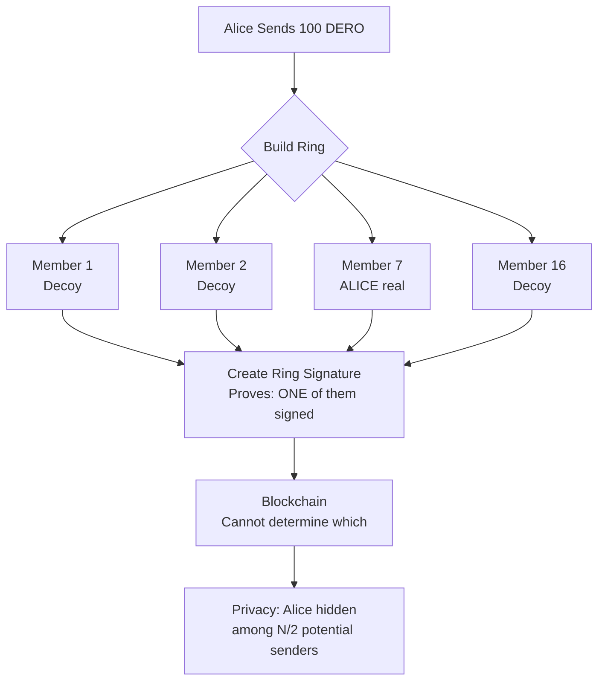

import { Callout } from 'nextra/components'
import { Tabs } from 'nextra/components'
import CaptainNote from '../../components/CaptainNote'

# Ring Signatures

<Callout type="info">
  **Core Concept:** Your address is mixed with others in a ring of 2-128. Rings are split evenly between senders and recipients — only half are possible senders. The blockchain can't determine which one actually sent.
</Callout>

<Callout type="info" emoji="📖">
**Naming note:** "Ring signature" is the user-facing name DERO uses for what the source actually implements as an Anonymous Zether-style anonymity-set ZK proof (see `cryptography/crypto/proof_generate.go` and `proof_verify.go`). The user-facing term is colloquial; the construction is not a classical (Schnorr/LSAG/MLSAG) ring signature.
</Callout>

## How It Works


```mermaid
graph TB
    A[Alice Sends 100 DERO] --> R{Build Ring}
    
    R --> M1[Member 1<br/>Decoy]
    R --> M2[Member 2<br/>Decoy]
    R --> M7[Member 7<br/>ALICE real]
    R --> M16[Member 16<br/>Decoy]
    
    M1 --> S[Create Ring Signature<br/>Proves: ONE of them signed]
    M2 --> S
    M7 --> S
    M16 --> S
    
    S --> BC[Blockchain<br/>Cannot determine which]
    
    BC --> P[Privacy: Alice hidden<br/>among N/2 potential senders]
```

**Traditional signature:**
```
Alice signs → Everyone knows Alice sent it ❌
```

**Ring signature:**
```
[Alice + N-1 others] sign → ONE of N/2 possible senders sent it, which one? Unknown ✅
```

---

## Ring Size Impact

| Ring Size | Privacy Level | TX Size (bytes) | Naive Guess Probability |
|-----------|---------------|----------------|-------------------------|
| 2 | Minimal | 1553 | 1 in 1 (no sender privacy) |
| 4 | Low | 2013 | 1 in 2 |
| 8 | Medium | 2605 | 1 in 4 |
| 16 | Good | 3461 | 1 in 8 |
| 32 | Strong | 4825 | 1 in 16 |
| 64 | Very Strong | 7285 | 1 in 32 |
| 128 | Maximum | 11839 | 1 in 64 |

**Note:** Rings are split evenly — half the members are potential senders, half are potential recipients. The naive guess probability is therefore 1/(ring_size/2), not 1/ring_size. Ring size 2 (1 sender slot, 1 recipient slot) provides no meaningful sender privacy.

**Sources:**
- Ring size limits: `config/config.go:58-59`
- Transaction sizes: `README.md` (Transactions Sizes table)

```go
const MIN_RINGSIZE = 2
const MAX_RINGSIZE = 128
```

---

## Real Example

**Transaction:** `4b2ebb476849260f077865756b74248a3ced966628b82eb10cdc56482b852d59`

```
Ring Members (16):
  0: dero1qy...83dd4s
  1: dero1qy...jssfzr
  2: dero1qy...0q74k4
  3: dero1qy...tr9wrs
  4: dero1qy...qa33r9m ← Unknown if sender or decoy
  5: dero1qy...73jc3d
  ...
  15: dero1qy...9nql7m

ONE sent 200,000 DERO
Which one? HIDDEN
```

**Blockchain shows (for this example ring):**
- ✓ 8 possible senders (half the ring)
- ✗ Amount (encrypted)
- ✗ Cannot determine real sender
- ✗ Cannot link to other TXs

---

## How Ring Members Are Selected

**Source** (`cmd/derod/rpc/rpc_dero_getrandomaddress.go:80-111` — quoted verbatim):

```go
account_map := map[string]bool{}

for i := 0; i < 100; i++ {
    k, v, err := balance_tree.Random()
    if err != nil {
        continue
    }
    v_old, err := balance_tree_old.Get(k)
    if err != nil {
        continue
    }
    if bytes.Compare(v, v_old) != 0 {
        continue // docs: balance recently changed → not a stable decoy
    }
    var acckey crypto.Point
    if err := acckey.DecodeCompressed(k[:]); err != nil {
        continue
    }
    addr := rpc.NewAddressFromKeys(&acckey)
    addr.Mainnet = (globals.Config.Name == config.Mainnet.Name)
    account_map[addr.String()] = true
    if len(account_map) > 140 {
        break
    }
}
// docs: returns up to ~140 candidate addresses; wallet samples ring_size-1 of them.
```

**Why unchanged balances?**
- Better decoys (less likely to exclude)
- Prevents timing attacks
- More plausible anonymity

### Roadmap: polymorphic ring selection

The selection algorithm described above — uniform random sampling of recently-unchanged-balance addresses — is the current implementation, not the long-term design. Captain has signaled the wallet layer is targeted for *polymorphic* per-wallet selection logic so that no two wallets pick decoys the same way.

<CaptainNote
  source="https://discord.com/channels/419781880632836096/419781880632836098/1050436403042988153"
  date="2022-12-08"
  channel="#dero-discussion"
>
  Also in free time wallet part will have new/modified code to handle more chain-analysis &amp; some points discussed above. Wallet will have some polymorphic code &amp; algo so that no single or two wallets work &amp; selects ring members in same way single/everytime. Also users will be able to configure this part to their preferences.
</CaptainNote>

No timeline has been published. The uniform algorithm above remains in force on Release 142.

---

## The Parity Constraint: How the Ring Is Split

The even/odd split between sender and recipient positions is not a convention — it is a hard constraint enforced at both the wallet layer and the cryptographic proof layer.

### The Rule

When the wallet shuffles ring positions, it keeps shuffling until the sender and receiver land on indices of **different parity** (one even, one odd).

**From source code** (`walletapi/transaction_build.go:79-90`):

```go
for {
    crand.Shuffle(len(witness_index), func(i, j int) {
        witness_index[i], witness_index[j] = witness_index[j], witness_index[i]
    })

    // make sure sender and receiver are not both odd or both even
    // sender will always be at  witness_index[0] and receiver will always be at witness_index[1]
    if witness_index[0]%2 != witness_index[1]%2 {
        break
    }
}
```

The comment in the source says it plainly: sender and receiver must not share parity. One occupies an even index; the other occupies an odd index.

### Cryptographic Enforcement

The proof generation encodes this split into two separate polynomial sets — `P` for even-indexed ring members, `Q` for odd-indexed ring members. An observer cannot determine which parity the sender occupies.

**Source** (`cryptography/crypto/proof_generate.go:700-723` — code below is verbatim; the `// docs:` lines are docs annotations, not in source):

```go
for i := 0; i < N; i++ {
    var poly [][]*big.Int
    if i%2 == 0 {
        poly = P   // docs: even indices form one parity group
    } else {
        poly = Q   // docs: odd indices form the other parity group
    }
    // ... math at lines 721-723 uses
    //     poly[j][(witness.Index[0]+N-(i-i%2))%N]  (sender side)
    //     poly[j][(witness.Index[1]+N-(i-i%2))%N]  (receiver side)
}
```

The witness index itself is encoded as an 8-bit string (for ring size 16, m=4 bits per role) that interleaves sender and receiver positions (`proof_generate.go:523`):

```go
witness_index := reverse(fmt.Sprintf("%0"+fmt.Sprintf("%db", m)+"%0"+fmt.Sprintf("%db", m), witness.Index[1], witness.Index[0]))
```

This structure means the proof system treats even and odd positions as fundamentally separate roles — an attacker cannot forge a valid proof by swapping one for the other.

### Concrete Example: Ring Size 16

```
Ring positions:  0   1   2   3   4   5   6   7   8   9  10  11  12  13  14  15
Parity:          E   O   E   O   E   O   E   O   E   O   E   O   E   O   E   O
                 └── Sender candidates ──┘   └── Recipient candidates ──┘
                     (8 even slots)               (8 odd slots)
                                    (or vice versa — observer cannot tell which)
```

- **8 even indices** (0, 2, 4, 6, 8, 10, 12, 14) — one parity role
- **8 odd indices** (1, 3, 5, 7, 9, 11, 13, 15) — the other parity role
- The sender is one of the 8 members in their parity group → probability of correct identification: **1/8 = 12.5%**

### Why Ring Size 2 Offers No Anonymity Set

With ring size 2: one even slot (index 0), one odd slot (index 1). The sender occupies one slot, the recipient the other. The parity assignment itself (which parity is the sender's role) is **cryptographically hidden** — the verifier's parity check at `cryptography/crypto/proof_verify.go:130-141` rejects malformed parity but does not reveal the assignment to observers. So an observer sees the two ring members and knows one sent and one received, but cannot tell from on-chain data alone which is which.

The reason ring size 2 is listed as "no sender privacy" is not that the parity leaks — it's that there is **no anonymity set within the sender's parity role**: there is exactly one candidate sender (the lone member of that parity), so the sender's identity collapses to the singleton on that side. Any additional out-of-band signal (timing, IP, repeated patterns across transactions, known counter-party relationships) then resolves the pair trivially. Ring size 2 should therefore be treated as no meaningful anonymity, even though the parity itself remains hidden.

Captain has stated explicitly that this collapse is **intentional** — ring size 2 is the opt-in mode for transactions where the sender wants to be mathematically provable (audit trails, exchange deposits, KYC reconciliation):

<CaptainNote
  variant="verified"
  source="https://discord.com/channels/419781880632836096/737351309396541471/911455371766407210"
  date="2021-11-20"
  channel="#dero-he-testnet"
  codeRef="config/config.go:58 (MIN_RINGSIZE = 2); walletapi/daemon_communication.go:1067-1074 (// if ring size is 2, the other party is the sender so mark it so)"
>
  This is by design. By this you can prove sender mathematically. This is a feature not a bug. There may be some situations/applications when you need to reveal sender, In that case send TX by setting RingSize to 2.
</CaptainNote>

In other words: the table above is correct that ring size 2 provides no sender anonymity — and that is the point. The sender is choosing to be derivable. Note: DERO-PROOF is a separate mechanism — it's a receiver-side receipt that reveals receiver+amount+payload and works at *any* ring size. See [Account-Based Privacy → What a verified DERO-PROOF reveals](/privacy/account-based-privacy#what-a-verified-dero-proof-reveals).

### Verify It Yourself

| Protection | File | Lines |
|------------|------|-------|
| Parity constraint (wallet) | `walletapi/transaction_build.go` | 79-90 |
| P/Q polynomial split (proof) | `cryptography/crypto/proof_generate.go` | 700-710 |
| Witness index encoding | `cryptography/crypto/proof_generate.go` | 523 |
| Ring size limits | `config/config.go` | 58-59 |

```bash
git clone https://github.com/deroproject/derohe.git
cd derohe

sed -n '79,90p' walletapi/transaction_build.go          # Parity constraint
sed -n '700,710p' cryptography/crypto/proof_generate.go # P/Q polynomial split
sed -n '523p' cryptography/crypto/proof_generate.go     # Witness index encoding
grep "RINGSIZE" config/config.go                        # Ring size limits
```

---

## Encrypted Balance Changes for Ring Members

When an address is included as a ring member (decoy) in a transaction, its encrypted balance changes even though the address performed no actions. This is **normal behavior** and part of how ring signatures provide privacy.

**Source** (`walletapi/daemon_communication.go:863-903` — code below is verbatim; the `// docs:` lines are docs annotations, not in source):

```go
if bytes.Compare(compressed_address, tx.Payloads[t].Statement.Publickeylist_compressed[j][:]) == 0 {
    // docs: this monitored address appears in the ring at slot j.
    changes := crypto.ConstructElGamal(tx.Payloads[t].Statement.C[j], tx.Payloads[t].Statement.D)
    changed_balance_e := previous_balance_e_tx.Add(changes)
    // docs: the encrypted balance ciphertext updates regardless of role
    //       (sender / receiver / decoy) — observers can't distinguish from this.
    switch {
    case previous_balance == changed_balance: //ring member/* handle 0 value tx but fees is deducted */
        //fmt.Printf("Anon Ring Member in TX %s\n", bl.Tx_hashes[i].String())
        ring_member = true
    case previous_balance > changed_balance: // we generated this tx
        // ...
    }
}
```

**What this means:**
1. Address with zero balance (never used) is selected as ring decoy
2. Encrypted balance changes due to homomorphic operations
3. This is **by design** - all ring members' encrypted balances participate in the transaction
4. The address didn't send anything; it was just included in the ring

**Why this is important:**
- Encrypted balance changes don't indicate the address was the sender
- Ring members are passive participants in the privacy mechanism
- This behavior is cryptographically required for ring signatures to work
- Observing encrypted balance changes alone cannot identify the real sender

**This is normal ring signature behavior, not a protocol flaw.**

---

## What Ring Signatures Protect

| Threat | Protected? | How |
|--------|-----------|-----|
| **Sender Identity** | ✅ Yes | Hidden among ring members |
| **Transaction Linking** | ✅ Yes | Each TX has independent ring |
| **Third-Party Attribution** | ✅ Yes | Plausible deniability |
| **Transaction Amounts** | ❌ No | Needs homomorphic encryption |
| **Network Activity** | ❌ No | Needs TLS/Tor |

**Ring signatures = Sender privacy ONLY**

For complete privacy: Ring sigs + Homomorphic encryption + Bulletproofs + TLS

---

## Why ANY Ring Member Can Generate Proof

All ring members use **same amount** in commitments:

```
C[k] = (amount × G) + pubkey[k]

C[0] = (200000 × G) + addr_0
C[1] = (200000 × G) + addr_1
...
C[7] = (200000 × G) + addr_7  ← Same 200000!
...
```

**Result:** Anyone can pick ANY member, calculate commitment, create "valid" proof.

**This is privacy working as designed** - you can't identify sender by inspection!

*Learn more: [Payload Proofs](/privacy/payload-proofs)*

---

## Best Practices

**For Maximum Privacy:**
- Ring size: 64-128
- Vary transaction timing
- Run own node

**For Balanced Privacy (Recommended):**
- Ring size: 16
- Standard network
- Trusted or own node

**For Developers:**
```javascript
// Let users choose
transfer({ ringsize: 16 })  // Example
transfer({ ringsize: 64 })  // High privacy
transfer({ ringsize: 128 }) // Maximum
```

---

## Common Misconceptions

| Myth | Reality |
|------|---------|
| "Ring sigs = complete anonymity" | Strong privacy, not absolute. 1 in (N/2) chance |
| "Bigger always better" | Trade-off: Privacy vs TX size |
| "Ring members know they're in ring" | No - passive selection, no notification |
| "Decoys must be online" | No - only their public keys used |
| "Encrypted balance change = sender" | No - ring members' balances change by design even as decoys |

---

## Key Takeaways

**What ring signatures provide:**
- ✅ Sender identity hidden (1 in 1-64, i.e. 1 in ring_size/2)
- ✅ Plausible deniability ("might be decoy")
- ✅ Transaction unlinkability
- ✅ No trusted setup needed
- ✅ Proven cryptography

**What they don't provide:**
- ❌ Amount privacy (use homomorphic encryption)
- ❌ Network privacy (use TLS/Tor)
- ❌ Absolute anonymity (probabilistic hiding)

<Callout type="warning">
  **Plausible Deniability:** If accused of sending a transaction, you can truthfully say "I might be just a decoy" - and nobody can prove otherwise!
</Callout>


---

## Related Pages

**Privacy Suite:**
- [Homomorphic Encryption](/privacy/homomorphic-encryption) - Encrypted balances
- [Bulletproofs](/privacy/bulletproofs) - Range proofs
- [Transaction Privacy](/privacy/transaction-privacy) - Complete privacy model
- [Account-Based Privacy](/privacy/account-based-privacy) - Stealth addresses

**How It Works:**
- [DERO Tokens](/basics/tokens) - Ring signatures in token transfers
- [Transaction Structure](/privacy/transaction-privacy) - Ring member selection

**For Developers:**
- [Wallet RPC API](/rpc-api/wallet-rpc-api) - Set ring size in transfers
- [DERO Daemon](/basics/daemon) - Network anonymity layer
