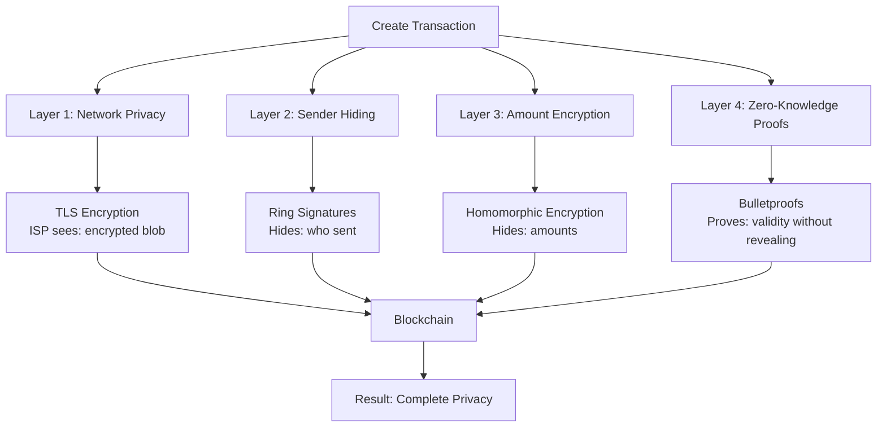
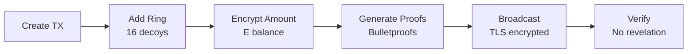

import { Callout } from 'nextra/components'
import { Tabs } from 'nextra/components'

# Complete Transaction Privacy

<Callout type="info">
  **Multi-Layer Defense:** DERO combines ring signatures, homomorphic encryption, bulletproofs, and TLS encryption. Even if one layer weakens, others protect your privacy.
</Callout>

## How Privacy Layers Work Together

DERO's privacy isn't a single feature—it's four independent layers that work together. Each layer protects different aspects of your transaction, and they're designed so that even if one layer weakens, others maintain your privacy.

**The Flow:**


**How They Interact:**

When you send a transaction, each layer adds privacy at a different stage. Network encryption protects your traffic from ISPs. Ring signatures hide which address sent the transaction. Homomorphic encryption keeps all amounts secret. Bulletproofs prove validity without revealing anything. Together, they create defense in depth—multiple barriers that protect your privacy even if one layer is compromised.

**Source Code References:**
- Network: `p2p/connection.go` (TLS encryption)
- Sender: `cryptography/crypto/proof_verify.go` (ring signatures)
- Amount: `cryptography/crypto/algebra_elgamal.go` (homomorphic encryption)
- Proofs: `cryptography/crypto/bulletproof.go` (zero-knowledge proofs)

---

## What Each Observer Sees

Understanding what different parties can and cannot see helps illustrate how DERO's privacy layers work together in practice.

| Observer | Can See | Cannot See | Why Privacy Maintained |
|----------|---------|-----------|----------------------|
| **ISP/Network** | Encrypted traffic to DERO | Transaction details, amounts, addresses | TLS encryption hides all content |
| **Blockchain** | Ring (2-128 members), encrypted commitments | Real sender, actual amounts, balances | Ring signatures + homomorphic encryption |
| **Chainalysis** | Transaction patterns, metadata | Definitive sender, amounts, proof of sending | Cannot prove specific sender identity |
| **Bob (receiver)** | Amount, comment, sender position | Alice's balance, other transactions | Only sees his own transaction details |
| **Alice (sender)** | Everything (has private keys) | - | Controls own privacy through wallet |

---

## Real Transaction Example

**Alice → Bob: 100 DERO**

<Tabs items={['What Alice Sees', 'What Network Sees', 'What Blockchain Shows', 'What Bob Sees']}>
  <Tabs.Tab>
    ```
    Balance: 500 DERO
    Send: 100 DERO
    To: Bob
    Comment: "Coffee"
    
    After send:
    Balance: 400 DERO ✓
    ```
  </Tabs.Tab>
  
  <Tabs.Tab>
    ```
    TLS-encrypted packet
    Cannot read:
      ✗ Who sent
      ✗ Amount
      ✗ Recipient
      ✗ Any details
      
    Sees only: Encrypted blob
    ```
  </Tabs.Tab>
  
  <Tabs.Tab>
    ```
    Ring: [16 addresses including Alice]
    Commitments: E(100), E(500→400), E(200→300)
    Proofs: ✓ Valid
    
    Cannot determine:
      ✗ Which address is Alice
      ✗ Amounts (encrypted)
      ✗ Balances
    ```
  </Tabs.Tab>
  
  <Tabs.Tab>
    ```
    Received: 100 DERO
    From: Position 7 in ring
    Comment: "Coffee"
    
    Cannot see:
      ✗ Alice's balance
      ✗ Alice's other TXs
    ```
  </Tabs.Tab>
</Tabs>

---

## Privacy at Each Stage



| Stage | Privacy Added | Source Code |
|-------|--------------|-------------|
| **Creation** | Local only | `walletapi/wallet_transfer.go:62` |
| **Ring Formation** | Sender hiding | `cryptography/crypto/proof_generate.go` |
| **Encryption** | Amount hiding | `cryptography/crypto/algebra_elgamal.go:69` |
| **Proofs** | ZK validation | `cryptography/crypto/bulletproof.go` |
| **Broadcast** | Network encryption | `p2p/connection.go` (TLS) |
| **Verification** | Homomorphic check | `blockchain/transaction_execute.go:239` |

---

## Key Takeaways

**What's Protected:**
- Sender identity (hidden among 2-128 ring members, default: 6.25% chance)
- All amounts (encrypted with homomorphic encryption, never decrypted)
- All balances (encrypted at all times)
- Transaction linkage (unlinkable, independent rings per transaction)

**What's Visible (Necessary for Function):**
- Transaction occurred (required for processing)
- Ring member list (creates ambiguity, actually protects privacy)
- Timing metadata (doesn't reveal transaction details)

**DERO's Design:** Privacy over third-party verification. Only you (with private keys) can prove you sent a transaction. Third parties cannot definitively prove sender identity—this is by design. Plausible deniability is a feature, not a bug.

<Callout type="warning">
  **Remember:** Privacy requires ambiguity. If you could prove to others you sent a transaction, your privacy would be broken. Plausible deniability is a feature, not a bug.
</Callout>

---

## Related Pages

**Privacy Technologies:**
- [Homomorphic Encryption](/privacy/homomorphic-encryption) - Encrypted balances
- [Ring Signatures](/privacy/ring-signatures) - Sender anonymity
- [Bulletproofs](/privacy/bulletproofs) - Range proofs
- [Payload Proofs](/privacy/payload-proofs) - Prove your transactions

**Understanding Transactions:**
- [DERO Tokens](/basics/tokens) - Private token transfers
- [Account-Based Privacy](/privacy/account-based-privacy) - Stealth addresses

**For Users:**
- [DERO Wallets](/basics/wallets) - Send private transactions
- [Wallet RPC API](/rpc-api/wallet-rpc-api) - Programmatic transfers
