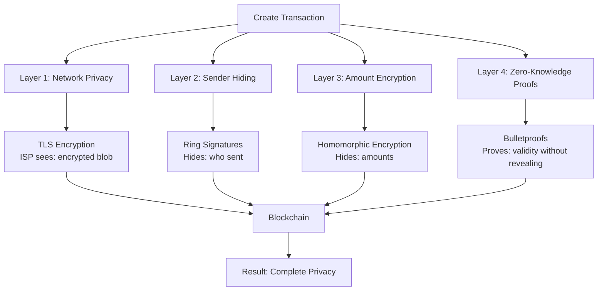
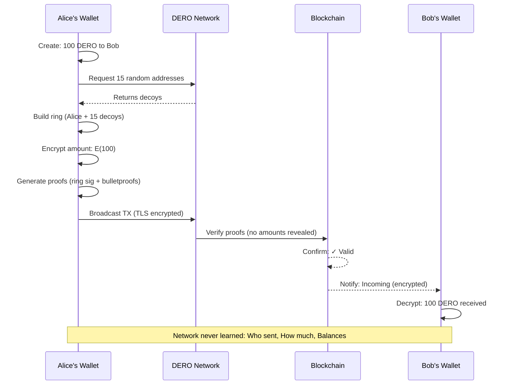
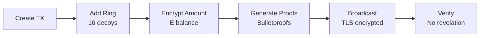

import { Callout } from 'nextra/components'
import { Tabs } from 'nextra/components'

# Complete Transaction Privacy

<Callout type="info">
  **Multi-Layer Defense:** DERO combines ring signatures, homomorphic encryption, bulletproofs, and TLS encryption. Even if one layer weakens, others protect your privacy.
</Callout>

## The 4 Privacy Layers



| Layer | What It Protects | How | Verification |
|-------|-----------------|-----|--------------|
| **Network** | IP linking, eavesdropping | TLS/UDP encryption | `blockchain/transaction_execute.go` |
| **Sender** | Identity, linkability | Ring signatures (2-128) | `cryptography/crypto/proof_verify.go` |
| **Amount** | Balances, transfers | Homomorphic (ElGamal) | `cryptography/crypto/algebra_elgamal.go` |
| **Proofs** | Validity revelation | Bulletproofs (ZK) | `cryptography/crypto/bulletproof.go` |

---

## Transaction Flow

**Alice sends 100 DERO to Bob:**



---

## What Each Observer Sees

| Observer | Can See | Cannot See |
|----------|---------|------------|
| **ISP** | Encrypted traffic to DERO | Transaction details, amounts, addresses |
| **Blockchain** | Ring (2-128 members), encrypted commitments | Real sender, actual amounts, balances |
| **Chainalysis** | Transaction patterns, metadata | Definitive sender, amounts, proof of sending |
| **Bob (receiver)** | Amount, comment, sender position | Alice's balance, other transactions |
| **Alice (sender)** | Everything | - |

---

## Privacy Comparison

| Blockchain | Sender | Amount | Balance | Network |
|------------|--------|--------|---------|---------|
| **Bitcoin** | 👁️ Public | 👁️ Public | 👁️ Public | 🔓 Cleartext |
| **Ethereum** | 👁️ Public | 👁️ Public | 👁️ Public | 🔓 Cleartext |
| **Privacy Coins** | 🔒 Hidden | 🔒 Hidden | 🔒 Hidden | 🔓 Cleartext |
| **DERO** | 🔒 Hidden | 🔒 Encrypted | 🔒 Encrypted | 🔐 TLS |

---

## Real Transaction Example

**Alice → Bob: 100 DERO**

<Tabs items={['What Alice Sees', 'What Network Sees', 'What Blockchain Shows', 'What Bob Sees']}>
  <Tabs.Tab>
    ```
    Balance: 500 DERO
    Send: 100 DERO
    To: Bob
    Comment: "Coffee"
    
    After send:
    Balance: 400 DERO ✓
    ```
  </Tabs.Tab>
  
  <Tabs.Tab>
    ```
    TLS-encrypted packet
    Cannot read:
      ✗ Who sent
      ✗ Amount
      ✗ Recipient
      ✗ Any details
      
    Sees only: Encrypted blob
    ```
  </Tabs.Tab>
  
  <Tabs.Tab>
    ```
    Ring: [16 addresses including Alice]
    Commitments: E(100), E(500→400), E(200→300)
    Proofs: ✓ Valid
    
    Cannot determine:
      ✗ Which address is Alice
      ✗ Amounts (encrypted)
      ✗ Balances
    ```
  </Tabs.Tab>
  
  <Tabs.Tab>
    ```
    Received: 100 DERO
    From: Position 7 in ring
    Comment: "Coffee"
    
    Cannot see:
      ✗ Alice's balance
      ✗ Alice's other TXs
    ```
  </Tabs.Tab>
</Tabs>

---

## Privacy at Each Stage



| Stage | Privacy Added | Source Code |
|-------|--------------|-------------|
| **Creation** | Local only | `walletapi/wallet_transfer.go:62` |
| **Ring Formation** | Sender hiding | `cryptography/crypto/proof_generate.go` |
| **Encryption** | Amount hiding | `cryptography/crypto/algebra_elgamal.go:69` |
| **Proofs** | ZK validation | `cryptography/crypto/bulletproof.go` |
| **Broadcast** | Network encryption | `p2p/connection.go` (TLS) |
| **Verification** | Homomorphic check | `blockchain/transaction_execute.go:239` |

---

## Privacy Threats & Mitigations

| Threat | How It Works | Mitigation | Effectiveness |
|--------|--------------|------------|---------------|
| **Timing Attack** | Correlate online time with TX | Random delays, Tor | Low risk |
| **Amount Fingerprint** | Link unique amounts | Vary amounts | Medium risk |
| **Network Analysis** | ISP monitoring | TLS + Tor/VPN | Low risk |
| **Ring Decoy** | Fake proofs claiming you sent | Plausible deniability, empty payload check | Medium risk |

---

## Key Takeaways

**What's Hidden:**
- ✅ Sender identity (1 in 2-128 ring members)
- ✅ All amounts (ElGamal encrypted)
- ✅ All balances (never decrypted)
- ✅ Transaction linkage (unlinkable)

**What's Visible:**
- ⚠️ Transaction occurred
- ⚠️ Ring member list (necessary for privacy)
- ⚠️ Timing metadata

**DERO's Choice:** Prioritize privacy over third-party verification

<Callout type="warning">
  **Remember:** Privacy requires ambiguity. If you could prove to others you sent a transaction, your privacy would be broken. Plausible deniability is a feature, not a bug.
</Callout>

---

## Related Pages

**Privacy Technologies:**
- [Homomorphic Encryption](/privacy/homomorphic-encryption) - Encrypted balances
- [Ring Signatures](/privacy/ring-signatures) - Sender anonymity
- [Bulletproofs](/privacy/bulletproofs) - Range proofs
- [Payload Proofs](/privacy/payload-proofs) - Prove your transactions

**Understanding Transactions:**
- [DERO Tokens](/basics/tokens) - Private token transfers
- [Account-Based Privacy](/privacy/account-based-privacy) - Stealth addresses

**For Users:**
- [DERO Wallets](/basics/wallets) - Send private transactions
- [Wallet RPC API](/rpc-api/wallet-rpc-api) - Programmatic transfers
