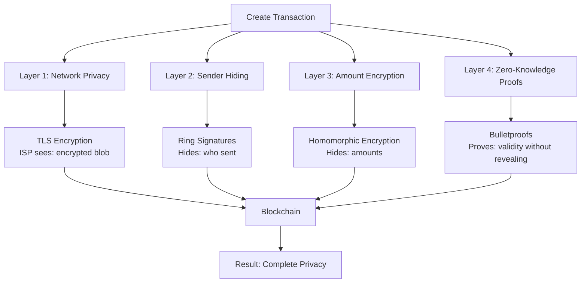
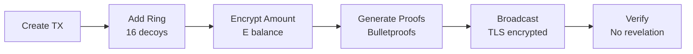

import { Callout } from 'nextra/components'
import { Tabs } from 'nextra/components'

# Complete Transaction Privacy

<Callout type="info">
  **Multi-Layer Defense:** DERO combines ring signatures, homomorphic encryption, bulletproofs, and TLS encryption. Even if one layer weakens, others protect your privacy.
</Callout>

## How Privacy Layers Work Together

DERO's privacy is layered. Network encryption (TLS), anonymity-set membership, amount encryption, and zero-knowledge proofs each address a different observer and a different question. They are **not** four interchangeable locks against the same attack — they cover different surfaces.

<Callout type="info" emoji="📖">
**Naming note:** "Ring signature" is the user-facing name DERO uses for what the source actually implements as an Anonymous Zether-style anonymity-set ZK proof (see `cryptography/crypto/proof_generate.go` and `proof_verify.go`). The user-facing term is colloquial; the construction is not a classical (Schnorr/LSAG/MLSAG) ring signature.
</Callout>

**The Flow:**

```mermaid
flowchart TD
    TX[Create Transaction]
    
    TX --> L1[Layer 1: Network Privacy]
    TX --> L2[Layer 2: Sender Hiding]
    TX --> L3[Layer 3: Amount Encryption]
    TX --> L4[Layer 4: Zero-Knowledge Proofs]
    
    L1 --> P1[TLS Encryption<br/>ISP sees: encrypted blob]
    L2 --> P2[Ring Signatures<br/>Hides: who sent]
    L3 --> P3[Homomorphic Encryption<br/>Hides: amounts]
    L4 --> P4[Bulletproofs<br/>Proves: validity without revealing]
    
    P1 --> BC[Blockchain]
    P2 --> BC
    P3 --> BC
    P4 --> BC
    
    BC --> R[Result: Complete Privacy]
   
```

**How They Interact:**

When you send a transaction, each layer addresses a different observer at a different stage. Network encryption protects your traffic from ISPs. Anonymity-set membership hides which address sent the transaction. Homomorphic encryption keeps all amounts secret. Bulletproofs prove validity without revealing the underlying values — and, at the integrity layer, **bulletproof soundness is the single cryptographic gate that prevents negative-transfer / wraparound mints**. The privacy layers and the integrity gate are not "defense in depth" against the same attack; they cover different surfaces.

**Source Code References:**
- Network: `p2p/controller.go` (TLS encryption)
- Sender: `cryptography/crypto/proof_verify.go` (ring signatures)
- Amount: `cryptography/crypto/algebra_elgamal.go` (homomorphic encryption)
- Proofs: `cryptography/crypto/proof_generate.go` and `cryptography/crypto/proof_innerproduct.go` (range proof + inner product)

---

## What Each Observer Sees

Understanding what different parties can and cannot see helps illustrate how DERO's privacy layers work together in practice.

| Observer | Can See | Cannot See | Why Privacy Maintained |
|----------|---------|-----------|----------------------|
| **ISP/Network** | Encrypted traffic to DERO | Transaction details, amounts, addresses | TLS encryption hides content from **passive** observers. Caveat: the p2p layer uses `tls.Config{InsecureSkipVerify: true}` with self-signed certs (`p2p/controller.go:398`, cert at `:551`), so an **active** MITM (e.g., a hostile ISP that can intercept and present its own self-signed cert) is *not* defended against by TLS alone — the upstream code itself acknowledges this with the comment `// NOTE: this does NOT protect from individual active man-in-the-middle attacks` at `p2p/controller.go:716`. |
| **Blockchain** | Ring (2-128 members), encrypted commitments | Real sender, actual amounts, balances | Ring signatures + homomorphic encryption |
| **Chainalysis** | Transaction patterns, metadata | Definitive sender, amounts, proof of sending | Cannot prove specific sender identity |
| **Bob (receiver)** | Amount, comment, sender position | Alice's balance, other transactions | Only sees his own transaction details |
| **Alice (sender)** | Everything (has private keys) | - | Controls own privacy through wallet |

---

## Real Transaction Example

**Alice → Bob: 100 DERO**

<Tabs items={['What Alice Sees', 'What Network Sees', 'What Blockchain Shows', 'What Bob Sees']}>
  <Tabs.Tab>
    ```
    Balance: 500 DERO
    Send: 100 DERO
    To: Bob
    Comment: "Coffee"
    
    After send:
    Balance: 400 DERO ✓
    ```
  </Tabs.Tab>
  
  <Tabs.Tab>
    ```
    TLS-encrypted packet
    Cannot read:
      ✗ Who sent
      ✗ Amount
      ✗ Recipient
      ✗ Any details
      
    Sees only: Encrypted blob
    ```
  </Tabs.Tab>
  
  <Tabs.Tab>
    ```
    Ring: [16 addresses including Alice]
    Commitments: E(100), E(500→400), E(200→300)
    Proofs: ✓ Valid
    
    Cannot determine:
      ✗ Which address is Alice
      ✗ Amounts (encrypted)
      ✗ Balances
    ```
  </Tabs.Tab>
  
  <Tabs.Tab>
    ```
    Received: 100 DERO
    From: Position 7 in ring
    Comment: "Coffee"
    
    Cannot see:
      ✗ Alice's balance
      ✗ Alice's other TXs
    ```
  </Tabs.Tab>
</Tabs>

---

## Privacy at Each Stage


```mermaid
graph LR
    C[Create TX] --> R[Add Ring<br/>16 decoys]
    R --> E[Encrypt Amount<br/>E balance]
    E --> P[Generate Proofs<br/>Bulletproofs]
    P --> N[Broadcast<br/>TLS encrypted]
    N --> V[Verify<br/>No revelation]
    
```

| Stage | Privacy Added | Source Code |
|-------|--------------|-------------|
| **Creation** | Local only | `walletapi/wallet_transfer.go:62` |
| **Ring Formation** | Sender hiding | `cryptography/crypto/proof_generate.go` |
| **Encryption (ciphertext construction)** | Amount hiding | `cryptography/crypto/algebra_elgamal.go:44` (`CommitElGamal`) |
| **Homomorphic addition (during balance update)** | Update encrypted balance without decrypting | `cryptography/crypto/algebra_elgamal.go:69` (`Add`) |
| **Proofs** | ZK validation | `cryptography/crypto/proof_generate.go` + `cryptography/crypto/proof_innerproduct.go` |
| **Broadcast** | Network encryption | `p2p/controller.go:398` (TLS — self-signed, no client/server auth) |
| **Verification** | Homomorphic balance update applied to ciphertexts | `blockchain/transaction_execute.go:239` (`nb.Balance.Add(echanges)`) |

---

## Key Takeaways

**What's Protected:**
- Sender identity (hidden among ring_size/2 potential senders; naive guess probability is 1/(ring_size/2), e.g., 1/8 for ring size 16)
- All amounts (encrypted with homomorphic encryption, never decrypted)
- All balances (encrypted at all times)
- Transaction linkage (unlinkable, independent rings per transaction)

**What's Visible (Necessary for Function):**
- Transaction occurred (required for processing)
- Ring member list (creates ambiguity, actually protects privacy)
- Timing metadata (doesn't reveal transaction details)

**DERO's Design:** Privacy over third-party verification. Only you (with private keys) can prove you sent a transaction. Third parties cannot definitively prove sender identity—this is by design. Plausible deniability is a feature, not a bug.

<Callout type="warning">
  **Remember:** Privacy requires ambiguity. If you could prove to others you sent a transaction, your privacy would be broken. Plausible deniability is a feature, not a bug.
</Callout>

---

## Related Pages

**Privacy Technologies:**
- [Homomorphic Encryption](/privacy/homomorphic-encryption) - Encrypted balances
- [Ring Signatures](/privacy/ring-signatures) - Sender anonymity
- [Bulletproofs](/privacy/bulletproofs) - Range proofs
- [Payload Proofs](/privacy/payload-proofs) - Prove your transactions

**Understanding Transactions:**
- [DERO Tokens](/basics/tokens) - Private token transfers
- [Account-Based Privacy](/privacy/account-based-privacy) - Stealth addresses

**For Users:**
- [DERO Wallets](/basics/wallets) - Send private transactions
- [Wallet RPC API](/rpc-api/wallet-rpc-api) - Programmatic transfers
