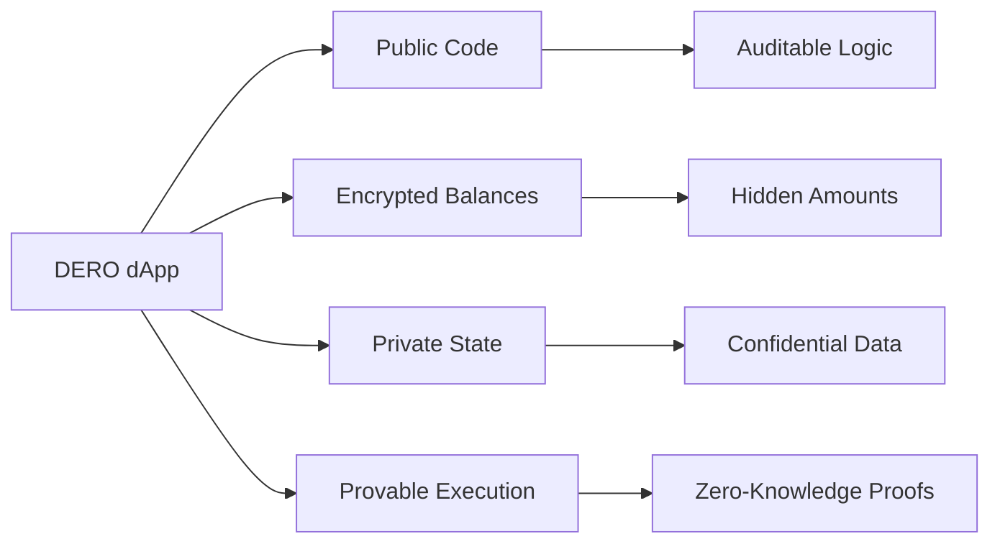

import Image from 'next/image';
import { Callout } from 'nextra/components';

# DERO dApps: Private Decentralized Applications


**Decentralized Applications (dApps)** are applications that run on blockchain technology rather than centralized servers. They operate on distributed networks where no single authority can control, censor, or shut them down.

<Callout type="info">
**DERO's Unique Advantage:** The world's first blockchain with **private smart contracts** using homomorphic encryption. Your dApp code is public and auditable, but all **balances, amounts, and financial data** remain encrypted on-chain.
</Callout>

---

## What Makes DERO dApps Special?



| Feature | Traditional Blockchains | DERO |
|---------|------------------------|------|
| **Smart Contracts** | ✅ Public | ✅ Private |
| **Balances** | ❌ Visible | ✅ Encrypted (Homomorphic) |
| **Transaction Amounts** | ❌ Public | ✅ Hidden (Bulletproofs) |
| **Contract State** | ❌ All visible | ✅ Financial data encrypted |
| **Speed** | ~15-60 seconds | ⚡ ~16 seconds |

---

## DERO dApp Categories

### 🏦 **DeFi (Decentralized Finance)**

Build financial applications with complete privacy:

- **Private DEXs** - Swap tokens without revealing amounts
- **Anonymous Escrow** - Trustless transactions with hidden balances
- **Private Lending** - Collateralized loans with encrypted positions
- **Yield Vaults** - Staking rewards without exposing holdings

**Example:** Private token swap where neither party knows the other's total balance.

### 🎮 **Gaming & Entertainment**

Privacy-enhanced gaming experiences:

- **Provably Fair Gambling** - Lottery, poker, baccarat with on-chain randomness
- **Play-to-Earn** - Hidden inventory and earnings
- **Virtual Assets** - Private ownership of in-game items
- **Tournament Platforms** - Anonymous competitive gaming

**Example:** Poker game where hand values and bet amounts remain hidden until reveal.

### 💬 **Social & Communication**

Censorship-resistant platforms:

- **Anonymous Forums** - Decentralized message boards (DEchan)
- **Private Messaging** - On-chain encrypted communication
- **Content Platforms** - Creator monetization without intermediaries
- **Voting Systems** - Anonymous governance with verifiable results

### 🛒 **Marketplaces & Commerce**

Private peer-to-peer commerce:

- **Anonymous Marketplaces** - Buy/sell without exposing wallet balances
- **Digital Goods** - NFTs with private metadata
- **Service Platforms** - Freelance work with encrypted payments
- **Supply Chain** - Track goods with selective disclosure

### 🔧 **Infrastructure**

Decentralized services:

- **Name Service** - Human-readable addresses (like ENS)
- **Storage Pointers** - Decentralized file references
- **Oracle Services** - Private data feeds
- **Identity Solutions** - Anonymous authentication

---

## Building Your First DERO dApp

### 1. Write Smart Contract in DVM-BASIC

DVM-BASIC is a BASIC-like language designed for the DERO Virtual Machine:

```basic
/* Simple Lottery Smart Contract */

Function Initialize() Uint64
    10  STORE("owner", SIGNER())
    20  STORE("deposit_count", 0)
    30  STORE("deposit_total", 0)
    40  RETURN 0
End Function

Function Lottery() Uint64
    10  dim deposit_count, winner as Uint64
    20  LET deposit_count = LOAD("deposit_count") + 1
    
    // Check if deposit is valid
    25  IF DEROVALUE() == 0 THEN GOTO 110
    
    // Store depositor
    30  STORE("depositor_address" + (deposit_count-1), SIGNER())
    40  STORE("deposit_total", LOAD("deposit_total") + DEROVALUE())
    50  STORE("deposit_count", deposit_count)
    
    // Wait for 2 players
    60  IF 2 > deposit_count THEN GOTO 110
    
    // Pick winner using on-chain randomness
    70  LET winner = RANDOM() % deposit_count
    80  SEND_DERO_TO_ADDRESS(LOAD("depositor_address" + winner), LOAD("deposit_total"))
    
    // Reset for next round
    90  STORE("deposit_count", 0)
    100 STORE("deposit_total", 0)
    
    110 RETURN 0
End Function
```

**Key DVM-BASIC Features:**
- ✅ `STORE()` / `LOAD()` - Persistent encrypted storage
- ✅ `SIGNER()` - Get transaction sender
- ✅ `DEROVALUE()` - Amount sent with transaction
- ✅ `RANDOM()` - Deterministic on-chain randomness
- ✅ `SEND_DERO_TO_ADDRESS()` - Send funds programmatically

### 2. Deploy via Wallet RPC

**Method 1: Using Wallet RPC Endpoint**

```bash
# Deploy smart contract
curl --request POST \
  --data-binary @lottery.bas \
  http://127.0.0.1:10103/install_sc

# Returns: { "txid": "abc123...", "scid": "def456..." }
```

**Method 2: Using Wallet RPC JSON-RPC**

```bash
# Install smart contract via scinvoke
curl -X POST http://127.0.0.1:10103/json_rpc \
  -H "Content-Type: application/json" \
  -d '{
    "jsonrpc": "2.0",
    "id": "1",
    "method": "transfer",
    "params": {
      "scid": "",
      "sc_rpc": [
        {"name": "SC_ACTION", "datatype": "U", "value": 0},
        {"name": "SC_CODE", "datatype": "S", "value": "<base64_encoded_contract>"}
      ],
      "ringsize": 16
    }
  }'
```

### 3. Interact with Contract

**Call smart contract function:**

```bash
# Call Lottery() function with 5 DERO deposit
curl http://127.0.0.1:10103/json_rpc -d '{
  "jsonrpc": "2.0",
  "id": "1",
  "method": "scinvoke",
  "params": {
    "scid": "YOUR_SCID_HERE",
    "sc_dero_deposit": 500000,
    "ringsize": 16,
    "sc_rpc": [
      {"name": "entrypoint", "datatype": "S", "value": "Lottery"}
    ]
  }
}' -H 'Content-Type: application/json'
```

### 4. Query Contract State

**Get contract balance and variables:**

```bash
# Query smart contract
curl http://127.0.0.1:10102/json_rpc -d '{
  "jsonrpc": "2.0",
  "id": "1",
  "method": "getsc",
  "params": {
    "scid": "YOUR_SCID_HERE",
    "code": true,
    "variables": true
  }
}' -H 'Content-Type: application/json'
```

**Response:**
```json
{
  "result": {
    "balance": 1000000,
    "code": "...",
    "balances": {
      "deposit_count": 5,
      "deposit_total": 1000000,
      "owner": "deto1qy..."
    }
  }
}
```

---

## Building a Web Front-End

### Option 1: Direct JSON-RPC (No Dependencies)

```javascript
// Simple JavaScript RPC client
async function callSmartContract(scid, entrypoint, deroDeposit = 0) {
  const response = await fetch('http://127.0.0.1:10103/json_rpc', {
    method: 'POST',
    headers: { 'Content-Type': 'application/json' },
    body: JSON.stringify({
      jsonrpc: '2.0',
      id: '1',
      method: 'scinvoke',
      params: {
        scid: scid,
        sc_dero_deposit: deroDeposit,
        ringsize: 16,
        sc_rpc: [
          { name: 'entrypoint', datatype: 'S', value: entrypoint }
        ]
      }
    })
  });
  
  return await response.json();
}

// Get contract state
async function getContractState(scid) {
  const response = await fetch('http://127.0.0.1:10102/json_rpc', {
    method: 'POST',
    headers: { 'Content-Type': 'application/json' },
    body: JSON.stringify({
      jsonrpc: '2.0',
      id: '1',
      method: 'getsc',
      params: {
        scid: scid,
        code: false,
        variables: true
      }
    })
  });
  
  return await response.json();
}

// Usage
const txid = await callSmartContract(
  'YOUR_SCID', 
  'Lottery', 
  500000 // 5 DERO
);
console.log('Transaction:', txid);

const state = await getContractState('YOUR_SCID');
console.log('Contract state:', state.result.balances);
```

### Option 2: XSWD Wallet Integration (Recommended)

For production dApps that need wallet connection:

```javascript
// Using XSWD for wallet integration
import { xswd } from './xswd-client.js';

// Connect to user's wallet
await xswd.initialize();

// Request wallet connection
const walletInfo = await xswd.wallet.GetAddress();
console.log('Connected wallet:', walletInfo.address);

// Call smart contract through user's wallet
const result = await xswd.wallet.scinvoke({
  scid: 'YOUR_SCID',
  sc_dero_deposit: 500000,
  ringsize: 16,
  sc_rpc: [
    { name: 'entrypoint', datatype: 'S', value: 'Lottery' }
  ]
});

console.log('TXID:', result.txid);
```

**See full XSWD guide:** [XSWD Integration](/tools/xswd)

---

## Development Tools

### dSlate - Visual Smart Contract Builder

<Callout type="tip">
**[dSlate](https://forum.dero.io/t/dapp-building-and-learning-tool-dslate/2204)** is a GUI tool for building and testing DERO smart contracts without command-line knowledge.
</Callout>

**Features:**
- 📝 Code editor with syntax highlighting
- 🧪 Built-in testing environment
- 🚀 One-click deployment
- 📊 Contract state visualization
- 💾 Template library

### Local Development Environment

**1. Run simulator node:**
```bash
# Start local test blockchain
./derod-linux-amd64 --simulator
```

**2. Create test wallet:**
```bash
# Create wallet for testing
./dero-wallet-cli-linux-amd64 --wallet-file test.db
```

**3. Deploy and test:**
```bash
# Deploy contract
curl --request POST --data-binary @contract.bas \
  http://127.0.0.1:30000/install_sc

# Test interaction
curl http://127.0.0.1:30000/json_rpc -d '{
  "method": "scinvoke",
  "params": {
    "scid": "YOUR_TEST_SCID",
    "sc_rpc": [...]
  }
}'
```

---

## Production Deployment Checklist

<Callout type="warning">
**Before deploying to mainnet**, ensure you've completed all testing!
</Callout>

### Pre-Launch

- [ ] **Test extensively** on simulator node
- [ ] **Deploy to testnet** and run for 1+ weeks
- [ ] **Security audit** - Have community review code
- [ ] **Gas optimization** - Minimize transaction costs
- [ ] **Documentation** - Write clear user guide
- [ ] **Front-end testing** - Test all user flows
- [ ] **Emergency functions** - Add pause/upgrade mechanisms

### Launch

- [ ] **Deploy to mainnet** with appropriate ring size (16+)
- [ ] **Publish SCID** - Share smart contract ID
- [ ] **Open-source code** - GitHub repository
- [ ] **Community announcement** - DERO Discord/Forum
- [ ] **Monitor usage** - Track contract calls and state
- [ ] **Bug bounty** - Incentivize security research

### Post-Launch

- [ ] **User support** - Answer questions, fix issues
- [ ] **Updates** - Release improvements via update function
- [ ] **Analytics** - Track adoption and usage metrics
- [ ] **Marketing** - Promote to DERO community

---

## Smart Contract Security

### Common Pitfalls

❌ **Don't:**
- Store sensitive data in plaintext (even encrypted blockchain leaks some info)
- Use predictable randomness (always use RANDOM() function)
- Skip input validation
- Allow reentrancy attacks
- Forget to check SIGNER() authorization

✅ **Do:**
- Use STORE() for all persistent data
- Validate all inputs and amounts
- Check SIGNER() for owner-only functions
- Use LOAD() safely (check for existence)
- Add emergency pause mechanisms
- Include UpdateCode() function for bug fixes

### Example: Secure Owner Pattern

```basic
Function Initialize() Uint64
    10  STORE("owner", SIGNER())
    20  RETURN 0
End Function

Function TransferOwnership(newowner String) Uint64
    // Check caller is current owner
    10  IF LOAD("owner") == SIGNER() THEN GOTO 30
    20  RETURN 1  // Unauthorized
    
    // Store new owner
    30  STORE("tmpowner", ADDRESS_RAW(newowner))
    40  RETURN 0
End Function

Function ClaimOwnership() Uint64
    // New owner must claim
    10  IF LOAD("tmpowner") == SIGNER() THEN GOTO 30
    20  RETURN 1
    
    30  STORE("owner", SIGNER())
    40  RETURN 0
End Function

Function UpdateCode(code String) Uint64
    // Only owner can update
    10  IF LOAD("owner") == SIGNER() THEN GOTO 30
    20  RETURN 1
    
    30  UPDATE_SC_CODE(code)
    40  RETURN 0
End Function
```

---

## Learning Resources

### Official Documentation

- 📘 **[DERO Documentation](https://docs.dero.io)** - Complete developer docs
- 🎓 **[DVM-BASIC Guide](/dvm/dvm-basic)** - Smart contract language reference
- 🔌 **[RPC API Reference](/rpc-api/wallet-rpc-api)** - Wallet and daemon APIs
- 🔐 **[XSWD Protocol](/tools/xswd)** - Wallet integration guide

### Community Resources

- 💬 **[DERO Discord](https://discord.gg/H95TJDp)** - Live developer chat
- 📖 **[DERO Wiki](https://wiki.dero.io)** - Community knowledge base
- 🐛 **[GitHub](https://github.com/deroproject/derohe)** - Source code & issues
- 🗣️ **[DERO Forum](https://forum.dero.io)** - Long-form discussions

### Example Projects

Browse working smart contracts in the [DERO GitHub](https://github.com/deroproject/derohe/tree/main/blockchain/hardcoded_sc):
- **Name Service** - Address registration system
- **Lottery** - Provably fair gaming
- **Token Standards** - Asset creation templates

---

## Why Build on DERO?

| Advantage | Impact |
|-----------|--------|
| 🔒 **Privacy by Default** | Users transact without exposing balances |
| ⚡ **Fast Finality** | 16-second blocks, ~1 minute confirmation |
| 💪 **Homomorphic Encryption** | Compute on encrypted data |
| 🎯 **Small Contracts** | Fixed ~2.5KB transactions regardless of complexity |
| 🔐 **Battle-Tested** | Running since 2017, proven security |
| 🌐 **No Gas Wars** | Predictable, fair transaction fees |
| 👥 **Active Community** | Supportive developers and users |

---

## Get Started

Ready to build the next private dApp?

1. **[Download DERO](/basics/running-a-node)** - Set up local node
2. **[Learn DVM-BASIC](/dvm/dvm-basic)** - Master smart contracts  
3. **[Join Discord](https://discord.gg/H95TJDp)** - Connect with builders
4. **[Explore Examples](https://github.com/deroproject/derohe/tree/main/tests)** - Study working code

<Callout type="success">
**Need help?** The DERO community is active and welcoming. Don't hesitate to ask questions in Discord or the forum!
</Callout>

---

## Further Reading

**Core Concepts:**
- [DERO Virtual Machine (DVM)](/dvm/dero-virtual-machine)
- [Smart Contracts Overview](/features/smart-contracts)
- [Homomorphic Encryption](/privacy/homomorphic-encryption)

**APIs & Integration:**
- [Daemon RPC API](/rpc-api/daemon-rpc-api)
- [Wallet RPC API](/rpc-api/wallet-rpc-api)
- [XSWD Wallet Integration](/tools/xswd)

**Advanced Topics:**
- [Private Smart Contracts](/privacy/private-smart-contracts)
- [Bulletproofs](/privacy/bulletproofs)
- [Ring Signatures](/privacy/ring-signatures)
