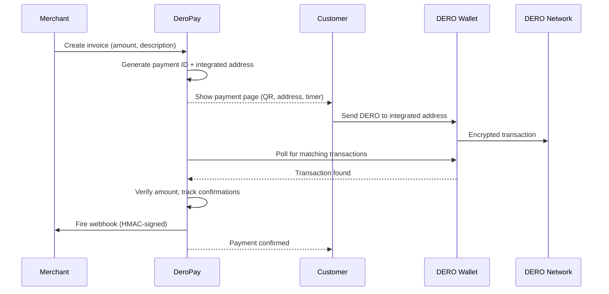

import { Callout } from 'nextra/components';

# DeroPay Overview

**DeroPay** is a full payment processing SDK for DERO — invoices, payment monitoring, webhooks, escrow, and a merchant dashboard. Think "Stripe for DERO" but self-hosted and privacy-preserving.

<Callout type="info">
  No actively maintained payment processor exists for current DERO (HE/Stargate). DeroPay is the first.
</Callout>

## Features

- **Invoice Engine** — Create invoices with unique integrated addresses, track payments, manage lifecycle
- **Payment Monitor** — Polls the DERO wallet for incoming transactions, tracks confirmations
- **Webhook Dispatcher** — HMAC-signed HTTP POST notifications on payment state changes
- **Pluggable Storage** — In-memory (dev) and SQLite (production) backends, or bring your own
- **x402 Payment Guard** — Protect API routes with HTTP `402 Payment Required`; clients pay DERO and retry with a signed receipt
- **Autonomous Agent Payer** — `dero-pay/agent` settles x402 challenges under a deny-by-default spend policy, so AI agents can pay for APIs and MCP tools without a facilitator
- **Escrow System** — On-chain smart contract with full escrow lifecycle (deposit, release, refund, dispute, arbitration), with a PREMINT keeper that keeps checkout latency off the hot path
- **React Components** — Drop-in `<PayWithDero>`, `<InvoiceView>`, `<PaymentStatus>` components
- **Next.js Integration** — Ready-made API route handlers and middleware
- **XSWD Client** — Browser-side wallet connection for "pay from wallet" UX
- **Self-Hosted Dashboard** — Admin UI for invoice management, payment history, wallet status

## How It Works



## Invoice States

```
created → pending → confirming → completed
                  ↘ expired
                  ↘ partial (underpaid, still waiting)
```

| State | Description |
|---|---|
| `created` | Invoice generated, not yet displayed to customer |
| `pending` | Awaiting payment, timer running |
| `confirming` | Transaction detected, waiting for confirmations (default: 3) |
| `completed` | Fully paid and confirmed |
| `expired` | Payment window closed (default TTL: 900s / 15 min) |
| `partial` | Some DERO received but less than required amount |

## Architecture

```
dero-pay/
├── core/        # Types, payment ID generation, pricing utilities
├── rpc/         # Wallet & Daemon RPC clients (HTTP JSON-RPC)
├── monitor/     # Payment polling engine with confirmation tracking
├── webhook/     # HMAC-signed webhook dispatcher with retry
├── store/       # Pluggable storage (memory, SQLite)
├── server/      # Invoice engine orchestrator
├── client/      # Browser XSWD client + payment session
├── react/       # React components (Provider, PayWithDero, InvoiceView)
├── next/        # Next.js API handlers + middleware
├── x402/        # Framework-agnostic HTTP 402 primitives + guard
├── agent/       # Autonomous agent-side payer (spend policy, paying-fetch, MCP)
├── escrow/      # On-chain escrow contract wrapper + lifecycle manager
├── router/      # Payment router contract wrapper + manager
├── gateway/     # Standalone gateway server building blocks
└── bridge/      # Shared bridge utilities
```

## Package Exports

| Import Path | Description |
|---|---|
| `dero-pay` | Core types, payment ID generation, pricing utilities (`deroToAtomic`, `formatDero`) |
| `dero-pay/rpc` | Wallet and Daemon RPC clients |
| `dero-pay/server` | Invoice engine, storage, monitor, webhooks |
| `dero-pay/client` | Browser-side XSWD payment client |
| `dero-pay/react` | React components and provider |
| `dero-pay/next` | Next.js API route handlers and middleware |
| `dero-pay/x402` | Framework-agnostic x402 primitives (`withX402`, `build402Response`) + `dero-pay/x402/{types,server,client,next}` |
| `dero-pay/agent` | Autonomous agent-side payer — spend policy, paying-fetch, MCP paid-tool guards |
| `dero-pay/escrow` | Escrow contract wrapper and lifecycle manager |
| `dero-pay/router` | Payment router contract wrapper and manager |
| `dero-pay/gateway` | Standalone gateway server building blocks |

<Callout type="info">
  Every subpath is published **dual-format** — an ESM build for `import` and a CommonJS build for `require` — so CommonJS backends (e.g. a Medusa plugin) can consume the SDK directly.
</Callout>

## Next Steps

- [Quick Start](/dero-pay/quick-start) — Accept your first payment
- [Invoice Engine](/dero-pay/invoice-engine) — Deep dive into the core
- [x402 Payment Guard](/dero-pay/x402) — Protect API routes with HTTP 402
- [Autonomous Agent Payer](/dero-pay/agent) — Let agents pay x402 challenges automatically
- [Escrow System](/escrow/overview) — On-chain escrow for trustless transactions
