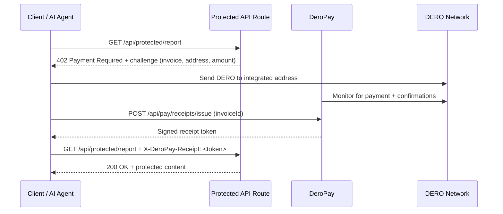

import { Callout, Steps, Tabs } from 'nextra/components';

# x402 Payment Guard

DeroPay implements the [x402 protocol](https://x402.org/) natively for DERO — protect any API route or resource with an HTTP `402 Payment Required` challenge. Clients pay DERO, receive a signed receipt, and retry. No accounts, no API keys, no subscriptions required.

<Callout type="info">
  This is a DERO-native implementation. It uses the x402 HTTP pattern (challenge → pay → retry with proof) but settles in DERO via DeroPay's invoice and monitoring infrastructure, not EVM stablecoins.
</Callout>

## Installable Exports

The x402 rail ships as published subpaths of `dero-pay` — no monorepo checkout or in-tree build step:

- **`dero-pay/next`** — `createX402RouteGuard` + `createPaymentHandlers`, the App Router guard used throughout this page.
- **`dero-pay/x402`** — framework-agnostic x402 primitives (`withX402`, `build402Response`, `parsePaymentHeader`, `FacilitatorHttpClient`) plus the spend-policy and paying-fetch toolkit, for non-Next stacks. Also exposed as focused subpaths: `dero-pay/x402/{types,server,client,next}`.
- **`dero-pay/agent`** — the autonomous agent-side payer that settles these challenges without a facilitator. See [Autonomous Agent Payer](/dero-pay/agent).

Every subpath ships **dual-format** (ESM `import` and CommonJS `require`), so CommonJS backends can consume the same guard.

## How It Works



The critical design choice: the protected route **never touches the chain on the hot path**. Receipt verification is a local HMAC signature check — fast, reliable, and scales horizontally.

## Quick Setup

<Steps>

### Install and configure

```ts
// lib/deropay.ts
import { createPaymentHandlers, createX402RouteGuard } from "dero-pay/next";
import { deroToAtomic } from "dero-pay";

export const paymentHandlers = createPaymentHandlers({
  walletRpcUrl: process.env.DERO_WALLET_RPC!,
  daemonRpcUrl: process.env.DERO_DAEMON_RPC!,
  receiptSecret: process.env.DEROPAY_RECEIPT_SECRET!,
});

export const x402Guard = createX402RouteGuard({
  getEngine: paymentHandlers.getEngine,
  receiptSecret: process.env.DEROPAY_RECEIPT_SECRET!,
  policy: {
    name: "Premium API Access",
    amountAtomic: deroToAtomic("0.10"),
    requiredConfirmations: 3,
    resource: "/api/protected/report",
  },
});
```

### Protect a route

```ts
// app/api/protected/report/route.ts
import { x402Guard } from "@/lib/deropay";

export const GET = x402Guard(async () => {
  return Response.json({ report: "paid content" });
});
```

### Expose receipt endpoints

```ts
// app/api/pay/receipts/issue/route.ts
import { paymentHandlers } from "@/lib/deropay";
export const POST = paymentHandlers.issueReceiptHandler;
```

```ts
// app/api/pay/receipts/verify/route.ts
import { paymentHandlers } from "@/lib/deropay";
export const POST = paymentHandlers.verifyReceiptHandler;
```

### Add environment variables

```env
DERO_WALLET_RPC=http://127.0.0.1:10103/json_rpc
DERO_DAEMON_RPC=http://127.0.0.1:10102/json_rpc
DEROPAY_RECEIPT_SECRET=your-signing-secret-here
```

</Steps>

## The Challenge Response

When a client hits a protected route without a valid receipt, they receive:

```http
HTTP/1.1 402 Payment Required
Content-Type: application/json
WWW-Authenticate: X402 protocol="x402-deropay-draft", asset="DERO", network="dero-mainnet", amount="100000000000", invoice_id="inv_abc123", address="deroi...", resource="/api/protected/report"
Cache-Control: no-store
```

```json
{
  "error": "payment_required",
  "payment": {
    "protocol": "x402-deropay-draft",
    "network": "dero-mainnet",
    "asset": "DERO",
    "amountAtomic": "100000000000",
    "amountDisplay": "0.1",
    "invoiceId": "inv_abc123",
    "integratedAddress": "deroi...",
    "expiresAt": "2026-04-04T12:10:00.000Z",
    "requiredConfirmations": 3,
    "resource": "/api/protected/report"
  }
}
```

Both the JSON body and the `WWW-Authenticate` header carry the same information — machine clients can use either.

## Retrying with a Receipt

After payment is confirmed, issue a receipt and retry the request with one of these headers:

```bash
# Option 1: DeroPay-native header
curl https://your-api.com/api/protected/report \
  -H "X-DeroPay-Receipt: <token>"

# Option 2: Standard Authorization header
curl https://your-api.com/api/protected/report \
  -H 'Authorization: X402 proof="<token>"'
```

Both are accepted. The `Authorization` form improves compatibility with HTTP clients and agent frameworks that expect standard auth headers.

Build the authorization header programmatically:

```ts
import { formatX402AuthorizationHeader } from "dero-pay";

const headerValue = formatX402AuthorizationHeader(receiptToken);
// => X402 proof="<token>"
```

## Issuing a Receipt

After the invoice completes, call the issue endpoint:

```bash
curl -X POST https://your-api.com/api/pay/receipts/issue \
  -H "Content-Type: application/json" \
  -d '{
    "invoiceId": "inv_abc123",
    "resource": "/api/protected/report",
    "ttlSeconds": 600
  }'
```

Response:

```json
{
  "token": "eyJhbGciOi...",
  "claims": {
    "invoiceId": "inv_abc123",
    "resource": "/api/protected/report",
    "amountAtomic": "100000000000",
    "expiresAt": 1712232600000
  }
}
```

## Dynamic Pricing

For metered APIs (LLM inference, compute, storage), use `X402PolicyResolver` — a function that reads the request and returns a policy per call:

```ts
import { createX402RouteGuard } from "dero-pay/next";
import { deroToAtomic } from "dero-pay";

export const meteredGuard = createX402RouteGuard({
  getEngine: paymentHandlers.getEngine,
  receiptSecret: process.env.DEROPAY_RECEIPT_SECRET!,
  policy: async (request) => {
    const url = new URL(request.url);
    const tokens = Number(url.searchParams.get("tokens") ?? "1000");
    // Price per 100k tokens = 0.1 DERO
    const amountAtomic = deroToAtomic((tokens / 100_000).toFixed(5));

    return {
      name: "Metered inference request",
      amountAtomic,
      resource: "/api/protected/inference",
      metadata: { tokens },
    };
  },
});
```

```ts
// app/api/protected/inference/route.ts
import { meteredGuard } from "@/lib/deropay";

export const POST = meteredGuard(async (request) => {
  const { prompt } = await request.json();
  // ... call your model
  return Response.json({ output: "..." });
});
```

## Usage Quotas

Add route-level caps directly to the policy to prevent abuse without a separate rate-limiter:

```ts
export const x402Guard = createX402RouteGuard({
  getEngine: paymentHandlers.getEngine,
  receiptSecret: process.env.DEROPAY_RECEIPT_SECRET!,
  policy: {
    name: "Premium API Access",
    amountAtomic: deroToAtomic("0.10"),
    requiredConfirmations: 3,
    resource: "/api/protected/report",

    // Max 500 receipt uses per UTC day across this route
    maxReceiptsPerDay: 500,

    // Max 10 DERO total per rolling hour
    maxAtomicPerWindow: {
      amountAtomic: deroToAtomic("10"),
      windowSeconds: 3600,
    },
  },
});
```

When a quota is exceeded, the guard returns `429 Too Many Requests` and emits an audit event.

<Callout type="warning">
  **Multi-instance deployments:** Quota enforcement requires a shared persistent store. Each instance must use the same `SqliteInvoiceStore` (or a custom shared backend) — per-instance in-memory stores will each enforce limits independently, allowing more traffic than intended.
</Callout>

## Replay Protection

Enable single-use receipts to prevent a token from being reused after the first successful request:

```ts
export const x402Guard = createX402RouteGuard({
  getEngine: paymentHandlers.getEngine,
  receiptSecret: process.env.DEROPAY_RECEIPT_SECRET!,
  enforceSingleUseReceipts: true, // mark jti as used after first use
  policy: {
    name: "One-time report download",
    amountAtomic: deroToAtomic("1.0"),
    resource: "/api/protected/report",
  },
});
```

Each receipt contains a unique `jti` (JWT ID). When single-use mode is enabled, the store marks the `jti` on first use — subsequent submissions of the same token return `409 Conflict`.

This requires the store to implement `markReceiptJtiUsed`. Both `MemoryInvoiceStore` and `SqliteInvoiceStore` support this.

## Key Rotation

Run two signing keys simultaneously for zero-downtime secret rotation:

```ts
export const x402Guard = createX402RouteGuard({
  getEngine: paymentHandlers.getEngine,

  // Map of keyId → secret
  receiptSecrets: {
    "v2": process.env.DEROPAY_RECEIPT_SECRET_V2!,
    "v1": process.env.DEROPAY_RECEIPT_SECRET_V1!, // keep during rotation window
  },

  policy: { ... },
});
```

```ts
// When issuing receipts, specify the active key
export const paymentHandlers = createPaymentHandlers({
  walletRpcUrl: process.env.DERO_WALLET_RPC!,
  daemonRpcUrl: process.env.DERO_DAEMON_RPC!,
  receiptSecret: process.env.DEROPAY_RECEIPT_SECRET_V2!,
  receiptKeyId: "v2", // embeds kid in new receipts
});
```

The guard verifies against all keys in the keyring. Old receipts signed with `v1` keep working until they expire. Once no `v1` receipts remain in circulation, remove it from the keyring.

## Audit Events

Every x402 lifecycle event fires a structured `x402Audit` event on the `InvoiceEngine` event bus:

```ts
import { InvoiceEngine } from "dero-pay/server";

const engine = new InvoiceEngine({ ... });

engine.on("x402Audit", (event) => {
  // pipe to your log aggregator, SIEM, or alerting system
  console.log("[x402]", JSON.stringify(event));
});
```

| Event type | When it fires |
|---|---|
| `x402.challenge_issued` | A new 402 challenge was returned (invoice created) |
| `x402.receipt_issued` | A signed receipt was issued after payment confirmed |
| `x402.receipt_used` | A valid receipt was accepted and the handler was called |
| `x402.receipt_rejected` | A receipt failed verification (see `reason` field) |

The `reason` field on `receipt_rejected` events:

| Reason | Meaning |
|---|---|
| `invalid_or_expired_receipt` | Signature invalid, token expired, or resource mismatch |
| `receipt_replay_detected` | `jti` already marked as used (replay attempt) |
| `receipt_daily_quota_exceeded` | `maxReceiptsPerDay` limit hit |
| `atomic_window_quota_exceeded` | `maxAtomicPerWindow` limit hit |
| `replay_store_not_configured` | Single-use mode enabled but store lacks `markReceiptJtiUsed` |
| `quota_store_not_configured` | Quota policy set but store lacks `reserveX402Usage` |

## Dynamic Order IDs (Replay Protection for Custom Facilitators)

<Callout type="warning">
  If you build a **custom facilitator or non-Next integration** on top of `dero-pay/x402`'s primitives directly (rather than `createX402RouteGuard`), read this section — it closes a real replay path.
</Callout>

Every x402 payment is looked up on-chain by an `orderId`. If your integration hard-codes a single static `orderId` for a route — the obvious way to wire this up — every request to that route shares the same on-chain payment slot. The slot pays exactly once; every subsequent presentation of that same, now-public, payment tuple is a valid-looking free replay for anyone within the receipt's TTL.

Pass an `orderIdMinter` to mint a fresh, server-issued order id per request instead:

```ts
import { createOrderIdMinter } from "dero-pay/x402";

export const x402Guard = createX402RouteGuard({
  getEngine: paymentHandlers.getEngine,
  receiptSecret: process.env.DEROPAY_RECEIPT_SECRET!,
  orderIdMinter: createOrderIdMinter(process.env.DEROPAY_ORDER_ID_SECRET!),
  policy: {
    name: "Premium API Access",
    amountAtomic: deroToAtomic("0.10"),
    requiredConfirmations: 3,
    resource: "/api/protected/report",
  },
});
```

The minted id is `<nonce>.<HMAC(secret, context|nonce)>` — stateless, so it validates across multiple server instances with no shared cache, and a caller cannot forge a server-issued id without the secret.

**Leaving `orderIdMinter` unset is safe only if your own server already issues a distinct `orderId` out-of-band for every unit of work.** `createX402RouteGuard`'s default policy does this correctly; only worry about this if you're calling the lower-level `dero-pay/x402` primitives yourself.

## Payer Privacy

<Callout type="warning">
  x402 payments settle at **ring size 2** and write the payer's plaintext DERO address into public contract state. **This is not sender-anonymous.** Do not describe x402 payments as private or anonymous to end users — only the amount and resource are hidden from casual observers, not the payer's identity.
</Callout>

## Security Summary

| Layer | Mechanism |
|---|---|
| Authenticity | HMAC-SHA256 signed receipt — tampered tokens fail immediately |
| Expiry | Short-lived TTL (default 10 min) — old tokens stop working automatically |
| Resource binding | Receipt for `/report` cannot unlock `/inference` |
| Replay protection | Optional `jti` one-time-use enforcement via store |
| Amount enforcement | Receipt must satisfy `minAmountAtomic` for the route's policy |
| Key rotation | `kid` in receipt header + keyring verification |
| Quota enforcement | Store-backed usage reservations with atomic window tracking |
| Audit trail | Structured events on every action for SIEM/logging |

## Example App

A fully runnable Next.js example demonstrating both a static paid report route and a dynamic metered inference route is available in the monorepo:

```
apps/x402-example/
```

Run it from the monorepo root:

```bash
bun run dev:x402-example
```

Then open `http://localhost:3000`.
