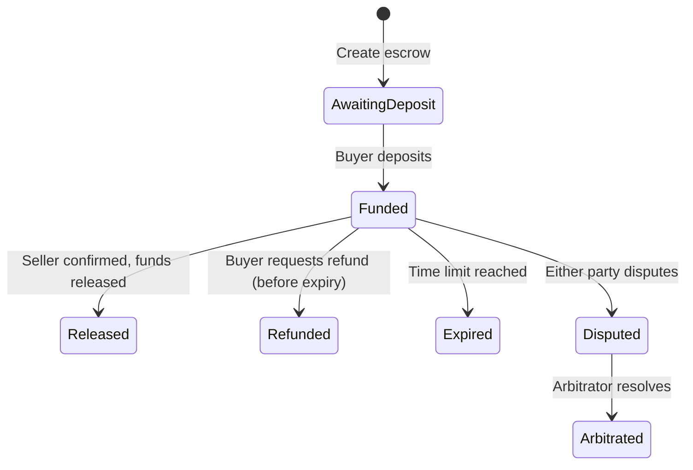

import { Callout } from 'nextra/components';

# Escrow System

DeroPay includes a full on-chain escrow system for trustless buyer-seller transactions. Funds are held in a DERO smart contract and released based on predefined conditions.

## Why Escrow?

Standard invoices work for trusted merchants, but many scenarios require a neutral third party:

- **Marketplaces** — Buyer pays, seller ships, funds release on confirmation
- **Freelance work** — Client deposits, freelancer delivers, funds release on approval
- **P2P trades** — Neither party trusts the other; contract holds funds until both agree
- **Dispute resolution** — An arbitrator can intervene if buyer and seller disagree

## How It Works

## Status Codes

| Code | Status | Description |
|---|---|---|
| 0 | `awaiting_deposit` | Escrow created, waiting for buyer's DERO |
| 1 | `funded` | Buyer has deposited, awaiting seller action |
| 2 | `released` | Funds sent to seller |
| 3 | `refunded` | Funds returned to buyer |
| 4 | `expired_claimed` | Time limit reached, seller claimed funds |
| 5 | `disputed` | Dispute raised, awaiting arbitrator |
| 6 | `arbitrated` | Arbitrator has resolved the dispute |

## Components

### Smart Contract (`escrow.bas`)

A DERO smart contract written in BASIC that holds funds and enforces escrow rules. See [Smart Contract](/escrow/smart-contract).

### TypeScript SDK

- **`EscrowContract`** — Low-level wrapper around the contract's RPC functions
- **`EscrowManager`** — High-level lifecycle manager that handles the full escrow flow

See [TypeScript SDK](/escrow/sdk).

### Pre-Minted Inventory (Keeper)

Escrow deploys a fresh contract per transaction, and minting a contract takes about one block to confirm. To keep that latency off the checkout path, `EscrowManager` can run a background **PREMINT keeper** that mints empty escrow boxes ahead of demand and hands a confirmed one to each checkout — so checkout only has to *bind* the order terms, not mint-confirm-bind. See [PREMINT Keeper](/escrow/keeper).

<Callout type="info">
  The escrow contract supports **platform fees** (in basis points), so marketplaces can take a cut of each transaction automatically at the contract level.
</Callout>

<Callout type="info">
  **Refund safety is mainnet-proven.** A rejected or underpaid deposit refunds the buyer and leaves the contract pristine — funds are never stranded. This was verified end-to-end on DERO mainnet (block 7,348,673): the escrow box remained fund-safe and reusable after a rejected deposit.
</Callout>

<Callout type="warning">
  Escrow deploys a **fresh contract for each transaction**. If you need fast, single-transaction payments without buyer protection, see the [Payment Router](/payment-router/overview) instead. For a full comparison, see [Escrow vs. Router](/payment-router/escrow-vs-router).
</Callout>
