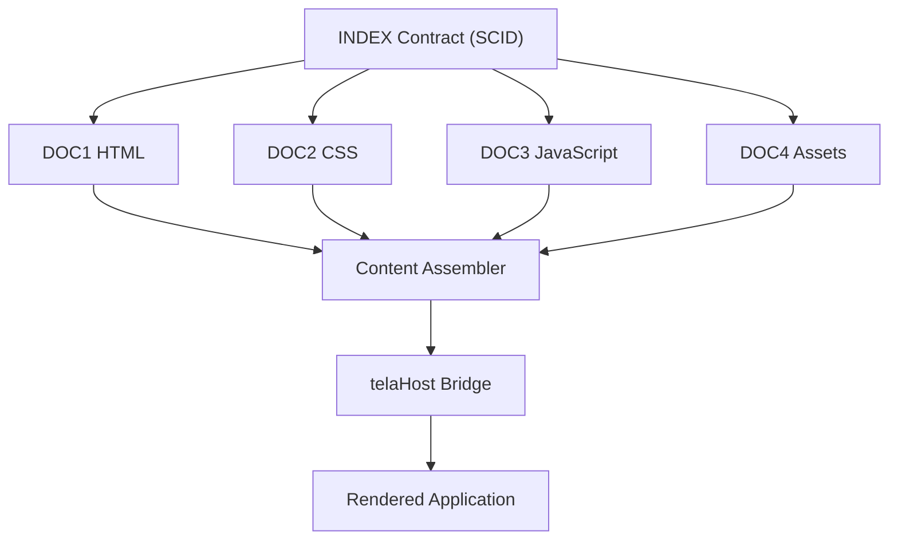
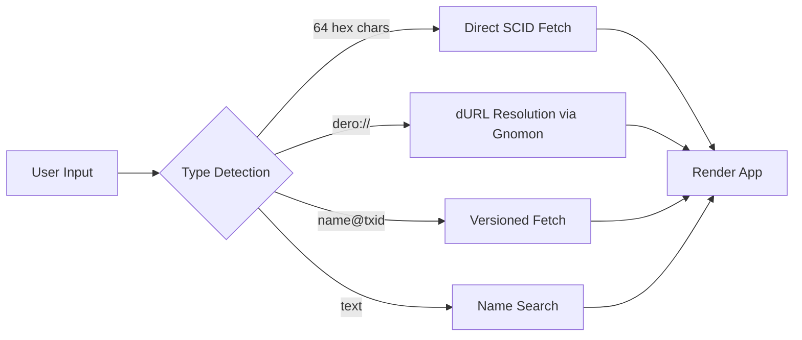

import { Callout } from 'nextra/components'

# TELA Browser


The TELA Browser enables accessing decentralized web applications stored entirely on the DERO blockchain.

## Core Concepts

### What is TELA?

TELA is a protocol for storing and serving web content from the DERO blockchain. Key benefits:

- **Immutable**: Content cannot be modified after deployment
- **Censorship-Resistant**: No central server to take down
- **Privacy-Preserving**: No tracking, no cookies (see [Security Features](/security))
- **Permanent**: Content exists as long as the blockchain exists

<Callout type="tip">
  New to TELA development? Check out [Studio](/studio) for local development tools and [Simulator Mode](/simulator) for testing your apps.
</Callout>

### How It Works



## Address Bar Navigation

The address bar intelligently detects input type and routes accordingly:



| Input Format | Example | Action |
|--------------|---------|--------|
| Raw SCID (64 hex) | `abc123...def456` | Fetch directly from blockchain |
| dero:// URL | `dero://myapp` | Resolve via Gnomon, then fetch |
| Name lookup | `myapp` | Search indexed apps |
| Versioned SCID | `abc123...@txid456...` | Fetch specific version (see below) |

### Versioned Navigation (scid@txid)

Access any historical version of a TELA app by appending `@txid` to the SCID:

```
abc123def456...@987fed654...
└─── SCID ────┘ └── TXID ──┘
```

**How to use versioned navigation:**

1. Open **Version History** for the app (clock icon in toolbar)
2. Find the version you want in the timeline
3. Copy its **TXID** (transaction hash)
4. Navigate to `scid@txid` in the address bar

**Example:**

```
# Latest version (default)
a1b2c3d4e5f6...

# Specific version from January 2026
a1b2c3d4e5f6...@f9e8d7c6b5a4...
```

<Callout type="info">
  Versioned URLs are useful for sharing links to specific app versions, bookmarking known-good states, or auditing changes over time.
</Callout>

**Version Resolution:**

When you navigate to a versioned URL, Hologram:

1. Parses the SCID and TXID from the address
2. Finds the block height where that TXID was confirmed
3. Retrieves the INDEX contract state at that height
4. Fetches DOC content as it existed at that version
5. Renders the historical version of the app

## Browser Toolbar

The browser toolbar includes:

| Button | Function |
|--------|----------|
| **Back/Forward** | Navigate history |
| **Reload** | Refresh current page |
| **Home** | Return to Discover |
| **Console** | Toggle developer console |
| **Version History** | View commit history for current TELA app |

<Callout type="info">
  The Version History button opens the commit timeline for the currently loaded TELA app. See [Studio > Actions](/studio#actions-version-control) for full version control documentation.
</Callout>

## Supported Document Types

- `TELA-HTML-1`: HTML documents
- `TELA-CSS-1`: Stylesheets
- `TELA-JS-1`: JavaScript files
- `TELA-JSON-1`: JSON data
- `TELA-STATIC`: Static files (SVG, images, etc.)
- `*.tela.shards`: Shard index files
- `*.tela.lib`: Library info views

### TELA-STATIC Support

Hologram supports `TELA-STATIC` document type for embedding static files like SVG images and other binary assets.

#### Automatic Inline Embedding

When Hologram encounters a `TELA-STATIC` DOC:

1. **File content extracted** — Static file content is read from the DOC contract
2. **MIME type detection** — Automatically detects file type (SVG, PNG, JPEG, GIF, WebP, ICO)
3. **Data URI conversion** — Converts to data URI format for inline embedding
4. **HTML replacement** — Replaces `` references with inline data URIs

#### Supported Static File Types

| File Type | MIME Type | Encoding |
|-----------|-----------|----------|
| SVG | `image/svg+xml` | URL-encoded (direct) |
| PNG | `image/png` | Base64 |
| JPEG | `image/jpeg` | Base64 |
| GIF | `image/gif` | Base64 |
| WebP | `image/webp` | Base64 |
| ICO | `image/x-icon` | Base64 |

#### Example

```html
<!-- In your TELA app HTML -->


<!-- After Hologram processing -->

```

This ensures static assets are always available, even when the original source is inaccessible.

### TELA V2 Contract Keys

Hologram supports both TELA V1 and V2 contract formats for maximum compatibility.

#### Version Comparison

| Version | Variable Keys | Description |
|---------|---------------|-------------|
| **V1 (Original)** | `nameHdr`, `descrHdr`, `iconHdr` | Original TELA format used by early deployments |
| **V2 (Current)** | `var_header_name`, `var_header_description`, `var_header_icon` | Newer standardized format |

#### Key Differences

**V1 Format:**
- Uses `nameHdr`, `descrHdr`, `iconHdr` for metadata
- Original TELA specification
- Still supported for backward compatibility

**V2 Format:**
- Uses `var_header_name`, `var_header_description`, `var_header_icon`
- Standardized naming convention
- **Mutable** — Can be updated after deployment (if INDEX is Ring 2)

#### How Hologram Handles Both

When fetching TELA content, Hologram automatically checks for both formats:

1. **First checks V2 keys** — Looks for `var_header_name`, `var_header_description`, `var_header_icon`
2. **Falls back to V1 keys** — If V2 not found, checks `nameHdr`, `descrHdr`, `iconHdr`
3. **No user action needed** — Hologram handles the format detection automatically

#### For Developers

- **New deployments**: Use V2 headers (`var_header_*`) for better compatibility
- **Existing apps**: V1 headers still work perfectly
- **Updates**: V2 headers can be updated if your INDEX is Ring 2 (updateable)

<Callout type="info">
  You don't need to know which version an app uses—Hologram automatically detects and handles both formats. For developers: use V2 headers if you want the ability to update metadata later!
</Callout>

## Features

### Automatic Gzip Decompression

Files stored with `.gz` extension are automatically decompressed:

```go
// Automatic gzip handling
if strings.HasSuffix(fileName, ".gz") {
    decompressed, err := decompressGzip(fileContent)
    // fileName becomes "app.js" from "app.js.gz"
}
```

### External Reference Inlining

External `<script>` and `<link>` tags are automatically replaced with inline content:

```html
<!-- Before (in source) -->
<link rel="stylesheet" href="styles.css">
<script src="app.js"></script>

<!-- After assembly -->
<style>/* CSS content inlined */</style>
<script>/* JS content inlined */</script>
```

### Versioned Caching

Content is cached with version tracking:

- **Key**: SCID or dURL
- **Version**: Latest interaction height from Gnomon
- **Hash**: SHA256 of assembled content
- **Auto-invalidation**: When version changes on-chain

```go
// Cache lookup with version validation
if html, ok := cache.GetHTMLIfVersion(scid, version); ok {
    return html // Cache hit
}
// Fetch from blockchain on cache miss
```

### telaHost Bridge API

Every TELA app automatically has access to the `telaHost` JavaScript API (similar to `window.ethereum` in Web3 browsers), enabling:

- Blockchain queries
- Wallet connection
- Smart contract interaction
- Transaction signing (with user approval)

See [telaHost API Reference](/telahost-api) for full documentation, including [Smart Permission Detection](/telahost-api#smart-permission-detection).

## Full TELA dApp Compatibility

Hologram provides full compatibility with complex TELA dApps, including those requiring CSP relaxation and direct WebSocket connections. This infrastructure enables dApps like `explorer.tela` to function fully within Hologram's secure sandboxed environment. Learn more about the security model in [Security Features](/security#reverse-proxy-system--csp-relaxation).

### Key Features

| Feature | Description |
|---------|-------------|
| **Reverse Proxy System** | Strips `Content-Security-Policy` headers while maintaining security through iframe sandboxing and blockchain immutability. Provides XSWD bridge script and adds security headers. |
| **XSWD WebSocket Bridge** | Intercepts `new WebSocket()` calls to XSWD ports (44326 mainnet, 44325 testnet), creating a proxy that routes connections through `window.parent.postMessage()`. |
| **Smart RPC Routing** | Automatically routes `DERO.*` methods to daemon when internal XSWD server is running, optimizing performance while maintaining backward compatibility. |
| **WKWebView Compatibility** | Custom workarounds for WKWebView's strict property enforcement, ensuring compatibility with JavaScriptCore engine on macOS. |

### How the XSWD Bridge Works

1. **App calls `new WebSocket('ws://127.0.0.1:44326/xswd')`**
2. **Bridge script intercepts** — The bridge script catches WebSocket creation
3. **Creates proxy WebSocket** — Returns a fake WebSocket object to the app
4. **Routes via postMessage** — All messages go through `window.parent.postMessage()`
5. **Hologram handles routing** — Go backend processes XSWD requests
6. **Response returned** — Results sent back through the same postMessage channel

This allows TELA apps to use standard XSWD WebSocket code while running in a sandboxed iframe.

### XSWD Method Compatibility

Hologram supports all standard XSWD methods for full compatibility with existing TELA dApps:

#### Supported Method Categories

| Category | Methods | Status |
|----------|---------|--------|
| **DERO Daemon** | `DERO.GetInfo`, `DERO.GetBlock`, `DERO.GetTransaction`, etc. | ✅ Fully supported |
| **Wallet** | `GetAddress`, `GetBalance`, `Transfer`, `scinvoke`, `GetTransfers`, `GetTransferbyTXID`, `MakeIntegratedAddress`, `SplitIntegratedAddress`, `QueryKey`, `SignData`, `CheckSignature`, `HasMethod`, `Unsubscribe`, `transfer_split` | ✅ Fully supported |
| **Gnomon Indexer** | `Gnomon.GetAllSCIDVariableDetails`, `Gnomon.GetStatus`, etc. | ✅ Fully supported |
| **EPOCH Mining** | `AttemptEPOCH`, `AttemptEPOCHWithAddr`, `GetMaxHashesEPOCH` | ✅ Fully supported |
| **TELA Links** | `HandleTELALinks` | ✅ Fully supported |

#### XSWD Parity Features

Hologram's XSWD server has been specifically engineered to ensure 100% plug-and-play parity with Engram and the official DERO CLI:

- **Case-Insensitivity**: Fully supports lowercase aliases (e.g., `getbalance`, `getaddress`, `transfer_split`) to match various dApp implementations.
- **Advanced Transfer Parsing**: Full support for parsing `sc_dero_deposit`, `sc_token_deposit`, custom `fees`, and per-transfer `scid` (for token transfers) via XSWD.
- **Smart Contract Deployment**: XSWD `sc` parameter forwarding is fully supported for deploying new contracts directly from dApps.

#### Response Format Compatibility

Hologram ensures compatibility with existing dApps by maintaining expected response formats:

**Gnomon.GetAllSCIDVariableDetails** returns data in the format expected by apps like `feed.tela`:

```json
{
  "success": true,
  "result": {
    "allVariables": [
      {"Key": "eid_1", "Value": "..."},
      {"Key": "eid_2", "Value": "..."}
    ]
  }
}
```

**AttemptEPOCHWithAddr** is supported for developer hash donations. The method accepts an `address` parameter for directing mining rewards, though rewards currently go to the connected wallet.

<Callout type="tip">
  For new dApp development, consider using the [telaHost API](/telahost-api) instead of raw XSWD for a cleaner, more maintainable codebase.
</Callout>

### Compatibility

| dApp Type | Status |
|-----------|--------|
| telaHost API apps | Fully functional |
| Direct XSWD WebSocket apps | Fully functional |
| CSP-restricted apps | Fully functional |
| Complex multi-file apps | Fully functional |

### Security Model

CSP removal is mitigated by multiple defense layers:

| Layer | Protection |
|-------|------------|
| **Blockchain immutability** | Content is cryptographically verified from on-chain data |
| **Iframe sandboxing** | Restricted permissions prevent malicious actions |
| **Controlled API access** | User approval required for wallet operations |
| **Local execution** | Content runs locally, not from remote servers |
| **Source verification** | All content fetched directly from blockchain |

<Callout type="info">
  This infrastructure benefits all TELA dApps, not just specific ones. It's part of Hologram's core browser rendering capabilities.
</Callout>

## Shard & Library Support

### Shard Index (`*.tela.shards`)

For large applications split across multiple contracts:

- Concatenates multiple DOC files into single HTML
- Maintains proper ordering
- Useful for apps exceeding single contract size limits

### Library View (`*.tela.lib`)

For inspecting TELA content without execution:

- Renders lightweight info table
- Shows file names, types, and SCIDs
- Metadata display only (no JavaScript execution)

## Browser Session Persistence

Hologram preserves your browser state when navigating to other tabs (Wallet, Settings, etc.):

- **Tabs persist** — All open tabs with their URLs and loading states
- **Filters persist** — Category, tag, sort order, and rating filters
- **Discover cache** — App list is cached to avoid reloading
- **Address bar** — Current URL preserved

This means you can check your wallet balance and return to Browser without losing your place or waiting for apps to reload.

## Discover Tab

The Discover tab provides app discovery features:

- **Browse All**: See all indexed TELA apps
- **Search**: Full-text search by name and description
- **Ratings**: Community-driven trust scores (0-99)
- **EPOCH Filter**: Find apps that support developer mining

## Tag-Based App Discovery

<Callout type="success">
  **New in v6.3** - Filter apps by smart contract classification tags for faster discovery.
</Callout>

Hologram's Gnomon indexer automatically classifies smart contracts into categories based on their code patterns. Use tag filters in the Browser to quickly find specific types of apps.

### Available Tags

| Tag | Description | Matched Patterns |
|-----|-------------|------------------|
| `tela` | TELA applications | `docVersion`, `telaVersion` |
| `g45` | G45 standard tokens/NFTs | `G45-NFT`, `G45-AT`, `G45-C`, `G45-FAT`, `G45-NAME`, `T345` |
| `nfa` | Non-Fungible Assets | `ART-NFA-MS1` |
| `epoch` | EPOCH-enabled apps | `EPOCH`, `epochEnabled`, `crowd_mining` |

### Tag Filter UI

The Browser shows tag filter buttons when tags are available:

```
+----------------------------------------------------------+
|  Filter by Tag:  [All] [tela] [g45] [nfa] [epoch]         |
+----------------------------------------------------------+
|  72 apps found                                            |
+----------------------------------------------------------+
```

### Tag API

```go
// Get all available tags
GetAllTags() -> {
    success: bool,
    tags: []string,  // ["tela", "g45", "nfa", "epoch"]
}

// Get SCIDs matching a tag
GetSCIDsByTag(tag) -> {
    success: bool,
    tag: string,
    scids: []string,
    count: int,
}

// Get classification for specific SCID
GetSCIDMetadata(scid) -> {
    success: bool,
    metadata: {
        scid: string,
        class: string,      // "TELA-INDEX-1", "G45-NFT", etc.
        tags: []string,     // ["tela", "all"]
        owner: string,
        deployHeight: int64,
    },
}

// Get tag distribution statistics
GetTagStats() -> {
    success: bool,
    stats: {
        tela: int,
        g45: int,
        nfa: int,
        epoch: int,
        total: int,
    },
}
```

### Classification System

Smart contracts are classified based on code analysis:

| Class | Detection Method |
|-------|------------------|
| `TELA-INDEX-1` | Contains `DOC1`, `DOC2`, etc. variables |
| `TELA-DOC-1` | Contains `docVersion` variable |
| `G45-NFT` | Contains `G45-NFT` in code |
| `G45-AT` | Contains `G45-AT` in code |
| `ART-NFA-MS1` | Contains `ART-NFA-MS1` in code |

```go
// Get SCIDs by class
GetSCIDsByClass(class) -> {
    success: bool,
    class: string,
    scids: []string,
    count: int,
}

// Get all known classes
GetAllClasses() -> {
    success: bool,
    classes: []string,
}

// Rebuild tag index from Gnomon data
RebuildTagIndex() -> {
    success: bool,
    indexed: int,
    message: string,
}
```

<Callout type="info">
  Tags are automatically assigned during indexing. Use `RebuildTagIndex()` to re-classify all indexed contracts if needed.
</Callout>

## Offline Access

Apps can be cached for offline access:

```go
// Cache entire app for offline use
PrefetchApp(scid) -> {
    app: CachedApp,
    message: "Cached for offline use"
}

// Check if cached
IsAppCachedOffline(scid) -> bool
```

<Callout type="info">
  Offline cache size is configurable (default 500MB). Oldest accessed apps are automatically evicted when space is needed.
</Callout>

### Sync Manager

For power users, the **Sync Manager** (Settings → Sync Manager) enables:

- **Batch Prefetch**: Clone all favorites with one click
- **Rating Threshold**: Filter by minimum community rating
- **Update Checking**: Compare cached vs on-chain versions
- **Visual Diffing**: See exactly what changed before updating

See [Offline-First Browsing](/offline-first) for complete documentation and [Privacy Mode](/security#privacy-mode) for network-level isolation.

## Content Filtering

Hologram includes optional content filtering:

| Setting | Description | Default |
|---------|-------------|---------|
| `min_rating` | Minimum app rating | 0 |
| `block_malware` | Block dangerous apps | true |
| `show_nsfw` | Show adult content | false |

## Navigation API

For developers, the browser exposes these Go methods:

```go
Navigate(scid string) map[string]interface{}
GoBack() map[string]interface{}
GoForward() map[string]interface{}
Reload() map[string]interface{}
FetchSCID(scid string) map[string]interface{}
FetchByDURL(durl string) map[string]interface{}
```

