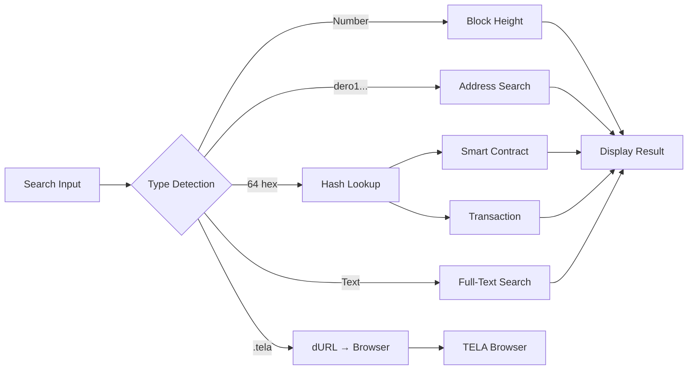
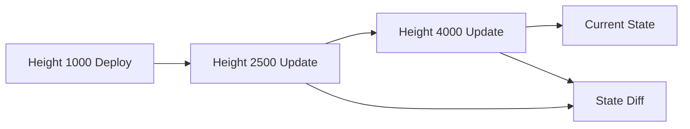
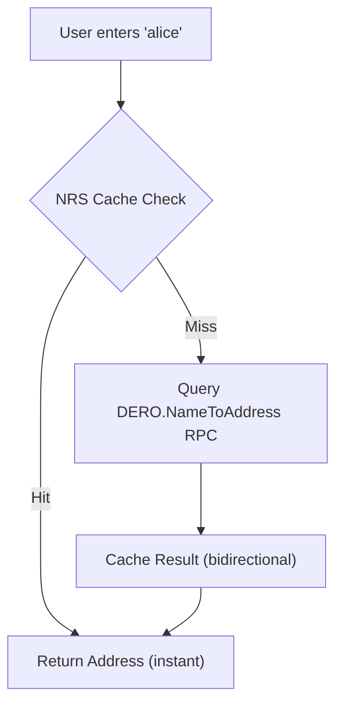

import { Callout } from 'nextra/components'

# Block Explorer


Hologram includes a comprehensive blockchain explorer for viewing blocks, transactions, smart contracts, and network statistics.

## OmniSearch

The Explorer landing page features **OmniSearch**, a universal search that intelligently detects and routes queries to the appropriate handler.

### Intelligent Hash Resolution

When searching a 64-character hex string, OmniSearch automatically determines if it's a Smart Contract (SCID) or a standard Transaction (TXID). It does this by checking if the returned object contains actual smart contract `code`. If the code is empty, it intelligently falls back to displaying the standard transaction details, preventing misclassification.

### Non-Eager Autocomplete

To provide a cleaner user experience, the OmniSearch input field features a non-eager autocomplete. While it focuses automatically on page load, the recent searches dropdown will only appear upon explicit user interaction (clicking the input), preventing the UI from feeling overly aggressive.



### Search Syntax

| Input Format | Example | Action |
|--------------|---------|--------|
| **64-char hex** | `abc123...def456` | Detect as SCID or TX hash |
| **Block height** | `5000000` | Load block at height |
| **DERO address** | `dero1qy...` | Search address references |
| **dURL** | `myapp.tela` | Navigate to Browser with app |
| **Name** | `alice` | Resolve via NRS |
| **Free text** | `voting app` | Search TELA apps by name/description |

### Advanced Search Filters

Power users can use special prefixes for targeted searches:

| Prefix | Example | Description |
|--------|---------|-------------|
| `key:` | `key:owner` | Search SC variables by key name |
| `value:` | `value:TELA` | Search SC variables by value |
| `code:` | `code:STORE` | Search SC code for patterns |
| `author:` | `author:dero1qy...` | Find apps by deployer address |

```
// Examples
key:owner           → Find all SCs with "owner" variable
value:TELA-INDEX    → Find all TELA INDEX contracts
code:STORE("votes"  → Find voting contracts
author:dero1qy...   → Find all apps by this address
```

<Callout type="info">
  Found a TELA app? Click the app icon to view it in the [TELA Browser](/browser), or use [Version History](#time-travel-state-viewer) to explore its deployment timeline.
</Callout>

### Search Exclusions

Filter out unwanted results from your searches:

1. Go to **Settings > Gnomon**
2. Find **Search Exclusions** section
3. Add SCIDs or patterns to exclude

```go
// API
AddSearchExclusion(filter string) -> { success: true }
RemoveSearchExclusion(filter string) -> { success: true }
GetSearchExclusions() -> { filters: ["scid1...", "scid2..."] }
ClearSearchExclusions() -> { success: true }
```

### Min-Likes Filter

Filter search results by minimum approval rating:

1. Go to **Settings > Gnomon**
2. Adjust the **Minimum Likes %** slider
3. Results below threshold are hidden

```go
SetSearchMinLikes(percent int) -> { success: true }
```

### Recent Searches

The landing page displays your recent searches for quick access:

- Click any recent search to re-run it
- Searches are stored locally
- Clear history from the search bar

## Block Exploration

### View Blocks

| Function | Description |
|----------|-------------|
| `GetBlock(height)` | Basic block data by height |
| `GetBlockByHash(hash)` | Block data by hash |
| `GetBlockExtended(heightOrHash)` | **Full block metadata** (tips, nonce, size, fees, miner, status) |
| `GetRecentBlocks(count)` | Last N blocks |
| `FormatBlockAge(timestamp)` | "5m 23s ago" format |

### GetBlockExtended Response

Returns comprehensive block data matching official DERO explorer:

```go
{
    // Core identifiers
    height, topoheight, hash,
    
    // Block metadata
    depth, difficulty, nonce,
    major_version, minor_version,
    
    // Status flags
    orphan_status, sync_block, side_block,
    
    // DAG structure
    tips: []string,  // Parent block hashes
    
    // Mining info
    miners: []string,
    miner_address: string,  // Extracted from coinbase TX
    reward: uint64,
    
    // Timing
    timestamp, age, block_time,
    
    // Transactions
    tx_count, tx_hashes: []string,
    txs: []TxSummary,  // Type, fee per TX
    total_fees: uint64,
    
    // Size
    size_bytes, size_kb,
    
    // Raw data
    blob: string,
}
```

### Block Data

Each block includes:

- Block header (hash, height, timestamp, difficulty)
- TopoHeight (position in DAG)
- Tips (parent blocks in DAG structure)
- Depth (confirmations)
- Status flags (orphan, sync, side block)
- Miner address (extracted from coinbase TX)
- Miner transaction (coinbase)
- Transaction list with types and fees
- Total fees and block size

## Transaction Exploration

### View Transactions

| Function | Description |
|----------|-------------|
| `GetTransaction(txid)` | Basic transaction details |
| `GetTransactionWithRings(txid)` | TX + ring members |
| `GetTransactionExtended(txid)` | **Full TX data** (rings per payload, assets, valid/invalid blocks, hex) |
| `GetCoinbaseMiner(txid)` | Extract miner from coinbase TX |
| `GetRingMembers(txid)` | Ring signature members |

### GetTransactionExtended Response

Returns comprehensive transaction data matching official DERO explorer:

```go
{
    txid, tx_type,
    
    // Status
    in_pool, ignored, is_coinbase,
    
    // Block info
    block_height, valid_block,
    invalid_blocks: []string,
    
    // Timing
    age, block_time,
    
    // Build info
    height_built, blid, root_hash,
    
    // Addresses
    miner_address, signer,
    
    // Economics
    fee, reward, burn_value, balance,
    
    // Ring members PER PAYLOAD (critical for privacy)
    rings: []PayloadRing{
        index: int,
        members: []string,  // Full addresses
        count: int,
    },
    ring_count, max_ring_size,
    
    // Assets breakdown PER PAYLOAD
    assets: []Asset{
        index: int,
        scid: string,
        fees: uint64,
        burn: uint64,
        ring_size: int,
        ring: []string,
    },
    
    // Smart Contract data
    sc_args, sc_code, sc_balance, sc_balance_now, sc_code_now,
    
    // Size
    size_bytes, size_kb,
    
    // Raw data
    hex: string,
    output_indices,
}
```

<Callout type="info">
  **Ring members per payload** is critical for understanding DERO's privacy model. Each payload (asset transfer) has its own ring of decoy addresses, providing plausible deniability.
</Callout>

### Transaction Types

```go
const (
    PREMINE      // Genesis allocation
    REGISTRATION // Address registration
    COINBASE     // Mining reward
    NORMAL       // Standard transfer
    BURN_TX      // Token burn
    SC_TX        // Smart contract interaction
)
```

## Proof Validation

Hologram validates payload proofs before display to prevent fake/fabricated proofs with impossible amounts. This feature is critical for merchants and service providers who need cryptographic proof of payment. See the dedicated [Proof Validation](/proof-validation) page for detailed documentation.

### What This Blocks

| Attack Type | Result |
|-------------|--------|
| 184 trillion DERO proofs | **REJECTED** |
| Any amount > 22M DERO | **REJECTED** |
| int64 wraparound attacks | **REJECTED** |
| Amounts > current supply (~16.5M) | WARNING |
| Large amounts (> 1M DERO) | INFO |

### Validation Functions

```go
// Block proofs with impossible amounts
ValidatePayloadProofAmount(amount uint64) error

// Get detailed validation with warnings
ValidatePayloadProofAmountWithContext(amount uint64) -> {
    valid: bool,
    error: string,
    warnings: []string,
    supplyContext: string  // "12.5% of current DERO supply"
}

// Flag suspicious but valid amounts
DetectSuspiciousProofPatterns(amount uint64) -> []string
```

### Constants

```go
const (
    MAX_INT64_SAFE               = 9223372036854775807  // 2^63 - 1
    MAX_REASONABLE_AMOUNT_ATOMIC = 22_000_000_000_000   // 22M DERO
    DERO_HARD_CAP_ATOMIC         = 21_000_000_000_000   // 21M DERO
)
```

<Callout type="info">
  DERO has a permanent hard cap of 21 million (like Bitcoin). Any proof claiming more than 21M DERO is mathematically impossible, not just suspicious.
</Callout>

### UI Features

- Supply context display: "12.5% of current DERO supply"
- Warning panel for suspicious patterns (AlertTriangle icon)
- "Proof Rejected" with security note for fabricated proofs (Shield icon)

See [Proof Validation Security](/proof-validation) for detailed documentation.

## Smart Contract Interaction

### View Smart Contracts

```go
GetSCInfo(scid) -> {
    code: string,      // DVM bytecode
    balance: uint64,   // SC balance
    variables: map,    // All stored variables
}

DaemonGetSC(scid) // Direct daemon call
```

### TELA INDEX Detection

When viewing a smart contract, Hologram automatically detects if it's a TELA INDEX (by checking for `DOC1` or `dURL` variables). When detected, a **VERSION CONTROL** panel appears with:

- **TELA INDEX** badge
- **View Version History** button - Opens commit timeline modal
- **Open in Studio** button - Jump to Studio Actions page

<Callout type="info">
  TELA INDEXes have Git-like version control. Each update creates a commit, and any version can be retrieved using `scid@txid` format. See [Studio > Actions](/studio#actions-version-control) for full documentation.
</Callout>

### Invoke Smart Contracts

```go
// Invoke SC function (requires wallet approval)
InvokeSCFromExplorer(scid, entrypoint, args, deposit) -> txid

// Specific actions
RateTELAApp(scid, rating)           // 0-99 rating
LikeTELAApp(scid)
DislikeTELAApp(scid)
```

### Gas Estimation

```go
EstimateSCGas(scid, entrypoint, args) -> {
    gascompute: uint64,
    gasstorage: uint64,
    total: uint64,
    cost_dero: string,
}
```

## Smart Contract Function Interactor

<Callout type="success">
  Dynamically discover and call smart contract functions without writing code. The interactor parses DVM bytecode to auto-generate input forms.
</Callout>

When viewing any smart contract in Explorer, a **Call Smart Contract Function** panel appears below the SC Variable Editor. This feature:

1. **Parses DVM code** to discover all exported functions (uppercase first letter)
2. **Auto-generates input fields** based on parameter types (String or Uint64)
3. **Detects special requirements**:
   - `DEROVALUE()` - Shows DERO amount input
   - `ASSETVALUE()` - Shows token SCID and amount inputs
   - `SIGNER()` - Disables anonymous mode (ringsize 16)
4. **Works with local wallet or XSWD** - No wallet? Connect via XSWD

```
+----------------------------------------------------------+
|  [Zap] Call Smart Contract Function                       |
+----------------------------------------------------------+
|  Function: [Deposit(amount: Uint64) v]                    |
+----------------------------------------------------------+
|  PARAMETERS                                               |
|  +------------------------------------------------------+ |
|  | amount [Uint64]                                      | |
|  | [_________________________] (number input)           | |
|  +------------------------------------------------------+ |
+----------------------------------------------------------+
|  [DEROVALUE] DERO Amount to Send                          |
|  [_____________] DERO                                     |
+----------------------------------------------------------+
|  [ ] Anonymous transaction (ringsize 16)                  |
|  ! SIGNER() detected - anonymous mode disabled            |
+----------------------------------------------------------+
|  [         Call Deposit         ]                         |
+----------------------------------------------------------+
```

### Parse Functions

```go
ParseSCFunctions(scid) -> {
    success: bool,
    functions: []SCFunction{
        name: string,           // "Deposit"
        params: []SCParam{
            name: string,       // "amount"
            type: string,       // "Uint64" or "String"
            dataType: string,   // "U" or "S" for XSWD
        },
        returnType: string,     // "Uint64"
        usesDero: bool,         // DEROVALUE() detected
        usesAsset: bool,        // ASSETVALUE() detected
        usesSigner: bool,       // SIGNER() detected
    },
    count: int,
}
```

### Invoke Functions

```go
InvokeSCFunction(paramsJSON) -> {
    success: bool,
    txid: string,
    function: string,
    message: string,
}

// paramsJSON structure:
{
    scid: "abc123...",
    function: "Deposit",
    params: { "amount": 1000 },
    deroAmount: 100000,        // Atomic units (0.001 DERO)
    assetScid: "",             // Token SCID if sending asset
    assetAmount: 0,
    anonymous: false,          // Use ringsize 16
}
```

### Install Smart Contracts

Deploy new smart contracts directly from Hologram:

```go
InstallSmartContract(code, anonymous) -> {
    success: bool,
    txid: string,
    message: string,
}
```

<Callout type="warning">
  Smart contract deployment requires a local wallet (not XSWD). The SCID will be available once the transaction is confirmed.
</Callout>

## Time-Travel Explorer

View smart contract state at any point in history using Graviton's versioning.

<Callout type="success">
  **Time-Travel** lets you see exactly what a smart contract looked like at any block height—compare changes, track variable evolution, and audit contract history.
</Callout>



### State Capture

```go
// Capture current state
CaptureSCState(scid) -> SCStateSnapshot

// Retrieve historical state
GetSCStateAtHeight(scid, height) -> SCStateSnapshot
```

### State Comparison

```go
// Compare two heights
CompareSCStateAtHeights(scid, from, to) -> SCStateDiff

// Get change timeline
GetSCChangeTimeline(scid) -> []SCStateDiff
```

### SC Watching

Watch smart contracts to automatically capture state snapshots when changes occur.

#### Watch Button (Header)

When viewing any smart contract in Explorer, a **Watch** button appears directly in the SC header alongside the balance:

```
┌──────────────────────────────────────────────────────────────┐
│ ◎ SMART CONTRACT                                             │
│                         0.00500 DERO │ View as TX │  Watch   │
└──────────────────────────────────────────────────────────────┘
```

- **Watch** (Eye icon) — Adds the SC to your watch list and captures the current state
- **Watching** (EyeOff icon, cyan) — Indicates SC is being watched; click to unwatch

This provides one-click access to the Time Machine watch feature without needing to expand the Time Machine panel.

#### Watch/Unwatch in Time Machine Panel

The **Time Machine** panel (further down the SC view) also includes Watch/Unwatch controls:

- **Watch** — Adds the SC to your watch list and captures the current state
- **Unwatch** — Removes the SC from your watch list

#### Automatic Snapshot Capture

When a watched SC changes:

1. **State change detected** — Hologram monitors watched SCs for variable changes
2. **Snapshot captured** — Current state is automatically saved
3. **Timeline updated** — New snapshot appears in the change timeline
4. **Notification** — You can see which SCs have changed in Settings > Gnomon

#### Watched SCs Management

Manage your watch list in **Settings > Gnomon > Time Machine Watch List**:

- View all watched SCs with their names and change counts
- See when each SC was last checked
- Unwatch SCs you no longer want to monitor
- Refresh all watched SCs to check for changes

```go
// Watch SC for changes
WatchSmartContract(scid, name) -> {
    success: true,
    message: "Now watching abc123..."
}

// Unwatch SC
UnwatchSmartContract(scid) -> {
    success: true
}

// Get all watched SCs
GetWatchedSmartContracts() -> {
    success: true,
    watched: [
        {
            scid: "abc123...",
            name: "My App",
            watched_since: "2026-01-03T10:00:00Z",
            last_checked: "2026-01-03T12:00:00Z",
            last_change: "2026-01-03T11:30:00Z",
            change_count: 3
        },
        ...
    ],
    count: 2
}

// Manually refresh all watched SCs
RefreshWatchedSCs() -> {
    success: true,
    changes_detected: 1  // Number of SCs that changed
}
```

### State Diff Structure

```go
type SCStateDiff struct {
    SCID          string
    FromHeight    uint64
    ToHeight      uint64
    BalanceDiff   int64
    Changes       []SCStateChange
    TotalAdded    int
    TotalModified int
    TotalRemoved  int
    CodeChanged   bool
}
```

## Historical Variable Timeline

<Callout type="success">
  View smart contract variable snapshots at any point in history using an interactive timeline slider.
</Callout>

When viewing a smart contract in Explorer, a **Historical Timeline** panel shows all recorded state changes. Use the slider to travel back in time and see exactly what variables looked like at each snapshot.

### Change Timeline

The timeline displays a chronological list of all state changes:

- **Block height ranges** — Shows when changes occurred
- **Change counts** — Number of variables added, modified, or removed
- **Code change indicators** — Visual markers when contract code changed
- **Visual timeline** — Interactive display of change history

Each timeline entry shows:
- Height range (from → to)
- Timestamp of the change
- Number of variables added/modified/removed
- Balance changes (if any)

```
+----------------------------------------------------------+
|  [History] HISTORICAL TIMELINE                            |
+----------------------------------------------------------+
|  [o--------o--------o--------o--------o] Height Slider    |
|   1000     2500     4000     5500     Current             |
+----------------------------------------------------------+
|  Viewing state at height: 4000                            |
|  +------------------------------------------------------+ |
|  | owner     | dero1qy...abc                            | |
|  | balance   | 50000                                    | |
|  | status    | "active"                                 | |
|  +------------------------------------------------------+ |
+----------------------------------------------------------+
```

### Timeline API

```go
// Get all recorded snapshots for an SC
GetSCIDTimeline(scid) -> {
    success: bool,
    timeline: []SnapshotInfo{
        height: int64,
        timestamp: int64,
        varCount: int,
    },
    count: int,
}

// Get SC state at a specific height
GetSCIDStateAtHeight(scid, height) -> {
    success: bool,
    height: int64,
    variables: {
        stringkeys: map[string]string,
        uint64keys: map[string]uint64,
    },
}

// Compare state between two heights
CompareSCIDHeights(scid, height1, height2) -> {
    success: bool,
    height1: int64,
    height2: int64,
    added: []VariableChange,
    modified: []VariableChange,
    removed: []VariableChange,
}
```

### History Management

```go
// Get storage statistics
GetHistoryStats() -> {
    success: bool,
    totalSCIDs: int,
    totalSnapshots: int,
    maxSnapshots: int,
}

// Configure snapshot limits
SetMaxSnapshots(max) -> { success: bool }

// Clear history for specific SC
ClearSCIDHistory(scid) -> { success: bool }

// Clear all historical data
ClearAllHistory() -> { success: bool }
```

<Callout type="info">
  Historical snapshots are stored locally and persist across sessions. The default limit is 100 snapshots per SC to manage storage.
</Callout>

## Network Statistics

```go
GetMempoolTransactions()  // Basic pending transaction list
GetMempoolExtended(max)   // Detailed mempool with full TX info
GetNetworkInfo()          // Chain height, difficulty, peers
GetBlockchainStats()      // Comprehensive stats
```

### GetMempoolExtended Response

Returns detailed mempool data for the Mempool Browser:

```go
{
    txs: []MempoolTx{
        hash, type, fee, fee_dero,
        size_bytes, size_kb,
        ring_size, ring_count,
        signer, in_pool,
    },
    count: int,           // Returned count
    total_count: int,     // Actual mempool size
    truncated: bool,      // If > maxCount
    
    // Aggregate stats
    total_fees, total_fees_dero,
    total_size_bytes, total_size_kb,
    
    // Type breakdown
    type_stats: {
        NORMAL: int,
        SC: int,
        BURN: int,
        OTHER: int,
    },
}
```

<Callout type="info">
  The Mempool Browser in Explorer shows all pending transactions with their type, fee, size, and ring size. Click any TX to view full details.
</Callout>

## Address Search

Due to DERO's privacy features, full TX history requires wallet access:

```go
SearchAddress(address) -> {
    ownedSCIDs: []  // SCIDs where address is owner
}
GetAddressSCIDReferences(address) // SCIDs where address appears
```

## Name Resolution

### NRS Cache

Bidirectional name-to-address caching:

```go
// Forward lookup (name -> address)
ResolveDeroName(name) -> address

// Reverse lookup (address -> name)
GetNameForAddress(address) -> name

// Cache management
GetNRSCacheStats()
GetAllCachedNames()
```

### Lookup Flow



