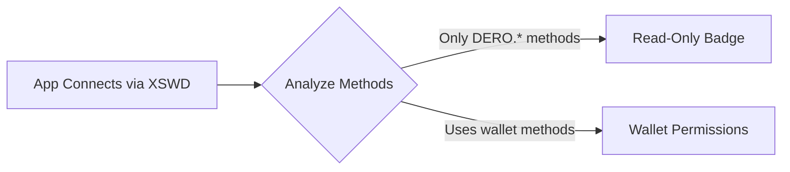

import { Callout } from 'nextra/components'

# telaHost Bridge API

**telaHost** is Hologram's native JavaScript API, automatically available in every TELA application—similar to how browsers provide `window.ethereum` for Web3 dApps. It gives your dApp a clean, async interface to interact with the DERO blockchain and wallet, without requiring raw XSWD WebSocket connections. Test your dApp locally with the [Studio Dev Server](/studio#serve-local-dev-server).

<Callout type="info">
**Security Model**: TELA apps run in sandboxed iframes, isolated from Hologram. All wallet operations require explicit user approval via native modals. Read-only blockchain queries work instantly without approval.
</Callout>

## Architecture

```
┌─────────────────────────────────────────────────────────┐
│  TELA App (sandboxed iframe)                            │
│  ┌───────────────────────────────────────────────────┐  │
│  │  window.telaHost  ←── provided by Hologram        │  │
│  └───────────────────────────────────────────────────┘  │
│                          │                              │
│                    async calls                          │
│                          ▼                              │
│  ┌───────────────────────────────────────────────────┐  │
│  │  Go Backend (Wails)                               │  │
│  │  ┌─────────────┐ ┌─────────┐ ┌─────────────────┐  │  │
│  │  │  DERO Node  │ │ Wallet  │ │     Gnomon      │  │  │
│  │  └─────────────┘ └─────────┘ └─────────────────┘  │  │
│  └───────────────────────────────────────────────────┘  │
└─────────────────────────────────────────────────────────┘
```

## telaHost vs Raw XSWD

| Aspect | telaHost (Hologram) | Raw XSWD |
|--------|---------------------|----------|
| Connection | Already connected by Hologram | App must open WebSocket |
| API | Clean async JavaScript | JSON-RPC over WebSocket |
| Wallet Access | Uses Hologram's integrated wallet | Requires external wallet |
| Setup | Zero config—built-in | App must handle connection |
| Approval Flow | Native Hologram modals | Custom implementation |

## Quick Start

### Check if Running in Hologram

```javascript
// Always check for telaHost before using it
if (typeof telaHost !== 'undefined' && telaHost) {
  console.log('Running in Hologram browser!');
  
  // Get network info
  const info = await telaHost.call('DERO.GetInfo');
  console.log('Connected to network:', info.testnet ? 'Testnet' : 'Mainnet');
} else {
  console.log('Not running in Hologram - use fallback');
}
```

### Basic Blockchain Query

```javascript
// Get current block height
const info = await telaHost.getNetworkInfo();
console.log('Current height:', info.topoheight);
```

### Wallet Connection

```javascript
// Request wallet connection
await telaHost.connect();

// Check if connected
if (telaHost.isConnected()) {
  console.log('Wallet connected!');
}
```

## API Reference

### Daemon Methods (No Wallet Required)

#### `telaHost.call(method, params)`

Generic RPC call to the DERO daemon.

```javascript
// Returns: Promise<any>
const result = await telaHost.call('DERO.GetInfo', {});
```

#### `telaHost.getNetworkInfo()`

Shortcut for `DERO.GetInfo`.

```javascript
// Returns: Promise<NetworkInfo>
const info = await telaHost.getNetworkInfo();
// info.topoheight, info.stableheight, info.difficulty, etc.
```

#### `telaHost.getBlock(height)`

Get block data by height.

```javascript
// Returns: Promise<Block>
const block = await telaHost.getBlock(5000000);
// block.block_header, block.txs, block.miner_tx, etc.
```

#### `telaHost.getTransaction(txHash)`

Get transaction details.

```javascript
// Returns: Promise<Transaction>
const tx = await telaHost.getTransaction('abc123...');
// tx.txid, tx.ring, tx.block_height, etc.
```

#### `telaHost.getSmartContract(scid)`

Get smart contract state and code.

```javascript
// Returns: Promise<SmartContract>
const sc = await telaHost.getSmartContract('abc123...');
// sc.code, sc.balances, sc.stringkeys, sc.uint64keys, etc.
```

### Wallet Methods (Connection Required)

#### `telaHost.connect()`

Request wallet connection. User will see a permission dialog.

```javascript
// Returns: Promise<void>
await telaHost.connect();
```

#### `telaHost.isConnected()`

Check wallet connection status.

```javascript
// Returns: boolean
if (telaHost.isConnected()) {
  // Wallet is connected
}
```

#### `telaHost.getAddress()`

Get connected wallet address.

```javascript
// Returns: Promise<string>
const address = await telaHost.getAddress();
```

#### `telaHost.getBalance()`

Get wallet balance.

```javascript
// Returns: Promise<{balance: number, unlocked: number}>
const bal = await telaHost.getBalance();
console.log('Available:', bal.unlocked / 100000, 'DERO');
```

#### `telaHost.transfer(params)`

Send DERO or tokens. **Requires user approval.**

```javascript
// Returns: Promise<{txid: string}>
const result = await telaHost.transfer({
  destination: 'dero1...',
  amount: 100000,  // Atomic units (0.00001 DERO = 1 atomic)
  payload_rpc: []  // Optional data
});
```

#### `telaHost.scInvoke(params)`

Call a smart contract function. **Requires user approval.**

```javascript
// Returns: Promise<{txid: string}>
const result = await telaHost.scInvoke({
  scid: 'abc123...',
  entrypoint: 'MyFunction',
  sc_rpc: [
    { name: 'param1', datatype: 'S', value: 'hello' },
    { name: 'param2', datatype: 'U', value: 42 }
  ],
  sc_dero_deposit: 0,  // Optional DERO deposit
  sc_token_deposit: 0  // Optional token deposit
});
```

## Usage Examples

### Display Network Stats

```html
<!DOCTYPE html>
<html>
<head>
  <title>Network Stats</title>
</head>
<body>
  <div id="stats">Loading...</div>
  
  <script>
    async function loadStats() {
      if (!telaHost) {
        document.getElementById('stats').innerHTML = 'Not in Hologram';
        return;
      }
      
      try {
        const info = await telaHost.getNetworkInfo();
        document.getElementById('stats').innerHTML = `
          <h2>Network Status</h2>
          <p>Height: ${info.topoheight.toLocaleString()}</p>
          <p>Difficulty: ${info.difficulty.toLocaleString()}</p>
          <p>TX Pool: ${info.tx_pool_size} transactions</p>
          <p>Network: ${info.testnet ? 'Testnet' : 'Mainnet'}</p>
        `;
      } catch (err) {
        document.getElementById('stats').innerHTML = 'Error: ' + err.message;
      }
    }
    
    loadStats();
    setInterval(loadStats, 30000);
  </script>
</body>
</html>
```

### Wallet Connection Flow

```javascript
let connected = false;

async function connectWallet() {
  if (!telaHost) {
    alert('Please open this app in Hologram browser');
    return;
  }
  
  try {
    await telaHost.connect();
    
    if (telaHost.isConnected()) {
      connected = true;
      
      const address = await telaHost.getAddress();
      document.getElementById('address').textContent = 
        address.substring(0, 20) + '...';
      
      const balance = await telaHost.getBalance();
      document.getElementById('balance').textContent = 
        (balance.unlocked / 100000).toFixed(5) + ' DERO';
      
      document.getElementById('connect-btn').style.display = 'none';
      document.getElementById('wallet-info').style.display = 'block';
    }
  } catch (err) {
    if (err.message.includes('rejected')) {
      alert('Connection rejected by user');
    } else {
      alert('Connection failed: ' + err.message);
    }
  }
}

document.getElementById('connect-btn').addEventListener('click', connectWallet);
```

### Smart Contract Interaction

```javascript
// Voting example
async function vote(scid, optionId) {
  if (!telaHost.isConnected()) {
    alert('Please connect wallet first');
    return;
  }
  
  try {
    const result = await telaHost.scInvoke({
      scid: scid,
      entrypoint: 'Vote',
      sc_rpc: [
        { name: 'option', datatype: 'U', value: optionId }
      ]
    });
    
    console.log('Vote recorded! TXID:', result.txid);
    return result.txid;
  } catch (err) {
    console.error('Vote failed:', err);
    throw err;
  }
}

// Purchase with DERO deposit
async function buyItem(scid, itemId, price) {
  const result = await telaHost.scInvoke({
    scid: scid,
    entrypoint: 'Buy',
    sc_rpc: [
      { name: 'item_id', datatype: 'U', value: itemId }
    ],
    sc_dero_deposit: price  // In atomic units
  });
  
  return result.txid;
}
```

## Error Handling

### Common Errors

| Error | Cause | Solution |
|-------|-------|----------|
| `telaHost is not defined` | App not running in Hologram | Add fallback or show message |
| `Wallet not connected` | Trying wallet method without connection | Call `telaHost.connect()` first |
| `User rejected` | User declined permission | Show friendly message |
| `Daemon not connected` | Hologram not connected to node | Check Settings > Node |
| `Invalid SCID` | Bad smart contract ID | Validate SCID format |

### Error Handling Pattern

```javascript
async function safeCall(fn) {
  try {
    return await fn();
  } catch (err) {
    if (err.message.includes('rejected') || err.message.includes('cancelled')) {
      return { error: 'user_rejected', message: 'Operation cancelled' };
    }
    
    if (err.message.includes('not connected')) {
      return { error: 'not_connected', message: 'Please connect your wallet' };
    }
    
    if (err.message.includes('daemon') || err.message.includes('RPC')) {
      return { error: 'daemon_error', message: 'Network error - please try again' };
    }
    
    console.error('Unexpected error:', err);
    return { error: 'unknown', message: err.message };
  }
}
```

## Security Model

### Smart Permission Detection

Hologram automatically detects what permissions your app actually needs based on the methods it calls. This provides a better user experience—apps that only read public blockchain data won't show scary wallet permission dialogs.

<Callout type="info">
  **Read-Only Apps**: If your app only calls `DERO.*` methods (GetInfo, GetBlock, GetSC, etc.), users will see a "Read-Only Access" badge instead of wallet permissions.
</Callout>

### Permission Scopes

| Scope | Methods | Description | Wallet Required |
|-------|---------|-------------|-----------------|
| `read_public_data` | `DERO.GetInfo`, `DERO.GetBlock`, `DERO.GetSC`, etc. | Read blockchain data | No |
| `view_address` | `GetAddress` | See wallet address | Yes |
| `view_balance` | `GetBalance` | See wallet balance | Yes |
| `sign_transaction` | `Transfer` | Send DERO (always asks) | Yes |
| `sc_invoke` | `SCInvoke` | Smart contract calls (always asks) | Yes |

### How It Works



1. **App connects via XSWD** — Sends handshake with app info
2. **Hologram analyzes methods** — Detects if app uses wallet methods
3. **Appropriate dialog shown**:
   - Read-only apps → "Read-Only Access" badge
   - Wallet apps → Full permission list

### Best Practice: Don't Request Permissions

For maximum compatibility across XSWD wallets, **don't specify permissions** in your handshake. Let the wallet auto-detect what you need:

```javascript
// Recommended: No permissions field
var handshake = {
  id: appId,           // 64-char hex (SHA-256 of app name)
  name: 'My App',
  description: 'What my app does',
  url: window.location.origin
  // Don't include permissions - let the wallet figure it out
};
```

This approach works in Hologram, Engram, and any other XSWD-compatible wallet.

### Permission Levels

| Permission | Description | User Approval |
|------------|-------------|---------------|
| `GetInfo` | Network info | Auto-approved |
| `GetBlock` | Block data | Auto-approved |
| `GetSC` | SC state | Auto-approved |
| `GetAddress` | Wallet address | Initial connection |
| `GetBalance` | Wallet balance | Initial connection |
| `Transfer` | Send DERO/tokens | **Every transaction** |
| `SCInvoke` | Call SC function | **Every transaction** |

### Best Practices

1. **Check telaHost existence**
   ```javascript
   if (typeof telaHost === 'undefined') {
     // Fallback or show message
   }
   ```

2. **Handle rejections gracefully**
   ```javascript
   try {
     await telaHost.connect();
   } catch (err) {
     // Don't show angry error, just inform user
   }
   ```

3. **Validate user input before transactions**
   ```javascript
   if (!address.startsWith('dero1')) {
     throw new Error('Invalid DERO address');
   }
   
   if (amount <= 0 || amount > balance) {
     throw new Error('Invalid amount');
   }
   ```

4. **Never store sensitive data**
5. **Use HTTPS for external resources**

## Data Types

### RPC Parameter Types

| Type Code | Name | Example |
|-----------|------|---------|
| `S` | String | `{ name: 'key', datatype: 'S', value: 'hello' }` |
| `U` | Uint64 | `{ name: 'amount', datatype: 'U', value: 42 }` |
| `H` | Hash | `{ name: 'hash', datatype: 'H', value: 'abc123...' }` |

### TypeScript Interfaces

```typescript
interface NetworkInfo {
  topoheight: number;
  stableheight: number;
  difficulty: number;
  tx_pool_size: number;
  testnet: boolean;
  version: string;
}

interface SmartContract {
  scid: string;
  balance: number;
  code: string;
  uint64keys: Record<string, number>;
  stringkeys: Record<string, string>;
}
```

