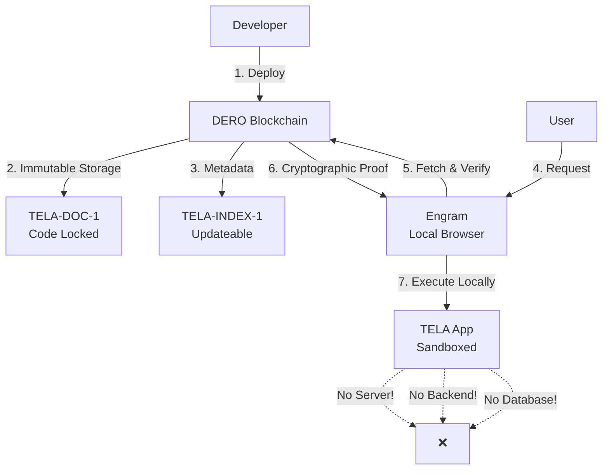
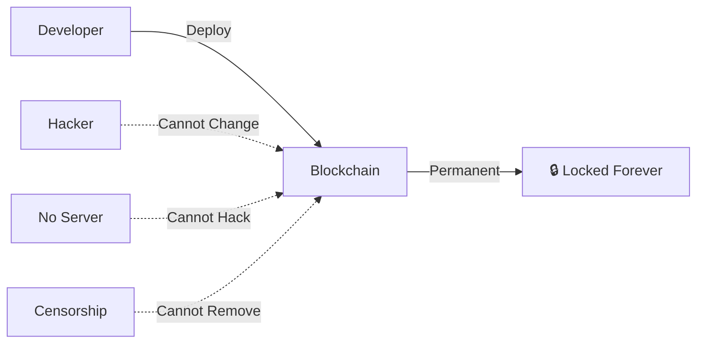
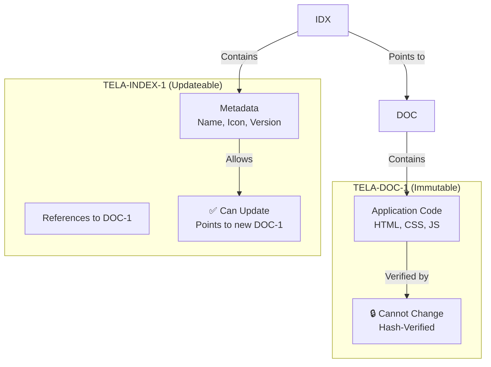
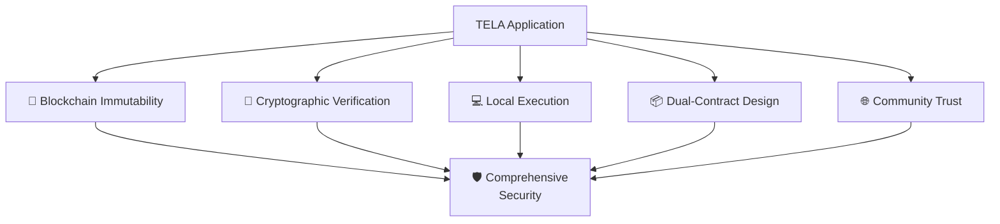

import { Callout } from 'nextra/components'

# TELA Security Model

<Callout type="success" emoji="🔒">
**Zero-Trust Architecture:** TELA applications run on-chain with cryptographic verification. No servers to compromise, no code injection, no hidden changes.
</Callout>

## How TELA Security Works



**Result:** Applications are verifiable, immutable, and censorship-resistant.

## TELA vs Traditional Web Security

| Security Layer | Traditional Web | TELA |
|----------------|-----------------|------|
| **Code Storage** | 👁️ Server (can change anytime) | 🔒 Blockchain (immutable) |
| **Code Integrity** | ⚠️ Trust the server | ✅ Cryptographically verified |
| **Execution** | 🌐 Remote server | 💻 Local (your computer) |
| **Backend** | 🔓 Centralized database | 🔐 Smart contracts |
| **Updates** | ❌ Silent, undetectable | ✅ Transparent on-chain |
| **Censorship** | ❌ Can be taken down | ✅ Unstoppable |
| **Privacy** | 👁️ Server logs everything | 🔒 Local execution |

---

## 5 Security Layers

### 🔐 **Layer 1: Blockchain Immutability**

**Once deployed → Forever locked**



**What this means:**
- ✅ Code cannot be modified after deployment
- ✅ No server-side code injection
- ✅ Historical record of all versions
- ✅ Prevents malicious updates

---

### 🔑 **Layer 2: Cryptographic Verification**

**Every file has a mathematical proof**

| What Gets Verified | How |
|-------------------|-----|
| **File Integrity** | SHA-256 hash on blockchain |
| **Author Identity** | DERO wallet address (cryptographic signature) |
| **Contract Linkage** | Cryptographic references between DOC-1 and INDEX-1 |
| **Code Authenticity** | Blockchain consensus (51% attack required to forge) |

**Verification process:**
```
1. User requests app
2. Engram fetches code from blockchain
3. Calculates hash of downloaded code
4. Compares to hash in INDEX-1 contract
5. ✅ Match = authentic | ❌ Mismatch = reject
```

---

### 💻 **Layer 3: Local Execution**

**Code runs on YOUR computer, not a server**

**Attack Vectors Eliminated:**
- ❌ Server-side attacks (no server!)
- ❌ Database breaches (no database!)
- ❌ Man-in-the-middle (cryptographically verified)
- ❌ Session hijacking (no sessions!)
- ❌ Server logging (runs locally)

**Modern Browser Protection:**
- ✅ Sandboxed execution
- ✅ Content Security Policy (CSP)
- ✅ Same-origin policy
- ✅ Memory isolation

---

### 📦 **Layer 4: Dual-Contract Architecture**

**Separation of code and metadata**



**Why this is secure:**
- ✅ Code (DOC-1) is immutable = can't inject malware
- ✅ Metadata (INDEX-1) is updateable = app can improve
- ✅ User can verify which DOC-1 version they're running
- ✅ Transparency: All changes visible on-chain

---

### 🌐 **Layer 5: Decentralized Trust**

| Trust Mechanism | How It Works |
|-----------------|--------------|
| **Author Accountability** | Wallet address = permanent identity on-chain |
| **Community Ratings** | Users rate apps (stored on-chain) |
| **Transparency** | All code visible = community audit |
| **No Gatekeepers** | Anyone can deploy, users decide trust |
| **Reputation** | Author's history = visible on blockchain |

---

## TELA Host Applications

A **TELA host** is the local application that fetches an INDEX and its DOCs from chain, reassembles them, and serves the result on your own machine. No server sits in the middle, so the host is what actually enforces the layers above — which host you run is part of your security model.

The hosts documented across these sites:

| Host | What it is | Documented at |
|------|-----------|---------------|
| **Engram** | DERO desktop wallet with a built-in TELA browser | [TELA Overview](/tela/overview) |
| **TELA-CLI** | Command-line host and deployment tool, built on the reference `civilware/tela` package | [Installation](/tela-cli/installation) |
| **Hologram** | DERO decentralized web browser | [hologram.derod.org](https://hologram.derod.org) |

<Callout type="info">
**This table is scope, not certification.** TELA is permissionless: anyone can write a host, and community hosts exist that are not documented here. There is no TELA compliance program and no authority that blesses a host — so a host being absent from this table says nothing about its legitimacy, and being listed is not an audit.
</Callout>

Each host decides for itself whether it verifies DOC signatures, how it sandboxes executed code, and what it exposes to app JavaScript. Those choices are not enforced by the chain. Judge any host you run from its source, the same way Layer 2 asks you to judge an app from its author.

---

## Security Best Practices

### 👨‍💻 **For Developers**

| Practice | Why It Matters |
|----------|----------------|
| **Validate ALL inputs** | Prevent XSS and injection attacks |
| **Verify 3rd-party libraries** | External code = potential vulnerability |
| **Minimize dependencies** | Smaller attack surface |
| **Test thoroughly** | Use TELA-CLI for security testing |
| **Document permissions** | Be transparent about what your app needs |
| **Version your DOC-1s** | Users can choose which version to trust |

<Callout type="warning">
**Remember:** Your code is IMMUTABLE and PUBLIC. Test carefully before deploying!
</Callout>

---

### 👤 **For Users**

| Practice | How To |
|----------|--------|
| **Check author address** | Look up author's other apps on blockchain |
| **Read community ratings** | See what others say about the app |
| **Review permissions** | Understand what access you're granting |
| **Keep Engram updated** | Latest security patches |
| **Start with low-risk apps** | Test with documents/games before financial apps |

**Red Flags:**
- 🚨 App requests unnecessary permissions
- 🚨 Unknown author with no history
- 🚨 Poor community ratings
- 🚨 Requests private keys (NEVER legitimate!)

---

## The Bottom Line

**TELA's Multi-Layer Defense:**



**TELA Security = Multiple independent layers**

If one layer is bypassed, others remain protective. This defense-in-depth approach makes TELA significantly more secure than traditional web applications.

---

## Comparison: TELA vs Web2

**Traditional Web:**
```
Trust the company → Trust the server → Hope they're secure
```

**TELA:**
```
Verify on blockchain → Run locally → You control security
```

**Difference:** TELA removes trust requirements through cryptographic proof and decentralization. 